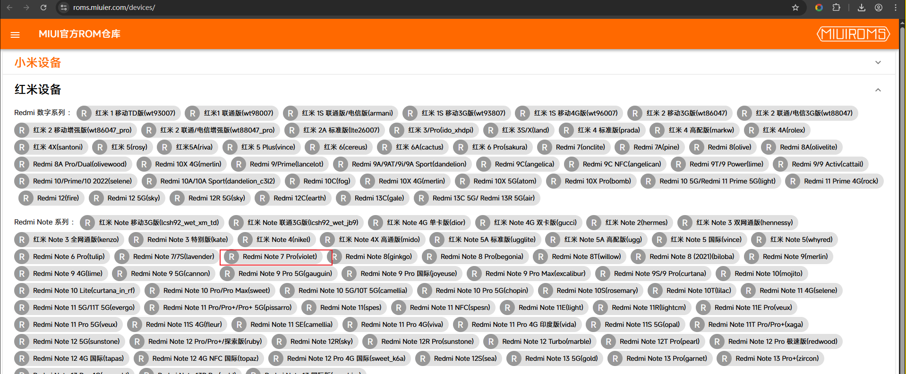
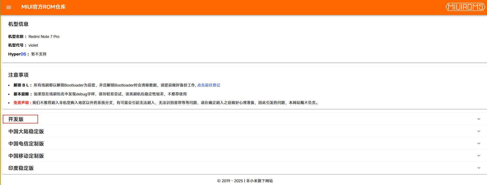
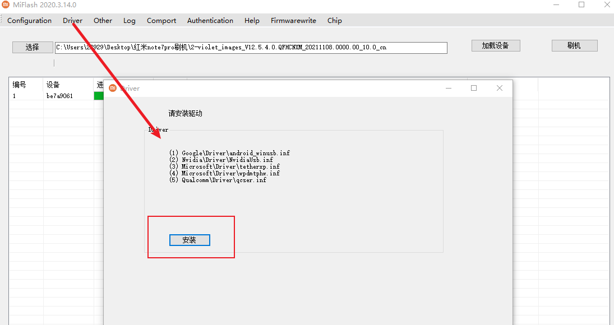
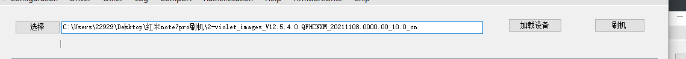

# 准备

1. 备份【可选】
2. 解bl锁
3. 下载magisk面具


# 备份数据

这里我的测试机对数据无所谓，所以我直接开干！

你如果有重要数据请查询网上资料备份好，云备份&网盘备份&换机 都行。


# 解bl

手机按照如下步骤进行； 【这里不做图文了，后面会录一期视频】

1. 打开 `设置` 应用

2. 点击 `我的设备`，点击 `全部参数`，快速点击 `MIUI版本` 多次；直到出现 "您已处于开发者模式，无需进行此操作"

3. 退到设置应用的最外层，搜索 `开发者选项`；往下滑，找到 `设备解锁状态`；

   1. 如果已经解锁，跳到4

   2. 如果还没解锁，绑定账号和设备，然后去搜解bl锁教程【解bl会清数据】；直到解锁成功后进入4；

      > 现在有些小米机型是不能解的，准确来说解的成本非常的高，主要是**时间成本**以及**不确定因素**
      >
      > 所以如果要做逆向的话，买个旧的小米就行；当然你都有钱买了，为什么不买pixel系列的呢（）


#  刷机

刷机包

- 去[小米rom仓库](https://roms.miuier.com/devices/)下载刷机包

  > 其他的网站一律别信，特别有广告的；

我这里选择第二种



然后记住机型和代号 `Redmi Note 7 Pro` `violet`



这里选择前两个比较好，我这里的开发版，安卓10没有线刷，只有卡刷；卡刷限制比较多，所以我选择中国大陆稳定版；


随便选一个就行，这里我们选择最上面这个，序号17的线刷包；[下载直链](https://bkt-sgp-miui-ota-update-alisgp.oss-ap-southeast-1.aliyuncs.com/V12.5.4.0.QFHCNXM/violet_images_V12.5.4.0.QFHCNXM_20211108.0000.00_10.0_cn_b4ece801ad.tgz)

> 下载较慢，我使用 `xdown` 加速；这里还推荐其他的软件如 `idm`，`比特彗星`；主要作用是增加并发，占满带宽；


去 https://miuiver.com/miflash/ 下载线刷工具 https://cdn.alsgp0.fds.api.mi-img.com/micomm/MiFlash2020-3-14-0.rar
然后


安装刷机驱动




然后



导入之前下载的刷机包外层文件夹（要求是images上一级）

然后进入 fastboot

```bash
adb reboot bootloader
```

然后点击刷机，等待刷新成功就行


刷机完毕后配置wifi，然后输入小米账号密码解锁手机即可


**刷机后可能需要再次解bl**

> zz使用小米提供的解锁工具就行，登录当前手机使用的小米账号即可；

# 狐妖面具

跟下面的方法一样


# apatch面具

打开开发者模式，然后打开usb调试，usb安装【要装sim卡】

刷入面具app 

```bash
adb install 5-APatch_11039_11039-release-signed.apk
```

然后打开app

推入刷机包的boot.img

```bash
adb push 3-原始boot.img /sdcard/Download/3-原始boot.img
```

导入boot.img进行修补 

然后设置密钥，点击开始修补

然后把修补后的img下载到电脑

```bash
adb pull /sdcard/Download/apatch_patched_11039_0.11.2_zaoj.img
```

刷入内核

1. 先进入fastboot

   ```bash
   adb reboot bootloader
   ```

2. 刷入内核

   ```bash
   fastboot flash boot 6-修补后apatch_patched_11039_0.11.2_zaoj.img
   ```

3. 输入超级密钥

4. 安装系统补丁


#  装lsposed

https://github.com/LSPosed/LSPosed/


# 隐藏root

1. 隐藏magisk
2. 打开zygisk；magiskHide，实现suList

用momo和hunter


