本文包含很多网上已有内容，有些是复制粘贴的，一般会注明来源；若存在看不懂的，请使用搜索引擎搜索，若还不懂可联系我；


# 逆向扫盲


什么是逆向？ 通俗来讲，逆向工程就是将机器才能够懂的机器代码（0101二进制代码）翻译成人能够读懂的代码（汇编、smali代码）。 

但实际情况往往是，我们只寻找关键的代码去翻译或仅了解其业务逻辑，因为要将所有的机器代码翻译出来，工作量是极其巨大的且繁琐的。


## 按照语言类型分类

逆向工程按照编程语言类别，可以分为:

- 解释型语言的逆向(如Android APP)
- 编译型语言的逆向(如C/C++、Objective-C)

`解释型语言`(如Java)的运行环境是JVM之类的虚拟机，其反编译的难度通常较低。以Java语言为例，编译器编译的结果通常是*.class*或者*.dex*文件，在没有做代码混淆的情况下，很容易反汇编出Java源码，分析出代码逻辑。而且混淆也只是将类、方法、变量名称替换成*a* *b* *c* *d*这种没有任何意义的名字，增加理解难度而已。


`编译型语言`(如C/C++，Objective-C等)最终编译出来的机器代码就比较复杂，因为其机器代码是跟CPU架构相关的，因此针对不同的CPU架构编译出来的二进制文件是不同的，反汇编得到的代码也会不一样。往往需要针对特定的CPU架构去解读汇编语言，才能正确的分析出结果出来，这就需要对不同架构CPU的寄存器、寻址方式等特性有所了解才行。另外二进制文件反汇编出来的函数、变量名通常是机器生成的无意义字符串，所以分析难度通常相较于解释型语言会更大一些。

> 因此，汇编对于逆向工程是基础；


## 常用分析手段

1. 静态分析

   将机器代码反汇编成方便人类理解的代码，如smali代码（Java）、汇编代码或汇编代码翻译的C语言伪代码等等，通过分析这些比较低级的编程语言的代码，找到程序的业务流程或参数的加密逻辑；

   

2. 动态调试分析

   通过断点调试手段，让程序单步执行进行分析。动态分析往往是在静态分析出一定的结果的基础上进行，找到合适的地方给代码打断点，即时地读取当前变量的值，来进一步分析程序的逻辑、获取程序关系数据。

   常用的是 hook技术 和 程序断点调试；

   

3. 网络流量分析（抓包分析）

   通过代理方式或者其他方式，截取程序与服务器通信的数据流量（抓包），来分析客户端和服务端的通信协议。

   

4. 合理**猜测**

   根据正向开发流程来进行合理猜测，**这是最常用也最有有效的**，但不一定是最准确的；

   想要提高猜测的准度，就得积累编程经验、了解程序设计模式、学会查框架使用说明、学习读开源代码等等；


## 加密参数逆向方法

1. 纯算：**基于源码还原加密逻辑**：直接分析并实现加密算法；

2. 黑盒：**补环境复制代码进行模拟**：搭建完整的运行环境，将原有加密代码移植到新环境中运行；

   例如：js逆向补浏览器环境；app逆向用unidbg补jni环境；

3. rpc：**远程调用**：通过远程调用的方式直接复用目标环境的加密逻辑。


## 关于App逆向

根据开发方式而导致逆向方式而有所不同

接下来我们先对开发方式进行分类，并给出常用逆向路线

### 原生开发 

Native App Development

**特点**：最高性能，最佳用户体验，完整设备功能访问
**适用**：高性能应用、游戏、复杂交互应用

| 操作系统 | 应用层语言                 | native层    | 开发工具                                | 包的管理                                  | 使用框架                                                     | 部署平台                      |
| :------- | :------------------------- | ----------- | :-------------------------------------- | :---------------------------------------- | :----------------------------------------------------------- | ----------------------------- |
| Android  | java<br />kotlin           | .so via JNI | Android Studio<br />adb<br />firebase   | maven<br />gradle                         | **Jetpack Compose(现代)** <br />Android SDK<br />Room<br />WorkManager | Google Play<br />其他应用商店 |
| Ios      | **swift**<br />objective-c | .dylib /.a  | xcode<br />Instruments <br />TestFlight | **Swift Package Manager**,<br />CocoaPods | UIKit<br />SwiftUI<br />Core Data<br />Core ML<br />ARKit    | App Store                     |

安卓逆向（大部分）：

- 用反编译工具 反编译 dex文件 去看java代码

  > jadx，jeb，gda
  >
  > 大部分是：dex -> smail -> java

- 用反编译工具 反编译 so文件看 native层代码

  > ida、

  


### 跨平台开发

Cross-Platform

一般都是使用开发框架来生成不同平台的代码

**特点**：一次编写多端运行

| 框架                     | 技术栈      | 渲染方式        | 代表应用             | 优势                 |
| :----------------------- | :---------- | :-------------- | :------------------- | :------------------- |
| **React Native**         | JS/TS+React | 原生组件桥接    | Facebook, Skype，ins | 热更新，丰富生态     |
| **Flutter**              | Dart        | Skia自绘引擎    | Google Pay           | 高性能，UI一致性     |
| **Xamarin**              | C#          | 原生绑定        | UPS, Alaska Air      | .NET生态集成         |
| **Kotlin Multiplatform** | Kotlin      | 共享逻辑+原生UI | Netflix, Philips     | 原生性能，无缝互操作 |

这里比较常见的有 flutter 开发的app；这里提一嘴，棋牌类游戏用lua脚本写加密逻辑，然后用cocos2dlua框架加载lua脚本；


我这里只给出 flutter 开发的app的逆向方法：

1. 拿到libapp.so，对其使用针对性工具如reflutter和blutter初步处理
2. 结合ida·分析代码


### h5开发

webview调试即可

但是有的好像有V8调用js进行加密，但是我还不知道怎么解决


# 密码学基础与py算法还原

密码学：cryptography【希腊语kryptós“隐藏的”，gráphein“书写”】

我编一句话：正向和底层了解的越多，对于逆向的帮助越大；关于计算机的上下层我们都要了解和学习，不一定要手搓，但一定要快速辨别出来；

## 密码学的发展

**这一节主要是从发展中 理解密码学算法的诞生与消失，学习密码学的思想，可以不看**


一般分为：传统密码学和现代密码学；

分界标志是：1949年香农（C.E.Shannon）发表的论文《保密系统的通信理论》；


在此之前几千年历史的传统密码阶段，密码主要采用**代换**（Substitution）和**置换**（Permutation）的方式来实现，仅是一种文字变换的艺术（创造性的方法）。

香农通过将信息理论引入到密码学中，为密码学奠定了坚实的理论基础，形成了科学的密码学体系。


传统密码一般可分为（1）古典密码（2）近代密码


### 传统密码

1. [密码学的前世今生](https://blog.csdn.net/apr15/article/details/125031352)
2. [古典密码之棋盘密码(ADFGVX,ADFGX,Polybius)](https://www.cnblogs.com/folio/p/18146847)

#### 古典密码

古典密码阶段从古代到19世纪末，长达上千年，主要采用代换及置换的方式，并通过手工或简单器械实现的。


（1）斯巴达棒（密码棒）【核心思想：置换移位】

公元前约700年，古希腊的斯巴达人使用一种叫做scytale的棍子（斯巴达棒）来传递加密信息。

加密：斯巴达人在scytale螺旋形地缠绕一条羊皮纸。发信人在缠绕的羊皮纸上横着写下信息，然后将羊皮纸取下，这样羊皮纸上就是一些无意义的字符排列。

解密：收件人要解密这条信息，只需将羊皮纸再次缠绕在相同直径的棍棒上，就可以读出信件的内容了。

斯巴达棒使用改变文本中字母的阅读顺序，即置换（换位）的方法达到加密的目的。

配图：


范例文字："Help me I am under attack".【横着写&读】

==>"HENTEIDTLAEAPMRCMUAK"【取下来后，竖着读】


假设编码字符串为"HENTEIDTLAEAPMRCMUAK"

解密：使用相同木棒，再次缠绕，横着读即可；


> 解密核心原理：直径 -> **每一圈能显示的文字数量；**（也就是字符间隔）


破译：合理猜测两个字符间隔，比如这里的20字符【笔者自己思考得到，可能方法不是最优，未经验证】

- 可以猜测是5轮一循环

  `HENTEIDTLAEAPMRCMUAK -> H I E C E`，无明显意义，舍去； 


- 可以猜测是4轮一循环

  `HENTEIDTLAEAPMRCMUAK -> H E L P M` ，有明显意义；

```python
# 没有写输入输出合法性校验
def scytale_encrypt(plain_text: str, length: int) -> str:
    """密码棒加密: 这里的length的作用是key，含义是一轮循环的字符数"""
    plain_text = plain_text.replace(" ", "").upper()  # 去掉空格，全部大写
    print(plain_text)
    plain_lst = list(plain_text)
    res = ""
    idx = 0
    while len(res) != len(plain_text):
        if idx >= len(plain_text):  # 索引越界，循环回来
            idx = idx % len(plain_text)
        if plain_lst[idx] == "":  # 读过了就跳过
            idx += 1
            continue
        res += plain_lst[idx]
        plain_lst[idx] = ""
        idx += length
    return res


def scytale_decrypt(cipher_text: str, length: int) -> str:
    """密码棒解密"""
    plain_lst = ["" for _ in range(len(cipher_text))]
    idx = 0
    for item in cipher_text:
        plain_lst[idx] += item
        idx += length
        if idx >= len(cipher_text):
            idx = idx % len(cipher_text)

    return "".join(plain_lst)


if __name__ == '__main__':
    plain_text = "Help me I am under attackK"
    encrypt_text = scytale_encrypt(plain_text, 10)
    print(encrypt_text)
    decrypt_text = scytale_decrypt(encrypt_text, 10)
    print(decrypt_text)

```


（2）棋盘密码

公元前2世纪，希腊人Polybius设计了一种将字母编码成符号的方法，称为棋盘密码。

棋盘密码只加密字母，不区分大小写（部分棋盘还可加密数字），若输入其它字符则原样保留。


1. Polybius【核心思想：编码替换】

   Polybius发明，通过Polybius矩阵进行加密密文，该矩阵是一个5*5的网格，通过Polybius矩阵将每个字母转换成两个数字, 第一个数字是该字母的行数,第二个数字是该字母的列数。

   加密：A 分解为（1，1）；B分解为（1，2）
   
   解密：（1，1）对应A
   
   Polybius矩阵（包含字母26，则i和j同时用一个坐标表示，则为25=5x5）如下：
   
   | \    | 1    | 2    | 3    | 4    | 5    |
   | ---- | ---- | ---- | ---- | ---- | ---- |
   | 1    | A    | B    | C    | D    | E    |
   | 2    | F    | G    | H    | I/J  | K    |
   | 3    | L    | M    | N    | O    | P    |
   | 4    | Q    | R    | S    | T    | U    |
   | 5    | V    | W    | X    | Y    | Z    |
   
   假设发送明文信息“Hello”，找到H对应2行3列，则加密为23，e加密为15，以此类推，得到密文：23 15 31 31 34。
   
   > 实际应用中，方阵中的字母顺序会被打乱，然后分发给信息发送方和接收方，增加第三方破解难度。
   
   特点：
   
   - **明文只能是字母**；密文全部为数字；
   - 密文长度是明文的两倍，即偶数；
   - 明文字母I和J的密文编码相同，解密后需人工确认。
   
   ```python
   # 没有写输入输出合法性校验
   class Polybius:
       polybius_table_letter = "abcdefghiklmnopqrstuvwxyz"  # j和i统一为i
       polybius_table_number = [(idx // 5 + 1, idx % 5 + 1) for idx in range(len(polybius_table_letter))]
   
       @staticmethod
       def encrypt(plain_text: str) -> str:
           res = []
           plain_text = plain_text.lower().replace("j", "i").replace(" ","")
           for item in plain_text:
               idx = Polybius.polybius_table_letter.index(item)
               row, column = Polybius.polybius_table_number[idx]
               res.append(f"{row}{column}")
           return "".join(res)
   
       @staticmethod
       def decrypt(cipher_text: str) -> str:
           res = []
           cipher_text = cipher_text.replace(" ", "")
           for i in range(0, len(cipher_text), 2):
               item = cipher_text[i:i + 2]  # 两个两个读
               row, column = int(item[0]), int(item[1])
               idx = (row - 1) * 5 + column - 1
               res.append(Polybius.polybius_table_letter[idx])
           return "".join(res)
   
   
   if __name__ == '__main__':
       plain_text = "Hello"
       encrypt_text = Polybius.encrypt(plain_text) # 2315313134
       print(encrypt_text)
       print(Polybius.decrypt(encrypt_text)) # hello
   
   ```
   
   


2. ADFGX&ADFGVX【核心思想：编码替换+置换移位】

   1918年，第一次世界大战将要结束时，法军截获了一份德军电报，电文中的所有单词都由A、D、F、G、X五个字母拼成，因此被称为ADFGX密码。

   ADFGX密码是1918年3月由德军上校FritzNebel发明的，**是结合了Polybius方阵和置换密码的双重加密方案**。

   ADFGX密码之所以选择ADFGX这几个字母，是因为它们译成摩斯密码时不容易混淆，可以降低传输错误的机率。

   而ADFGVX的出现是为了解决ADFGX加密造成的密文数字太多，加入一个V之后方阵变成了6x6，则字母和数字全部可以囊括，并且ij也可以更好区分；

   ADFGX密码表（包含字母，这里使用5x5的Polybius方阵）如下：
   
   > 这里使用移位的码表，btalpdhozkqfvsnqfvsnmrewy
   
   |  \   |  A   |  D   |  F   |  G   |  X   |
   | :--: | :--: | :--: | :--: | :--: | :--: |
   |  A   |  b   |  t   |  a   |  l   |  p   |
   |  D   |  d   |  h   |  o   |  z   |  k   |
   |  F   |  q   |  f   |  v   |  s   |  n   |
   |  G   |  g   | i/j  |  c   |  u   |  x   |
   |  X   |  m   |  r   |  e   |  w   |  y   |
   
   假设加密密文 “Hello” ：
   
   1. 经过编码替换：DD XF AG AG DF。(hello)
   
   2. 使用**密钥进行移位**：DF AX FA FA FG；(opqqs，移了4位) 
   
      > 这里使用bye密钥

|  b   |  y   |  e   |
| :--: | :--: | :--: |
|  D   |  F   |  A   |
|  X   |  F   |  A   |
|  F   |  A   |  F   |
|  G   |      |      |

密钥有几个字母，就有多少列，然后将密文一行一行填入。

把密钥“bye”按字母顺序重排为“bey”，**因此，密码不能有重复的字母**,依照这个顺序将表格中的字母一列一列的抄写得到：DX FG AA FF FA，这就是最终密文。可见，由于增加了密钥，ADFGX棋盘的加密强度明显高于Polybius棋盘密码。
特点：


## 各大算法来源

### md系列


### sha系列


### des与3des


### aes


### rsa


### sm系列

这里补一下sm算法；

国密算法（中国商用密码算法）**既包含对称算法，也包含非对称算法**，它是一个完整的密码算法体系，涵盖了多种密码技术。

1. **对称密码算法：**
   - **SM1：** 分组密码算法（分组长度、密钥长度均为128位）。算法细节不公开，通过硬件加密芯片实现。**（对称）**
   - **SM4：** 分组密码算法（分组长度、密钥长度均为128位）。**算法公开**，广泛应用于数据加密、无线局域网等领域。是国密对称算法的代表。**（对称）**
   - **SM7：** 分组密码算法（分组长度128位），主要用于非接触式IC卡应用（如门禁卡、会员卡等）。算法不公开。**（对称）**
2. **非对称密码算法（公钥密码算法）：**
   - **SM2：** 基于椭圆曲线密码（ECC）的公钥密码算法。它集成了数字签名算法、密钥交换协议和公钥加密算法。是我国自主设计的ECC算法标准，效率高、安全性好，是国密非对称算法的核心代表，广泛应用于电子认证、数字签名、密钥协商等。**（非对称）**
   - **SM9：** 基于标识的密码（IBC）算法。用户的公钥由其唯一标识（如身份证号、邮箱、手机号等）通过系统参数直接生成，无需数字证书。支持数字签名、密钥交换、加密等功能。简化了密钥管理，特别适合物联网、云计算等场景。**（非对称）**
3. **密码杂凑算法（哈希算法）：**
   - **SM3：** 密码杂凑算法（哈希算法），输出长度为256位。类似于SHA-256。用于生成数字摘要、数据完整性校验、消息认证码、数字签名等。**（属于单向散列函数）**
4. **其他：**
   - **ZUC（祖冲之序列密码算法）：** 流密码算法，主要用于移动通信（4G/5G）的机密性保护。**（对称）**


## 算法出现顺序与原因


## 逆向常用编码

什么叫编码：其实就是查表替换（映射）


### url编码

什么是url？**U**niform **R**esource **L**ocator（先扫盲一下

**统一资源定位器**、**定位地址**、URL地址、统一资源定位符 俗称网页地址，简称**网址**，是[因特网](https://zh.wikipedia.org/wiki/因特网)上标准的资源的地址（Address）

> 如同在网络上的门牌

统一资源定位符的**完整**格式如下：

> \[协议类型\]://\[访问资源需要的凭证信息\]@\[服务器地址\]:\[端口号\]/\[资源层级UNIX文件路径文件名\]?\[查询\]#\[片段ID\]


案例

以 `https://zh.wikipedia.org:443/w/index.php?title=Special:随机页面`为例，其中：

1. **https**，是协议；
2. **zh.wikipedia.org**，是服务器；
3. **443**，是服务器上的网络端口号；
4. **/w/index.php**，是路径；
5. **?title=Special:随机页面**，是询问。

> 什么时候会有片段id？
>
> https://github.com/LunFengChen/reverseNotes/blob/master/xxx.js#L10
>
> 代表代码第10行，这种一般都是网站自己有一个规则

> 什么时候会有访问资源需要的凭证信息？
>
> 如果以某个代理访问的时候会用到！


使用浏览器进行Http网络请求时，若请求query中包含中文，中文会被编码为 `%+16进制+16进制`形式。【[文章来源](https://www.cnblogs.com/xiaxveliang/p/14438336.html)】

为什么要进行这种转义编码吗？编码的原理又是什么？

> **https://www.baidu.com/s?wd=你好** -> **https://www.baidu.com/s?wd=%E4%BD%A0%E5%A5%BD**

也叫**百分号编码（Percent Encoding）**

1. 为啥需要这么编码

   一些不在ascii编码表的以及**不安全的字符**（甚至易忽略的：空格），为这些字符设计一套编码表来转码

   The ASCII control characters %00-%1F were originally designed to control hardware devices.

   Control characters have nothing to do inside a URL.

   > 不在ascii的指的是 中文等其他语言的字符；
   >
   > 不安全的 如下
   >
   > | <    | >    | %    | }    | {    | \|   | \    |
   > | ---- | ---- | ---- | ---- | ---- | ---- | ---- |
   > | %3C  | %3E  | %25  | %7D  | %7B  | %7C  | %5C  |
   > | ^    | ~    | [    | ]    | `    | 空格 | #    |
   > | %5E  | %7E  | %5B  | %5D  | %60  | %20  | %23  |

2. 编码原理

   **将需要转码的字符，按指定编码方式（默认使用UTF-8编码）转化为字节流，每个字节按16进制表示，并添加%组成一个percent编码。**

   > `你好 -> E4 BD A0 E5 A5 BD（16进制字节流） -> %E4%BD%A0%E5%A5%BD` 

3. **空格编码注意事项**

   - `空格`编码为`+`的情况；[W3C标准](https://www.w3.org/TR/html4/interact/forms.html#h-17.13.4.1)
     提交表单时请求时`Content-Type：application/x-www-form-urlencoded`的情况下，URL请求查询字符串中出现`空格`时，需替换为`+`。
   - 其他情况`空格`编码为`%20`；[rfc3986标准](https://tools.ietf.org/html/rfc3986)

   > 有时我们从抓包软件复制的表单为 字典之后，**他的+和%20因为这个原因是不对的，需要额外注意！**

```python
from urllib import parse

def parse_urlencode(url_encoded_string: str) -> str:
    return parse.quote(url_encoded_string)


if __name__ == "__main__":
    print(parse_urlencode("你好")) # '%E4%BD%A0%E5%A5%BD'
```


### base64编码

####  初步扫盲

Base64是网络上最常见的传输8Bit字节代码的编码方式。

为啥会出现这个?

> 在参数传输的过程中经常遇到的一种情况：使用全英文的没问题，但一旦涉及到中文就会出现乱码情况。与此类似，网络上传输的字符并不全是可打印的字符，比如二进制文件、图片等。
>
> Base64的出现就是为了解决此问题，**它是基于64个可打印的字符来表示二进制的数据的一种方法。**
>
> Base64在URL、Cookie、网页传输少量二进制文件中也有相应的使用。


#### 编码原理

1. 将待转换的字符串每三个字节分为一组，每个字节占8bit，那么共有24个二进制位。

   > 为啥3个字节一组？
   >
   > 因为6和8的最小公倍数为24，三个字节正好24个二进制位，每6个bit位一组，恰好能够分为4组。
   >
   > 不足3位的怎么办：补0；

2. 将上面的24个二进制位每6个一组，再分为4组。

3. 在每组前面添加两个0，每组由6个变为8个二进制位，总共32个二进制位，即四个字节。

   **因此，Base64编码之后的文本，要比原文大约三分之一。**

   > 所以在某些so中我们会看到初始化长度的时候会出现1/3相关的字眼；

4. 根据Base64编码对照表获得对应的值。0映射到A，61映射到9，62映射到+，63映射到/

   **标准编码表：`A-Za-z0-9+/ `**  **认准标准编码表**

   > 有些会只交换其中的a-z和A-Z，让你误以为是标准b64；
   >
   > 有的会交换+/
   >
   > 有些会直接打乱编码表；


不需要填充示例

| 文      本 | M        | a        | n        |
| ---------- | -------- | -------- | -------- |
| ASCII 编码 | 77       | 97       | 110      |
| 8bit  字节 | 01001101 | 01100001 | 01101110 |

| 6bit  字节 | 010011 | 010110 | 000101 | 101110 |
| ---------- | ------ | ------ | ------ | ------ |
| Base64索引 | 19     | 22     | 5      | 46     |
| Base64编码 | T      | W      | F      | u      |


需要填充示例

| 文      本 | M        |          |          |
| ---------- | -------- | -------- | -------- |
| ASCII 编码 | 77       |          |          |
| 8bit  字节 | 01001101 | 00000000 | 00000000 |

| 6bit  字节 | 010011 | 010000 | 000000 | 000000 |
| ---------- | ------ | ------ | ------ | ------ |
| Base64索引 | 19     | 16     |        |        |
| Base64编码 | T      | Q      | =      | =      |


#### python实现

```python
import random
import string

#  base 字符集： A-Za-z0-9+/
base64_charset = string.ascii_uppercase + string.ascii_lowercase + string.digits + '+/'


def b64encode(origin_bytes: bytes) -> str:
    """
    base64编码
    :param origin_bytes: 原始bytes
    :return: base64编码后的字符串
    """
    # 1. 将bytes按照每一个转换为二进制字符串（每一个都是8位的）
    # base64_bytes = ['{:0>8}'.format(bin(byte)[2:]) for byte in origin_bytes] # 列表推导式写法
    base64_bytes = []
    for byte in origin_bytes:
        # b: byte，这里显示出来的是数字 77; bytes迭代出来在python中是int类型，其他语言可能会有byte类型
        # bin(b): 10进制数转换为2进制字符串
        temp: str = bin(byte)
        # >8：表示将字符串右对齐，总宽度为8字符； 0：不足8位时，用'0'在左侧填充。
        base64_bytes.append('{:0>8}'.format(temp[2:]))  # 去掉字符串前面的部分
    # 2. 将3个字节的二进制字符串，以每6比特，转换为4个整数
    resp = ''
    nums = len(base64_bytes) // 3
    integral_part = base64_bytes[0:3 * nums]
    while integral_part:
        # 总bit数不变，一次循环24bit：原本的3位一组，每组8bit；扩充到4位一组，也就是每组6bit。
        # 取三个字节，以每6比特，转换为4个整数
        cycle_part = ''.join(integral_part[0:3])
        tmp_unit = [int(cycle_part[x: x + 6], 2) for x in [0, 6, 12, 18]]  # 每6位一组，从2进制数转10进制整数
        # 取对应base64字符
        resp += ''.join([base64_charset[i] for i in tmp_unit])
        # 取后面的部分，继续循环
        integral_part = integral_part[3:]  # 剔除掉已经处理过的部分，取后面的部分继续循环

    # 不足3位的额外处理
    remain = len(base64_bytes) % 3  # 计算剩余字节数：0（不用补），1（补2个），2（补1个）
    if remain:
        # 取出还剩下的字节，计算需要补的字节数（3-remain），每个补0000 0000
        remain_part = ''.join(base64_bytes[3 * nums:])
        cycle_part = remain_part + '00000000' * (3 - remain)  # 每6位一组，转为整数+ (3 - remain) * '0' * 8
        # 注意尾部的[:remain+1]: 只取前面不为0的字节；
        tmp_unit = [int(cycle_part[x: x + 6], 2) for x in [0, 6, 12, 18]][:remain + 1]
        resp += ''.join([base64_charset[i] for i in tmp_unit]) + (3 - remain) * '='  # 差几个字节就补几个=

    return resp


def b64decode(base64_str: str) -> bytes:
    """
    base64解码
    :param base64_str: base64编码字符串
    :return: 解码后的原始bytes
    """
    # 1. 移除末尾的等号填充符并记录填充数量
    pad_count = base64_str.count('=')
    clean_str = base64_str.rstrip('=')  # 去掉右侧的等号填充符

    # 2. 将每个Base64字符转换回6位二进制字符串
    bin_string = ''  # 最终的二进制字符串
    for char in clean_str:
        # 获取字符对应的在码表中的6位整数值
        index = base64_charset.index(char)
        # 将整数转换为6位二进制字符串（左侧补0）
        bin_string += f"{index:06b}"
    # 补尾部0
    bin_string += '0' * 6 * pad_count

    # 3. 将二进制字符串按8位一组转换为字节
    origin_bytes = []
    # 遍历二进制字符串，每8位一组
    for i in range(0, len(bin_string), 8):
        # 获取当前8位组（可能不足8位时用右侧补0）
        byte_str = bin_string[i:i + 8]
        # 将二进制字符串转换为整数（字节值）
        temp_int = int(byte_str, 2)
        if temp_int == 0:
            continue
        origin_bytes.append(temp_int)

    return bytes(origin_bytes)


if __name__ == '__main__':
    s = "".join(random.sample('abcdefghijklmnopqrstuvwxyz', random.randint(1, 26)))
    s_b64encode = b64encode(s.encode("utf8"))
    s_b64decode = b64decode(s_b64encode).decode("utf8")
    print(f'{s} -> {s_b64encode} -> {s_b64decode}')


```


#### 编码出现的一些现象

1. 长度现象

   > 由于我们可用字符只有64位，码表大小被压缩了，所以字符串长度或扩充；
   >
   > 而因为采取的是24的因子6和8，对应的是3和4，所以长度扩充1/3


#### 算法辨别

1. 经典码表：A-Za-z0-9+/

   - 字符串出现：大小写混搭，时不时出现数字；偶尔看见+/之类的；
   - 字符串出现少量=号

2. 码表长度64

   代码中：由于index从0开始所以会有63之类的，由于+/没有直接写入码表，所以可能有61；


#### 魔改思路

1. 简单微调码表

2. 打乱码表

3. 对编码后的字符串进行二次码表替换

   如+替换成%2B就是一种，我可以替换成 `-1` ；只要我自己能解析出来


## 摘要算法

### 算法特点

也就哈希函数；

特点：

1. 不同长度输入，产生固定长度输出

2. 散列后密文不可逆（无法推导明文

   > 如果没有传输明文，说明是固定的或者随机；

3. 散列结果唯一

什么时候用？

确保数据完整性，未被篡改；

1. 网络包的签名参数：将网络包中的其他参数进行加密得到签名，服务器使用同意算法进行计算与签名比对，异常则报错；


### md5

算法特点：固定128 bits，十六进制字符串32位，如果是16位（舍弃前、后8位）

@落叶 的[算法笔记](https://www.yuque.com/nanren-w8l2z/xgu63m/bfhqvc5d7cm0aw73?singleDoc#)

1. 填充到64字节

   - 先转字节

     `admin -> 61 64 6D 69 6E` 

   - 填到56字节：第一位填充 0x80，剩下的填充 00 ，直到达到 56 个字节； $56-5-1=50$ , 所以填充50个`00`      

     `61 64 6D 69 6E 80 00(50个)`

   - 填剩下8字节：第一位填充 `消息长度 * 8`，也就是 `5*8=40=0x28`，剩下的填充 `00`

     `61 64 6D 69 6E 80 0(50个) 28 00(7个)`

     

   - 注意事项

     1. 输入小于56个字节时 对其进行正常填充

     2. 输入等于56个字节时 直接填充长度

     3. 输入大于56小于64 首先填充80 后面的用0补 达到64字节后 再填充64字节

        `61 64 6D 69 6E ... 61(假设到这是57长度)`

        (1) `61 64 6D 69 6E ... 61(假设到这是57长度) 80 00(7次)`

        (2) `00(填充56次) 2 0 (填充7次) 共64字节`


### sm3

- gmssl

  ```python
  from gmssl import sm3
  
  
  def fun_sm3_hash(data: str):
      data_list = [i for i in bytes(data.encode('UTF-8'))]
      hash_val = sm3.sm3_hash(data_list)
      return hash_val
  
  
  data = "hello, linge"
  print(fun_sm3_hash(data))
  ```

- hashlib

  ```python
  # 创建SM3对象，传入数据后已计算 hash 很像 md5的用法。
  import hashlib
  sm3 = hashlib.new('sm3')
  data = "hello, linge"
  sm3.update(data.encode('utf-8'))
  hash_value = sm3.hexdigest()
  print(hash_value)
  ```

  


hmacsm3

```python
import hmac
key = b"secret"
data = b"Hello, Linge!"
hmac_value = hmac.new(key, data, digestmod="sm3").hexdigest()
print(hmac_value)
```


## 对称加密

### 算法特点

加解密可逆；**加解密密钥相同**；


| 算法                            | 密钥长度                                             |
| ------------------------------- | ---------------------------------------------------- |
| rc4                             | 1-256字节                                            |
| des                             | 8字节                                                |
| 3des<br />desede<br />tripledes | 24字节                                               |
| aes                             | 16（AES128）<br />24（AES192）<br />**32（AES256）** |
| sm4                             |                                                      |


### des

[des文档](https://www.yuque.com/nanren-w8l2z/xgu63m/owxzxq7qn0b5o53x?singleDoc#)


### 3des


### aes

[aes文档](https://www.yuque.com/nanren-w8l2z/xgu63m/uoff9ovsmhqki9wh?singleDoc#)

1. ecb：只需要key

2. cbc：需要key和iv

   ```python
   from Crypto.Cipher import AES
   from Crypto.Util.Padding import pad, unpad
   
   
   def aes_encrypt(plain_text: bytes, aes_key: bytes, aes_iv: bytes) -> bytes:
       return AES.new(aes_key, AES.MODE_CBC, aes_iv).encrypt(pad(plain_text, AES.block_size))
   
   
   def aes_decrypt(cipher_text: bytes, aes_key: bytes, aes_iv: bytes) -> bytes:
       return unpad(AES.new(aes_key, AES.MODE_CBC, aes_iv).decrypt(cipher_text), AES.block_size)
   
   ```


### sm4


- gmssl

  ```python
  from gmssl.sm4 import CryptSM4, SM4_ENCRYPT
  
  
  def sm4_ecb_encrypt(plaintext: bytes, key: bytes) -> bytes:
      crypt_sm4 = CryptSM4()
      crypt_sm4.set_key(key, SM4_ENCRYPT)
  
      return crypt_sm4.crypt_ecb(plaintext)
  ```

  


### rc2


### rc4


### rc5


### rc6


### Blowfish


### Rabbit


### 异或


## 非对称加密

### rsa

1. 随机填充：pkcs#1
   ```bash
   pip install pycryptodome
   ```

   ```python
   from Crypto.Cipher import PKCS1_v1_5
   from Crypto import Random
   from Crypto.PublicKey import RSA
   import base64
   
   
   def rsa_ecb_encrypt(plain_bytes: bytes, public_key_b64: str) -> bytes:
       public_key_pem = base64.b64decode(public_key_b64)
       public_key = RSA.importKey(private_key_pem)
   
       cipher = PKCS1_v1_5.new(public_key)
       ciphertext = cipher.encrypt(plain_bytes)
   
       return ciphertext
   
   def rsa_ecb_decrypt(cipherd_bytes: bytes, private_key_b64: str) -> bytes:
       private_key_pem = base64.b64decode(private_key_b64)
       private_key = RSA.import_key(private_key_pem)
       cipher = PKCS1_v1_5.new(private_key)
       decrypted_bytes = cipher.decrypt(cipherd_bytes, Random.new().read(16))
       return decrypted_bytes
   
   # 加密案例
   public_key_b64 = "MIIBIjANBgkqhkiG9w0BAQEFAAOCAQ8A"
   plain_hex = "6535353535333338343335323038356231613535373438333030623237346331"
   
   # 加密: 拿到明文bytes，公钥b64 -> 得到密文bytes
   plain_bytes = bytes.fromhex(plain_hex)
   res_bytes = rsa_ecb_encrypt(plain_bytes, public_key_b64)
   # 用b64编码打印
   res_b64 = base64.b64encode(res_bytes).decode("utf8")
   print(res_b64)
   
   # 解密案例
   cipherd_b64 = "gYMBWpwHYvLmMYshV/p/9u1vUhmyZS"
   private_key_b64 = "MIIEvwIBADANBgkqhkiG9w0BAQ"
   # 解密: 拿到密文bytes，私钥b64 -> 得到明文bytes
   cipherd_bytes = base64.b64decode(cipherd_b64)
   res_bytes = rsa_ecb_decrypt(cipher_bytes,key_b64)
   # 用字符串打印
   res_str = res_bytes.decode("utf8")
   print(res_str)
   ```

2. 固定填充

   ```python
   from Crypto.Util.number import bytes_to_long, long_to_bytes
   from Crypto.PublicKey import RSA
   import base64
   
   
   def rsa_fixed_encrypt(message_bytes: bytes, public_key_b64: str) -> str:
       """固定输出的RSA加密"""
       # 解码Base64公钥
       der_data = base64.b64decode(public_key_b64)
       key = RSA.import_key(der_data)
   
       # 明文转整数
       plain_int = bytes_to_long(message_bytes)
   
       # RSA核心运算：c = m^e mod n
       cipher_int = pow(plain_int, key.e, key.n)
   
       cipher_bytes = long_to_bytes(cipher_int) 
       return cipher_bytes
   
   
   # 加密案例
   public_key_b64 = "MIIBIjANBgkqhkiG9w0BAQEFAAOCAQ8A"
   plain_hex = "6535353535333338343335323038356231613535373438333030623237346331"
   
   # 加密: 拿到明文bytes，公钥b64 -> 得到密文bytes
   plain_bytes = bytes.fromhex(plain_hex)
   res_bytes = rsa_fixed_encrypt(plain_bytes, public_key_b64)
   # 用b64编码打印
   res_b64 = base64.b64encode(res_bytes).decode('utf-8')
   print(res_b64)
   ```

   


### sm2


## 填充算法

### PKCS7

PKCS#7 填充（Padding）是一种在**分组密码**（如 AES、DES）中使用的一种填充方案，主要目的是确保**待加密的明文长度**是**分组大小（Block Size）** 的整数倍。当明文字节长度不足一个分组的整数倍时，就需要在末尾添加特定字节进行填充。

1. **计算需要填充的字节数（N）**：
   - 设分组大小为 **B** 字节（例如 AES 的分组大小是 16 字节）。
   - 设最后一块明文剩余 **K** 字节（`0 < K < B`）。
   - 需要填充的字节数为 **`N = B - K`**。
   - 如果明文长度正好是 **B** 的整数倍，则额外填充一个完整分组（**`N = B`**）。
2. **填充字节的值**：
   - 每个填充字节的值都等于 **N**（用十六进制表示为 `0xN`）。
   - 例如：
     - 若 `N = 4`，则填充 `0x04 0x04 0x04 0x04`。
     - 若 `N = 2`，则填充 `0x02 0x02`。


## 压缩算法

### gzip

下面的代码和java端的一样，其他语言不清楚

```python
def gzip_compress(input_str: str) -> str:
    """
    完全匹配 Java GZipUtils.compress 行为的压缩函数
    """
    if not input_str:
        return ""

    # 1. 将字符串转为字节数组 (使用 UTF-8 编码)
    input_bytes = input_str.encode('utf-8')

    # 2. 使用 zlib 压缩数据（DEFLATE 算法）
    compressor = zlib.compressobj(
        level=6,  # 压缩级别 6 (与 Java 的 Deflater.DEFAULT_COMPRESSION 匹配)
        method=zlib.DEFLATED,  # DEFLATE 算法
        wbits=-15,  # 使用原始 DEFLATE 格式，不添加 zlib 头/尾
    )
    compressed_data = compressor.compress(input_bytes)
    compressed_data += compressor.flush()

    # 3. 计算 CRC32 校验和
    crc32 = zlib.crc32(input_bytes) & 0xFFFFFFFF

    # 4. 构建 GZIP 头部
    header = bytearray([
        0x1F, 0x8B,  # GZIP 魔数
        0x08,  # 压缩方法 (DEFLATE)
        0x00,  # 标志 (无额外字段)
        0x00, 0x00, 0x00, 0x00,  # 时间戳 (0)
        0x00,  # 额外标志 (0)
        0x00  # 操作系统 (0 = FAT)
    ])

    # 5. 构建 GZIP 尾部
    trailer = struct.pack("<I", crc32)  # CRC32 (小端序)
    trailer += struct.pack("<I", len(input_bytes) & 0xFFFFFFFF)  # 原始长度 (小端序)

    # 6. 组合完整的 GZIP 流
    gzip_stream = bytes(header) + compressed_data + trailer

    # 7. Base64 编码
    return base64.b64encode(gzip_stream).decode('ascii')

```


### protobuf


# 魔改算法还原

## 摘要算法

### md5

#### md5魔改方法

1. 明文加密前处理 
2. 改[初始化](https://so.csdn.net/so/search?q=初始化&spm=1001.2101.3001.7020)魔数 
3. 改k表中的值 
4. 改循环左移的次数

#### app案例：大姨妈


# 逆向常用数据格式互转

提供js和py的脚本，一般发包或者还原算法都是用的这两，对于经典加密算法（在密码学基础）会使用c和py来实现 

## str & bytes or bytesArr

1. str2bytesArr

   **java端的字节数组是 有符号的**[-128, -127]，python和js的都是无符号的[0, 255] 

   > js端本质就是每个字符用utf8编码得到对应的数字，然后组合成字节数组；
   >
   > 解码的话也是一样，拿到数字，**去utf8编码表查表**，得到对应字符，然后组合起来；
   >
   > 对于这个查表，我们直接使用内置函数就行；对于b64的查表实现，我们在密码学基础会有c和py代码

   ```js
   function str2bytearray(str) {
      	// str -> bytearray
       const encoder = new TextEncoder('utf-8');
       return encoder.encode(str);
   }
   
   function bytearray2str(bytesArr) {
       // bytearray -> str
       const decoder = new TextDecoder('utf-8');
       return decoder.decode(bytesArr);
   }
   
   
   function main() {
       // 示例
       console.log(str2bytearray('加密数据')); // 输出: Uint8Array(12) [229, 138, 160, 229,175, 134, 230, 149, 176, 230, 141, 174]
       console.log(bytearray2str(new Uint8Array([229, 138, 160, 229, 175, 134, 230, 149, 176, 230, 141, 174]))); // 输出: 加密数据
   }
   
   main();
   
   ```

   

python

1. str2bytes

   > python端有两种选择：
   >
   > 一是每个字符转utf8编码后得到对应数字然后直接用16进制表示，组合成bytes形式的‘字符串’
   >
   > 二是转bytearray，本质其实还是先转bytes的

   ```python
   def str2bytes(s: str) -> bytes:
       # str -> bytes
       return s.encode("utf8")
   
   def bytes2str(s: bytes) -> str:
       # str -> bytes
       return s.decode("utf8")
   
   if __name__ == '__main__':
       # 示例
       text = "加密数据"
       bytes_result = str2bytes(text)
   	print(bytes_result) # b'\xe5\x8a\xa0\xe5\xaf\x86\xe6\x95\xb0\xe6\x8d\xae'
   ```

2. str2bytesArr

   但是实际上走的也是和上面一样的

   ```python
   def str2bytearray(s: str) -> bytearray:
       # str -> bytes -> bytearray
       return bytearray(s.encode("utf8"))
   
   def bytearray2str(ba: bytearray) -> str:
       return ba.decode("utf-8")
   
   if __name__ == '__main__':
       # 示例
       text = "加密数据"
       print(str2bytearray(text)) # bytearray(b'\xe5\x8a\xa0\xe5\xaf\x86\xe6\x95\xb0\xe6\x8d\xae')
       print(bytearray2str(bytearray([229, 138, 160, 229, 175, 134, 230, 149, 176, 230, 141, 174])))
   ```

   

## 有符号和无符号 bytearray

字节数转换成有符号字节数计算过程 (byte << 24) >> 24，转成无符号字节数计算过程 & 255。

**说白了就是把 `-128 ~ 127` 的数，与 `0-255` 区间的数进行互相映射**

1. 有符号转无符号

   ```python
   # 1. 掩码计算
   python_bytes = [i&0xff for i in [-118,70,-1]] # 0xff -> 255
   print(python_bytes) # [138, 70, 255])
         
   # 2. 移位（python的数类型浮动所以需要8字节掩码）
   python_bytes = [((b << 24) & 0xFFFFFFFF) >> 24 for b in [-118,70,-1]]
   print(python_bytes) # [138, 70, 255])
   
   # 3. 加法映射
   python_bytes = [i+256 if i<0 else i for i in [-118,70,-1]]
   print(python_bytes) # [138, 70, 255])
   
   ```

2. 无符号转有符号

   ```python
   # 1. 异或计算
   java_bytes = [(b ^ 0x80) - 0x80 for b in [138, 70, 255]]  # 0x80 -> 128
   print(java_bytes) # [-118, 70, -1]
   
   # 2. 减法映射
   java_bytes = [b if b < 128 else b - 256 for b in [138, 70, 255]]
   print(java_bytes) # [-118, 70, -1]
   ```

   

字节数组记得要转为bytes


## str & hex

我们可以把bytes理解成bytes的一种可见表现形式，主要应对于不处于可见字符表中的字符的可视化表示【ascii中的127】

用处很广：地址表示；内存数据表示；

> 这个一般都是需要bytes或者btyearray做桥梁的
>
> - js或者java要用字节数组桥梁
> - py使用bytes

```js
function str2hex(str) {
    // str -> bytearray -> hex
    const encoder = new TextEncoder();
    const bytes = encoder.encode(str);
    return Array.from(bytes, byte => byte.toString(16).padStart(2, '0')).join('');
}

function hex2str(hex) {
    const bytes = new Uint8Array(hex.length / 2);
    for (let i = 0; i < hex.length; i += 2) {
        bytes[i / 2] = parseInt(hex.substr(i, 2), 16);
    }
    const decoder = new TextDecoder('utf-8');
    return decoder.decode(bytes);
}

function main() {
    // 示例
    console.log(str2hex('加密数据')); // 输出: e58aa0e5af86e695b0e68dae
    console.log(hex2str('e58aa0e5af86e695b0e68dae')); // 输出: 加密数据
}

main();

```

python

```python
def str2hex_1(input_str: str) -> str:
    # str -> bytes(utf8) --> byte -> hex_item --> 补0 -> join
    return "".join([hex(i)[2:].rjust(2, "0") for i in input_str.encode("utf8")])
    # return "".join(f'{i:02x}' for i in input_str.encode("utf8"))


def str2hex_2(s):
    # str -> bytes(utf8) -> hex
    import binascii
    return binascii.hexlify(s.encode("utf8")).decode("utf8")


def str2hex_3(s: str) -> str:
    # str -> bytes(utf8) -> hex
    return s.encode("utf8").hex()


def hex2str(hex_str: str) -> str:
    # hex -> bytes -> str
    return bytes.fromhex(hex_str).decode('utf-8')


if __name__ == '__main__':
    # 示例
    text = "加密数据"
    hex_result = str2hex_1(text)
    print(hex_result)  # 输出: e58aa0e5af86e695b0e68dae

    hex_result = str2hex_2(text)
    print(hex_result)  # 输出: e58aa0e5af86e695b0e68dae

    hex_result = str2hex_3(text)
    print(hex_result)  # 输出: e58aa0e5af86e695b0e68dae

```


## bytes & b64

> js端实现b64：
>
> 1）浏览器环境有btoa和atob 
>
> 我们这里自己nodejs实现，这里可以使用Buffer类，对于纯算法实现去看密码学基础中的c和py实现

```js
// 字节数组转 Base64
function bytearray2base64(bytearray) {
    return Buffer.from(bytearray).toString('base64');
}

// Base64 转字节数组
function base642bytearray(base64) {
    return Uint8Array.from(Buffer.from(base64, 'base64'));
}


function main() {
    // 字节数组 → Base64
    const encoder = new TextEncoder();
    const bytes = encoder.encode("1");
    console.log(bytes2base64(bytes)); // MQ==

    // Base64 → 字节数组
    const bytesFromBase64 = base642bytes("MQ==");
    const decoder = new TextDecoder();
    console.log(decoder.decode(bytesFromBase64)); // 1

}

main();
```


## bytes & protobuf

hook出toByteArray的内容，然后复制到python，使用blackProtobuf进行解析，会得到打包用到的 数据（data）和打包外壳（types）


## gzip


# 汇编基础

汇编是我们分析编译型语言，所必备的基础；


# java基础

安卓开发工程中常用语言是java

我们学习java的需求就是：看得懂java代码，能够配合ai编写java代码，会调试错误即可；

想要学懂其他语言，先精通一门语言（或者熟练）

如果想要安卓逆向走的更远，那就得java学的比较好，最好是干一段时间的安卓开发

## 环境安装

jdk+idea，已经出了b站视频


## 学习内容

### 面向对象设计理念

参考python，或者找篇文章看看就能理解了

这里的java是必须按照面向对象的写法来写的；

这里找个案例，手搓一个就能快速理解了；比如游戏的职业和职业对应的技能作为案例；


### 注释

// 注释

/**/ 多行注释


### 变量和常量

注意去了解一下声明类型就行


# 安卓基础


## adb

adb主要是手机和电脑进行通信用的；


adb主要构成：

- `client`端，在电脑上，负责发送adb命令
- `dameon`端，`adbd`进程，手机端上的守护进程，负责接收adb命令并执行
- `server`端，在电脑上，负责管理client和手机端的daemon守护进程`adbd`


adb工作原理

1. 电脑 `client` 端发送adb命令

   > 对应cmd中敲入adb命令

2. 电脑 `server` 端接收adb命令并发送给手机 `dameon` 端

3. 手机 `dameon` 端执行命令

4. 手机 `dameon` 端拿到执行结果返回给 `server` 端

5. 电脑 `server` 端将结果返回给 `client` 端

   > 对应cmd拿到adb命令执行结果


adb常用命令

1. `adb devices`：当前adb可访问的设备列表

2. `adb install apk安装包路径` ：把电脑上的apk装到手机上

   加`-r`是覆盖安装

3. `adb uninstall 包名`：卸载已经装好的app

4. `adb start-server` 和 `adb kill-server`：打开或杀死server

5. 


## 签名校验


# flutter逆向总结

参考:

- [**安卓逆向这档事》番外实战篇3-拨云见日之浅谈Flutter逆向**](https://www.52pojie.cn/thread-1951619-1-1.html)
- [**Android-Flutter逆向**](https://blog.lleavesg.top/article/Flutter-Reverse#9a5b45b33a1549a9a8d19f7fcc75384f)


## 一些经典问题

1. 什么样的app会用flutter开发?

   - 确实有跨平台的需求的

     - 如 `微博` `扇贝单词 ` `reqable`

   - 一定程度上防止逆向的

     - 黑灰类app, 如色情类, 网赌类, 游戏类(捕鱼,棋牌)
     - 安全要求高的类: 腾讯, 邮箱类; 支付类, 微信, 支付宝
     - 部分大厂app的部分版本

     

2.  flutter开发的app有什么难点?

   - 抓包难

     默认不会走系统代理; 默认sslpinning;

     > 解决方法: (1) vpn转发+hook处理; (2) 抓包软件: reqable 或 proxybin

   - 代码位置在so层

     代码逻辑部分或者全部在`libapp.so`中，且ida无法直接反编译出阅读性高的源码。

   

3. 怎么辨别呢?

   - 看lib下有没有 `libapp.so` 和 `libflutter.so`;
   - `assets` 下有 `flutter_assets `之类的 文件夹; 还会有 dexopt; 

   有的话代表 **部分** (或者可能根本没用) 或者全部业务  使用flutter开发;

   > 注意这里的部分或者根本没用, 有的时候只是单纯的障眼法; 
   >
   > 有些app可能某些版本用了flutter, 其他版本就不用了!!
   >
   > 有的app可能有 `libflutter.so` 但是完全不加载,也就是根本不用; 


4. 逆向方法和主流工具

   逆向方法:

   - 静态分析 

     将libapp.so中的快照数据按照其既定格式进行解析，获取业务代码的类的各种信息，包括类的名称、其中方法的偏移等数据，从而辅助逆向工作.

   - 动态分析

     编译修改过的`libflutter.so`并且重新打包到APK中，在启动APP的过程中，由修改过的引擎动态链接库将快照数据获取并且保存.

   

   主流工具:

   - [blutter](https://github.com/worawit/blutter)静态分析

     介绍: [作者写的ppt](https://conference.hitb.org/hitbsecconf2023hkt/materials/D2%20COMMSEC%20-%20B(l)utter%20%E2%80%93%20Reversing%20Flutter%20Applications%20by%20using%20Dart%20Runtime%20-%20Worawit%20Wangwarunyoo.pdf)

   - [reFlutter](https://github.com/Impact-I/reFlutter) 动态分析

     介绍: [作者写的文档](https://swarm.ptsecurity.com/fork-bomb-for-flutter/)

   - 自实现 静态分析

     flutter快照解析文章: 

     - [Reverse engineering Flutter apps (Part 1) (tst.sh)](https://blog.tst.sh/reverse-engineering-flutter-apps-part-1/)
     - [Reverse engineering Flutter apps (Part 2) (tst.sh)](https://blog.tst.sh/reverse-engineering-flutter-apps-part-2/)

   

这里我们常用的方法就是blutter+frida进行静态分析+动态验证就可以搞定大多数了;


## blutter 配置教程

吾爱破解文档有详细教学;


## 定位方法与案例截图

撰写初衷: 目前网上的flutter逆向教程, 案例比较多, 但是总结的定位技巧都比较少, 不像java层的定位有很多方法;

在逆向过程的算法还原中, 定位代码位置的难度是两级分化的, 有的几分钟就能找到, 有的几小时还没找到; 所以我把我常用的定位技巧总结一下; 

> 当然本人总结的定位技巧也不算多, 而且也不一定准确,主要是从案例和源码中总结的;  不一定100%, 目标就是能应用大部分app就行

1. 根据业务功能猜测函数名, 比如登录就找 `login`, 密码加密就找 `encryptpwd` `pwd`, 响应体解密 `decrypt`; 比如参数是sign就搜`sign`
2. 根据算法名来寻找定位; 如 `md5` `aes`
3. 根据flutter正向开发会使用的第三方库的函数名来定位 ; 如`convert`;

其实这些逆向方法 在其他层面如java层,和native层 都是差不多的, 不过flutter开发的 `libapp.so` 更不容易定位;


## 常见flutter逆向案例blog

-  [库迪咖啡(360加固+md5)](https://dawnnnnnn.com/2024/06/:/day/Flutter%20Android%20APP%E9%80%86%E5%90%91/index.html) 工具: blutter 作者: @Dawnnnnnn 

-  [天工ai(仅解决抓包)](https://dawnnnnnn.com/2024/07/:/day/Flutter%20Android%20APP%E9%80%86%E5%90%912/) 工具: 不清楚 作者: @Dawnnnnnn 

- [KO台球(360加固+md5)](https://blog.csdn.net/A_fanyifan/article/details/140412371) 工具: blutter 作者: @带带弟弟学爬虫 

- [入魂一番赏(md5))](https://blog.csdn.net/A_fanyifan/article/details/139727512) 工具: blutter 作者: @带带弟弟学爬虫 

- [联大学堂(RSA)](https://www.bilibili.com/video/BV1ZZ421K7WL) 工具: blutter 作者: @带带弟弟学爬虫 

- 母之蕴(AES) (购买星球赠送视频) 工具: blutter 作者: @带带弟弟学爬虫 

- 兔迹(AES+RSA) (购买星球赠送视频) 工具: blutter 作者: @带带弟弟学爬虫 

  > 视频配套的app版本 测试 网络异常, 疑似api关闭了或者我的网络环境有问题

- 水果派(AES+RSA)  (购买星球赠送视频) 工具: blutter 作者: @带带弟弟学爬虫 

  > 视频配套的app版本 测试  网络异常, 疑似api关闭了或者我的网络环境有问题

- [囧次元（AES+RSA）](https://blog.csdn.net/A_fanyifan/article/details/141462500) 工具: blutter 作者: @带带弟弟学爬虫 

  > 老版本走的是flutter的AES+RSA加密
  >
  > v1.5.7.9 版本有libapp.so但是压根不用, 走的是java层加密


## 案例

1. 糖心vlog AES/CBC/PKCS7 5分钟速通
2. 91  51视频 吃瓜网 海角


## 常用算法

接下来讲一下加解密过程中的常用算法的正向开发和逆向方法

### base64

正向开发:

dart自带的convert库

```dart
import 'dart:convert';

void encryptBase64(String str) {
    print("Base64加密前文本：" + str);
    var content_bytes = utf8.encode(str);
    var digest = base64Encode(content_bytes); // 在这里直接调用
    base64String = digest.toString();
    // 还有的会手动创建编码器，底层实现也是convert
    // var encoder = new Base64Encoder();
    // var base64String = encoder.convert(content_bytes); // 得到字符串
    
    print("Base64加密后文本：" + base64String);
}

void decryptBase64() {
    print("Base64解密前文本：" + base64String);
    base64String = String.fromCharCodes(base64Decode(base64String)); // 在这里直接调用
    print("Base64解密后文本：" + base64String);
}

```

所以可以搜 `base64Encode/decode` 来寻找

如 `dart_convert_Base64Codec::decode_a4421`


### hash

1. 使用的是 [`crypto` ](https://pub-web.flutter-io.cn/packages/crypto)第三方加密库：md5，sha，hmac

   - 正向开发

     > 有些app会模仿这个库自己实现

     ```dart
     import 'package:crypto/crypto.dart';
     import 'dart:convert'; // utf8.encode()需要这个引用
     
     // md5,sha
     void main() {
         var bytes = utf8.encode("需要加密的数据"); // data being hashed
     	var digest = sha256.convert(bytes); // 直接调用对应算法对象，然后传入字节
         // 其他hash算法
         // var digest = sha1.convert(bytes);
         // var digest = md5.convert(bytes);
     
         print("Digest as bytes: ${digest.bytes}");
         print("Digest as hex string: $digest");
     }
     // hmac
     void encryptHMACSHA256(String hmacKey, String hmacValue) {
         print("加密前文本：key:$hmacKey value:$hmacValue");
         var key = utf8.encode(hmacKey);
         var bytes = utf8.encode(hmacValue);
         //第一个参数算法类型就不多说了
         var hmacSha256 = Hmac(sha256, key); // HMAC-SHA256, 这里构造一个对象，传入算法和key
         var digest = hmacSha256.convert(bytes);
         final encryptStr = digest.toString();
         print("SHA256的HMAC加密后文本：key:$hmacKey value:$encryptStr");
     }
     // 分块输入
     import 'dart:convert';
     import 'package:convert/convert.dart';
     import 'package:crypto/crypto.dart';
     
     void main() {
         var firstChunk = utf8.encode("foo");
         var secondChunk = utf8.encode("bar");
     	
         var output = AccumulatorSink<Digest>(); 
         // 创建输入流
         var input = sha1.startChunkedConversion(output);
         input.add(firstChunk);
         input.add(secondChunk); // call `add` for every chunk of input data
         // 输入完毕
         input.close();
         var digest = output.events.single; // 拿到十六进制字符串
     
         print("Digest as bytes: ${digest.bytes}");
         print("Digest as hex string: $digest");
     }
     ```

     

   - 逆向定位方法:

     1. 搜对应hash算法的名字然后跟栈找convert

        比如搜 `md5` ,然后找可疑的hook测试

        这里面主要是convert传入加密的数据，所以我们逆向的时候，遇到参数像是哈希算法的时候主要找convert的调用

        这里值得注意的是，调用都是  `对象.convert` 所以是可以动态调整对象的 (搜 `convert` `hash_Hash_convert`；也就是常说的面向对象中的鸭子模型

        

     2. 案例

        - ko台球

        

        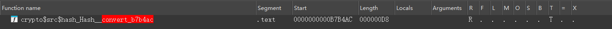

        

        - 入魂一番赏

        

        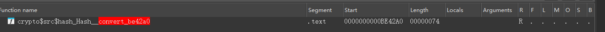

        > 这个截图是自定义库实现的, 前面走的并不是 `crypto` 第三方库 ; 不过这个函数内部调用了 `crypto` 的convert函数

     

     

2. 使用第三方库 `cryptography`

   ```dart
   //只有一个加密这么导入就行了
   import 'package:cryptography/cryptography.dart'
   //如果同时使用了两个加密，很容易冲突，使用模块化导出即可
   import 'package:cryptography/cryptography.dart' as cryptography;
   
   //SHA1加密
   Future<void> encryptSHA1ByCryptography(String str) async {
       print("SHA1ByCryptograph加密前文本:" + str);
       final message = utf8.encode(str);
       final algorithm = cryptography.Sha1();
       final hash = await algorithm.hash(message); // 构造算法对象，然后执行.hash
       //转化成16进制字符串
       final encryptStr = getHexString(hash.bytes);
       print("SHA1ByCryptograph加密后文本:" + encryptStr);
   }
   
   //SHA256加密
   Future<void> encryptSHA256ByCryptography(String str) async {
       print("SHA256ByCryptograph加密前文本:" + str);
       final message = utf8.encode(str);
       final algorithm = cryptography.Sha256();
       final hash = await algorithm.hash(message); // 构造算法对象，然后执行.hash
       final encryptStr = getHexString(hash.bytes);
       print("SHA256ByCryptograph加密后文本:" + encryptStr);
   }
   
   //SHA256的HMAC加密
   Future<void> encryptHMACSHA256ByCryptography(String hmacKey, String hmacValue) async {
       print("SHA256ByCryptograph加密前文本:key:$hmacKey value:$hmacValue");
       var key = utf8.encode(hmacKey);
       final bytes = utf8.encode(hmacValue); //这个转化的是accii码走的
       final secretKey = cryptography.SecretKey(key);
   
       final hmac = cryptography.Hmac.sha256(); 
       final mac = await hmac.calculateMac(
           bytes,
           secretKey: secretKey,
       ); // 构造算法对象时传入key，然后执行.calculateMac
       
       //返回的内容是16进制数组，需要转化成16进制字符串，因此不能使用utf8.decode
       final encryptStr = getHexString(mac.bytes);
       print("SHA256ByCryptograph加密后文本:" + encryptStr);
   }
   
   //将16进制数组转化成字符串
   String getHexString(List<int> ints) {
       return ints.map((e) {
           //toRadixString 转化 成 16 进制
           String text = e.toRadixString(16);
           return text.length > 1 ? text : '0$text';
       }).join('');
   }
   ```

   如果使用了这个库，我们需要去找 `.hash` 和 `calculateMac` 方法

   

3. 使用第三方库 [crypt](https://pub-web.flutter-io.cn/packages/crypt)

   ```dart
   import 'package:crypt/crypt.dart';
   
   void main() {
       // Creating crypt strings
   
       // Default rounds and random salt generated
       final c1 = Crypt.sha256('p@ssw0rd');
   
       // Random salt generated
       final c2 = Crypt.sha256('p@ssw0rd', rounds: 10000);
   
       // Default rounds
       final c3 = Crypt.sha256('p@ssw0rd', salt: 'abcdefghijklmnop');
   
       // No defaults used
       final c4 = Crypt.sha256('p@ssw0rd', rounds: 10000,
                               salt: 'abcdefghijklmnop');
   
       // SHA-512
       final d1 = Crypt.sha512('p@ssw0rd');
   	
       // Crypt 对象包含哈希值（hash） 使用的盐（salt） 哈希算法类型（type，这里是 sha512） 迭代轮数（rounds，默认值取决于库的实现）
       // 直接打印会出现 $6$salt$hashedpassword: 6代表算法sha512；salt是随机盐值；hashedpassword是最终结果
       // 所以一般用这个库会指定盐
       print(c1);
       print(c2);
       print(c3);
       print(c4);
       print(d1);
   
       // Comparing a value to a crypt hash
   
       for (final hashString in [
           r'$5$zQUCjEzs9jnrRdCK$dbo1i9WjQjbUwOC4JCRAZHpfd31Dh676vI0L6w0dZw1',
           c1.toString(),
           c2.toString(),
           c3.toString(),
           c4.toString(),
           d1.toString(),
       ]) {
           // Parse the crypt string: this extracts the type, rounds and salt
           final h = Crypt(hashString);
   
           const correctValue = 'p@ssw0rd';
           const wrongValue = '123456';
   
           if (!h.match(correctValue)) {
               print('Error: unexpected non-match: $correctValue');
           }
   
           if (h.match(wrongValue)) {
               print('Error: unexpected match: $wrongValue');
           }
       }
   }
   ```

   

### AES

正向开发:

使用的是  `encrypt` 加密库

支持很多模式，`CBC` `ECB` `CFB-64` `OFB-64` `SIC`

```dart
class AESUtil {
    static String generateAES(String data, String keyStr, String ivStr) {
        final plainText = data;
        final key = Key.fromUtf8(keyStr);
        final iv = IV.fromUtf8(ivStr);
        final encrypter = Encrypter(AES(key, mode: AESMode.cbc));// 指定使用CBC模式(AES/CBC/PKCS5PADDING)
        final encrypted = encrypter.encrypt(plainText, iv: iv);
        // final encrypter = Encrypter(AES(key, mode: AESMode.cbc)); 默认是AESMode.sic
        // final encrypter = Encrypter(AES(key, mode: AESMode.cbc, padding: null)); // NoPadding

        print("generateAES:" + encrypted.base64);
        return encrypted.base64;
    }
}
```

这里的key是通过AES传的；iv和明文是通过encrypt传的；


逆向方法:

1. 首先要判断出AES

   > 根据AES算法特点, **bytes字节数是16的倍数** ; 这只能代表可能是AES

2. 搜AES寻找 `encrypt` `encryptBytes` `convert` 之类的;

   

   > 目的是寻找key和iv

   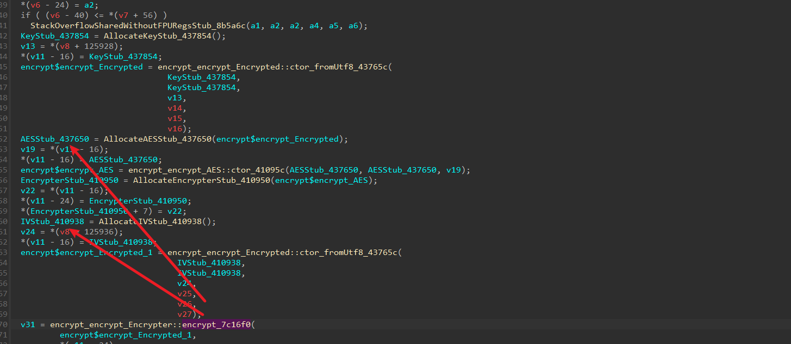

   > 这里就能找到key&iv了,按道理也能找到明文; 不过这里都只是初始化函数, 我们可以hook更直接的加密函数;
   >
   > hook这里涉及到的函数就能找到mode了;

   或者在去找这里的 `encrypt` 然后交叉引用找到AES验证顺便找key和iv

   > 这里的 `encrypt` 一般是为了找aes明文的

   

   这个一般会继续调用 `encryptBytes`

   

   继续跟

   

   这几个 `encrypt` 函数都包含了明文,找一个方便的就行;


### RSA

正向开发:

1. 首先pubspec.yaml中添加依赖

2. 在`assets` 目录下新建`rsa_key`文件夹，用来存储我们的公钥私钥文件

   > 我们逆向时去 `assets` 下寻找密钥; 一般flutter打包会额外创建一个文件夹叫 `flutter_assets`

   给一个案例截图

   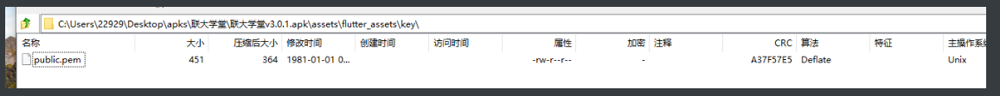

3.  在`pubspec.yaml`文件中添加公钥私钥文件。

    ```yaml
    flutter:
      # The following line ensures that the Material Icons font is
      # included with your application, so that you can use the icons in
      # the material Icons class.
      uses-material-design: true
    
      # To add assets to your application, add an assets section, like this:
      assets:
        - assets/fonts/iconfont.json
        - assets/rsa_key/rsa_public_key.pem
        - assets/rsa_key/rsa_private_key.pem
        #   - images/a_dot_burr.jpeg
        #   - images/a_dot_ham.jpeg
        - assets/images/home_logo.png
    ```

4. 在`lib/utils`目录下新建`rsa_encrypt.dart`文件，用来开发我们的加密解密工具类。

   ```dart
   import 'dart:convert';
   import 'package:encrypt/encrypt.dart';
   import 'package:flutter/services.dart';
   import 'package:pointycastle/asymmetric/api.dart';
   class Encrypt {
       ///  加密
       static encryption(content) async {
           final parser = RSAKeyParser();
           // 加载密钥
           String publicKeyString = await rootBundle.loadString('assets/rsa_key/rsa_public_key.pem'); 
           print('publicKeyString=$publicKeyString'); // 注意这一行的输出
           // 实现加密
           RSAPublicKey publicKey = parser.parse(publicKeyString) as RSAPublicKey;
           final encrypter = Encrypter(RSA(publicKey: publicKey));
           // 转base64
           return encrypter.encrypt(content).base64;
       }
       /// 解密
       static Future<String> decrypt(String decoded) async {
           final parser = RSAKeyParser();
           String privateKeyString = await rootBundle.loadString('assets/rsa_key/rsa_private_key.pem');
           final privateKey = parser.parse(privateKeyString) as RSAPrivateKey;
           final encrypter = Encrypter(RSA(privateKey: privateKey));
           return encrypter.decrypt(Encrypted.fromBase64(decoded));
       }
   }
   
   ```


逆向方法:

1. 先去assets找到密钥

   > 找不到的话先看2, 顺藤摸瓜也能找到的]

   实在找不到的话 ida搜索 strings试试; 一般会有路径和文件名

   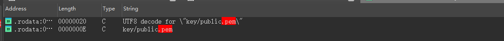

   

2. 找 `parse` 函数来定位明文和密钥; 或者搜 `RSA` `decrypt` `encrypt`

   

   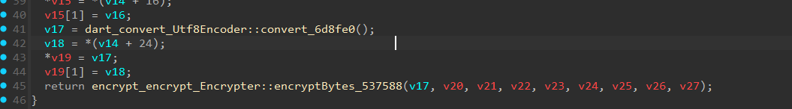

   比如这个函数调用convert函数传递bytes数据,然后调用 `encryptBytes` 实现加密

   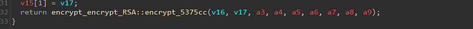

   > 这里就能找到明文了, 密钥可能还得找找

   里面又调用了 前面提到的 `RSA_encrypt` 函数

   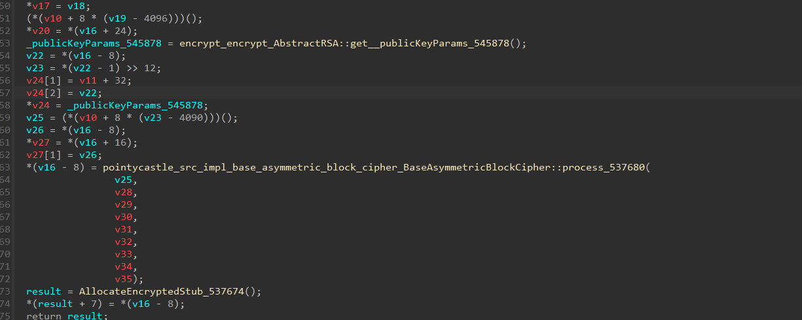

   这个函数里面就会有密钥以及明文, 可以hook拿


# py爬虫常用信息伪造

在这一章节我会把爬虫中所有需要伪造的东西都列出来，并且给出伪造代码

> 如果可以的话，我会把这些信息打包成pip包

## 时间

1. time模块

   - 时间戳

     ```python
     def timestamp() -> str:
         return int(time.time())
     
     def timestamp_ms() -> str:
         return int(time.time() * 1000)
     
     ```

   - 格式化字符串

     ```python
     timestamp = time.time()
     time_str = time.strftime('%Y-%m-%d %H:%M:%S', time.localtime(timestamp))
     time_str = time.strftime('%Y-%m-%d %H:%M:%S', time.localtime(timestamp))
     ```

   - 时间字符串转时间戳

     ```python
     time_str = '2025-06-18 21:33:49'
     # 转时间元组
     print(time.strptime(time_str, '%Y-%m-%d %H:%M:%S'))
     # 时间字符串转换成时间戳
     timestamp = time.mktime(time.strptime(time_str, '%Y-%m-%d %H:%M:%S'))
     
     ```

2. datetime模块

   - 时间戳

     ```python
     from datetime import datetime
     
     time_str = datetime.now() # 2025-06-18 21:37:02.490199
     # 时间元组
     time_tuple = datetime.now().timetuple()
     ```

   - datetime对象转**时间字符串和时间戳**

     ```python
     # datetime对象转换成时间字符串
     datetime_str = datetime.strftime(datetime.now(), '%Y-%m-%d %H:%M:%S')
     print(datetime_str) #2019-05-29 17:22:37
     
     # datetime对象转换成时间戳
     datetime_stamp = datetime.timestamp(datetime.now())
     print(datetime_stamp) # 1559121757.343784
     ```

   - 时间字符串转时间戳

     ```python
     # 时间字符串转datetime对象，再转时间戳
     datetime_stamp2 = datetime.timestamp(datetime.strptime(datetime_str, '%Y-%m-%d %H:%M:%S'))
     print(datetime_stamp2) # 1559121757.0
     ```

   - 时间戳转时间字符串

     ```python
     # 时间戳转datetime对象，再转时间字符串
     datetime_str2 = datetime.strftime(datetime.fromtimestamp(datetime_stamp2), '%Y-%m-%d %H:%M:%S')
     print(datetime_str2)
     ```

   - 带毫秒的时间字符串

     ```python
     print(datetime.utcnow().strftime('%Y-%m-%d %H:%M:%S.%f')[:-3])
     ```
     


## imei

规则:        

1. 第一部分 TAC，Type Allocation Code，类型分配码

   由8位数字组成（早期是6位），是区分手机品牌和型号的编码，该代码由GSMA及其授权机构分配。
   其中TAC码前两位又是分配机构标识（Reporting Body Identifier），是授权IMEI码分配机构的代码，如01为美国CTIA，35为英国BABT，86为中国TAF。

2. 第二部分 FAC，Final Assembly Code，最终装配地代码
3. 由2位数字构成，仅在早期TAC码为6位的手机中存在，所以TAC和FAC码合计一共8位数字。
   该FAC码用于生产商内部区分生产地代码。

3. 第三部分 SNR，Serial Number，序列号

   由第9位开始的6位数字组成，区分每部手机的生产序列号。

4. 第四部分 CD，Check Digit，验证码

   由前14位数字通过Luhn算法计算得出。

5. 第五部分 SVN，Software Version Number，软件版本号

   区分同型号手机出厂时使用的不同软件版本，仅在部分品牌的部分机型中存在。

   


```python
def validate_imei(imei):
    """验证IMEI号码是否有效"""
    if len(imei) != 15 or not imei.isdigit():
        return False

    imei_base = imei[:14]
    expected_check_digit = calculate_luhn_check_digit(imei_base)
    return expected_check_digit == imei[-1]

def calculate_luhn_check_digit(imei_base):
    """计算Luhn校验位"""
    """
        序号是倒置的 D14 D13 D12 D11 D10 D9 D8 D7 D6 D5 D4 D3 D2 D1 D0
        (1) 取奇数位: 则为D13 D11 D9 D7 D5 D3 D1【代码index%2==1】
        (2) 奇数位翻倍
    """
    total = 0
    for i, digit in enumerate(map(int, imei_base)):
        if i % 2 == 1:  # 奇数位: 乘以2【代码中从0开始】, 偶数位直接加
            digit *= 2
            if digit > 9: # 两位数则，十位数+个位数
                digit = digit // 10 + digit % 10
        total += digit
    check_digit = (10 - (total % 10)) % 10
    return str(check_digit)

def generate_imei() -> str:
    """
    生成符合规范的IMEI号码
    """
    # 现代IMEI结构：TAC+FAC(8位) + SNR(6位) + 校验位(1位)
    tac_fac = "".join([str(random.randint(0, 9)) for _ in range(8)])
    snr = "".join([str(random.randint(0, 9)) for _ in range(6)])

    imei_base = tac_fac + snr
    check_digit = calculate_luhn_check_digit(imei_base)
    return imei_base + check_digit


```


## mac地址

mac 地址 **由六组两个十六进制数字组成，每组与下一组用冒号分隔，例如aa：bb：cc：dd：ee：00**

有的mac地址使用 `-` 连接

前五组十六进制数字派生自交换机，对于交换机上的所有接口都是相同的。

> 手机查看mac地址
>
> ```bash
> C:\Users\xxx>adb shell ip addr show wlan0
> 26: wlan0: <BROADCAST,MULTICAST,UP,LOWER_UP> mtu 1500 qdisc mq state UP group default qlen 3000
>     link/ether 7e:3e:d1:83:85:3c brd ff:ff:ff:ff:ff:ff
>     inet 192.168.84.209/24 brd 192.168.84.255 scope global wlan0
>        valid_lft forever preferred_lft forever
>     inet6 fe80::7c3e:d1ff:fe83:853c/64 scope link
>        valid_lft forever preferred_lft forever
> ```
>
> 7e:3e:d1:83:85:3c就是手机的mac地址了；ff:ff:ff:ff:ff:ff是对于的子网掩码

```python
import random

def generate_mac() -> str:
    return ":".join("".join(random.sample("0123456789abcdef",2)) for i in range(6))

```


## uuid

### 介绍

UUID 是一套用于生成全局唯一标识符的标准，也被称为 GUID （Globally Unique Identifier）。[参考文章](https://blog.csdn.net/u012581020/article/details/131120310)

UUID 的英文全称为 Universally Unique Identifier，即通用唯一识别码，它是由一组 16 个字节（128 位）组成的标识符，可以用于唯一地标识信息。UUID 的生成方式有多种，其中最为常用的是基于算法的 UUID 生成方式和基于硬件的 UUID 生成方式。下面我们分别来介绍这两种生成方式的原理。

1. 基于算法的 UUID 生成方式
    基于算法的 UUID 生成方式是指使用计算机程序根据一定的算法生成 UUID。

  这种方式的优点是可以在任何环境中生成 UUID，并且不需要依赖于任何硬件设备，缺点是生成的 UUID 不够随机，容易被猜测到，因此不适合用于安全领域。

  目前最常用的基于算法的 UUID 生成方式是基于时间戳的 UUID 生成方式。该方式基于当前时间戳和机器的 MAC 地址生成 UUID，它的算法流程如下：

  - 获取当前时间戳和机器的 MAC 地址；
  - 将当前时间戳转换为 UTC 时间，并计算出自 1582 年 10 月 15 日午夜（即格林威治标准时间 0 点）以来的纳秒数，将其存储在 UUID 的时间戳字段中；
  - 将机器的 MAC 地址哈希得到其中的 6 个字节作为 UUID 的节点字段；
  - 随机生成两个字节作为 UUID 的时钟序列字段；
  - 将时间戳、节点、时钟序列等信息组合起来，生成 UUID。
  - 基于时间戳的 UUID 生成方式可以保证在同一时刻生成的 UUID 唯一，并且可以提供一定的顺序性，因此非常适合用于分布式系统中对数据进行排序操作。

  但是，如果多台计算机的时钟存在差异，就有可能导致生成重复的 UUID，因此需要采取一些措施来防止时钟不同步的问题。此外，这种方式也容易受到时钟回拨攻击的影响，因此需要特殊处理。

  

2. 基于硬件的 UUID 生成方式

   基于硬件的 UUID 生成方式是指使用计算机硬件设备生成 UUID，该方式的优点是生成的 UUID 随机性高，不容易被猜测到，缺点是只能在具备对应硬件设备的机器上生成 UUID，不够灵活。

   基于硬件的 UUID 生成方式常用的有 MAC 地址 UUID 和 CPU ID UUID。

   MAC 地址 UUID 是指使用计算机网卡设备的 MAC 地址作为 UUID 的节点字段，这种方式可以保证每个机器生成的 UUID 都是唯一的，并且不依赖于时钟同步。但是，它也存在一些缺点，比如计算机的网卡可能会被更换，导致 UUID 发生变化。

   CPU ID UUID 是指使用计算机 CPU 的序列号作为 UUID 的节点字段，这种方式与 MAC 地址 UUID 很相似，但是比 MAC 地址 UUID 更加安全，因为 CPU 序列号不会轻易发生变化。不过，由于 CPU 可以被替换，因此这种方式也存在一定的风险。
   


### 代码实现

格式一般是：`14b66846-03f1-43a8-8621-ee1a783d5760`

- java端一般都是直接随机生成的

  ```java
  java.util.UUID.randomUUID();
  ```

- python端可以使用标准库生成

  ```python
  import uuid
  
  def generate_uuid() -> str:
      # 这里把uuid转为字符串，否则uuid4对象使用起来没那么方便
      return f"{uuid.uuid4()}"
  ```


## oaid

移动终端设备标识码，如IMEI、Wi-Fi的MAC地址、SIM卡国际移动用户识别码（IMSI）和蓝牙地址等终端设备标识信息的收集和使用成为普遍现象。

同时各国对用户隐私保护的要求越来越高，传统的移动终端设备标识如国际移动设备识别码（IMEI）等已被部分国家认定为**用户隐私的一部分**，安卓10之后想获取这些信息也很难，需要系统应用才能拿。而且本身这些信息比较好伪造，所以在进行设备溯源的效果中就没有那么好；

至此oaid被提出来了，匿名设备标识符（Open Anonymous Device Identifier，简称OAID）是一种用于安卓设备的**唯一标识符，可由用户重置**。该标识符由 **移动安全联盟（MSA）**、中国信息通信研究院以及设备厂商合力推出，旨在替代IMEI等不可重置的设备标识符，以保护用户隐私。**OAID 匿名设备标识** 是 UUID 的替代品，在终端首次启动时生成。**同一设备的 OAID 相同，因此可以在多个应用之间共享**，恢复出厂设置会重置 OAID；

>  OAID 是移动智能终端补充设备标识体系中的一员，官方定义为 Open Anonymous Device Identifier（开放匿名设备标识符）， 华为称之为 Open Advertising ID （开放广告标识符），谷歌称之为 Android Advertising ID （安卓广告标识符）。[参考文章](https://github.com/gzu-liyujiang/Android_CN_OAID?tab=readme-ov-file)

实际上这个oaid就是为了给你量身定做，投放广告用的；国内的APP如果需要接广告，基本上都要且都会接入它。

> 因为广告赚钱+免费的frida反调试功能，所以使用的app非常多；

>  其实可以这么理解，广告商需要根据oaid这个参数来精准推送广告；可能你在某个app搜了点东西，然后到另一个app中就会弹出对应商品的广告（这里我猜测就是利用了这个参数）；对于精准推送广告这个问题，代表性的还有，b站会根据你的手机型号来精准推送手机壳等东西；


那么如何下载这个sdk来获取oaid？[参考文章](https://juejin.cn/post/7072741392178479140)

1. 注册 MSA 账号

   > 下载 SDK 和集成文档前需要注册一个企业账户

2. 申请 SDK 证书

   从 v1.0.26 开始，SDK 引入了证书校验机制，每个 APP 都需要申请一个证书文件（`包名.cert.pem`），并且只有包名与证书匹配的 APP 才能正常获取补充设备 ID。默认证书的有效期为 1 年，证书过期也会影响获取补充设备 ID。因此还需要根据实际场景需要设计证书更新机制，比如在应用中内置一个默认证书，并应用开到期时提前从后台服务器更新证书。申请证书需要向 `msa@caict.ac.cn` 发送申请邮件，并携带附件；

3. 下载 SDK 与集成文档

   企业账号注册并审核通过后，就可以从官网下载到相关资料了（因为 MSA 禁止第三方违规分发 SDK，所以还是得自己去下载）

   最后差不多是这样

   

4. 集成与封装

   - 集成 aar

   - APPID 配置

   - 证书配置

   - 设置混淆

   - 设置 Gradle 编译选项

     根据项目需要，配置 ndk 编译配置；主要是支持的平台，如 `arm64-v8a` 、`armebi-v7a`

5. 代码封装

   下面是一些注意事项：

   - 隐私政策授权： 需要确保用户同意《隐私政策》后，再初始化 SDK；

   - 初始化时机： 加固版本在调用前需要先 `loadLibrary("msaoaidsec")`，因为加载有延迟，所以官方推荐尽早提前初始化；

   - 回调时机： `MidSdkHelper#InitSdk()` 的结果回调可能是同步的，也可能是从异步子线程回调，与 SDK 内部的判断也有关。


这个sdk提供的接口有哪些？

- **IdSupplier#isSupported()：** 判断设备是否支持补充设备标识符
- **IdSupplier#isLimited()：** 判断设备是否限制应用获取补充设备标识符
- **IdSupplier#getOAID(Context)：** 获取 OAID
- **IdSupplier#getVAID(Context)：** 获取 VAID
- **IdSupplier#getAAID(Context)：** 获取 AAID


更 新一些的oaid获取方案，可以看 [Android_CN_OAID](https://github.com/gzu-liyujiang/Android_CN_OAID)，不过这个设计初衷是个人开发者的app；所以企业版一般还是会走msa的sdk；

> ps: 使用这个库生产的oaid有可能全是0


## vaid


## aaid


# root技术

记住一句话：root只是基本，如果手机不适合root，我们就换个适合的手机；


selinux：安全增强型 Linux（SELinux）是一种针对 Linux设计的安全架构，它能够让管理员更好地控制哪些人可以访问系统。它最初由美国国家安全局（NSA）开发，并利用 Linux 安全模块（LSM）以补丁集的形式整合到 Linux 内核中。


## 常见root手法

1. 普通面具 magisk
2. 其他面具如 狐妖面具、apatch面具
3. kernelSu


## root前置条件

解bl锁


## root检测

检测文章

- [常见Java层反调试技术之root检测方式总结](https://github.com/r0ysue/AndroidSecurityStudy/tree/master/Student/001)


1. su文件

   su文件是linux提权到root所需要的文件；

   安卓手机出于安全考虑，**系统内部一般是没有su可执行文件**，所以基于检查系统内部是否存在su文件的方式可以判断该系统有没有被Root。

   

2. 非法二进制文件如 magisk

   

3. SELinux是否开启

   

4. ro.debuggable和ro.secure

   ro.debuggable： adb是否开启；

   ro.secure：是否开启安全性强化措施；

   

5. 特定路径是否有写权限

   在 Linux 和 Android 的系统中，root 用户有着最高的权限，可以在系统中执行一些非常低级的操作，例如更改系统设置、系统文件、程序文件等。

   而其他常规用户则只能够在自己拥有的权限下进行操作，通过检查具体路径的读写权限，可以判断设备是否被root；

   如 `/system`， `/system/bin`， `/system/sbin`， `/system/xbin`， `/vendor/bin`， `/sbin`， `/etc`， `/sys`， `/proc`， `/dev`

   

6. test-keys

   "ro.build.tags"，如果其值为"test-keys"，则说明该手机系统是使用测试版的数字签名密钥构建的，而这种密钥是开发人员常用的，容易被黑客攻击，因此有被root的风险。

   而正式发布的Android系统则使用的是"release-keys"，这种密钥是由厂家发布的数字签名，更难被攻击，因此是相对安全的。

   因此，如果检测到一个Android设备的系统属性中的"ro.build.tags"为"test-keys"，则可以判定该设备可能被root

   

7. 非法应用


## 对抗检测

1. 面具隐藏+模块隐藏

2. 其他面具隐藏

3. 内核su隐藏

4. hook绕过（通杀或者对app针对性hook）

   https://github.com/AshenOneYe/FridaAntiRootDetection，下面的脚本就是

5. aosp隐藏su

```js
const commonPaths = [
    "/data/local/bin/su",
    "/data/local/su",
    "/data/local/xbin/su",
    "/dev/com.koushikdutta.superuser.daemon/",
    "/sbin/su",
    "/system/app/Superuser.apk",
    "/system/bin/failsafe/su",
    "/system/bin/su",
    "/su/bin/su",
    "/system/etc/init.d/99SuperSUDaemon",
    "/system/sd/xbin/su",
    "/system/xbin/busybox",
    "/system/xbin/daemonsu",
    "/system/xbin/su",
    "/system/sbin/su",
    "/vendor/bin/su",
    "/cache/su",
    "/data/su",
    "/dev/su",
    "/system/bin/.ext/su",
    "/system/usr/we-need-root/su",
    "/system/app/Kinguser.apk",
    "/data/adb/magisk",
    "/sbin/.magisk",
    "/cache/.disable_magisk",
    "/dev/.magisk.unblock",
    "/cache/magisk.log",
    "/data/adb/magisk.img",
    "/data/adb/magisk.db",
    "/data/adb/magisk_simple",
    "/init.magisk.rc",
    "/system/xbin/ku.sud",
    "/data/adb/ksu",
    "/data/adb/ksud"
];

const ROOTmanagementApp = [
    "com.noshufou.android.su",
    "com.noshufou.android.su.elite",
    "eu.chainfire.supersu",
    "com.koushikdutta.superuser",
    "com.thirdparty.superuser",
    "com.yellowes.su",
    "com.koushikdutta.rommanager",
    "com.koushikdutta.rommanager.license",
    "com.dimonvideo.luckypatcher",
    "com.chelpus.lackypatch",
    "com.ramdroid.appquarantine",
    "com.ramdroid.appquarantinepro",
    "com.topjohnwu.magisk",
    "me.weishu.kernelsu"
];


function stackTraceHere(isLog){
    var Exception = Java.use('java.lang.Exception');
    var Log = Java.use('android.util.Log');
    var stackinfo = Log.getStackTraceString(Exception.$new())
    if(isLog){
        console.log(stackinfo)
    }else{
        return stackinfo
    }
}

function stackTraceNativeHere(isLog){
    var backtrace = Thread.backtrace(this.context, Backtracer.ACCURATE)
    .map(DebugSymbol.fromAddress)
    .join("\n\t");
    console.log(backtrace)
}


function bypassJavaFileCheck(){
    var UnixFileSystem = Java.use("java.io.UnixFileSystem")
    UnixFileSystem.checkAccess.implementation = function(file,access){

        var stack = stackTraceHere(false)

        const filename = file.getAbsolutePath();

        if (filename.indexOf("magisk") >= 0) {
            console.log("Anti Root Detect - check file: " + filename)
            return false;
        }

        if (commonPaths.indexOf(filename) >= 0) {
            console.log("Anti Root Detect - check file: " + filename)
            return false;
        }

        return this.checkAccess(file,access)
    }
}

function bypassNativeFileCheck(){
    var fopen = Module.findExportByName("libc.so","fopen")
    Interceptor.attach(fopen,{
        onEnter:function(args){
            this.inputPath = args[0].readUtf8String()
        },
        onLeave:function(retval){
            if(retval.toInt32() != 0){
                if (commonPaths.indexOf(this.inputPath) >= 0) {
                    console.log("Anti Root Detect - fopen : " + this.inputPath)
                    retval.replace(ptr(0x0))
                }
            }
        }
    })

    var access = Module.findExportByName("libc.so","access")
    Interceptor.attach(access,{
        onEnter:function(args){
            this.inputPath = args[0].readUtf8String()
        },
        onLeave:function(retval){
            if(retval.toInt32()==0){
                if(commonPaths.indexOf(this.inputPath) >= 0){
                    console.log("Anti Root Detect - access : " + this.inputPath)
                    retval.replace(ptr(-1))
                }
            }
        }
    })
}

function setProp(){
    var Build = Java.use("android.os.Build")
    var TAGS = Build.class.getDeclaredField("TAGS")
    TAGS.setAccessible(true)
    TAGS.set(null,"release-keys")

    var FINGERPRINT = Build.class.getDeclaredField("FINGERPRINT")
    FINGERPRINT.setAccessible(true)
    FINGERPRINT.set(null,"google/crosshatch/crosshatch:10/QQ3A.200805.001/6578210:user/release-keys")

    // Build.deriveFingerprint.inplementation = function(){
    //     var ret = this.deriveFingerprint() //该函数无法通过反射调用
    //     console.log(ret)
    //     return ret
    // }

    var system_property_get = Module.findExportByName("libc.so", "__system_property_get")
    Interceptor.attach(system_property_get,{
        onEnter(args){
            this.key = args[0].readCString()
            this.ret = args[1]
        },
        onLeave(ret){
            if(this.key == "ro.build.fingerprint"){
                var tmp = "google/crosshatch/crosshatch:10/QQ3A.200805.001/6578210:user/release-keys"
                var p = Memory.allocUtf8String(tmp)
                Memory.copy(this.ret,p,tmp.length+1)
            }
        }
    })

}

//android.app.PackageManager
function bypassRootAppCheck(){
    var ApplicationPackageManager = Java.use("android.app.ApplicationPackageManager")
    ApplicationPackageManager.getPackageInfo.overload('java.lang.String', 'int').implementation = function(str,i){
        // console.log(str)
        if (ROOTmanagementApp.indexOf(str) >= 0) {
            console.log("Anti Root Detect - check package : " + str)
            str = "ashen.one.ye.not.found"
        }
        return this.getPackageInfo(str,i)
    }

    //shell pm check
}

function bypassShellCheck(){
    var String = Java.use('java.lang.String')

    var ProcessImpl = Java.use("java.lang.ProcessImpl")
    ProcessImpl.start.implementation = function(cmdarray,env,dir,redirects,redirectErrorStream){

        if(cmdarray[0] == "mount"){
            console.log("Anti Root Detect - Shell : " + cmdarray.toString())
            arguments[0] = Java.array('java.lang.String',[String.$new("")])
            return ProcessImpl.start.apply(this,arguments)
        }

        if(cmdarray[0] == "getprop"){
            console.log("Anti Root Detect - Shell : " + cmdarray.toString())
            const prop = [
                "ro.secure",
                "ro.debuggable"
            ];
            if(prop.indexOf(cmdarray[1]) >= 0){
                arguments[0] = Java.array('java.lang.String',[String.$new("")])
                return ProcessImpl.start.apply(this,arguments)
            }
        }

        if(cmdarray[0].indexOf("which") >= 0){
            const prop = [
                "su"
            ];
            if(prop.indexOf(cmdarray[1]) >= 0){
                console.log("Anti Root Detect - Shell : " + cmdarray.toString())
                arguments[0] = Java.array('java.lang.String',[String.$new("")])
                return ProcessImpl.start.apply(this,arguments)
            }
        }

        return ProcessImpl.start.apply(this,arguments)
    }
}


console.log("Attach")
bypassNativeFileCheck()
bypassJavaFileCheck()
setProp()
bypassRootAppCheck()
bypassShellCheck()
```


## aosp源码定制

原理:修改aosp源代码,在fork子进程的时候注入frida-gadget

[ubuntu 20.04系统AOSP(Android 11)集成Frida](https://www.mobibrw.com/2021/28588#/)
[AOSP Android 10内置FridaGadget实践01](https://www.52pojie.cn/thread-1740214-1-1.html#/)
[AOSP Android 10内置FridaGadget实践02(完)](https://www.52pojie.cn/thread-1748101-1-1.html)|


# 抓包技术

## 手机抓包

讲一下中间人抓包的本质：手机转抓包软件的证书，从而可以解密https流量

而安卓7+，证书装在用户证书，安卓是不信任这个证书的，所以我们需要移到系统证书下；

而想移动到系统证书下，需要把对应目录挂载为可读写，这是需要root的（实际现在很多手机即使root也不好挂载）

因此我们需要对手机进行root，这里可以去看[root技术](#root技术)


## 配置抓包

手机wifi挂代理把流量转发到抓包软件，

抓包软件有很多，看你喜欢哪个用哪个，这里可以是charles，mitmproxy，reqable，burp，wireshark等等

比如charles就需要设置wifi代理 `192.168.31.170:8888`，然后浏览器访问 `chls.pro`，后面这一步是下载对应你电脑的安卓需要的charles证书，下载好，安装CA证书；

这时候证书已经到了用户证书了，如果是低版本安卓，此时随便抓包了；但是我们现在都是高版本(7+)，所以需要移动到系统证书下；

我们使用 movecert的xp模块，他会自动把用户证书移动到系统证书下；

移动好之后，就可以正常抓包了；


## 转发流量

常见的一些方式

1. wifi代理

2. vpn代理转发

   >  socksDroid、postern、shadowrocket

   - http/https 转发
   - sockets 转发

   有这两种方式，我们一般用后面的 sockets

3. 无痕代理（我用的少）


实际使用时，我们使用 reqable 进行抓包是最方便的，其ui非常清爽，功能丰富；


## 海外app抓包

1. 抓包软件再挂一个能访问海外网站的代理就行

   clash配置端口，然后抓包软件设置clash的端口就行；

2. 电脑流量强制走底层vpn软件

   如：快连vpn


## 代理相关理论知识

正向代理：

- 你的电脑 - 代理服务器 - 目标服务器

反向代理：


透明代理：

> 走的是iptable

匿名代理：

> 加密的透明代理


### 关于iptables

iptable原理（透明代理）：

 - linux内核提供的防火墙工具是**Netfilter/Iptables**。

 - **Netfilter**是由linux内核集成的IP数据包过滤系统，其工作在内核内部，而**Iptables**则是让用户定义规则集的表结构。

 - 也就是，**iptables**是一个命令行工具，位于用户空间，它真正操作的框架实现在内核当中。

 - `Iptables`主要工作在OSI七层的2.3.4层，好像也没比VPN的工作协议低，反而还有高的。

   > 测试结果证明，iptables不是由于协议低，而是没有出现`tun0`或者`ppp0`这两个关键的网卡特征，所以成功绕过了VPN的检测。所以也叫做透明代理

 [一篇文章解析 各种代理区别](https://zhuanlan.zhihu.com/p/68560128)


## 抓包对抗

-  [APP代理和VPN检测绕过对抗](https://sanshiok.com/archive/8.html)
-  [一篇文章解析 各种代理区别](https://zhuanlan.zhihu.com/p/68560128)

### wifi代理转发检测

不开代理正常数据返回，开了代理就返回不了

**代表软件**：安居客v16.13.2


原理

1. java端可以读出来你是否使用代理
2. java端也可以设置强行不走代理


正向实现方式

1. 系统类

   ```java
   // 也可以这样
   String host = System.getProperty("https.proxyHost");
   String port = System.getProperty("https.proxyPort");
   
   // 直接不走代理
   new OkHttpClient().newBuilder().proxy(Proxy.NO_PROXY).build();
   ```

2. 使用SystemProperties类

   ```java
   import android.os.SystemProperties;
   
   String proxyHost = SystemProperties.get("http.proxyHost");
   String proxyPort = SystemProperties.get("http.proxyPort");
   
   if (proxyHost != null && proxyPort != null) {
       // 代理已设置
   } else {
       // 未设置代理
   }
   ```

3. 使用ConnectivityManager类

   ```java
   import android.content.Context;
   import android.net.ConnectivityManager;
   import android.net.NetworkInfo;
   
   public boolean isProxySet(Context context) {
       ConnectivityManager cm = (ConnectivityManager) context.getSystemService(Context.CONNECTIVITY_SERVICE);
       NetworkInfo activeNetwork = cm.getActiveNetworkInfo();
   
       if (activeNetwork != null && activeNetwork.isConnected()) {
           if (activeNetwork.getType() == ConnectivityManager.TYPE_WIFI) {
               // Wi-Fi连接，无需代理
               return false;
           } else if (activeNetwork.getType() == ConnectivityManager.TYPE_MOBILE) {
               String proxyHost = android.net.Proxy.getDefaultHost();
               return (proxyHost != null && proxyHost.length() > 0);
           }
       }
   
       return false; // 未设置代理
   }
   ```

4. 使用Java的URL类 不走代理

   ```java
   import java.net.Proxy;
   import java.net.URL;
   import java.net.URLConnection;
   
   try {
       URL url = new URL("http://www.example.com");
       URLConnection connection = url.openConnection(Proxy.NO_PROXY);
       // 无代理设置
   } catch (Exception e) {
       // 代理设置
   }
   ```

   > NO_PROXY实际上就是type属性为DIRECT的一个Proxy对象，这个type有三种：
   >
   > - DIRECT 、 HTTP 、SOCKS
   >
   > 所以，`Proxy.NO_PROXY`的意思是connection的请求是直连。
   > 此时若通过系统进行代理，app对外请求会失效，也就是视觉上看到的卡死状态，就是不让走系统代理。


如何对抗：

1. hook对抗
2. 更换转发流量的方式，如vpn


hook对抗代码

```js
function bypass_proxyCheck() {
    Java.perform(function () {
        // 1. 绕过 SystemProperties 类
        var SystemProperties = Java.use('android.os.SystemProperties');
        SystemProperties.get.overload('java.lang.String').implementation = function (key) {
            if (key.startsWith('http.proxy') || key.startsWith('https.proxy') || key.startsWith('socks.proxy')) {
                console.log('[*] 拦截代理检测(SystemProperties): ' + key + ' -> null');
                return null;
            }
            return this.get(key);
        };

        // 2. 绕过系统检测
        var System = Java.use('java.lang.System');
    	System.getProperty.overload('java.lang.String').implementation = function(key) {
            if(key=="https.proxyHost" || key=="https.proxyPort"){
                return null;
            }
        return this.getProperty(key);
        }
        
        // 3. 绕过 okhttp
        var Builder = Java.use("okhttp3.OkHttpClient$Builder");

        Builder.proxy.implementation = function (proxy) {
            var res = this.proxy(null);
            return res;
        }
        // 4. 绕过 ConnectivityManager 类
        var Proxy = Java.use('android.net.Proxy');
        Proxy.getDefaultHost.implementation = function () {
            console.log('[*] 拦截代理检测(Proxy): getDefaultHost() -> null');
            return null;
        };

        // 5. 绕过 Java URL 类
        var URL = Java.use('java.net.URL');
        URL.openConnection.overload('java.net.Proxy').implementation = function (proxy) {
            console.log('[*] 拦截代理检测(URL): openConnection(Proxy) -> 使用NO_PROXY');
            return this.openConnection(Java.use('java.net.Proxy').NO_PROXY.value);
        };
        
    });
}
setImmediate(bypass_proxyCheck);
```


### vpn代理转发检测

常用软件：Postern、SocksDroid、VProxid、Reqable、ProxyDroid、[PCAPdroid](https://github.com/emanuele-f/PCAPdroid)

> VProxid`据说可以理解是`Proxifier`的手机版；有时 `postern` 抓不了的我们用 `VProxid

现象

开了vpn就各种风控，不让访问；全部关掉后就正常

**代表软件**: 拼多多v6.29.0


原理

使用vpn转发的话，`ifconfig` 一般是tun0字样

```bash
ip addr | grep -E ".*: <"
```

```bash
adb shell ip link show
```

开了vpn：

> 26: wlan0: 
> 27: p2p0: 
> 30: tun0: 

没开vpn：

> 26: wlan0:
> 27: p2p0: 


检测方式如下：

1. 把vpn转发后的ip地址（也就是服务器收到的ip地址）与已有公开的vpn的地址表对比

2. dns解析验证：VPN连接通常会通过特定的DNS服务器进行解析。比如10.0

3. 判断网络接口名字包含`ppp0`或`tun0` 或 `tap0`
   - ppp0 点对点协议接口
   - tun0/tap0 虚拟网络接口

4. 获取当前网络 `Transpoart` 字样

5. 协议识别 `java.net.DatagramPacket` 类


解决方案

1. hook--`java.net.NetworkInterface` 的 `getName` 和 `getAll` 的返回值

   > 检测到 `ppp0` 和tun0修改成正常的 `eth0` `wlan0` `rmnet0` ``rmnet_data0` `
   >
   > - Wi-Fi 连接：通常是 `wlan0`; 
   > - 移动数据：通常是 `rmnet0`、`rmnet_data0` 或类似名称
   > - **VPN 连接**：(1) IPsec/L2TP可能使用 `ppp0` (2) OpenVPN/Shadowsocks：通常使用 `tun0`
   > - USB 共享网络：(1) 手机作为热点`rndis0` 或 `usb0` (2) 手机连接到电脑 `ppp0`（如果通过 PPP 协议）

   ```js
   // 篡改检测
   let String = Java.use("java.lang.String");
   let NetworkInterface = Java.use("java.net.NetworkInterface");
   NetworkInterface.getName.implementation = function () {
       console.log("call java.net.NetworkInterface.getName()");
       var result = this.getName();
       console.log("find getName：", result);
       if (result && (result.indexOf("ppp0") > -1 || result.indexOf("tun0") > -1)) {
           return String.$new("rmnet_data0");
       }
   }
   // 篡改getAll(hooker工具包js)
   NetworkInterface.getAll.implementation = function () {
       var nis = this.getAll();
       console.log("call java.net.NetworkInterface.getAll()");
       nis.forEach(function (ni) {
           if (ni.name.value.indexOf("tun0") >= 0 || ni.name.value.indexOf("ppp0") >= 0 || ni.displayName.value.indexOf("tun0") >= 0 || ni.displayName.value.indexOf("ppp0") >= 0) {
               ni.name.value = "rmnet_data0";
               ni.displayName.value = "rmnet_data0";
           }
       })
       return nis;
   }
   ```

2. hook--`android.net.ConnectivityManager `的 `getNetworkCapabilities` 返回值为null； 

   > - 以及 `getNetworkInfo()` 传入17代表找到了vpn，正在查询对应信息 （这部分来自hooker工具包）

   ```js
   var can_hook = false;
   // 检测监听
   let ConnectivityManager = Java.use("android.net.ConnectivityManager");
   ConnectivityManager.getNetworkInfo.overload('int').implementation = function () {
       if (arguments[0] === 17) {
           can_hook = true
       }
       let ret = this["getNetworkInfo"](arguments[0]);
       console.log("find getNetworkInfo：", ret)
       return ret;
   }
   // 篡改返回值
   let NetworkInfo = Java.use("android.net.NetworkInfo")
   NetworkInfo.isConnected.implementation = function () {
       let ret = this.isConnected()
       if (can_hook) {
           ret = false
           can_hook = false
           console.log("call isConnected function !!!")
       }
       return ret
   }
   // 禁用网络能力检测
   ConnectivityManager.getNetworkCapabilities.implementation = function (arg) {
       let result = this["getNetworkCapabilities"](arg);
       console.log("find getNetworkCapabilities：", result);
       return null;
   }
   ```

3. `android.net.NetworkCapabilities.NetworkCapabilities` 的 `hasTransport` 表示是否转发

   ```js
   // 篡改是否转发
   let NetworkCapabilities = Java.use("android.net.NetworkCapabilities");
   NetworkCapabilities.hasTransport.implementation = function (v) {
       console.log(v);
       let res = this["hasTransport"](v);
       console.log("res hasTransport ==> ", res)
       return false;
   }
   // 篡改vpn为wifi
   NetworkCapabilities.transportNameOf.overload('int').implementation = function () {
       let ret = this["transportNameOf"](arguments[0]);
       if (ret.indexOf("VPN") >= 0) {
           return "WIFI";
       }
       return ret;
   }
   ```


# frida详解

1. 为什么要用frida？

   Frida 是一个动态代码插桩工具包。

   **何为插桩**：就是把自己写的代码，在不知道别人源码的情况下，动态的插入到别人的二进制程序中，从而改变程序的执行流程。说简单点，也就是把别人的代码，进行一定程度的拦截和修改；

2. frida简单介绍

   Frida 核心是用 C 语言编写，并将 QuickJS 注入到目标进程中。

   之后通过一个专门的双向信息通道，目标进程就可以和这个注入进来的 JavaScript 引擎进行通信， 这样通过JavaScript代码就可以在目标进程中做很多事情。比如：完全访问内存、函数Hook，调用目标进程中的原生函数。

   >  [JavaScript 引擎对比](https://cloud.tencent.com/developer/article/1801742) ( V8、JSCore、Hermes、QuickJS，hybrid )。

   通过 Python 和 JS 代码，可以快速的开发出无风险的 Frida 脚本。

   > 无风险是指frida脚本代码报错不会让进程崩溃，如果做过win上的汇编注入的话就知道了，汇编代码写错了，程序很容易崩溃；

   frida提供python、js、c等多种语言，但是主流的都是使用 `js` 编写脚本，优点是 简单+语言自身提供的api多；


## frida使用配置

去 [github](https://github.com/frida/frida) 下载，根据手机架构选择 `frida-server` 版本；


然后解压，使用adb把文件推送到手机高权限的目录下，如 `/data/local/tmp/`

然后 `chmod +x` 添加可执行权限，使用的时候执行就行；


电脑直接 `pip install frida==x.x.x` 安装对应frida版本，必要的话可以 `pip install frida-tools==对应版本`

```bash
pip install frida==16.2.1
pip install frida-tools==12.0.0
# 如果安装不上，可以切镜像或者挂代理 
# -i https://mirrors.tuna.tsinghua.edu.cn/pypi/web/simple
# --proxy http://127.0.0.1:63110
```

> `frida-tools` 安装对应版本，这个版本是根据 `frida` 版本来确定的，一般来说 `frida==16.2.1` 选择 `frida-tools==12.0.0`；这个可以去网上查对应关系；

然后就可以用了；

```bash
# 关键命令如下
adb push frida-servcer-17.2.11-android-arm64 /data/local/tmp/fr17_2_11
adb shell
su
chmod +x /data/local/tmp/fr17_2_11
./data/local/tmp/fr17_2_11
```


下面是批处理脚本

```bash
@echo off
adb kill-server
adb start-server

REM 检查并杀掉占用端口的进程
adb shell "su -c 'lsof -i :27042 | grep LISTEN | awk '{print $2}' | xargs kill -9'"

adb shell "su -c 'cd /data/local/tmp && chmod 777 frida-server-14.2.2-android-arm64 && ./frida-server-14.2.2-android-arm64 &'"
adb forward tcp:27042 tcp:27042

REM 检查 Frida Server 是否成功启动
adb shell "ps | grep frida-server"
if %errorlevel% neq 0 (
    echo Frida Server failed to start.
    pause
    exit /b 1
) else (
    echo Frida Server started successfully!
)

REM 检查端口转发是否成功
adb forward --list | findstr "tcp:27042"
if %errorlevel% neq 0 (
    echo Port forwarding failed.
    pause
    exit /b 1
) else (
    echo Port forwarding set up successfully!
)

REM 测试连接到 Frida Server
frida-ps -H 127.0.0.1:27042
if %errorlevel% neq 0 (
    echo Failed to connect to Frida Server.
    pause
    exit /b 1
) else (
    echo Successfully connected to Frida Server!
)

pause

```


## frida常用命令

1. 启动 `frida-server`
   - `-l`:指定端口       `./data/local/tmp/fr17_2_11 -l  0.0.0.0:2199` 
   
2. `frida` 命令行(cli)

    - `-U`：usb连接设备
    
    - `-F`：注入手机当前启动的进程
    
    - `-f`：spawn方式启动，后面要跟 `包名` 如 `com.xiaofeng.xmalaya`
    
    - `-l`：注入js脚本
    
    - `-o`：命令行打印的内容额外保存到日志中
    
    - `-p`：根据pid来选择注入的进程
    
    - `-H`：与 `frida-server` 的 `-l` 配合使用，一般需要端口转发
    
      ```js
      frida -H 127.0.0.1:2199 -F -l xx.js
      ```
    
      

下面是frida的help命令，需要的可以自己看；

```bash
(.venv) PS C:\codes\reverse> frida -h
usage: frida [options] target

positional arguments:
  args                  extra arguments and/or target

optional arguments:
  -h, --help            show this help message and exit
  -D ID, --device ID    connect to device with the given ID
  -U, --usb             connect to USB device
  -R, --remote          connect to remote frida-server
  -H HOST, --host HOST  connect to remote frida-server on HOST
  --certificate CERTIFICATE
                        speak TLS with HOST, expecting CERTIFICATE
  --origin ORIGIN       connect to remote server with “Origin” header set to ORIGIN
  --token TOKEN         authenticate with HOST using TOKEN
  --keepalive-interval INTERVAL
                        set keepalive interval in seconds, or 0 to disable (defaults to -1 to auto-select based on transport)
  --p2p                 establish a peer-to-peer connection with target
  --stun-server ADDRESS
                        set STUN server ADDRESS to use with --p2p
  --relay address,username,password,turn-{udp,tcp,tls}
                        add relay to use with --p2p
  -f TARGET, --file TARGET
                        spawn FILE
  -F, --attach-frontmost
                        attach to frontmost application
  -n NAME, --attach-name NAME
                        attach to NAME
  -N IDENTIFIER, --attach-identifier IDENTIFIER
                        attach to IDENTIFIER
  -p PID, --attach-pid PID
                        attach to PID
  -W PATTERN, --await PATTERN
                        await spawn matching PATTERN
  --stdio {inherit,pipe}
                        stdio behavior when spawning (defaults to “inherit”)
  --aux option          set aux option when spawning, such as “uid=(int)42” (supported types are: string, bool, int)
  --realm {native,emulated}
                        realm to attach in
  --runtime {qjs,v8}    script runtime to use
  --debug               enable the Node.js compatible script debugger
  --squelch-crash       if enabled, will not dump crash report to console
  -O FILE, --options-file FILE
                        text file containing additional command line options
  --version             show program's version number and exit
  -l SCRIPT, --load SCRIPT
                        load SCRIPT
  -P PARAMETERS_JSON, --parameters PARAMETERS_JSON
                        parameters as JSON, same as Gadget
  -C USER_CMODULE, --cmodule USER_CMODULE
                        load CMODULE
  --toolchain {any,internal,external}
                        CModule toolchain to use when compiling from source code
  -c CODESHARE_URI, --codeshare CODESHARE_URI
                        load CODESHARE_URI
  -e CODE, --eval CODE  evaluate CODE
  -q                    quiet mode (no prompt) and quit after -l and -e
  -t TIMEOUT, --timeout TIMEOUT
                        seconds to wait before terminating in quiet mode
  --pause               leave main thread paused after spawning program
  -o LOGFILE, --output LOGFILE
                        output to log file
  --eternalize          eternalize the script before exit
  --exit-on-error       exit with code 1 after encountering any exception in the SCRIPT
  --auto-perform        wrap entered code with Java.perform
  --auto-reload         Enable auto reload of provided scripts and c module (on by default, will be required in the future)
  --no-auto-reload      Disable auto reload of provided scripts and c module
```


## 使用模式和注入方式

### 使用模式

#### 命令行模式


#### python模式


### 注入方式

#### 附加注入：attach

大多数时候，都是附加到正在运行的程序，或者在程序执行时进行拦截劫持，然后在其中运行插装逻辑 (就是在目标进程中运行我们的代码逻辑)。

```js
frida -UF -l xx.js
```


#### 预加载注入：spawn

有时候，我们要修改的内容，在程序一开始就执行完毕了；

如果使用 `attach` 就会找不到，所以需要让 `frida` 来启动app从而获得很早的时机。

**在程序运行之前先 hook，再启动。** 主要用于：过 frida 检测、代理检测、root检测 等。

```js
frida -f 包名  -l 文件名
```


#### 嵌入模式注入：gadget

在实际使用的过程中，会发现在没有 root 过的 iOS、Android 设备上你是没有办法对进程进行注入的。

Frida 提供了一个动态连接库组件 frida-gadget， 可以把这个动态库集成到你的程序里面来使用 Frida 的动态执行功能。

一旦你集成了gadget，你就可以使用现有的基于 Frida 的工具（如 frida-trace）远程与它进行交互。

同时也支持从文件自动加载Js文件执行JS逻辑。

**一般来说，我们会把这个 `gadget` 做成xp模块，让他自动注入程序中。**


网上的教程：

- https://www.52pojie.cn/thread-1181471-1-1.html
- https://github.com/ksg97031/frida-gadget
- https://github.com/JsHookApp


我们一般使用小佳的 `gadget` 来进行frida检测的绕过


## 常用api详解

### frida打印

1. `console`

   js文件中的打印

   ```js
   console.log(); // 白色
   console.warn(); // 黄色
   console.error(); // 红色
   ```

2. `send`

   `send` 是在 `python` 层定义的 `on_message` 回调函数，`jscode`内所有的信息都被监控`script.on('message', on_message)`，当输出信息的时候`on_message`函数会拿到其数据再通过`format`转换， 其最重要的功能也是最核心的是能够直接将数据以`json`格式输出。

   当然数据是二进制的时候也依然是可以使用`send`，十分方便。

   ```js
   import frida
   import sys
   
   
   // 监听frida-server传过来的消息
   def on_message(message, data):
       if message['type'] == 'send':
           print("[*] {0}".format(message['payload']))
       else:
           print(message)
   
   // 注入的js指令，这里面的send是向python发送消息
   jscode = """
       Java.perform(function () 
       {
           var jni_env = Java.vm.getEnv();
           console.log(jni_env);
           send(jni_env);
       });
    """
   
   
   process = frida.get_usb_device().attach('com.roysue.roysueapplication')
   script = process.create_script(jscode)
   script.on('message', on_message)
   script.load()
   sys.stdin.read()
   
   运行脚本效果如下：
   
   roysue@ubuntu:~/Desktop/Chap09$ python Chap03.py 
   [object Object]
   [*] {'handle': '0xdf4f8000', 'vm': {}}
   ```

3. `hexdump`

   ```js
   hexdump(target, options); // hexdump(地址, 参数字典);
   ```

   `hexdump` 打印内存中的地址，`target` 参数可以是 `ArrayBuffer` 或者 `NativePointer` , 而 `options `参数则是自定义输出格式可以填这几个参数`offset、lengt、header、ansi`。

   - `offset`: 相对于基地址的偏移量，从哪个位置开始dump。这里设置为0，表示从基地址开始。

   - `length`: 要dump的字节数。这里设置为64，表示dump 64个字节。

   - `header`: 布尔值，表示是否在输出中包含标题行（显示地址、十六进制和ASCII）。这里设置为true，表示包含标题。

   - `ansi`: 布尔值，表示是否使用ANSI颜色编码来高亮显示输出。这里设置为true，表示使用颜色。

   前面两个参数是非常常用的。

   ```js
   console.log(hexdump(libc, {
     offset: 0,
     length: 64,
     header: true,
     ansi: true
   }));
              0  1  2  3  4  5  6  7  8  9  A  B  C  D  E  F  0123456789ABCDEF
   00000000  7f 45 4c 46 01 01 01 00 00 00 00 00 00 00 00 00  .ELF............
   00000010  03 00 28 00 01 00 00 00 00 00 00 00 34 00 00 00  ..(.........4...
   00000020  34 a8 04 00 00 00 00 05 34 00 20 00 08 00 28 00  4.......4. ...(.
   00000030  1e 00 1d 00 06 00 00 00 34 00 00 00 34 00 00 00  ........4...4...
   ```


### frida数据类型

| 索引 | API                  | 含义                                                         |
| ---- | -------------------- | ------------------------------------------------------------ |
| 1    | new Int64(v)         | 定义一个有符号Int64类型的变量值为v，参数v可以是字符串或者以0x开头的的十六进制值 |
| 2    | new UInt64(v)        | 定义一个无符号Int64类型的变量值为v，参数v可以是字符串或者以0x开头的的十六进制值 |
| 3    | new NativePointer(s) | 定义一个指针，指针地址为s                                    |
| 4    | ptr(“0”)             | 同上                                                         |

```js
Java.perform(function () {
    console.log("");
    console.log("new Int64(1):"+new Int64(1));
    console.log("new UInt64(1):"+new UInt64(1));
    console.log("new NativePointer(0xEC644071):"+new NativePointer(0xEC644071));
    console.log("new ptr('0xEC644071'):"+new ptr(0xEC644071));
});

输出效果如下：
new Int64(1):1
new UInt64(1):1
new NativePointer(0xEC644071):0xec644071
new ptr('0xEC644071'):0xec644071
```

一般用的比较多的是使用 `ptr` 包裹一些未识别的地址，这样可以拿到代码提示；


### Frida对象

- `Frida.version`：获取`frida-server`版本
- `Frida.heapSize`：变化属性，当前frida私有堆的大小；


### Script对象

[文档官网](https://frida.re/docs/javascript-api/#script-registersourcemap) 

常用Script对象的方法:

- `load()`: 加载并激活脚本。
- `unload()`: 卸载脚本。
- `pause()`: 暂停脚本的执行。
- `resume()`: 恢复暂停的脚本。
- `post(message, payload)`: 向脚本发送消息。
- `on(event, callback)`: 监听脚本的事件，例如消息和错误。
- `exports`: 一个用于访问脚本导出的变量和函数的对象。


### Java对象

参考博客：

- [frida-api学习笔记](https://blog.csdn.net/qq_53861867/article/details/134603396) 
- [r0ysue的博客](https://www.anquanke.com/post/id/195869)

1. `Java.available`

   用于检查当前进程是否已经加载了 JavaVM，Dalvik 或 ART 虚拟机。

   这个函数的返回值是一个布尔值，**表示当前环境是否支持 Java Hook**。

   

2. `Java.androidVersion`

   显示android系统版本号

   

3. `Java.enumerateLoadedClasses`

   用于列举当前进程中已加载的所有 Java 类。

   这个函数允许你在运行时获取当前应用程序中加载的所有 Java 类，从而进行后续的分析、监控或 Hook 操作。

   包含了回调函数onMatch和onComplete。

   **这里的 `onMatch` 是每个被找到的类都会执行的，这里的 `onComplete` 是所有的类都找完了会执行的**

   > `Java.enumerateLoadedClassesSync()`功能相同，返回的是数组格式。

   ```js
   Java.perform(function (){
       console.log("[+] enumerating all classes...");
       
       Java.enumerateLoadedClasses({
           onMatch: function(_className){
               console.log(`[*] found instance of ${className}`);
           },
           onComplete: function(){
               console.log("[-] all classes enuemration complete!");
           }
       });
   });
   ```

   

4. `Java.perform`

   用于确保当前线程已附加到 JavaVM，并提供一个上下文，使得你可以在 Java 运行时环境中执行代码，实现对 Java 类和方法的动态分析和修改。

   

5. `Java.use`

   用于动态创建一个 JavaScript 对象，代表应用程序中的 Java 类。

   这个函数使得用户可以通过 Frida 运行时环境直接访问和操作 Java 类的实例、静态成员、方法等。

   ```js
   let StringClass = Java.use("java.lang.String");
   var bytes_str = StringClass.$new("aaaa").getBytes();
   ```

   

6. `Java.choose`

   用于通过扫描 Java VM 堆中的对象实例，枚举指定类的实例。

   这个函数允许用户选择并处理指定类的实例，常用于动态分析和调试场景。

   ```js
   // 从内存中的对象堆上捞，捞到一个就让他执行对应回调函数	
   Java.perform(function () {
       Java.choose("android.view.View", {
           onMatch:function(instance){
               console.log(instance);
           },
           onComplete:function() {
               console.log("end")
           }
       });
   });
   ```

   

7. `Java.cast`

   用于在 JavaScript 中进行 Java 对象的类型转换。**这个函数很重要**！

   这个函数的主要作用是将一个 Java 对象强制转换为另一种类型。

   > 比如我们拿到一个map如果直接打印是 [Object object]，我们 `JSON.stringfy()` 拿到具体类型之后，强制转换后再打印，就会把其 `key` 和 `value` 都打印出来；

   

8. `Java.array`

   用于创建、操作和访问 Java 数组的 API。

   这个 API 允许你在 Frida 脚本中与 Java 数组进行交互，包括创建新数组、获取和设置数组的元素值等。

   ```js
   Java.perform(function () {
       //定义一个int数组、值是1003, 1005, 1007
       var intarr = Java.array('int', [ 1003, 1005, 1007 ]);
       //定义一个byte数组、值是0x48, 0x65, 0x69
       var bytearr = Java.array('byte', [ 0x48, 0x65, 0x69 ]);
       for(var i = 0; i < bytearr.length; i++)
       {
           //输出每个byte元素
           console.log(bytearr[i]);
       }
   });
   ```

   ```js
   var classArray = Java.array("Ljava.lang.Class;", [StringClass.class, StringClass.class]);
   ```

   这里的类型参考smail语法就行； 定义格式为`Java.array('type',[value1,value2,....]);`

   | 索引 | type | 含义    |
   | ---- | ---- | ------- |
   | 1    | Z    | boolean |
   | 2    | B    | byte    |
   | 3    | C    | char    |
   | 4    | S    | short   |
   | 5    | I    | int     |
   | 6    | J    | long    |
   | 7    | F    | float   |
   | 8    | D    | double  |
   | 9    | V    | void    |

9. `Java.registerClass`

   registerClass(spec) 函数用于在 JavaScript 端注册一个新的类（Class）。

   这个函数通常用于在 Frida 脚本中创建一个继承自 Java 类的新的 JavaScript 类。

   规范如下:

   - name：指定类名称的字符串。
   - superClass：（可选）父类。要从 java.lang.Object 继承的省略。
   - implements：（可选）由此类实现的接口数组。
   - fields：（可选）对象，指定要公开的每个字段的名称和类型。
   - methods：（可选）对象，指定要实现的方法。

   ```js
   //获取目标进程的SomeBaseClass类
   var SomeBaseClass = Java.use('com.example.SomeBaseClass');
   //获取目标进程的X509TrustManager类
   var X509TrustManager = Java.use('javax.net.ssl.X509TrustManager');
   
   var MyWeirdTrustManager = Java.registerClass({
       //注册一个类是进程中的MyWeirdTrustManager类
       name: 'com.example.MyWeirdTrustManager',
       //父类是SomeBaseClass类
       superClass: SomeBaseClass,
       //实现了MyWeirdTrustManager接口类
       implements: [X509TrustManager],
       //类中的属性
       fields: {
           description: 'java.lang.String',
           limit: 'int',
       },
       //定义的方法
       methods: {
           //类的构造函数
           $init: function () {
               console.log('Constructor called');
           },
           //X509TrustManager接口中方法之一，该方法作用是检查客户端的证书
           checkClientTrusted: function (chain, authType) {
               console.log('checkClientTrusted');
           },
           //该方法检查服务器的证书，不信任时。在这里通过自己实现该方法，可以使之信任我们指定的任何证书。在实现该方法时，也可以简单的不做任何处理，即一个空的函数体，由于不会抛出异常，它就会信任任何证书。
           checkServerTrusted: [{
               //返回值类型
               returnType: 'void',
               //参数列表
               argumentTypes: ['[Ljava.security.cert.X509Certificate;', 'java.lang.String'],
               //实现方法
               implementation: function (chain, authType) {
                   //输出
                   console.log('checkServerTrusted A');
               }
           }, {
               returnType: 'java.util.List',
               argumentTypes: ['[Ljava.security.cert.X509Certificate;', 'java.lang.String', 'java.lang.String'],
               implementation: function (chain, authType, host) {
                   console.log('checkServerTrusted B');
                   //返回null会信任所有证书
                   return null;
               }
           }],
           //　返回受信任的X509证书数组。
           getAcceptedIssuers: function () {
               console.log('getAcceptedIssuers');
               return [];
           },
       }
   });
   ```

   

10. `java.vm`

    用于与 [Java 虚拟机](https://so.csdn.net/so/search?q=Java 虚拟机&spm=1001.2101.3001.7020)（Java VM）进行交互的对象。

    它提供了一些方法，允许你在 Frida 脚本中执行一些与 Java VM 相关的操作。

    > 比如想要拿到JNI层的JNIEnv对象，可以使用getEnv()。

    ```js
    function frida_Java() {     
        Java.perform(function () {
            //拦截getStr函数
            let address_func = Module.findExportByName("libhello.so" , "Java_com_roysue_roysueapplication_hellojni_getStr");
            Interceptor.attach(address_func, {
                onEnter: function(args) {
                    console.log("getStr");
                },
                onLeave:function(retval){
                    //它的返回值的是retval 在jni层getStr的返回值的jstring 
                    //我们在这里做的事情就是替换掉结果
                    //先获取一个Env对象
                    var env = Java.vm.getEnv();
                    //通过newStringUtf方法构建一个jstirng字符串
                    var jstring = env.newStringUtf('roysue');
                    //replace替换掉结果
                    retval.replace(jstring);
                    console.log("getSum方法返回值为:roysue")
                }
            });
        });
    };
    setImmediate(frida_Java);
    ```


### Interceptor对象

Interceptor 是 Frida API 中的一个对象，用于在运行时拦截和修改函数的调用。

它是 Frida 提供的一个强大工具，用于进行函数级别的 hook，允许你在目标函数被调用之前或之后执行自定义逻辑。

1. `Interceptor.attach`

   `onEnter：`函数（`args`）：回调函数，给定一个参数`args`，可用于读取或写入参数作为 `NativePointer` 对象的数组。

   `onLeave：`函数（`retval`）：回调函数给定一个参数 `retval`，该参数是包含原始返回值的 `NativePointer` 派生对象。可以调用 `retval.replace（1337）` 以整数 `1337` 替换返回值，或者调用 `retval.replace（ptr（"0x1234"））`以替换为指针。请注意，此对象在 `OnLeave` 调用中回收，因此不要将其存储在回调之外并使用它。如果需要存储包含的值，请制作深副本，例如：`ptr（retval.toString（））`。

   ```js
   // 使用Module对象getExportByNameAPI直接获取libc.so中的导出函数read的地址，并对read函数进行附加拦截
   Interceptor.attach(Module.getExportByName('libc.so', 'read'), {
       //每次read函数调用的时候会执行onEnter回调函数
       onEnter: function (args) {
           this.fileDescriptor = args[0].toInt32();
       },
       //read函数执行完成之后会执行onLeave回调函数
       onLeave: function (retval) {
           if (retval.toInt32() > 0) {
               /* do something with this.fileDescriptor */
           }
       }
   });
   ```

   这个函数内部还有很多属性

   | 索引 | 属性          | 含义                                                         |
   | ---- | ------------- | ------------------------------------------------------------ |
   | 1    | returnAddress | 返回地址，类型是`NativePointer`                              |
   | 2    | context       | 上下文：具有键`pc`和`sp`的对象，它们是分别为`ia32/x64/arm`指定`EIP/RIP/PC`和`ESP/RSP/SP的NativePointer`对象。其他处理器特定的键也可用，例如`eax、rax、r0、x0`等。也可以通过分配给这些键来更新寄存器值。 |
   | 3    | errno         | 当前`errno`值                                                |
   | 4    | lastError     | 当前操作系统错误值                                           |
   | 5    | threadId      | 操作系统线程ID                                               |
   | 6    | depth         | 相对于其他调用的调用深度                                     |

   在这里面我们主要关心 `this.context`，因为它可以拿到寄存器的数据；

    ```js
    //对So层的导出函数getSum进行拦截
    Interceptor.attach(Module.findExportByName("libhello.so" , "Java_com_roysue_roysueapplication_hellojni_getSum"), {
        onEnter: function(args) {
            //输出
            console.log('Context information:');
            //输出上下文因其是一个Objection对象，需要它进行接送、转换才能正常看到值
            console.log('Context  : ' + JSON.stringify(this.context));
            console.log("x0: " + this.context.x0);
            //输出返回地址
            console.log('Return   : ' + this.returnAddress);
            //输出线程id
            console.log('ThreadId : ' + this.threadId);
            console.log('Depth    : ' + this.depth);
            console.log('Errornr  : ' + this.err);
        },
        onLeave:function(retval){
        }
    });
    ```

   

2. `Interceptor.detachAll`

   简单来说这个的函数的作用就是让之前所有的`Interceptor.attach`附加拦截的回调函数失效。


3. `Interceptor.replace`

   相当于替换掉原本的函数，用替换时的实现替换目标处的函数。

   如果想要完全或部分替换现有函数的实现，则通常使用此函数。

   ```js
   function frida_Interceptor() {
       Java.perform(function () {
           //这个c_getSum方法有两个int参数、返回结果为两个参数相加
           //这里用NativeFunction函数自己定义了一个c_getSum函数
           var add_method = new NativeFunction(Module.findExportByName('libhello.so', 'c_getSum'), 
                                               'int',['int','int']);
           //输出结果 那结果肯定就是 3
           console.log("result:",add_method(1,2));
           //这里对原函数的功能进行替换实现
           Interceptor.replace(add_method, new NativeCallback(function (a, b) {
               //h不论是什么参数都返回123
               return 123;
           }, 'int', ['int', 'int']));
           //再次调用 则返回123
           console.log("result:",add_method(1,2));
       });
   }
   ```

   


```js
// 获取 Java 类的引用
var ExampleClass = Java.use('com.example.ExampleClass');
// 使用 new 关键字来创建 ExampleClass 的一个实例 【造字符串调用getBytes时用的多】
var exampleObject = ExampleClass.$new();
// 使用对象进行一些操作，例如调用其方法
exampleObject.someMethod();

// 强制转换，obj转String
var castValue = Java.cast(obj, Java.use("java.lang.String"))

// 获取对象属性内容，得到的这个对象可以使用.value
// 也可以直接执行函数，是a.函数，而不是a.value.函数
obj.a.value
```


### NativePointer对象

理解成C语言中的指针

1. new NativePointer(s)

   声明定义NativePointer类型; 造一个指针指向某个数据；

   ```js
   function frida_NativePointer() {
       Java.perform(function () {
           //第一种字符串定义方式 十进制的100 输出为十六进制0x64
           const ptr1 = new NativePointer("100");
           console.log("ptr1:",ptr1);
           
           //第二种字符串定义方式 直接定义0x64 同等与定义十六进制的64
           const ptr2 = new NativePointer("0x64");
           console.log("ptr2:",ptr2);        
           
           //第三种定数值义方式 定义数字int类型 十进制的100 是0x64
           const ptr3 = new NativePointer(100);
           console.log("ptr3:",ptr3);
       });
   }     
   setImmediate(frida_NativePointer);
   
   输出如下，都会自动转为十六进制的0x64
   ptr1: 0x64
   ptr2: 0x64
   ptr3: 0x64
   ```

   

2. 运算符以及指针读写API

   看r0ysue的文章

   

3. `readPointer`

   从内存位置读取`NativePointer`，示例代码如下。

   ```js
   var pointer = Process.findModuleByName("libc.so").base;
   console.log(pointer.readByteArray(0x10));
   console.log("readPointer():" + pointer.readPointer());
   ```

   `readPointer`是把传入地址的内存中的**前四个字节的内容**转成地址产生一个新的`NativePointer`。

   

4. `writePointer(ptr)`

   读取ptr指针地址到当前指针

   ```js
   //先打印pointer指针地址
   console.log("pointer: " + pointer);
   //分配四个字节的空间地址
   const ptr_address = Memory.alloc(4);
   //将 ptr_address 指针写入刚刚申请的 ptr_address 内
   ptr_address.writePointer(pointer);
   
   //读取 ptr_address 指针的数据
   var buffer = Memory.readByteArray(ptr_address, 4);
   // ptr_address 指针内放的 pointer 指针地址
   console.log(buffer);
   
   输出如下：注意这里windows的小端序问题
   //console.log("pointer :"+pointer); 这句打印的地址 也就是libc的地址
   pointer: 0xf588f000
   //console.log(buffer); 输出buffer 0xf588f000在内存数据会以00 f0 88 f5方式显示
             0  1  2  3  4  5  6  7  8  9  A  B  C  D  E  F  0123456789ABCDEF
   00000000  00 f0 88 f5    
   ```


5. readS32()、readU32()

   从该内存位置读取有符号或无符号`8/16/32/etc`或浮点数/双精度值，并将其作为数字返回。

   这里拿`readS32()、readU32()`作为演示.

   ```js
   //从pointer地址读4个字节 有符号
   console.log(pointer.readS32());
   //从pointer地址读4个字节 无符号
   console.log(pointer.readU32());
   
   
   输出如下。
              0  1  2  3  4  5  6  7  8  9  A  B  C  D  E  F  0123456789ABCDEF
   00000000  7f 45 4c 46 01 01 01 00 00 00 00 00 00 00 00 00  .ELF............
   1179403647 == 0x464c457f
   1179403647 == 0x464c457f
   ```

   

6. writeS32()、writeU32()

   将有符号或无符号`8/16/32/`等或浮点数/双精度值写入此内存位置。

   ```js
   //申请四个字节的内存空间
   const r = Memory.alloc(4);
   //将0x12345678写入r地址中
   r.writeS32(0x12345678);
   //输出
   console.log(r.readByteArray(0x10));
   
   // writeS32()、writeU32()输出的也是一样的，只是区别是有符号和无符号
   输出如下。
              0  1  2  3  4  5  6  7  8  9  A  B  C  D  E  F  0123456789ABCDEF
   00000000  78 56 34 12 00 00 00 00 00 00 00 00 00 00 00 00  xV4.............
   ```


7. readByteArray(length))、writeByteArray(bytes)

   `readByteArray(length))`连续读取内存`length`个字节，、`writeByteArray`连续写入内存`bytes`。

   ```js
   //先定义一个需要写入的字节数组
   var arr = [ 0x72, 0x6F, 0x79, 0x73, 0x75, 0x65];
   //这里申请以arr大小的内存空间
   const r = Memory.alloc(arr.length);
   //将arr数组字节写入r
   Memory.writeByteArray(r,arr);
   //读取arr.length大小的数组
   var buffer = Memory.readByteArray(r, arr.length);
   console.log("Memory.readByteArray:");
   console.log(hexdump(buffer, {
       offset: 0,
       length: arr.length, 
       header: true,
       ansi: false
   }));
   
   输出如下。       
   Memory.readByteArray:
              0  1  2  3  4  5  6  7  8  9  A  B  C  D  E  F  0123456789ABCDEF
   00000000  72 6f 79 73 75 65                                roysue
   ```


8. readCString([size = -1])、writeUtf8String(str)

   `readCString`功能是读取指针地址位置的字节字符串，对应的`writeUtf8String`是写入指针地址位置的字符串处。

   （这里的`r`是接着上面的代码的变量）。

   ```js
   //在这里直接使用readCString读取会把上面的'roysue'字符串读取出来
   console.log("readCString():" + r.readCString());
   //这里是写入字符串 也就是 roysue起始位置开始被替换为haha
   const newPtrstr = r.writeUtf8String("haha");
   //替换完了之后再继续输出 必然是haha
   console.log("readCString():"+newPtrstr.readCString());
   ```

   


### NativeFunction对象

创建新的 `NativeFunction` 以调用 `address` 处的函数(用 `NativePointer` 指定)，其中 `rereturn Type` 指定返回类型，`argTypes`数组指定参数类型。

在定义的时候必须要将参数类型个数和参数类型以及返回值完全匹配！假设有三个参数都是`int`，则`new NativeFunction(address, returnType, ['int', 'int', 'int'])`，而返回值是`int`则`new NativeFunction(address, 'int', argTypes[, options])`，必须要全部匹配，并且第一个参数一定要是函数地址指针。

> 如果不是系统默认值，还可以选择指定 `ABI`。

对于可变函数，添加一个 ‘.’ 固定参数和可变参数之间的 `argTypes` 条目，我们来看看官方的例子。

```js
// LargeObject HandyClass::friendlyFunctionName();
// 创建friendlyFunctionPtr地址的函数
var friendlyFunctionName = new NativeFunction(
    friendlyFunctionPtr,
    'void', 
    ['pointer', 'pointer']
);
//申请内存空间    
var returnValue = Memory.alloc(sizeOfLargeObject);
//调用friendlyFunctionName函数
friendlyFunctionName(returnValue, thisPtr);
```

`returnType和argTypes[，]`可以填`void、pointer、int、uint、long、ulong、char、uchar、float、double、int8、uint8、int16、uint16、int32、uint32、int64、uint64`这些类型，根据函数的所需要的type来定义即可。


### NativeCallback对象

`new NativeCallback(func，rereturn Type，argTypes[，ABI])：`创建一个由`JavaScript`函数`func`实现的新`NativeCallback`，其中`rereturn Type`指定返回类型，`argTypes`数组指定参数类型。

> 您还可以指定`ABI`(如果不是系统默认值)。有关支持的类型和Abis的详细信息，请参见`NativeFunction`。

注意，返回的对象也是一个`NativePointer`，因此可以传递给`Interceptor#replace`。

当将产生的回调与`Interceptor.replace()`一起使用时，将调用func，并将其绑定到具有一些有用属性的对象，就像`Interceptor.Attach()`中的那样。

我们来看一个例子。如下，利用`NativeCallback`做一个函数替换。

```js
Java.perform(function () {
    // 1. 先是把so层的 c_getSum 拿出来我们定义一个一样功能的函数 add_method; 
    var add_method = new NativeFunction(
        Module.findExportByName('libhello.so', 'c_getSum'), // 函数地址                   
        'int', // 返回值类型
        ['int','int'] // 参数类型
    );
    console.log("result:",add_method(1,2));
    
    // 2. 把我们定义的 add_method 进行hook，让他只返回123
    Interceptor.replace( // 把add_method -> 永远只返回123
        add_method, 
        new NativeCallback(
            function (a, b) { return 123; },  // 造一个函数，拿到地址
            'int', // 返回值类型
            ['int', 'int'] // 参数类型
        )
    );
    console.log("result:",add_method(1,2));
});
```


### Process对象

参考r0ysue博客文章：https://www.anquanke.com/post/id/195215#h2-6

`Process` 对象代表当前被Hook的进程，能获取进程的信息，枚举模块，枚举范围等

| 属性/函数                              | 含义                                                         |
| -------------------------------------- | ------------------------------------------------------------ |
| `Process.findModuleByAddress(address)` | 根据基地址获取Module对象，找不到返回null                     |
| `Process.findModuleByName(name)`       | 根据模块名字获取Module对象，找不到返回null                   |
| `Process.getModuleByAddress(address)`  | 根据基地址获取Module对象，找不到**报错**                     |
| `Process.getModuleByName(name)`        | 根据模块名字获取Module对象，找不到**报错**                   |
| `Process.id`                           | 返回附加目标进程的 `PID`                                     |
| `Process.getCurrentThreadId()`         | 当前进程的主线程id                                           |
| `Process.runOnThread(id, callback)`    | 在指定id的线程上执行写好的js的`callback`函数（可能被中断）   |
| `Process.isDebuggerAttached()`         | 检测当前是否对目标程序已经附加                               |
| `Process.enumerateModules()`           | 枚举当前加载的模块，返回模块对象的数组                       |
| `Process.enumerateThreads()`           | 枚举当前所有的线程，返回包含 `id`, `state`, `context` 等属性的对象数组 |


1. 查看目前已经加载的所有so

   ```js
   function frida_Process() {
       Java.perform(function () {
           var process_Obj_Module_Arr = Process.enumerateModules();
           for(var i = 0; i < process_Obj_Module_Arr.length; i++) {
               console.log("",process_Obj_Module_Arr[i].name);
           }
       });
   }
   setImmediate(frida_Process);
   ```

   


### Module对象

`Module` 对象代表一个加载到进程的模块

> (例如，在 Windows 上的 DLL，或在 Linux/Android 上的 .so 文件)


Module对象可用的api，**能查询模块的信息，如模块的基址、名称、导入/导出的函数等**

| API                                                          | 含义                                         |
| :----------------------------------------------------------- | :------------------------------------------- |
| `Module.findExportByName(exportName)`<br />`Module.getExportByName(exportName)` | **寻找指定so中export库中的函数地址**         |
| `Module.findBaseAddress(name)`<br />`Module.getBaseAddress(name)` | **返回so的基地址**                           |
| `Module.load()`                                              | 加载指定so文件，返回一个Module对象           |
| `enumerateImports()`                                         | 枚举所有Import库函数，返回Module数组对象     |
| `enumerateExports()`                                         | **枚举所有Export库函数，返回Module数组对象** |
| `enumerateSymbols()`                                         | 枚举所有Symbol库函数，返回Module数组对象     |

Module对象的常用属性

| 属性    | 含义               |
| ------- | ------------------ |
| `.name` | 模块名             |
| `.base` | **模块基地址**     |
| `.path` | 模块文件的系统路径 |
| `.size` | 模块大小           |


关于 `Module.load()`

在`frida-12-5`版本中更新了该`API`，主要用于加载指定`so`文件，返回一个`Module`对象。

> 我们可以用这个功能做到提前加载某个so；因为一般加载过的so，不会再次加载；

```js
function frida_Module() {
    Java.perform(function () {
         //参数为so的名称 返回一个Module对象
         const hooks = Module.load('libhello.so');
         //输出
         console.log("模块名称:",hooks.name);
         console.log("模块地址:",hooks.base);
         console.log("大小:",hooks.size);
         console.log("文件系统路径",hooks.path);
    });
}
setImmediate(frida_Module);

输出如下：
模块名称: libhello.so
模块地址: 0xdf2d3000
大小: 24576
文件系统路径 /data/app/com.roysue.roysueapplication-7adQZoYIyp5t3G5Ef5wevQ==/lib/arm/libhello.so
```


### Memory

`Memory`是一个工具对象，提供直接读取和修改进程内存的功能，能够读取特定地址的值、写入数据、分配内存等。

直接操作内存是很重要的，只要我们能与内存对话，很多对抗手段的作用都会下降很多；


| 方法                      | 功能                                                        |
| :------------------------ | :---------------------------------------------------------- |
| `Memory.copy()`           | 复制内存                                                    |
| `Memory.scan()`           | 搜索内存中特定模式的数据                                    |
| `Memory.scanSync()`       | 同上，但返回多个匹配的数据                                  |
| `Memory.alloc()`          | 在目标进程的堆上申请指定大小的内存，返回一个`NativePointer` |
| `Memory.writeByteArray()` | 将字节数组写入一个指定内存                                  |
| `Memory.readByteArray`    | 读取内存                                                    |


```js
console.log(soAddr);
if(soAddr != null){
    //读取指定地址的字符串 dump指定内存
    //console.log(soAddr.add(0x2C00).readCString());
    //console.log(hexdump(soAddr.add(0x2C00)));

    //读内存
    //var strByte = soAddr.add(0x2C00).readByteArray(16); 
    //console.log(strByte);

    //写内存
    //soAddr.add(0x2C00).writeByteArray(stringToBytes("xiaojianbang")); 
    //读取指定地址的字符串 dump指定内存
    //console.log(hexdump(soAddr.add(0x2C00)));  

    //var bytes = Memory.readByteArray(soAddr.add(0x2C00), 16); //原先API
    //console.log(bytes);

}

```


1. `Memory.scan` 搜索内存数据，只显示第一次

   ```js
   Memory.scan(起始地址, 搜索长度, 搜索条件, 回调函数);  
   ```

   其主要功能是搜索内存，以`address`地址开始，搜索长度为`size`，搜索条件是`pattern`，`callbacks` 是搜索之后的回调函数；

   我们来直接看例子，然后结合例子讲解，如下图`1-5`。

   ```js
   // 搜索libhello.so内存中 第一次出现 03 49 ?? 50 20 44 的地址
   function frida_Memory() {
       Java.perform(function () {
           //先获取so的module对象
           var module = Process.findModuleByName("libhello.so"); 
           // ??是通配符
           var pattern = "03 49 ?? 50 20 44";
           //基址
           console.log("module base:" + module.base);
           //从so的基址开始搜索，搜索大小为so文件的大小，搜指定条件03 49 ?? 50 20 44的数据
           var res = Memory.scan(module.base, module.size, pattern, {
               onMatch: function(address, size){
                   //搜索成功
                   console.log('搜索到 ' +pattern +" 地址是:"+ address.toString());  
               }, 
               onError: function(reason){
                   //搜索失败
                   console.log('搜索失败');
               },
               onComplete: function()
               {
                   //搜索完毕
                   console.log("搜索完毕")
               }
             });
       });
   }
   setImmediate(frida_Memory);
   ```

   回调函数

   - `onMatch：function(address，size)`：使用包含作为`NativePointer`的实例地址的`address`和指定大小为数字的`size`调用，此函数可能会返回字符串`STOP`以提前取消内存扫描。
   - `onError：Function(Reason)`：当扫描时出现内存访问错误时使用原因调用。
   - `onComplete：function()`：当内存范围已完全扫描时调用。

2. `Memory.scanSync` 搜索内存数据，显示多次

   ```js
   Memory.scanSync(起始地址, 搜索长度, 搜索条件);
   ```

   ```js
   function frida_Memory() {
       Java.perform(function () {
           var module = Process.findModuleByName("libhello.so"); 
           var pattern = "03 49 ?? 50 20 44";
           var scanSync = Memory.scanSync(module.base, module.size, pattern);
           console.log("scanSync:"+JSON.stringify(scanSync));
       });
   }
   setImmediate(frida_Memory);
   
   // 输出如下，可以看到地址搜索出来是一样的，因为只有一个
   scanSync:[{"address":"0xdf2d412a","size":6}]
   ```

3. `Memory.alloc` 内存分配

   ```js
   Memory.alloc(数据大小);
   ```

   这个会经常用到，主要是在目标进程中的堆上申请 `size` 大小的内存，并且会按照 `Process.pageSize` 对齐，返回一个`NativePointer`，并且申请的内存如果在`JavaScript`里面没有对这个内存的使用的时候会自动释放的。

   也就是说，如果你不想要这个内存被释放，你需要自己保存一份对这个内存块的引用。

   使用案例如下

   ```js
   function frida_Memory() {
       Java.perform(function () {
           const r = Memory.alloc(10);  // 申请10大小的内存，返回地址
           console.log(hexdump(r, {
               offset: 0,
               length: 10,
               header: true,
               ansi: false
           }));
       });
   }
   setImmediate(frida_Memory);
   ```

   以上代码在目标进程中申请了`10`字节的空间~我们来看执行脚本的效果图`1-7`。

   对于字符串的内存分配

   - `Memory.allocUtf8String(str)` 分配utf字符串
   - `Memory.allocUtf16String` 分配utf16字符串
   - `Memory.allocAnsiString` 分配ansi字符串

4. `Memory.copy` 内存复制

   ```js
   Memory.copy(新地址, 源地址, 长度); 
   ```

   如同`c api memcp`一样调用，使用案例如下。

   ```js
   // 从module.base中复制10个字节的内存到新申请的r内
   function frida_Memory() {
       Java.perform(function () {
           //获取so模块的Module对象
           var module = Process.findModuleByName("libhello.so"); 
           //条件
           var pattern = "03 49 ?? 50 20 44";
           //搜字符串 只是为了将so的内存数据复制出来 方便演示~
           var scanSync = Memory.scanSync(module.base, module.size, pattern);
           //申请一个内存空间大小为10个字节
           const r = Memory.alloc(10);
           //复制以module.base地址开始的10个字节 那肯定会是7F 45 4C 46...因为一个ELF文件的Magic属性如此。
           Memory.copy(r, module.base, 10);
           console.log(hexdump(r, {
               offset: 0,
               length: 10,
               header: true,
               ansi: false
           }));
       });
   }
   setImmediate(frida_Memory);
   
   
   // 输出如下。
              0  1  2  3  4  5  6  7  8  9  A  B  C  D  E  F  0123456789ABCDEF
   e8142070  7f 45 4c 46 01 01 01 00 00 00                    .ELF......
   ```

5.  `Memory.writeByteArray` 写入内存

   ```js
   Memory.writeByteArray(地址, 写入的数据数组);
   ```

   将字节数组写入一个指定内存，代码示例如下:

   ```js
   function frida_Memory() {     
       Java.perform(function () {
           //定义需要写入的字节数组 这个字节数组是字符串"roysue"的十六进制
           var arr = [ 0x72, 0x6F, 0x79, 0x73, 0x75, 0x65];
           //申请一个新的内存空间 返回指针 大小是arr.length
           const r = Memory.alloc(arr.length);
           //将arr数组写入R地址中
           Memory.writeByteArray(r,arr);
           //输出
           console.log(hexdump(r, {
               offset: 0,
               length: arr.length,
               header: true,
               ansi: false
           }));  
       });
   }
   setImmediate(frida_Memory,0);
   
   
   // 输出如下
              0  1  2  3  4  5  6  7  8  9  A  B  C  D  E  F  0123456789ABCDEF
   00000000  72 6f 79 73 75 65                                roysue
   ```

6. `Memory.readByteArray`  读取内存

   ```js
   Memory.readByteArray(地址, 长度);
   ```

   读一个指定地址的数据，代码示例如下:

   ```js
   function frida_Memory() {     
       Java.perform(function () {
           //定义需要写入的字节数组 这个字节数组是字符串"roysue"的十六进制
           var arr = [ 0x72, 0x6F, 0x79, 0x73, 0x75, 0x65];
           //申请一个新的内存空间 返回指针 大小是arr.length
           const r = Memory.alloc(arr.length);
           //将arr数组写入R地址中
           Memory.writeByteArray(r,arr);
           //读取r指针，长度是arr.length 也就是会打印上面一样的值
           var buffer = Memory.readByteArray(r, arr.length);
           //输出
           console.log("Memory.readByteArray:");
           console.log(hexdump(buffer, {
               offset: 0,
               length: arr.length,
               header: true,
               ansi: false
           }));
         });  
       });
   }
   setImmediate(frida_Memory,0);
   
   // 输出如下
   [Google Pixel::com.roysue.roysueapplication]-> Memory.readByteArray:
              0  1  2  3  4  5  6  7  8  9  A  B  C  D  E  F  0123456789ABCDEF
   00000000  72 6f 79 73 75 65                                roysue
   ```

   


### rpc基本使用

注入的 `js` 代码中可以定义一些函数，我们 `python` 可以远程调用这些函数；

这样的话，我们可以在`js`代码中调用 `java` 或者 `native` 层已有的函数，然后再通过 `send` 传递输入输出，从而实现 `python` 操控 ` frida` 完成一些数据的封装和获取；

最经典的就是 拿来干爬虫，主要是完成app中的某些加密算法；

```python
import frida

def on_message(message, data):
    if message['type'] == 'send':
        print(message['payload'])
    elif message['type'] == 'error':
        print(message['stack'])


# 这里面定义函数, 按照这个格式就行；
source = """
    rpc.exports = {
        add: function (a, b) {
            return a + b;
        },
        sub: function (a, b) {
            return new Promise(function (resolve) {
            setTimeout(function () {
                resolve(a - b);
            }, 100);
            });
        }
    };
"""

# 连接设备并注入js脚本
session = frida.get_usb_device().attach('com.roysue.roysueapplication')
script = session.create_script(source)
script.on('message', on_message)
script.load()

# 使用的时候调用对应脚本的导出 script.exports 下会存储定义好的函数
print(script.exports.add(2, 3))
print(script.exports.sub(5, 3))
session.detach()
```


## java层hook

### 打印技巧


#### 字节打印utf8

```js
function utf8Bytes(exampleBytes) {
    let StringClass = Java.use("java.lang.String");
    let CharsetClass = Java.use("java.nio.charset.Charset");
    let utf8Charset = CharsetClass.forName("UTF-8");
    return StringClass.$new(exampleBytes, utf8Charset);
}
```


#### map打印

1. 直接调用gson打印;

   这里推荐使用 r0ysue 重新编译的gson

   ```bash
   C:\Users\xxx>adb push r0gson.dex /data/local/tmp/r0gson.dex
   ```

   ```js
   // 加载gson
   Java.openClassFile("/data/local/tmp/gson.dex").load(); 
   function maptoJson(map){
       var Gson = Java.use('com.r0ysue.gson.Gson').$new();
       Gson.toJsonTree(map).getAsJsonObject();
   }
   ```

   

2. 转回正确类型打印

   ```js
   function maptoJson(map){
       console.log(JSON.stringfy(map));
       var map_ = Java.cast("具体map类", map);
       console.log(map_);
   }
   ```

   


#### 打印堆栈

```js
function showJavaStacks() {
    const LogClass = Java.use("android.util.Log");
	console.log(LogClass.getStackTraceString(Java.use("java.lang.Throwable").$new()));
}
// 或者
function showJavaStacks() {
    const LogClass = Java.use("android.util.Log");
	console.log(LogClass.getStackTraceString(Java.use("java.lang.Exception").$new()));
}
```


#### 打印方法签名

这个主要是用到 `method` 的 `getName` 拿到函数名 和 `toString` 拿到签名

```js
var methods = clazz.class.getDeclaredMethods();
for (var i = 0; i < methods.length; i++) {
    // 获取方法的名称和签名
    var methodName = methods[i].getName();
    var methodSignature = methods[i].toString(); // toString() 方法会返回方法的签名信息
    console.log("Method: " + methodName + ", Signature: " + methodSignature);
}
```


#### 条件过滤

1. equals：是否相等
2. ===：是否相等
3. includes ：是否包含子字符串
4. indexOf：返回的是子字符串的索引，找不到就是-1，所以只要>=0就代表找到了


### java层定位技巧

#### 基本hook

1. Hook普通方法、打印参数和修改返回值

   ```js
   //定义一个名为hookTest1的函数
   function hookTest1(){
           //获取一个名为"类名"的Java类，并将其实例赋值给JavaScript变量utils
       var utils = Java.use("类名");
       //修改"类名"的"method"方法的实现。这个新的实现会接收两个参数（a和b）
       utils.method.implementation = function(a, b){
               //将参数a和b的值改为123和456。
           a = 123;
           b = 456;
           //调用修改过的"method"方法，并将返回值存储在`retval`变量中
           var retval = this.method(a, b);
           //在控制台上打印参数a，b的值以及"method"方法的返回值
           console.log(a, b, retval);
           //返回"method"方法的返回值
           return retval;
       }
   }
   
   ```


2. Hook重载参数

   ```js
   // .overload()
   // .overload('自定义参数')
   // .overload('int')
   function hookTest2(){
       var utils = Java.use("com.zj.wuaipojie.Demo");
       //overload定义重载函数，根据函数的参数类型填
       utils.Inner.overload('com.zj.wuaipojie.Demo$Animal','java.lang.String').implementation = function(a，b){
           b = "aaaaaaaaaa";
           this.Inner(a,b);
           console.log(b);
       }
   }
   
   ```


3. hook构造函数

   ```js
   function hookTest3(){
       var utils = Java.use("com.zj.wuaipojie.Demo");
       //修改类的构造函数的实现，$init表示构造函数
       utils.$init.overload('java.lang.String').implementation = function(str){
           console.log(str);
           str = "52";
           this.$init(str);
       }
   }
   
   ```


4. Hook字段

   ```js
   function hookTest5(){
       Java.perform(function(){
           //静态字段的修改
           var utils = Java.use("com.zj.wuaipojie.Demo");
           //修改类的静态字段"flag"的值
           utils.staticField.value = "我是被修改的静态变量";
           console.log(utils.staticField.value);
           //非静态字段的修改
           //使用`Java.choose()`枚举类的所有实例
           Java.choose("com.zj.wuaipojie.Demo", {
               onMatch: function(obj){
                       //修改实例的非静态字段"_privateInt"的值为"123456"，并修改非静态字段"privateInt"的值为9999。
                   obj._privateInt.value = "123456"; //字段名与函数名相同 前面加个下划线
                   obj.privateInt.value = 9999;
               },
               onComplete: function(){
   
               }
           });
       });
   
   }
   ```


5. Hook内部类

   ```js
   function hookTest6(){
       Java.perform(function(){
           //内部类
           var innerClass = Java.use("com.zj.wuaipojie.Demo$innerClass");
           console.log(innerClass);
           innerClass.$init.implementation = function(){
               console.log("eeeeeeee");
           }
   
       });
   }
   
   ```


6. 枚举所有的类与类的所有方法

   ```js
   function hookTest7(){
       Java.perform(function(){
           //枚举所有的类与类的所有方法,异步枚举
           Java.enumerateLoadedClasses({
               onMatch: function(name,handle){
                       //过滤类名
                   if(name.indexOf("com.zj.wuaipojie.Demo") !=-1){
                       console.log(name);
                       var clazz =Java.use(name);
                       console.log(clazz);
                       var methods = clazz.class.getDeclaredMethods();
                       console.log(methods);
                   }
               },
               onComplete: function(){}
           })
       })
   }
   
   ```

   


#### Map

- put

  ```js
  function hook_Map_put() {
      Java.perform(function () {
          let Map = Java.use("java.util.Map");
          Map.put.implementation = function (key, value) {
              let result = this.put(key, value);
              // 过滤参数
              if (key != null && (key.equals("key") || key.equals("content"))) {
                  console.log(`HashMap.put is called: key=${key}, value=${value}`);
                  showJavaStacks();
              }
              return result;
          };
      })
  }
  hook_Map_put();
  ```
  
  


- 遍历

  1.  写辅助函数
  
     ```js
     function iterateMap(map) {
         if (map == null) {
             console.log("Map is null");
             return;
         }
         
         try {
             var keyset = map.keySet();
             var it = keyset.iterator();
             console.log("Map contents:");
             while(it.hasNext()){
                 var key = it.next();
                 var value = map.get(key);
                 // 处理 key 和 value 可能为 null 的情况
                 var keystr = key ? key.toString() : "null";
                 var valuestr = value ? value.toString() : "null";
                 console.log(keystr + " = " + valuestr);
             }
         } catch (e) {
             console.log("Error iterating map: " + e);
         }
     }
     ```
  
  2. 类型转换
  
     我们只需要把map使用 `Java.cast(对象,java类型)` 之后再打印就是正常显示的了


#### HashMap

```js
function hook_HashMap_put() {
    Java.perform(function () {
        var HashMap = Java.use('java.util.HashMap');
        HashMap.put.implementation = function (a, b) {
            if (a === 'signature' || a === 'WLL-KGSA') {
                showJavaStacks();
                console.log('HashMap: ', a, b);
            }
            return this.put(a, b);
        }
    })
}

hook_HashMap_put();
```


#### Base64

我们可以拦截java端的base64

> 适用于加密过程比较复杂，没有完全使用标准加密，这时候就可以hook一下base64；
>
> 因为这个一般不会手动去写，虽然也不是很难

1. android的base64
    ```js
    function hook_android_b64() {
        Java.perform(function () {
            var Base64_android = Java.use("android.util.Base64");
            Base64_android.encodeToString.overload('[B', 'int').implementation = function (a, b) {
                console.log("base64.encodeToString: ", JSON.stringify(a));
                var result = this.encodeToString(a, b);
                console.log("base64.encodeToString result: ", result)
                // 这里可以根据转换后的结果进行过滤
                showJavaStacks();
                return result;
            }
        })
    }
    hook_android_b64();
    ```
    
2. java的b64

   这个很常见，一般都是unidbg的时候用到（

   ```js
   var javaBase64 = Java.use("java.util.Base64");
   // Hook Encoder 实例
   var base64Encoder = javaBase64.getEncoder();
   Java.use("java.util.Base64$Encoder").encodeToString.overload('[B').implementation = function(input) {
       var result = this.encodeToString(input);
       console.log("\n[java.util.Base64.Encoder.encodeToString]");
       console.log("Input: " + bytesToHex(input));
       console.log("Result: " + result);
       return result;
   };
   
   // Hook Decoder 实例
   var base64Decoder = javaBase64.getDecoder();
   Java.use("java.util.Base64$Decoder").decode.overload('[B').implementation = function(input) {
       var result = this.decode(input);
       console.log("\n[java.util.Base64.Decoder.decode]");
       console.log("Input: " + bytesToHex(input));
       console.log("Result: " + bytesToHex(result));
       return result;
   };
   
   ```
   
   


#### ArrayList

> 这个其实很少用，但有些时候会遇到，很少很少。。。

```js
var ArrayList = Java.use("java.util.ArrayList");
ArrayList.add.overload("java.lang.Object") = function (item){
    console.log(`Map: ${k}=${v}`);
    if (item && item == "关键词"){
        showStacks(); 
    	console.log(`add: ${item}`);
    }
    return this.add(item);
}
```

```js
ArrayList.add.overload("int", "java.lang.Object") = function (index, item){
    console.log(`Map: ${k}=${v}`);
    if (item && item == "关键词"){
        showStacks(); 
    	console.log(`add: ${item}, index=${index}`);
    }
    return this.add(index, item);
}
```


#### String

3.  首尾strip

   这个在java是trim；一般用于用户输入，去除首尾空白字符，用的还是蛮多的

   ```js
   var str = Java.use("java.lang.String");
   str.trim.implementation = function () {
       console.log("str.trim: ",  this);
       printStacks();
       return this.trim();
   }
   ```


#### JSONObject

一般用于寻找如何解析响应体

1. 放数据

   ```js
   var jSONObject = Java.use("org.json.JSONObject");
   jSONObject.put.overload('java.lang.String', 'java.lang.Object').implementation = function (a, b) {
       // 这里可以对a b进行过滤
       showStacks();
       console.log("jSONObject.put: ", a, b);
       return this.put(a, b);
   }
   ```

2. 取数据

   optString等价于python 的get； getString找不到会跑异常

   ```js
   jSONObject.getString.implementation = function (a) {
       //var result = Java.cast(a, Java.use("java.util.ArrayList"));
       console.log("jSONObject.getString: ", a);
       var result = this.getString(a);
       console.log("jSONObject.getString result: ", result);
   
       return result;
   }
   
   JSONObject['optString'].overload('java.lang.String').implementation = function (str) {
       if(str === "data"){
           console.log('str', str)
           getStackTraceString();
       }
       let result = this['optString'](str);
       return result;
   };
   ```


   

#### StringFactory

```js
// hook string的构造函数  字符串生成的地方例子，new String
var stringFactory = Java.use("java.lang.StringFactory");
stringFactory.newStringFromString.implementation = function (a) {
    var retval = this.newStringFromString(a);
    console.log("stringFactory.newStringFromString: ", retval);
    return retval;
}
stringFactory.newStringFromChars.overload('[C').implementation = function (a) {
    var retval = this.newStringFromChars(a);
    console.log("stringFactory.newStringFromChars: ", retval);
    return retval;
}
```


#### StringBuilder

```js
// 字符串拼接
var sb = Java.use("java.lang.StringBuilder");
sb.toString.implementation = function () {
    var retval = this.toString();
    console.log("StringBuilder.toString: ", retval);
    return retval;
}

// 支持多线程 字符串拼接
var sb = Java.use("java.lang.StringBuffer");
sb.toString.implementation = function () {
    var retval = this.toString();
    console.log("StringBuffer.toString: ", retval);
    return retval;
}
```


#### Toast

我们用这个方法可以快速定位到界面编写的地方，不过可能需要跟栈找找

```js
function hook_monitor_toast() {
    Java.perform(function () {
        var toast = Java.use("android.widget.Toast");
        toast.show.implementation = function () {
            const classname_toast = this.getClass().getName();
            console.warn(`[*] classname: ${classname_toast} , toast show() is called!`)
            showJavaStacks();
            return this.show();
        }
    })
}
hook_monitor_toast();
```


我们自己弹窗

```js
Java.perform(function() {
    // 获取当前应用的 Context
    const context = Java.use('android.app.ActivityThread')
        .currentApplication()
        .getApplicationContext();
    
    // 创建 Toast 并显示
    const Toast = Java.use('android.widget.Toast');
    const String = Java.use('java.lang.String');
    
    // 在主线程执行
    Java.scheduleOnMainThread(function() {
        // 创建 Toast 对象
        const toast = Toast.makeText(
            context,
            String.$new('Frida控制Toast!'),
            Toast.LENGTH_LONG.value
        );
        
        // 显示 Toast
        toast.show();
        
        console.log("[+] Toast 已弹出");
    });
});
```


#### TextUtils

这里用于寻找输入框定位之类的，用于硬编码密码爆破和定位检测函数

上面这两个之前，一般都要对输入内容进行判空的，不然java可能报错，所以大概率会用到

```js
var textUtils = Java.use("android.text.TextUtils");
textUtils.isEmpty.implementation = function (a) {
    if (a == "TURJNk1EQTZNREE2TURBNk1EQTZNREE9") { //过滤，不过滤应该挺多的
        console.log("textUtils.isEmpty: ", a);
        showStacks();
    }
    return this.isEmpty(a);
}
```


#### EditText

这个一般是爆破密码的时候会用

`editText.getText` 的功能是输入框对象取其中内容；

```js
var editText = Java.use("android.widget.EditText");
editText.getText.overload().implementation = function () {
    var result = this.getText();
    result = Java.cast(result, Java.use("java.lang.CharSequence"));
    console.log("editText.getText: ", result.toString());
    printStacks();
    return result;
}
```


#### Log

`java` 的日志类，一般来说大型的 `app`，会有很多日志打印，我们可以利用这个进行定位；

`Log.w()` 功能是打印日志，第一个参数是tag，第二个参数是日志内容；

这个日志我们可以把手机连上 `android studio` 进行查看，记得切换tag；

```js
var log = Java.use("android.util.Log");
log.w.overload('java.lang.String', 'java.lang.String').implementation = function (tag, message) {
    console.log("log.w: ", tag, message);
    return this.w(tag, message);
}
```


#### URL

主要目的是监控应用中的 URL 请求行为。一般我们用 `r0capture` 来进行抓包；

- `Java.net.URL`

  监控通过 Java 标准库 `java.net.URL` 发起的请求。捕获使用 Java 原生网络库（如 `HttpURLConnection`）发起的请求。

  ```js
  // hook java.net.URL
  var URL = Java.use('java.net.URL');
  URL.$init.overload('java.lang.String').implementation = function (a) {
      console.log('java.net.URL ' + a);
      this.$init(a);
  }
  ```

- OkHttp 的 `Request.Builder.url()` 方法

  监控通过 **OkHttp3 库**（Android 主流网络库）发起的请求。

  ```js
  //hook okhttp3 HttpUrl
  var Builder = Java.use('okhttp3.Request$Builder');
  Builder.url.overload('okhttp3.HttpUrl').implementation = function (a) {
      var res = this.url(a);
      console.log("okhttp3.HttpUrl result: " + res)
      return res;
  }
  ```

  


#### addHeader

```js
var Builder = Java.use("okhttp3.Request$Builder");
Builder["addHeader"].implementation = function (str, str2) {
    console.log("okhttp3.Request$Builder.addHeader key: " + str)
    console.log("okhttp3.Request$Builder.addHeader val: " + str2)
    var result = this["addHeader"](str, str2);
    console.log("okhttp3.Request$Builder.addHeader result: " + result);
    return result;
};
```


#### SharedPreferences

```js
// hook内部存储api，打印出存储的数据
var sp = Java.use("android.app.SharedPreferencesImpl$EditorImpl");
sp.putBoolean.overload('java.lang.String', 'boolean').implementation = function(arg1,arg2){
    console.log("[SharedPreferencesImpl ] putBoolean -> key: "+arg1+" = "+arg2);
    return this.putBoolean(arg1,arg2);
}

sp.putString.overload('java.lang.String', 'java.lang.String').implementation = function(arg1,arg2){
    console.log("[SharedPreferencesImpl] putString -> key: "+arg1+" = "+arg2);
    return this.putString(arg1,arg2);
}

sp.putInt.overload('java.lang.String', 'int').implementation = function(arg1,arg2){
    console.log("[SharedPreferencesImpl] putInt -> key: "+arg1+" = "+arg2);
    return this.putInt(arg1,arg2);
}

sp.putFloat.overload('java.lang.String', 'float').implementation = function(arg1,arg2){
    console.log("[SharedPreferencesImpl] putFloat -> key: "+arg1+" = "+arg2);
    return this.putFloat(arg1,arg2);
}

sp.putLong.overload('java.lang.String', 'long').implementation = function(arg1,arg2){
    console.log("[SharedPreferencesImpl] putLong -> key: "+arg1+" = "+arg2);
    return this.putLong(arg1,arg2);
}

// hook应用程序间数据传递的api，打印出传递数据的uri与具体的字段
var content = Java.use("android.content.ContentResolver");
content.insert.overload("android.net.Uri","android.content.ContentValues").implementation = function(arg1,arg2){
    console.log("[ContentResolver] *insert -> Uri: "+arg1+"  Values: "+arg2);
    return this.insert(arg1,arg2);
}

content.delete.overload("android.net.Uri","java.lang.String","[Ljava.lang.String;").implementation = function(arg1,arg2,arg3){
    console.log("[ContentResolver] *delete -> Uri: "+arg1+"\n  -> arg2: "+arg2+"\n  -> arg3: "+arg3);
    return this.delete(arg1,arg2,arg3);
}

content.update.overload('android.net.Uri','android.content.ContentValues','java.lang.String','[Ljava.lang.String;').implementation = function(arg1,arg2,arg3,arg4){
    console.log("[ContentResolver] *update -> Uri: "+arg1+"\n  -> arg2: "+arg2+"\n  -> arg3: "+arg3+"\n  -> arg4: "+arg4);
    return this.update(arg1,arg2,arg3,arg4);
}

content.query.overload('android.net.Uri', '[Ljava.lang.String;', 'android.os.Bundle', 'android.os.CancellationSignal').implementation = function(arg1,arg2,arg3,arg4){
    console.log("[ContentResolver] *query -> Uri: "+arg1+"\n  -> arg2: "+arg2+"\n  -> arg3: "+arg3+"\n  -> arg4: "+arg4);
    return this.query(arg1,arg2,arg3,arg4);
}

content.query.overload('android.net.Uri', '[Ljava.lang.String;', 'java.lang.String', '[Ljava.lang.String;', 'java.lang.String').implementation = function(arg1,arg2,arg3,arg4,arg5){
    console.log("[ContentResolver] *query -> Uri: "+arg1+"\n  -> arg2: "+arg2+"\n  -> arg3: "+arg3+"\n  -> arg4: "+arg4+"\n  -> arg5: "+arg5);
    return this.query(arg1,arg2,arg3,arg4,arg5);
}

content.query.overload('android.net.Uri', '[Ljava.lang.String;', 'java.lang.String', '[Ljava.lang.String;', 'java.lang.String', 'android.os.CancellationSignal').implementation = function(arg1,arg2,arg3,arg4,arg5,arg6){
    console.log("[ContentResolver] *query -> Uri: "+arg1+"\n  -> arg2: "+arg2+"\n  -> arg3: "+arg3+"\n  -> arg4: "+arg4+"\n  -> arg5: "+arg5+"\n arg6: "+arg6);
    return this.query(arg1,arg2,arg3,arg4,arg5,arg6);
}
```


#### webview

- 开启webview调试权限

  - 算法助手pro开启

  - 用frida脚本hook开启

    ```js
    /*
     * 通用 WebView 调试模式开启脚本
     *
     * 结合了两种策略:
     * 1. 主动开启: Hook WebView所有的构造函数($init)，在WebView对象被创建时，立即开启调试模式。
     * 2. 防止关闭: Hook setWebContentsDebuggingEnabled 方法本身，拦截任何试图关闭调试模式的调用，并强制其开启。
     *
     * 优点:
     * - 覆盖全面，成功率高。
     * - 包含详细的日志输出，方便调试。
     * - 使用 .apply(this, arguments) 使代码更简洁，易于维护。
     * - 包含 try-catch 结构，更健壮。
     */
    
    console.log("[*] 开始执行通用 WebView 调试开启脚本...");
    
    Java.perform(function() {
        try {
            const WebView = Java.use('android.webkit.WebView');
    
            // --- 策略一：主动开启 ---
            // Hook WebView的所有构造函数，确保在初始化时就开启调试模式
            WebView.$init.overloads.forEach(function(overload) {
                overload.implementation = function() {
                    console.log("[+] Hook到 WebView 构造函数: " + overload.signature);
                    
                    // 调用原始的构造函数
                    // 使用 .apply(this, arguments) 可以完美处理所有重载，无需关心具体参数
                    const result = overload.apply(this, arguments);
                    
                    // 开启调试模式
                    this.setWebContentsDebuggingEnabled(true);
                    console.log("    => 已强制开启此 WebView 的调试模式");
    
                    return result;
                };
            });
    
            // --- 策略二：防止关闭 ---
            // Hook setWebContentsDebuggingEnabled 方法，防止应用代码后续将其关闭
            WebView.setWebContentsDebuggingEnabled.implementation = function(enabled) {
                console.log("[+] Hook到 setWebContentsDebuggingEnabled，原始参数: " + enabled);
                
                // 直接调用原始方法，但参数强制为 true
                this.setWebContentsDebuggingEnabled(true);
                console.log("    => 已拦截并强制开启调试模式");
            };
    
            console.log("[*] WebView 调试开启脚本加载完成，等待触发...");
    
        } catch (error) {
            console.error("[!] 脚本执行出错:", error.message);
        }
    });
    ```

    ```js
    Java.perform(function (){
        var WebView = Java.use("android.webkit.WebView"); 
        WebView.setWebContentsDebuggingEnabled.overload("boolean").implementation = function (arg) {
            console.log("webview hook");  // 当出现webview hook时，说明有布尔值被hook了
            this.setWebContentsDebuggingEnabled(true);  // 设置webview可调
        };
    });
    
    Java.perform(function () {
        var WebView = Java.use("android.webkit.WebView");
        WebView.$init.overload('android.content.Context').implementation = function (a) {
            console.log("WebView.$init is called");
            var retval = this.$init(a);
            this.setWebContentsDebuggingEnabled(true);
            return retval;
        }
        WebView.$init.overload('android.content.Context','android.util.AttributeSet').implementation = function (a,b) {
            console.log("WebView.$init is called");
            var retval = this.$init(a,b);
            this.setWebContentsDebuggingEnabled(true);
            return retval;
        }
        WebView.$init.overload('android.content.Context','android.util.AttributeSet','int').implementation = function (a,b,c) {
            console.log("WebView.$init is called");
            var retval = this.$init(a,b,c);
            this.setWebContentsDebuggingEnabled(true);
            return retval;
        }
        WebView.$init.overload('android.content.Context','android.util.AttributeSet','int','boolean').implementation = function (a,b,c,d) {
            console.log("WebView.$init is called");
            var retval = this.$init(a,b,c);
            this.setWebContentsDebuggingEnabled(true);
            return retval;
        }
        WebView.$init.overload('android.content.Context','android.util.AttributeSet','int','int').implementation = function (a,b,c,d) {
            console.log("WebView.$init is called");
            var retval = this.$init(a,b,c,d);
            this.setWebContentsDebuggingEnabled(true);
            return retval;
        }
        // WebView.$init.overload('android.content.Context','android.util.AttributeSet','int','int','java.util.Map','boolean').implementation = function (a,b,c,d) {
        //     console.log("WebView.$init is called");
        //     var retval = this.$init(a,b,c,d,e,f);
        //     this.setWebContentsDebuggingEnables(true);
        //     return retval;
        // }
        // WebView.setWebContentDebuggingEnabled.implementation = function () {
        //     this.setWebContentsDebuggingEnabled(true);
        //     console.log("setWebContentDebuggingEnabled is called")
        // }
        // 检查 WebView 类是否存在
        if (WebView) {
            // 重写 setWebContentsDebuggingEnabled 方法
            WebView.setWebContentsDebuggingEnabled.implementation = function (enabled) {
                this.setWebContentsDebuggingEnabled(true);
                console.log("setWebContentsDebuggingEnabled is called with argument: " + enabled);
            };//setWebContentsDebuggingEnabled
        } else {
            console.log("WebView class not found");
        }
    });
    ```

    

  

- 监测url

```js
function hook_WebView() {
	Java.perform({
        let WebView = Java.use("android.webkit.WebView");
        WebView["postUrl"].implementation = function (str, bArr) {
            var string = java.use('java.lang.String').$new(bArr);
            console.log(`[*] WebView.postUrl is called: str=${str}, string=${string}`);
            this["postUrl"](str, bArr);
        };
        WebView["loadUrl"].overload('java.lang.String').implementation = function (str) {
            console.log(`[*] WebView.loadUrl-1 is called: str=${str}`);
            var s = Java.use('java.lang.String').$new(str);
            var t = Java.use('java.lang.String').$new("https");
            if (s.contains(t)) {// 用java的api进行过滤
                showJavaStacks();
            }
            this["loadUrl"](str);
        };
        WebView["loadUrl"].overload('java.lang.String', 'java.util.Map').implementation = function (str, map) {
            console.log(`[*] WebView.loadUrl-2 is called: str=${str}, map=${map}`);
            this["loadUrl"](str, map);
        };
    });
}

hook_WebView();
```


#### 加壳的hook

加壳之后的hook需要使用classLoader，每一个加载的dex都对应有一个classLoader，然后它们之间互相之间的函数调用，也需要使用到对方的classLoader才可以，没有办法直接使用，我们hook也需要使用到这些，因为这样子才能hook到这个java函数的具体地址，然后变成一个native函数再来进行hook

```js
Java.enumerateClassLoadersSync().forEach(classLoader => {
    try {
        if (classLoader.loadClass("ot2.b")) {
            Java.classFactory.loader = classLoader;
            console.log(classLoader)
            let C82252b = Java.use("ot2.b");
            C82252b["getBdOz"].implementation = function (context) {
                console.log(`C82252b.getBdOz is called: context=${context}`);
                let result = this["getBdOz"](context);
                console.log(`C82252b.getBdOz result=${result}`);
                return result;
            };
        }
    } catch (e) {
        // console.log(e)
    }
})
```


#### activity

监测页面切换

```js
Java.perform(function () {
    var Activity = Java.use("android.app.Activity");
    // console.log(Object.getOwnPropertyNames(Activity));
    Activity.startActivity.overload('android.content.Intent').implementation = function (p1) {
        console.log("Hooking android.app.Activity.startActivity(p1) successfully,p1=" + p1);
        showJavaStacks();
        console.log(decodeURIComponent(p1.toUri(256)));
        this.startActivity(p1);
    }
    Activity.startActivity.overload('android.content.Intent', 'android.os.Bundle').implementation = function (p1, p2) {
        console.log("Hooking android.app.Activity.startActivity(p1,p2) successfully,p1=" + p1 + ",p2=" + p2);
        showJavaStacks();
        console.log(decodeURIComponent(p1.toUri(256)));
        this.startActivity(p1, p2);
    }
    Activity.startService.overload('android.content.Intent').implementation = function (p1) {
        console.log("Hooking android.app.Activity.startService(p1) successfully,p1=" + p1);
        showJavaStacks();
        console.log(decodeURIComponent(p1.toUri(256)));
        this.startService(p1);
    }
})
```


页面控制

```js
function get_activity() {
    Java.perform(function () {
        var ActivityThread = Java.use("android.app.ActivityThread");
        var currentActivityThread = ActivityThread.currentActivityThread();
        var activities = currentActivityThread.mActivities.value;

        var iterator = activities.entrySet().iterator();
        while (iterator.hasNext()) {
            var entry = iterator.next();
            console.log(entry.getClass())
        }
    });
}

function goto_activity() {
    Java.perform(function () {
        var Intent = Java.use("android.content.Intent");
        var ActivityThread = Java.use("android.app.ActivityThread");

        // 获取当前的 Application 上下文
        var currentApplication = ActivityThread.currentApplication();
        var context = currentApplication.getApplicationContext();

        var cpI = Java.use("o.cpI")
        // 构造 Intent
        var intent = Intent.$new(context, cpI.class); // 使用合适的构造器设置 Action 和 Data
        intent.addFlags(Intent.FLAG_ACTIVITY_NEW_TASK.value); // 添加 FLAG_ACTIVITY_NEW_TASK
        // 启动目标页面
        console.log("Redirecting to: th.co.truemoney.wallet/o.cpI");
        context.startActivity(intent); // 使用上下文启动 Intent
    });
}
```


#### dialog

弹窗拦截

```js
function hook_monitor_and_bypass_update_dialog() {
    Java.perform(function () {
        // 获取 Dialog 类
        var Dialog = Java.use('android.app.Dialog');
        // Hook show 方法
        Dialog.show.implementation = function () {
            const classname_dialog = this.getClass().getName();
            console.warn(`[*] classname: ${classname_dialog} , dialog show() is called!`)

            if (classname_dialog && classname_dialog === "cn.gov.chinatax.gt4.bundle.upgrade.internal.ui.CustomDialog") {
                console.warn(`[*] classname: ${classname_dialog} , dialog show() is called! but hook done!`)
                return;
            }
            this.show();
        };
    });
}

hook_monitor_and_bypass_update_dialog()
```


#### System

- loadlibrary
- exit


### java层主动调用

静态方法直接调用，对象方法需要自己造一个或者从内存的对象堆中捞一个来

1. 静态方法

   ```js
   var ClassName=Java.use("com.zj.wuaipojie.Demo"); 
   ClassName.privateFunc("传参");
   ```

2. 对象方法

   ```js
   var ret = null;
   Java.perform(function () {
       Java.choose("com.zj.wuaipojie.Demo",{    //要hook的类
           onMatch:function(instance){
               ret=instance.privateFunc("aaaaaaa"); //要hook的方法
           },
           onComplete:function(){
               //console.log("result: " + ret);
           }
       });
   })
       //return ret;
   
   ```


### java层加密算法自吐

明文，密文；算法，密钥

1. java层原生加密算法自吐脚本 

   > 网上搜搜了解了解就行了

2. xposed算法助手pro

   都用这个的


### java层证书自吐

hook一下keystore.load的输入流，然后下载成文件，再pull下来

导入抓包软件

发包的时候python带着就行


### java层解决抓包限制


### java层hook抓包

r0capture


## native层hook

### 打印技巧

#### 打印调用栈

```js
function showSoStacks(this_obj){
    console.log('backtrace is:\n' +Thread.backtrace(this_obj.context, Backtracer.ACCURATE).map(DebugSymbol.fromAddress).join('\n') + '\n');
}
```


## objection工具

[r0ysue: 实用FRIDA进阶：内存漫游、hook anywhere、抓包](https://www.anquanke.com/post/id/197657)

### 基本使用

1. 启动

   ```bash
   objection -g 包名 explore
   ```

   

2. 启动就hook

   ```js
   objection -g 包名 explore --startup-command "android hooking watch class 路径.类名"
   ```


3. 查看内存中加载的库【查看so文件】

   ```bash
   memory list modules   -查看内存中加载的库
   ```

   

4. 查看库的导出函数

   > 这一步用ida打开会方便一点

   ```js
   memory list exports so名称 - 查看库的导出函数
   ```

   

5. 查看内存中加载的activity 和services

   ```bash
   android hooking list activities 
   android hooking list services
   ```

   

6. 跳转activity和service

   ```bash
   android intent launch_activity com.android.settings.DisplaySettings
   android intent launch_service com.android.settings.bluetooth.BluetoothPairingService
   ```

   

8. 关掉安卓提供的ssl校验

   > 如果软件自己写的，就不行了； 而且这个作用现在一般了，现在很多框架需要分析其专门的so的ssl验证才能过
   >
   
   ```js
   android sslpinning disable
   ```
   
   
   
9. 关闭root检测

   ```bash
   android root disable
   ```

    

10. 保存日志文件 `--json`


### 内存漫游

1. 内存搜刮类实例

    ```smali
    android heap search instances 类名(命令)
    
    Class instance enumeration complete for com.zj.wuaipojie.Demo  
     Hashcode  Class                  toString()
    ---------  ---------------------  -----------------------------
    215120583  com.zj.wuaipojie.Demo  com.zj.wuaipojie.Demo@cd27ac7
    ```

    

2. 调用实例的方法

    ```smali
    android heap execute <handle> getPublicInt(实例的hashcode+方法名)
    
    如果是带参数的方法，则需要进入编辑器环境  
    android heap evaluate <handle>  
    console.log(clazz.a("吾爱破解"));
    按住esc+enter触发
    ```

    

3. 列出内存中所有的类(结果比静态分析的更准确)

    ```nginx
    android hooking list classes 
    
    tw.idv.palatis.xappdebug.MainApplication
    tw.idv.palatis.xappdebug.xposed.HookMain
    tw.idv.palatis.xappdebug.xposed.HookMain$a
    tw.idv.palatis.xappdebug.xposed.HookMain$b
    tw.idv.palatis.xappdebug.xposed.HookMain$c
    tw.idv.palatis.xappdebug.xposed.HookMain$d
    tw.idv.palatis.xappdebug.xposed.HookSelf
    u
    v
    void
    w
    xposed.dummy.XResourcesSuperClass
    xposed.dummy.XTypedArraySuperClass
    
    Found 10798 classes
    ```

    

4. 在内存中所有已加载的类中搜索包含特定关键词的类

    ```nginx
     复制代码 隐藏代码
    android hooking search classes wuaipojie
    Note that Java classes are only loaded when they are used, so if the expected class has not been found, it might not have been loaded yet.
    com.zj.wuaipojie.Demo
    com.zj.wuaipojie.Demo$Animal
    com.zj.wuaipojie.Demo$Companion
    com.zj.wuaipojie.Demo$InnerClass
    com.zj.wuaipojie.Demo$test$1
    com.zj.wuaipojie.MainApplication
    com.zj.wuaipojie.databinding.ActivityMainBinding
    ... 
    
    Found 38 classes
    ```

    

5. 在内存中所有已加载的类的方法中搜索包含特定关键词的方法(一般不建议使用，特别耗时，还可能崩溃)

  ```nginx
  android hooking search methods 关键方法名 -
  ```

6. 内存漫游类中的所有方法

   android hooking list class_methods 类名

   ```js
    android hooking list class_methods com.zj.wuaipojie.ui.ChallengeSixth
    private static final void com.zj.wuaipojie.ui.ChallengeSixth.onCreate$lambda-.String)
    public final void com.zj.wuaipojie.ui.ChallengeSixth.toastPrint(java.lang.String)
   
   ```

   


### Hook

1. hook类的所有方法

   ```cpp
   android hooking watch class 类名
   ```

2. hook方法的参数、返回值和调用栈

   ```perl
   android hooking watch class_method 类名.方法名 --dump-args --dump-return --dump-backtrace
   ```

3. hook 类的构造方法

   ```nginx
   android hooking watch class_method 类名.$init
   ```

4. hook 方法的所有重载

   ```mipsasm
   android hooking watch class_method 类名.方法名
   ```


## so层hook相关

### 函数hook

- 导出函数有：根据名字&偏移

  > 注意名称粉碎； 以汇编中的为准

  ```js
  var func_addr = Module.findExportByName("libxiaojianbang.so", "函数名字");
  ```

  

- 导出函数没有：so基地址+函数偏移

  > thmub汇编需要地址额外+1；arm汇编不用加
  >
  > ida设置optcode长度为4，arm64全是4个一组；2，4混搭是thumb

  ```js
  // so基地址
  var moduleAddr1 = Process.findModuleByName("lib52pojie.so").base;  
  var moduleAddr2 = Process.getModuleByName("lib52pojie.so").base;  
  var moduleAddr3 = Module.findBaseAddress("lib52pojie.so");
  
  // arm汇编
  var helloAddr = moduleAddr3.add(0x369c8);
  // thumb汇编
  var helloAddr = moduleAddr3.add(0x369c8 + 1);
  ```

  


函数地址计算:

1. 安卓里一般32 位的 so 中都是`thumb`指令，64 位的 so 中都是`arm`指令
2. 通过IDA里的opcode bytes来判断，arm 指令为 4 个字节(options -> general -> Number of opcode bytes (non-graph)  输入4)
3. thumb 指令，函数地址计算方式： so 基址 + 函数在 so 中的偏移 + 1
   arm 指令，函数地址计算方式： so 基址 + 函数在 so 中的偏移


### 参数打印

- 整数型、布尔值类型、char类型

```js
Java.perform(function(){
    //根据导出函数名打印地址
    var helloAddr = Module.findExportByName("lib52pojie.so","Java_com_zj_wuaipojie_util_SecurityUtil_checkVip");
    console.log(helloAddr);
    if(helloAddr != null){
        console.log("没找到hello函数");
        return;
    }
    //Interceptor.attach是Frida里的一个拦截器
    Interceptor.attach(helloAddr,{
        //onEnter里可以打印和修改参数
        onEnter: function(args){  //args传入参数
            console.log(args[0]);  //打印第一个参数的值
            console.log(this.context.x1);  // 打印寄存器内容
            console.log(args[1].toInt32()); //toInt32()转十进制
            console.log(args[2].readCString()); //读取字符串 char类型
            console.log(hexdump(args[2])); //内存dump, hexdump的第二个函数可以指定dump长度
        },
        //onLeave里可以打印和修改返回值
        onLeave: function(retval){  //retval返回值
            console.log(retval);
            console.log("retval",retval.toInt32());
        }
    })
})

```


- 字符串类型

```js
Java.perform(function (){
    //根据导出函数名打印地址
    var helloAddr = Module.findExportByName("lib52pojie.so","Java_com_zj_wuaipojie_util_SecurityUtil_vipLevel");
    if(helloAddr != null){
        console.log("没找到hello函数");
        return;
    }
    // hook：函数拦截
    Interceptor.attach(helloAddr,{
        //onEnter里可以打印和修改参数
        onEnter: function(args){  //args传入参数
            // 方法一: 转为Java的字符串
            var jString = Java.cast(args[2], Java.use('java.lang.String'));
            console.log("参数:", jString.toString());
            // 方法二：调用jni方法打印
            var JNIEnv = Java.vm.getEnv(); // tryGetEnv
            var originalStrPtr = JNIEnv.getStringUtfChars(args[2], null).readCString();        
            console.log("参数:", originalStrPtr);                                
        },
        //onLeave里可以打印和修改返回值
        onLeave: function(retval){  //retval返回值
            var returnedJString = Java.cast(retval, Java.use('java.lang.String'));
            console.log("返回值:", returnedJString.toString());
        }
    })
})

```


### 打印调用栈

```js
function stackTraceNativeHere(isLog){
    var backtrace = Thread.backtrace(this.context, Backtracer.ACCURATE)
    .map(DebugSymbol.fromAddress)
    .join("\n\t");
    console.log(backtrace)
}

function showSoStacks(this_obj) {
    console.log(`Call Stack:\n${Thread.backtrace(this_obj.context, Backtracer.ACCURATE).map(DebugSymbol.fromAddress).join('\n')}`);
}

// 用的时候要在函数内部 showSoStacks(this)
```


### jni函数

[frida-java-bridge](https://github.com/frida/frida-java-bridge)

jnihook三件套：

[libart的hook三件套](https://github.com/lasting-yang/frida_hook_libart)

- hook

  ```js
  //Hook libart 来Hook jni相关函数
  function hookTest10(){
      var artSym = Module.enumerateSymbols("libart.so");
      var NewStringUTFAddr = null;
      for(var i = 0; i < artSym.length; i++){
          // 不包含checkjni，并且有newstringutf，这样拿到的是art::JNI::NewStringUTF
          if(artSym[i].name.indexOf("CheckJNI") == -1 && artSym[i].name.indexOf("NewStringUTF") != -1){
              console.log(JSON.stringify(artSym[i]));
              NewStringUTFAddr = artSym[i].address;
          }
      };
  
      if(NewStringUTFAddr != null){
          Interceptor.attach(NewStringUTFAddr,{
              onEnter: function(args){
                  // 第一个是env，第二个是
                  console.log(args[1].readCString());
              },
              onLeave: function(retval){
  
              }
          });
      }
  }
  ```
  
  


- **主动调用**

  > 比如：
  >
  > - 进入的时候我们把jstr转cstr
  > - 退出的时候我们主动cstr转为jstr
  
  ```js
  //主动调用JNI函数
  function hookTest8(){
      var funcAddr = Module.findExportByName("libxiaojianbang.so", "Java_com_xiaojianbang_app_NativeHelper_helloFromC");
      console.log(funcAddr);
      if(funcAddr != null){
          Interceptor.attach(funcAddr,{
              onEnter: function(args){
  
              },
              onLeave: function(retval){
                  var env = Java.vm.tryGetEnv();
                  var jstr = env.newStringUtf("bbs.125.la");  //主动调用jni函数 cstr转jstr
                  retval.replace(jstr);
  
                  var cstr = env.getStringUtfChars(jstr); //主动调用 jstr转cstr
                  console.log(cstr.readCString());
                  console.log(hexdump(cstr));
            }
          });
      }
  }
  ```
  
  


### so层主动调用

```js
//so层主动调用任意函数
function hookTest11(){
    Java.perform(function(){
        //拿到函数地址
        var funcAddr = Module.findBaseAddress("libxiaojianbang.so").add(0x23F4);
        //声明函数指针
        var func = new NativeFunction(funcAddr, "pointer", ['pointer', 'pointer']);
        var env = Java.vm.tryGetEnv();
        console.log("env: ", JSON.stringify(env));
        if(env != null){
            var jstr = env.newStringUtf("xiaojianbang is very good!!!");
            var cstr = func(env, jstr);
            console.log(cstr.readCString());
            console.log(hexdump(cstr));
        }
    });
}
```


native函数: frida官方文档 https://frida.re/docs/javascript-api/#nativefunction

```js
var funcAddr = Module.findBaseAddress("lib52pojie.so").add(0x1054C);
//声明函数指针
//NativeFunction的第一个参数是地址，第二个参数是返回值类型，第三个[]里的是传入的参数类型(有几个就填几个)
var aesAddr = new NativeFunction(funcAddr , 'pointer', ['pointer', 'pointer']);
var encry_text = Memory.allocUtf8String("OOmGYpk6s0qPSXEPp4X31g==");    //开辟一个指针存放字符串       
var key = Memory.allocUtf8String('wuaipojie0123456'); 
console.log(aesAddr(encry_text ,key).readCString());

```


### 延迟hook

原理：

- 安卓中是dlopen加载so【高版本是dlopen_ext】；

- 我们只需要检测so加载了再hook就行

这里请看下面的系统库


### dump内存

```js
var so_addr = Module.findExportByName("lib52pojie.so");

// 读内存
var strByte = so_addr.add(0x2c00).readByteArray(16);
console.log(strByte);

// 写内存
so_addr.add(0x2c00).writeByteArray(stringToBytes("xiaojianbang"));
console.log(hexdump(so_addr.add(0x2c00)));

// 也可以用Memory类的api
```


### so层函数hook修改

#### 整数型修改

> 返回指针就行，套个ptr；返回值替换用replace；修改参数用ptr

```js
Java.perform(function(){
    //根据导出函数名打印地址
    var helloAddr = Module.findExportByName("lib52pojie.so","Java_com_zj_wuaipojie_util_SecurityUtil_checkVip");
    console.log(helloAddr);
    if(helloAddr != null){
        console.log("没找到hello函数");
        return;
    }
    Interceptor.attach(helloAddr,{
        onEnter: function(args){  //args参数
            args[0] = ptr(1000); //第一个参数修改为整数 1000，先转为指针再赋值
            console.log(args[0]);
        },
        onLeave: function(retval){  //retval返回值
            retval.replace(20000);  //返回值修改
            console.log("retval",retval.toInt32());
        }
    })
})

```


#### 字符串类型修改

```js
function hookTest2(){
Java.perform(function(){
    //根据导出函数名打印地址
    var helloAddr = Module.findExportByName("lib52pojie.so","Java_com_zj_wuaipojie_util_SecurityUtil_vipLevel");
    if(helloAddr != null){
        console.log("没找到hello函数");
        return;
    }
    Interceptor.attach(helloAddr,{
        //onEnter里可以打印和修改参数
        onEnter: function(args){  //args传入参数
            var JNIEnv = Java.vm.getEnv();
            var originalStrPtr = JNIEnv.getStringUtfChars(args[2], null).readCString();        
            console.log("参数:", originalStrPtr);
            var modifiedContent = "至尊";
            var newJString = JNIEnv.newStringUtf(modifiedContent);
            args[2] = newJString;                                
        },
        //onLeave里可以打印和修改返回值
        onLeave: function(retval){  //retval返回值
            var returnedJString = Java.cast(retval, Java.use('java.lang.String'));
            console.log("返回值:", returnedJString.toString());
            var JNIEnv = Java.vm.getEnv();
            var modifiedContent = "无敌";
            var newJString = JNIEnv.newStringUtf(modifiedContent);
            retval.replace(newJString);
        }
    })
})
}
```


#### 数组

```js
function hookTest2(){
Java.perform(function(){
    //根据导出函数名打印地址
    var helloAddr = Module.findExportByName("lib52pojie.so","Java_com_zj_wuaipojie_util_SecurityUtil_vipLevel");
    if(helloAddr != null){
        console.log("没找到hello函数");
        return;
    }
    Interceptor.attach(helloAddr,{
        //onEnter里可以打印和修改参数
        onEnter: function(args){  //args传入参数
            this.arg1 = args[1];
        },
        //onLeave里可以打印和修改返回值
        onLeave: function(retval){  //retval返回值
            ptr(this.args1).writeByteArray(hexToBytes("0123456789adcdef0123456789adcdef"));
            console.log(hexdump(this.arg1));
        }
    })
})
}
```


## Frida_inlineHook与读写汇编

什么是inlinehook？
Inline hook（内联钩子）是一种在程序运行时修改函数执行流程的技术。**它通过修改函数的原始代码，将目标函数的执行路径重定向到自定义的代码段，从而实现对目标函数的拦截和修改。**
简单来说就是可以对任意地址的指令进行hook读写操作

> Frida的inlinehook不是太稳定，崩溃是基操，另外新版的frida兼容性会比较好


常见inlinehook框架:

- [Android-Inline-Hook](https://github.com/ele7enxxh/Android-Inline-Hook)
- [whale](https://github.com/asLody/whale)
- [Dobby](https://github.com/jmpews/Dobby)
- [substrate](http://www.cydiasubstrate.com/)


```js
function inline_hook() {
    var soAddr = Module.findBaseAddress("lib52pojie.so");
    if (!soAddr){
        console.log("can't find so!");
    }
    // 修改指定内存器值
    var func_addr = soAddr.add(0x10428);
    Java.perform(function () {
        Interceptor.attach(func_addr, {
            onEnter: function (args) {
                console.log(this.context.x22); //注意此时就没有args概念了
                this.context.x22 = ptr(1); //赋值方法参考上一节课
            },
            onLeave: function (retval) {
            }
    })
}

```


```js
//inlineHook与寄存器Hook
function hookTest14(){
    var soAddr = Module.findBaseAddress("libxiaojianbang.so");
    console.log(soAddr);
    var sub_2894 = soAddr.add(0x2894); //函数地址计算 thumb+1 ARM不加
    console.log(sub_2894);
    if(sub_2894 != null){
        Interceptor.attach(sub_2894,{
            onEnter: function(){
                console.log(this.context.x0.toInt32());
                this.context.x0 = 0x1000;
                console.log(this.context.x0.toInt32());
            },
            onLeave: function(){

            }
        });
    }

    var sub_2858 = soAddr.add(0x2858); //函数地址计算 thumb+1 ARM不加
    console.log(sub_2858);
    if(sub_2858 != null){
        Interceptor.attach(sub_2858,{
            onEnter: function(){
                console.log(this.context.x1);
                this.context.x1 = soAddr.add(0x2C35);
                console.log(this.context.x1);
            },
            onLeave: function(){

            }
        });
    }
}
```


### 地址指令转汇编

```js
var soAddr = Module.findBaseAddress("lib52pojie.so");
var codeAddr = Instruction.parse(soAddr.add(0x10428));
console.log(codeAddr.toString());
```


### arm2hex

arm2hex: https://armconverter.com/


```js
var soAddr = Module.findBaseAddress("lib52pojie.so");
var codeAddr = soAddr.add(0x10428);
Memory.patchCode(codeAddr, 4, function(code) {
const writer = new Arm64Writer(code, { pc: codeAddr });
writer.putBytes(hexToBytes("20008052"));
writer.flush();
});
function hexToBytes(str) {
var pos = 0;
var len = str.length;
if (len % 2 != 0) {
    return null;
}
len /= 2;
var hexA = new Array();
for (var i = 0; i < len; i++) {
    var s = str.substr(pos, 2);
    var v = parseInt(s, 16);
    hexA.push(v);
    pos += 2;
}
return hexA;
}
```


## frida原理

### frida架构图


参考小佳笔记

### 执行

frida-server核心是把`frida-agent`这个部分加载进去目标进程的内存空间，具体加载原理目测是通过dlopen来加载的。

使用 `ptrace` 这个函数中断当前进程，此时就可以注入当前进程了，然后在这个进程的内存空间里面获取dlopen地址，然后调用dlopen函数把 `frida-agent` 加载进去这个进程的内存空间里面去。

>  之前是加载的 `frida-agent.so`，现在不确定

`frida-agent.so` 内部有初始化的函数，会创建几个线程，然后开启一个tcp监听，实现类似于一个rpc的功能，然后和外部进行通信。

`frida-agent.so` 内置有v8引擎，接收到 `js` 代码以后就会执行相关的操作。

如果 `frida-agent.so` 注入进了 `app` 中，我们的 `frida-server` 可以使用 `rpc` 来进行调用这个 `frida-agent.so` 相关函数了。

/proc/进程id/task


### maps

在这个时候，我们的在被hook的app的`maps`里面，就会有注入`frida-agent.so`的痕迹，`maps`是内存区域，你引入了什么so库里面都可以看得见，这个时候如果你使用了frida就可以看见了，魔改的一个方向就是修改`maps`的痕迹，修改frida相关内容引入`frida-agent.so`的名字问题，改为一个随机的名字就可以解决这个问题，高版本的frida采用的是/memfd:的形式，然而低版本的frida是把这个so释放在了/data/local/tmp，frida也是直接把这个agent进行了释放，并且不方便进行相关其他的操作，以spawn启动的时候会调用这个agent里面的main函数

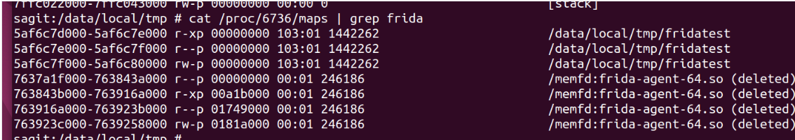


### status和cmdline

那么我们的frida-agent.so在init初始化部分会创建相关线程：

线程是在你的/proc/self/task/线程id/status下可以看到状态和线程名字，也可以看它的cmdline都可以看到线程名称和线程具体数据，这里也是一个检测的地方。

gmain -> 目测是主要运行程序的位置，杀死它之后整个程序就退出了

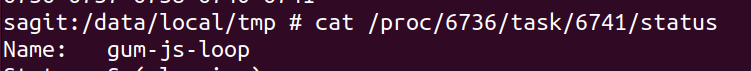

gdbus -> 通讯用的，杀死目测不会影响程序退出，只是程序没有反应了

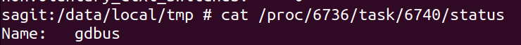

gum-js-loop -> 执行你的js代码用的

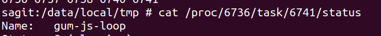

我们解决这里的检测手段就是使用replace替换掉全部frida-server的相关字符串，因为frida-server内部已经有了frida-agent.so来着，具体需要使用到anti-frida.py来实现，使用anti-frida替换相关内容。

其他的具体检测可以通过anti-frida.js来解决了

对于so的hook，最好直接执行，而不是在Java.perform里面执行


### spawn和attach

spawn是整个进程一启动马上调用 `ptrace` 这个函数注入`frida-agent`进去，非常的快速。

attach不是这样的，是附加当前已有进程；


### hook核心

#### so层 inline hook

对于so层的函数，修改函数的入口部分，修改为一个jmp跳转，然后跳转到自己frida-agent里面的函数，然后再跳转回去原本的函数位置去，这个部分也叫做inline hook。

具体的汇编对比如下：

- hook前

  ```bash
  (remote) gef➤  x/20i 0x599b346000+0x854
     0x599b346854 <_Z9quickSortPiii>:	stp	x29, x30, [sp, #-48]!
     0x599b346858 <_Z9quickSortPiii+4>:	stp	x22, x21, [sp, #16]
     0x599b34685c <_Z9quickSortPiii+8>:	mov	x29, sp
     0x599b346860 <_Z9quickSortPiii+12>:	stp	x20, x19, [sp, #32]
     0x599b346864 <_Z9quickSortPiii+16>:	cmp	w1, w2
     0x599b346868 <_Z9quickSortPiii+20>:	b.ge	0x599b34692c <_Z9quickSortPiii+216>  // b.tcont
     0x599b34686c <_Z9quickSortPiii+24>:	mov	w20, w2
     0x599b346870 <_Z9quickSortPiii+28>:	mov	w21, w1
     0x599b346874 <_Z9quickSortPiii+32>:	mov	x19, x0
     0x599b346878 <_Z9quickSortPiii+36>:	b	0x599b346898 <_Z9quickSortPiii+68>
     0x599b34687c <_Z9quickSortPiii+40>:	add	w1, w22, #0x2
     0x599b346880 <_Z9quickSortPiii+44>:	mov	x0, x19
     0x599b346884 <_Z9quickSortPiii+48>:	mov	w2, w20
     0x599b346888 <_Z9quickSortPiii+52>:	bl	0x599b346854 <_Z9quickSortPiii>
     0x599b34688c <_Z9quickSortPiii+56>:	mov	w20, w22
     0x599b346890 <_Z9quickSortPiii+60>:	cmp	w21, w20
     0x599b346894 <_Z9quickSortPiii+64>:	b.ge	0x599b34692c <_Z9quickSortPiii+216>  // b.tcont
     0x599b346898 <_Z9quickSortPiii+68>:	ldr	w9, [x19, w20, sxtw #2]
     0x599b34689c <_Z9quickSortPiii+72>:	sxtw	x8, w20
     0x599b3468a0 <_Z9quickSortPiii+76>:	sub	w22, w21, #0x1
  ```

- hook后

  ```js
  (remote) gef➤  x/20i 0x55da45b000+0x854
     0x55da45b854 <_Z9quickSortPiii>:	ldr	x16, 0x55da45b85c <_Z9quickSortPiii+8>
     0x55da45b858 <_Z9quickSortPiii+4>:	br	x16
     0x55da45b85c <_Z9quickSortPiii+8>:	.inst	0xdeb6c400 ; undefined
     0x55da45b860 <_Z9quickSortPiii+12>:	udf	#113
     0x55da45b864 <_Z9quickSortPiii+16>:	cmp	w1, w2
     0x55da45b868 <_Z9quickSortPiii+20>:	b.ge	0x55da45b92c <_Z9quickSortPiii+216>  // b.tcont
     0x55da45b86c <_Z9quickSortPiii+24>:	mov	w20, w2
     0x55da45b870 <_Z9quickSortPiii+28>:	mov	w21, w1
     0x55da45b874 <_Z9quickSortPiii+32>:	mov	x19, x0
     0x55da45b878 <_Z9quickSortPiii+36>:	b	0x55da45b898 <_Z9quickSortPiii+68>
     0x55da45b87c <_Z9quickSortPiii+40>:	add	w1, w22, #0x2
     0x55da45b880 <_Z9quickSortPiii+44>:	mov	x0, x19
     0x55da45b884 <_Z9quickSortPiii+48>:	mov	w2, w20
     0x55da45b888 <_Z9quickSortPiii+52>:	bl	0x55da45b854 <_Z9quickSortPiii>
     0x55da45b88c <_Z9quickSortPiii+56>:	mov	w20, w22
     0x55da45b890 <_Z9quickSortPiii+60>:	cmp	w21, w20
     0x55da45b894 <_Z9quickSortPiii+64>:	b.ge	0x55da45b92c <_Z9quickSortPiii+216>  // b.tcont
     0x55da45b898 <_Z9quickSortPiii+68>:	ldr	w9, [x19, w20, sxtw #2]
     0x55da45b89c <_Z9quickSortPiii+72>:	sxtw	x8, w20
     0x55da45b8a0 <_Z9quickSortPiii+76>:	sub	w22, w21, #0x1
  ```


调用的函数memcp，对比函数指令是否相同，来判断是否被hook了。

maps status cmdline fd -> open fopen syscall


#### java层 hook

对于java层的函数，会首先注册为一个native函数，然后再进行hook这个native函数，然后原本的函数会被通过JNI获取一个methodId，后面调用这个会通过这个methodId来调用原本的函数，具体如下：

```js
jclass targetClass = (*env)->FindClass(env, "com/example/MyClass");
jmethodID originalMethodID = (*env)->GetMethodID(env, targetClass, "myMethod", "()V");
```

调用原始 Java 方法

在 Frida 的 Hook 逻辑中，虽然 `myMethod` 方法已经被替换为 Native 函数，但 Frida 可以通过之前保存的 `MethodID` 来调用原始的 Java 方法。也就是说我们正常使用this就行，不会出现递归（如果两个脚本hook了同一地方可能会）；

这是通过 JNI 的 `CallMethod` 系列函数实现的，例如 `CallVoidMethod`：

```js
(*env)->CallVoidMethod(env, thisObject, originalMethodID);
```

只要执行了 java层的hook，就一定会修改 `libart.so` 下面的 `PrettyMethod` 方法，具体使用如下：

```js
JNIEnv* env
jclass cls = env->GetObjectClass(obj); // obj 是 Java 对象
jmethodID mid = env->GetMethodID(cls, "methodName", "(signature)"); // signature 是方法签名
ArtMethod* art_method = art::jni::GetMethodID<ArtMethod>(env, cls, mid);
std::string method_description = art_method->PrettyMethod();
```

所以一般java层的api使用了就退出是因为检测了 `prettymethod`


#### 检测 inline hook

获取原始函数基本地址

```cpp
#define SIZE_ORIG_BYTES 16;  // 保存的原始指令字节数，一般frida只修改4条指令，只需要16个字节就可以
unsigned char orig_bytes[SIZE_ORIG_BYTES];
memcpy(orig_bytes, (void *)函数地址, 16);
// 打印出来orig_bytes
```

对比代码

```cpp
#define SIZE_ORIG_BYTES 16  // 保存的原始指令字节数，一般frida只修改4条指令，只需要16个字节就可以
unsigned char orig_bytes[SIZE_ORIG_BYTES] = {
    0x2d,0xe9,0xf0,0x4f,0x8d,0xb0,0xdf,0xf8,0x58,0x93,0x80,0x46,0x1e,0x46,0x92,0x46
};  // 用于保存原始的函数指令
if(memcmp(orig_bytes, (void *)函数地址, 16)!=0){
    printf("被inline hook了");
}
```


#### zygote检测

```cpp
如果frida-server和这个app不能共存，就是zygote检测，因为frida会去hook这个zygote检测，具体代码如下：
#if ANDROID
    if (get_executable_path ().has_prefix ("/system/bin/app_process")) {
        try {
            string cmdline;
            FileUtils.get_contents ("/proc/self/cmdline", out cmdline);
            if (cmdline == "zygote" || cmdline == "zygote64" || cmdline == "usap32" || cmdline == "usap64") {
                var set_argv0 = (void *) Gum.Module.find_export_by_name ("libandroid_runtime.so", "_Z27android_os_Process_setArgV0P7_JNIEnvP8_jobjectP8_jstring");
                if (set_argv0 != null) {
                    interceptor.attach (set_argv0, listener, (void *) HookId.SET_ARGV0);
                    child_recovery_behavior = DEFERRED_UNTIL_SET_ARGV0;
                }

                var setcontext = (void *) Gum.Module.find_export_by_name ("libselinux.so", "selinux_android_setcontext");
                if (setcontext != null)
                    interceptor.attach (setcontext, listener, (void *) HookId.SET_CTX);
            }
        } catch (FileError e) {
        }
    }
#endif
```

一启动就会去hook的相关函数，具体看maps下面


### frida-gadget

#### 原理

本身具备和`frida-agent`相同的功能，看代码都是引入了`frida-base`这个部分，目测修改掉这个so文件，然后重新编译apk就可以把这个引入进去，这个是用来做frida持久化操作的一个东西，是一个so文件，`frida-gadget.so`在编译好frida之后可以看得到，也需要执行之前的anti-frida.py这个文件，这样子把它很多的字符串替换掉就可以。

具体使用教程：

关键的就是使得app在启动的时候，去加载这个frida-gadget.so，可以写入java代码里面，也可以使用lief去链接到so里面去。

frida-gadget.so注入之后需要有一个和它重名的文件，比如魔改的libfridagadget.so叫做libhhh.so，那么它的配置文件就为libhhh.config.so，这个libhhh.config.so是文本文件，配置如果希望和frida-serer一样远程调试的，需要这样子配置：

关于小佳的gadget小工具如何使用

libhhh.config.so

```js
{
  "interaction": {
    "type": "listen",
    "address": "0.0.0.0",
    "port": 27042,
    "on_port_conflict": "fail",
    "on_load": "wait"
  }
}
```

然后我们这里连接就是，这样子就可以正常的连接进去了

```bash
frida -H 192.168.0.100:14725 -F
```

这样子可以解决zygote被检测的问题，因为frida-server会去hook这个zygote

也可以这样子，写入js文件也可以

```js
{
  "interaction": {
    "type": "script",
    "path": "/data/local/tmp/code.js"
  }
}
```

测试代码

```js
'use strict';

console.log("Waiting for Java..");

Java.perform(function () {
  var Log = Java.use("android.util.Log");
  Log.v("frida-lief", "Have fun!");
});
```


# jdax使用

## 安装

可以看我的b站视频

jadx是一款流行的开源Java反编译工具，主要用于Android应用程序（APK文件）的反编译和分析。

它能够将Dalvik字节码（DEX文件）或Java字节码（JAR文件）转换成易于阅读的Java源代码，同时支持图形界面（GUI）和命令行操作。

jadx是开源的 [源码地址](https://github.com/skylot/jadx)；

如何下载：直接下载 `https://github.com/skylot/jadx/releases/download/v{最新版本}/jadx-{最新版本}.zip`

然后解压这个，启动 `jadx-gui.bat` 就能使用了。


## mcp


# jeb使用

这里使用的是jeb pro破解版，下载地址：`https://pixeldrain.com/u/iPz6HCP2`；[下载讲解](https://book.crifan.org/books/android_re_tool_jeb/website/download_run/)

jeb如何使用？

参考博客：

- https://book.crifan.org/books/android_re_tool_jeb/website/download_run/


# ida使用

## mcp


# trace技术

| 工具名            | 介绍                                                         | 地址                                                         |
| ----------------- | ------------------------------------------------------------ | ------------------------------------------------------------ |
| frida-trace       | frida官方，用树状图显示调用流程，非常清晰                    | [frida-trace](https://github.com/frida/frida-tools/blob/main/frida_tools/tracer.py) |
| jnitrace          | 老牌，经典，信息全，携带方便                                 | [jnitrace](https://github.com/chame1eon/jnitrace)            |
| jnitrace-engine   | 基于jnitrace，可定制化                                       | [jnitrace-engine](https://github.com/chame1eon/jnitrace-engine) |
| jtrace            | 定制方便，信息全面，直接在_agent.js或者_agent_stable.js 里面加自己的逻辑就行 | [jtrace](https://github.com/SeeFlowerX/jtrace)               |
| hook_art.js       | 可提供jni trace，可以灵活的增加你需要hook的函数              | [hook_art.js](https://github.com/lasting-yang/frida_hook_libart) |
| JNI-Frida-Hook    | 函数名已定义，方便定位                                       | [JNI-Frida-Hook](https://github.com/Areizen/JNI-Frida-Hook)  |
| findhash          | ida插件，可用于检测加解密函数，也可作为Native Trace库        | [findhash](https://github.com/Pr0214/findhash)               |
| Stalker           | frida官方提供的代码跟踪引擎<br />可以在Native层方法级别，块级别，指令级别实现代码修改，代码跟踪 | [Stalker](https://frida.re/docs/stalker/)                    |
| sktrace           | 类似 ida 指令 trace 功能                                     | [sktrace](https://github.com/bmax121/sktrace)                |
| frida-qbdi-tracer | 速度比frida stalker快，免补环境                              | [frida-qbdi-tracer](https://github.com/lasting-yang/frida-qbdi-tracer) |


## frida-trace

frida-trace是frida-tools提供的，[代码地址](https://github.com/frida/frida-tools/blob/main/frida_tools/tracer.py)

> 使用前需要安装你frida版本对应版本的frida-tools，如`frida==16.2.1` 对应 `frida-tools==12.0.0`

frida-trace 可以一次性监控一堆函数地址，还能打印出比较漂亮的树状图，不仅可以**显示调用流程，还能显示调用层次**。

并且贴心的把不同线程调用结果用不同的颜色区分开了。

使用文档：

- [官方文档](https://frida.re/docs/frida-trace/)
- [crifan整理的笔记](https://crifan.github.io/reverse_debug_frida/website/use_frida/frida_trace/)
- 


frida-trace命令会在当前目录生成`./__handlers__/`文件夹内生成对应函数的js代码。

如果需要打印入参，返回值。或修改入参，返回值时，可编辑对应的js文件。

> js代码经常显示代码错误，强迫症很难受...


命令格式：`frida-trace [options] target`

常用命令：

- `-i` / `-a`: 跟踪 C 函数或 so 库中的函数。
  PS:-a 包含模块+偏移跟踪，一般用于追踪未导出函数，例子：-a "lib52pojie.so!0x4793c"

包含/排除模块或函数：

- `-I` : 包含指定模块。
- `-X` : 排除指定模块。

Java 方法跟踪：

- `-j JAVA_METHOD`: 包含 Java 方法。
- `-J JAVA_METHOD`: 排除 Java 方法。

附加方式:

- `-f`:通过 spwan 方式启动
- `-F`:通过 attach 方式附加当前进程

日志输出:
`-o`:日志输出到文件


基于 `frida-trace` 的优秀工具有：

- ida插件之 `traceNative` [原始项目地址](https://github.com/Pr0214/trace_natives) [fork项目地址](https://github.com/LunFengChen/traceNative)
- 


## stalker

Stalker 是 Frida 的代码跟踪引擎。它允许跟踪线程，捕获每个函数、每个块，甚至执行的每一条指令。

Stalker 目前支持运行 Android 或 iOS 的手机和平板电脑上常见的 AArch64 架构，以及台式机和笔记本电脑上常见的 Intel 64 和 IA-32 架构。

官网文档：https://frida.re/docs/stalker/


## unidbg的trace


## jnitrace

jnitrace 可以动态跟踪 Java 层通过 JNI 接口调用 native 层（C/C++）代码的过程。

它会记录并显示每一个 JNI 函数的调用，包括方法签名、参数、返回值等详细信息。	

[源码地址](https://github.com/chame1eon/jnitrace)

使用教程：

- [jnitrace使用教程](https://juejin.cn/post/7430494800236888099)


jnitrace 的使用依赖于 Frida。在使用 jnitrace 之前，需要确保 Frida 和 Python 环境已安装。

```bash
pip install jnitrace
```


使用教程：

1. 跟踪所有jni函数的调用

   ```bash
   jnitrace -R 127.0.0.1:1234 -l libnative-lib.so com.cyrus.example
   ```

2. 自定义跟踪特定的 JNI 函数

   - 跟踪动态注册：`RegisterNatives`

     ```bash
     jnitrace -R 127.0.0.1:1234 -l libGameVMP.so -i RegisterNatives com.shizhuang.duapp
     ```

   - 跟踪utf8：`NewStringUTF `

     ```bash
     jnitrace -R 127.0.0.1:1234 -l libGameVMP.so -i NewStringUTF com.shizhuang.duapp
     ```

3. 参数详细说明

   用法：`usage: jnitrace [options] -l libname target`

   - 常用

     - `-l`：指定要追踪的库；可以追踪多个库；-l * 追踪所有库；

     - `target`：目标应用的包名

     - `-p`： 加载自定义 Frida 脚本，jnitrace **加载前**执行，用于绕过反调试，后面跟js脚本路径

     - `-a`： 加载自定义 Frida 脚本，jnitrace **加载后**执行（不过这种用的少，为何不用正常attach呢）

     - `-o` ：记录日志，指定追踪数据保存路径，以 JSON 格式存储。
     - `-m`： `<spawn|attach>`，指定 Frida 注入方式，默认为 spawn，推荐使用
     - `-i`：include，用于指定应跟踪的方法名称；`-i Get` 跟踪方法名包含`Get`的方法
     - `-e`：exclude，用于指定跟踪中应忽略的方法名称
     - `-I`：用于指定应跟踪的库的导出
     - `-E`：用于指定不应跟踪的库的导出

   - 其他

     - `-R`：` <host>:<port>`，指定远程 Frida server 的位置（默认是 localhost:27042）

     - `-b`： `<fuzzy|accurate|none>`，控制追踪输出的堆栈信息，默认 accurate，可以选择 fuzzy 或 none 禁用

     - `--hide-data`：减少输出，隐藏 hexdump 和字符串引用。

     - `--ignore-env`：隐藏通过 JNIEnv 的调用。

     - `--ignore-vm`：隐藏通过 JavaVM 的调用。

       

   


## sktrace

```bash
python sktrace.py -m attach -l lib52pojie.so -i 0x103B4 com.zj.wuaipojie
```


# 底层hook技术与源码分析

## dlopen

```js
var android_dlopen_ext = Module.findExportByName(null, "android_dlopen_ext");
Interceptor.attach(android_dlopen_ext, {
    onEnter: function (args) {
        var so_path = args[0].readCString();
        if (so_path.indexOf("lib52pojie.so") >= 0) {
            console.log("loading: ", so_path)
            this.call_hook = true;
        }
    }, onLeave: function (retval) {
        if (this.call_hook) {
            // 退出的时候才加载完
            hookTest2();
   		}
    }
});
```


## libart

`libart.so`: 在 Android 5.0（Lollipop）及更高版本中，`libart.so` 是 Android 运行时（ART，Android Runtime）的核心组件，它取代了之前的 Dalvik 虚拟机。可以在 `libart.so` 里找到 JNI 相关的实现。
PS:在**高于安卓10**的系统里，so的路径是/apex/com.android.runtime/lib64/libart.so，低于10的则在system/lib64/libart.so

[yang神的libart-hook三件套](https://github.com/lasting-yang/frida_hook_libart)


### 常见jni函数

| 函数名称                                                     | 参数                                                         | 描述                                                         | 返回值                                   |
| :----------------------------------------------------------- | :----------------------------------------------------------- | :----------------------------------------------------------- | :--------------------------------------- |
| `RegisterNatives`                                            | `JNIEnv *env, jclass clazz, const JNINativeMethod *methods, jint nMethods` | 反注册类的本地方法。类将返回到链接或注册了本地方法函数前的状态。该函数不应在本地代码中使用。相反，它可以为某些程序提供一种重新加载和重新链接本地库的途径。 | 成功时返回0；失败时返回负数              |
| `GetStringUTFChars`                                          | `JNIEnv*env, jstring string, jboolean *isCopy`               | 通过JNIEnv接口指针调用，它将一个代表着Java虚拟机中的字符串jstring引用，转换成为一个UTF-8形式的C字符串 | -                                        |
| `NewStringUTF`                                               | `JNIEnv *env, const char *bytes`                             | 以字节为单位返回字符串的 UTF-8 长度                          | 返回字符串的长度                         |
| `FindClass`                                                  | `JNIEnv *env, const char *name`                              | 通过对象获取这个类。该函数比较简单，唯一注意的是对象不能为NULL，否则获取的class肯定返回也为NULL。 | -                                        |
| `GetMethodID`                                                | `JNIEnv *env, jclass clazz, const char *name, const char *sig` | 返回类或接口实例（非静态）方法的方法 ID。方法可在某个 clazz 的超类中定义，也可从 clazz 继承。GetMethodID() 可使未初始化的类初始化。 | 方法ID，如果找不到指定的方法，则为NULL   |
| `GetStaticMethodID`                                          | `JNIEnv *env, jclass clazz, const char *name, const char *sig` | 获取类对象的静态方法ID                                       | 属性ID对象。如果操作失败，则返回NULL     |
| `GetFieldID`                                                 | `JNIEnv *env, jclass clazz, const char *name, const char *sig` | 回Java类（非静态）域的属性ID。该域由其名称及签名指定。访问器函数的Get<type>Field 及 Set<type>Field系列使用域 ID 检索对象域。GetFieldID() 不能用于获取数组的长度域。应使用GetArrayLength()。 | -                                        |
| `GetStaticFieldID`                                           | `JNIEnv *env,jclass clazz, const char *name, const char *sig` | 获取类的静态域ID方法                                         | -                                        |
| `Call<type>Method`, `Call<type>MethodA`, `Call<type>MethodV` | `JNIEnv *env, jobject obj, jmethodID methodID, .../jvalue *args/va_list args` | 这三个操作的方法用于从本地方法调用Java 实例方法。它们的差别仅在于向其所调用的方法传递参数时所用的机制。 | NativeType，具体的返回值取决于调用的类型 |


### JNI_OnLoad动态注册流程

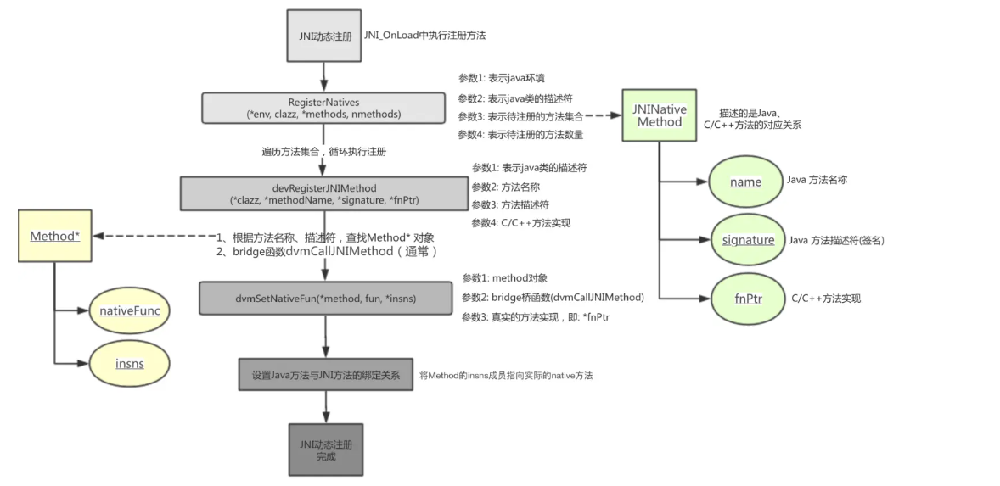


### jni函数hook

[hook_art.js](https://github.com/lasting-yang/frida_hook_libart/blob/master/hook_art.js)

hook art中的jni函数并且有打印参数和返回值

> 使用之前记得先加上过滤的so名称，另外高版本的系统也需要在脚本68行的过滤修改成`_ZN3art3JNI`(最好是加载libart.so查看一下)，这个脚本包含了hook_RegisterNatives.js的内容(但不太稳定，做个了解即可)

```bash
frida -U --no-pause -f package_name -l hook_art.js
```

```js
const STD_STRING_SIZE = 3 * Process.pointerSize;
class StdString {
    constructor() {
        this.handle = Memory.alloc(STD_STRING_SIZE);
    }

    dispose() {
        const [data, isTiny] = this._getData();
        if (!isTiny) {
            Java.api.$delete(data);
        }
    }

    disposeToString() {
        const result = this.toString();
        this.dispose();
        return result;
    }

    toString() {
        const [data] = this._getData();
        return data.readUtf8String();
    }

    _getData() {
        const str = this.handle;
        const isTiny = (str.readU8() & 1) === 0;
        const data = isTiny ? str.add(1) : str.add(2 * Process.pointerSize).readPointer();
        return [data, isTiny];
    }
}

function prettyMethod(method_id, withSignature) {
    const result = new StdString();
    Java.api['art::ArtMethod::PrettyMethod'](result, method_id, withSignature ? 1 : 0);
    return result.disposeToString();
}

/*
GetFieldID is at  0xe39b87c5 _ZN3art3JNI10GetFieldIDEP7_JNIEnvP7_jclassPKcS6_
GetMethodID is at  0xe39a1a19 _ZN3art3JNI11GetMethodIDEP7_JNIEnvP7_jclassPKcS6_
NewStringUTF is at  0xe39cff25 _ZN3art3JNI12NewStringUTFEP7_JNIEnvPKc
RegisterNatives is at  0xe39e08fd _ZN3art3JNI15RegisterNativesEP7_JNIEnvP7_jclassPK15JNINativeMethodi
GetStaticFieldID is at  0xe39c9635 _ZN3art3JNI16GetStaticFieldIDEP7_JNIEnvP7_jclassPKcS6_
GetStaticMethodID is at  0xe39be0ed _ZN3art3JNI17GetStaticMethodIDEP7_JNIEnvP7_jclassPKcS6_
GetStringUTFChars is at  0xe39d06e5 _ZN3art3JNI17GetStringUTFCharsEP7_JNIEnvP8_jstringPh
FindClass is at  0xe399ae5d _ZN3art3JNI9FindClassEP7_JNIEnvPKc
*/

function hook_libart() {
    var symbols = Module.enumerateSymbolsSync("libart.so");
    var addrGetStringUTFChars = null;
    var addrNewStringUTF = null;
    var addrFindClass = null;
    var addrGetMethodID = null;
    var addrGetStaticMethodID = null;
    var addrGetFieldID = null;
    var addrGetStaticFieldID = null;
    var addrRegisterNatives = null;
    var so_name = "lib";      //TODO 这里写需要过滤的so

    for (var i = 0; i < symbols.length; i++) {
        var symbol = symbols[i];
        if (symbol.name.indexOf("art") >= 0 &&
            symbol.name.indexOf("JNI") >= 0 &&
            symbol.name.indexOf("CheckJNI") < 0 &&
            symbol.name.indexOf("_ZN3art3JNIILb0") >= 0
        ) {
            if (symbol.name.indexOf("GetStringUTFChars") >= 0) {
                addrGetStringUTFChars = symbol.address;
                console.log("GetStringUTFChars is at ", symbol.address, symbol.name);
            } else if (symbol.name.indexOf("NewStringUTF") >= 0) {
                addrNewStringUTF = symbol.address;
                console.log("NewStringUTF is at ", symbol.address, symbol.name);
            } else if (symbol.name.indexOf("FindClass") >= 0) {
                addrFindClass = symbol.address;
                console.log("FindClass is at ", symbol.address, symbol.name);
            } else if (symbol.name.indexOf("GetMethodID") >= 0) {
                addrGetMethodID = symbol.address;
                console.log("GetMethodID is at ", symbol.address, symbol.name);
            } else if (symbol.name.indexOf("GetStaticMethodID") >= 0) {
                addrGetStaticMethodID = symbol.address;
                console.log("GetStaticMethodID is at ", symbol.address, symbol.name);
            } else if (symbol.name.indexOf("GetFieldID") >= 0) {
                addrGetFieldID = symbol.address;
                console.log("GetFieldID is at ", symbol.address, symbol.name);
            } else if (symbol.name.indexOf("GetStaticFieldID") >= 0) {
                addrGetStaticFieldID = symbol.address;
                console.log("GetStaticFieldID is at ", symbol.address, symbol.name);
            } else if (symbol.name.indexOf("RegisterNatives") >= 0) {
                addrRegisterNatives = symbol.address;
                console.log("RegisterNatives is at ", symbol.address, symbol.name);
            } else if (symbol.name.indexOf("CallStatic") >= 0) {
                console.log("CallStatic is at ", symbol.address, symbol.name);
                Interceptor.attach(symbol.address, {
                    onEnter: function (args) {
                        var module = Process.findModuleByAddress(this.returnAddress);
                        if (module != null && module.name.indexOf(so_name) == 0) {
                            var java_class = args[1];
                            var mid = args[2];
                            var class_name = Java.vm.tryGetEnv().getClassName(java_class);
                            if (class_name.indexOf("java.") == -1 && class_name.indexOf("android.") == -1) {
                                var method_name = prettyMethod(mid, 1);
                                console.log("<>CallStatic:", DebugSymbol.fromAddress(this.returnAddress), class_name, method_name);
                            }
                        }
                    },
                    onLeave: function (retval) { }
                });
            } else if (symbol.name.indexOf("CallNonvirtual") >= 0) {
                console.log("CallNonvirtual is at ", symbol.address, symbol.name);
                Interceptor.attach(symbol.address, {
                    onEnter: function (args) {
                        var module = Process.findModuleByAddress(this.returnAddress);
                        if (module != null && module.name.indexOf(so_name) == 0) {
                            var jobject = args[1];
                            var jclass = args[2];
                            var jmethodID = args[3];
                            var obj_class_name = Java.vm.tryGetEnv().getObjectClassName(jobject);
                            var class_name = Java.vm.tryGetEnv().getClassName(jclass);
                            if (class_name.indexOf("java.") == -1 && class_name.indexOf("android.") == -1) {
                                var method_name = prettyMethod(jmethodID, 1);
                                console.log("<>CallNonvirtual:", DebugSymbol.fromAddress(this.returnAddress), class_name, obj_class_name, method_name);
                            }
                        }
                    },
                    onLeave: function (retval) { }
                });
            } else if (symbol.name.indexOf("Call") >= 0 && symbol.name.indexOf("Method") >= 0) {
                console.log("Call<>Method is at ", symbol.address, symbol.name);
                Interceptor.attach(symbol.address, {
                    onEnter: function (args) {
                        var module = Process.findModuleByAddress(this.returnAddress);
                        if (module != null && module.name.indexOf(so_name) == 0) {
                            var java_class = args[1];
                            var mid = args[2];
                            var class_name = Java.vm.tryGetEnv().getObjectClassName(java_class);
                            if (class_name.indexOf("java.") == -1 && class_name.indexOf("android.") == -1) {
                                var method_name = prettyMethod(mid, 1);
                                console.log("<>Call<>Method:", DebugSymbol.fromAddress(this.returnAddress), class_name, method_name);
                            }
                        }
                    },
                    onLeave: function (retval) { }
                });
            }
        }
    }

    if (addrGetStringUTFChars != null) {
        Interceptor.attach(addrGetStringUTFChars, {
            onEnter: function (args) {
            },
            onLeave: function (retval) {
                if (retval != null) {
                    var module = Process.findModuleByAddress(this.returnAddress);
                    if (module != null && module.name.indexOf(so_name) == 0) {
                        var bytes = Memory.readCString(retval);
                        console.log("[GetStringUTFChars] result:" + bytes, DebugSymbol.fromAddress(this.returnAddress));
                    }
                }
            }
        });
    }
    if (addrNewStringUTF != null) {
        Interceptor.attach(addrNewStringUTF, {
            onEnter: function (args) {
                if (args[1] != null) {
                    var module = Process.findModuleByAddress(this.returnAddress);
                    if (module != null && module.name.indexOf(so_name) == 0) {
                        var string = Memory.readCString(args[1]);
                        console.log("[NewStringUTF] bytes:" + string, DebugSymbol.fromAddress(this.returnAddress));
                    }

                }
            },
            onLeave: function (retval) { }
        });
    }

    if (addrFindClass != null) {
        Interceptor.attach(addrFindClass, {
            onEnter: function (args) {
                if (args[1] != null) {
                    var module = Process.findModuleByAddress(this.returnAddress);
                    if (module != null && module.name.indexOf(so_name) == 0) {
                        var name = Memory.readCString(args[1]);
                        console.log("[FindClass] name:" + name, DebugSymbol.fromAddress(this.returnAddress));
                    }
                }
            },
            onLeave: function (retval) { }
        });
    }
    if (addrGetMethodID != null) {
        Interceptor.attach(addrGetMethodID, {
            onEnter: function (args) {
                if (args[2] != null) {
                    var clazz = args[1];
                    var class_name = Java.vm.tryGetEnv().getClassName(clazz);
                    var module = Process.findModuleByAddress(this.returnAddress);
                    if (module != null && module.name.indexOf(so_name) == 0) {
                        var name = Memory.readCString(args[2]);
                        if (args[3] != null) {
                            var sig = Memory.readCString(args[3]);
                            console.log("[GetMethodID] class_name:" + class_name + " name:" + name + ", sig:" + sig, DebugSymbol.fromAddress(this.returnAddress));
                        } else {
                            console.log("[GetMethodID] class_name:" + class_name + " name:" + name, DebugSymbol.fromAddress(this.returnAddress));
                        }
                    }
                }
            },
            onLeave: function (retval) { }
        });
    }
    if (addrGetStaticMethodID != null) {
        Interceptor.attach(addrGetStaticMethodID, {
            onEnter: function (args) {
                if (args[2] != null) {
                    var clazz = args[1];
                    var class_name = Java.vm.tryGetEnv().getClassName(clazz);
                    var module = Process.findModuleByAddress(this.returnAddress);
                    if (module != null && module.name.indexOf(so_name) == 0) {
                        var name = Memory.readCString(args[2]);
                        if (args[3] != null) {
                            var sig = Memory.readCString(args[3]);
                            console.log("[GetStaticMethodID] class_name:" + class_name + " name:" + name + ", sig:" + sig, DebugSymbol.fromAddress(this.returnAddress));
                        } else {
                            console.log("[GetStaticMethodID] class_name:" + class_name + " name:" + name, DebugSymbol.fromAddress(this.returnAddress));
                        }
                    }
                }
            },
            onLeave: function (retval) { }
        });
    }
    if (addrGetFieldID != null) {
        Interceptor.attach(addrGetFieldID, {
            onEnter: function (args) {
                if (args[2] != null) {
                    var module = Process.findModuleByAddress(this.returnAddress);
                    if (module != null && module.name.indexOf(so_name) == 0) {
                        var name = Memory.readCString(args[2]);
                        if (args[3] != null) {
                            var sig = Memory.readCString(args[3]);
                            console.log("[GetFieldID] name:" + name + ", sig:" + sig, DebugSymbol.fromAddress(this.returnAddress));
                        } else {
                            console.log("[GetFieldID] name:" + name, DebugSymbol.fromAddress(this.returnAddress));
                        }
                    }
                }
            },
            onLeave: function (retval) { }
        });
    }
    if (addrGetStaticFieldID != null) {
        Interceptor.attach(addrGetStaticFieldID, {
            onEnter: function (args) {
                if (args[2] != null) {
                    var module = Process.findModuleByAddress(this.returnAddress);
                    if (module != null && module.name.indexOf(so_name) == 0) {
                        var name = Memory.readCString(args[2]);
                        if (args[3] != null) {
                            var sig = Memory.readCString(args[3]);
                            console.log("[GetStaticFieldID] name:" + name + ", sig:" + sig, DebugSymbol.fromAddress(this.returnAddress));
                        } else {
                            console.log("[GetStaticFieldID] name:" + name, DebugSymbol.fromAddress(this.returnAddress));
                        }
                    }
                }
            },
            onLeave: function (retval) { }
        });
    }

    if (addrRegisterNatives != null) {
        Interceptor.attach(addrRegisterNatives, {
            onEnter: function (args) {
                console.log("[RegisterNatives] method_count:", args[3], DebugSymbol.fromAddress(this.returnAddress));
                var env = args[0];
                var java_class = args[1];
                var class_name = Java.vm.tryGetEnv().getClassName(java_class);

                var methods_ptr = ptr(args[2]);

                var method_count = parseInt(args[3]);
                for (var i = 0; i < method_count; i++) {
                    var name_ptr = Memory.readPointer(methods_ptr.add(i * Process.pointerSize * 3));
                    var sig_ptr = Memory.readPointer(methods_ptr.add(i * Process.pointerSize * 3 + Process.pointerSize));
                    var fnPtr_ptr = Memory.readPointer(methods_ptr.add(i * Process.pointerSize * 3 + Process.pointerSize * 2));

                    var name = Memory.readCString(name_ptr);
                    var sig = Memory.readCString(sig_ptr);
                    var find_module = Process.findModuleByAddress(fnPtr_ptr);
                    console.log("[RegisterNatives] java_class:", class_name, "name:", name, "sig:", sig, "fnPtr:", fnPtr_ptr, "module_name:", find_module.name, "module_base:", find_module.base, "offset:", ptr(fnPtr_ptr).sub(find_module.base));

                }
            },
            onLeave: function (retval) { }
        });
    }
}

setImmediate(hook_libart);

```

脚本分析

1. **`StdString` 辅助类**

- **作用**：安全处理 C++ `std::string` 对象的内存操作。
- **关键方法**：
  - `_getData()`：检测字符串存储模式（小型优化/堆分配），返回数据指针。
  - `toString()`：将 C++ 字符串转为 JavaScript 字符串。
  - `dispose()`：释放非小型字符串的堆内存（避免泄漏）。
  - `disposeToString()`：返回字符串后自动清理内存。

2. **`prettyMethod()` 函数**

- **作用**：解析 Java 方法 ID 的可读名称（含签名）。
- **原理**：调用 ART 内部函数 `art::ArtMethod::PrettyMethod`。


### 动态注册函数

核心都是跟踪  `RegisterNatives`

- jnitrace过滤

- frida脚本过滤

  > hook_RegisterNatives.js：hook打印动态注册的函数，主要是拿对应so的函数偏移
  >
  > [hook_RegisterNatives.js](https://github.com/lasting-yang/frida_hook_libart/blob/master/hook_art.js)


2. 带过滤的hook动态注册

   ```js
   // 获取 RegisterNatives 函数的内存地址，并赋值给addrRegisterNatives。
   var addrRegisterNatives = null;
   
   // 列举 libart.so 中的所有导出函数（成员列表）
   var symbols = Module.enumerateSymbolsSync("libart.so");
   
   
   for (var i = 0; i < symbols.length; i++) {
       var symbol = symbols[i];
   
       // console.log(symbol.name)
       //_ZN3art3JNI15RegisterNativesEP7_JNIEnvP7_jclassPK15JNINativeMethodi
       if (symbol.name.indexOf("art") >= 0 &&
           symbol.name.indexOf("JNI") >= 0 &&
           symbol.name.indexOf("RegisterNatives") >= 0 &&
           symbol.name.indexOf("CheckJNI") < 0) {
   
           addrRegisterNatives = symbol.address;
           console.log("RegisterNatives is at ", symbol.address, symbol.name);
           break
       }
   }
   
   
   if (addrRegisterNatives) {
       // RegisterNatives(env, 类型, Java和C的对应关系,个数)
       Interceptor.attach(addrRegisterNatives, {
           onEnter: function (args) {
               var env = args[0];        // jni对象
               var java_class = args[1]; // 类
               var class_name = Java.vm.tryGetEnv().getClassName(java_class);
               var taget_class = "com.faloo.util.EncryptUtil";
   
               // if (class_name === taget_class) {
               //只找我们自己想要类中的动态注册关系
               console.log("\n[RegisterNatives] method_count:", args[3]);
               var methods_ptr = ptr(args[2]);
               var method_count = parseInt(args[3]);
   
               for (var i = 0; i < method_count; i++) {
                   // Java中函数名字的
                   var name_ptr = Memory.readPointer(methods_ptr.add(i * Process.pointerSize * 3));
                   // 参数和返回值类型
                   var sig_ptr = Memory.readPointer(methods_ptr.add(i * Process.pointerSize * 3 + Process.pointerSize));
                   // C中的函数内存地址
                   var fnPtr_ptr = Memory.readPointer(methods_ptr.add(i * Process.pointerSize * 3 + Process.pointerSize * 2));
   
   
                   var name = Memory.readCString(name_ptr);
                   var sig = Memory.readCString(sig_ptr);
   
                   var find_module = Process.findModuleByAddress(fnPtr_ptr);
                   // 地址、偏移量、基地址
                   var offset = ptr(fnPtr_ptr).sub(find_module.base);
   
                   console.log("name:", name, "name:", sig, "module_name:", find_module.name, "offset:", offset, "class: ", class_name);
                   // console.log("name:", name, "name:", sig, "offset:", offset);
   
                   // }
   
               }
           }
       });
   }
   // frida -U -f tv.danmaku.bili -l 3.动态注册hook_so.js
   
   ```

   


### 打印java函数调用so函数，调用栈


[hook_artmethod.js]([hook_art.js](https://github.com/lasting-yang/frida_hook_libart/blob/master/hook_artmethod.js))


## libc

`libc.so`: 这是一个标准的 C 语言库，用于提供基本的系统调用和功能，如文件操作、字符串处理、内存分配等。在Android系统中，`libc` 是最基础的库之一。


> 过frida检测：strstr，strcmp等等
>
> 寻找签名校验&ssl证书：fopen检测加载的文件
>
> 过frida检测线程：pthread_create
>
> 抓包：sockect，recv

| 类别             | 函数名称                | 参数                                                         | 描述                                        |
| :--------------- | :---------------------- | :----------------------------------------------------------- | :------------------------------------------ |
| 字符串类操作     | strcpy                  | `char *dest, const char *src`                                | 将字符串 src 复制到 dest                    |
|                  | strcat                  | `char *dest, const char *src`                                | 将字符串 src 连接到 dest 的末尾             |
|                  | strlen                  | `const char *str`                                            | 返回 str 的长度                             |
|                  | strcmp                  | `const char *str1, const char *str2`                         | 比较两个字符串                              |
| 文件类操作       | fopen                   | `const char *filename, const char *mode`                     | 打开文件                                    |
|                  | fread                   | `void *ptr, size_t size, size_t count, FILE *stream`         | 从文件读取数据                              |
|                  | fwrite                  | `const void *ptr, size_t size, size_t count, FILE *stream`   | 写入数据到文件                              |
|                  | fclose                  | `FILE *stream`                                               | 关闭文件                                    |
| 网络IO类操作     | socket                  | `int domain, int type, int protocol`                         | 创建网络套接字                              |
|                  | connect                 | `int sockfd, const struct sockaddr *addr, socklen_t addrlen` | 连接套接字                                  |
|                  | recv                    | `int sockfd, void *buf, size_t len, int flags`               | 从套接字接收数据                            |
|                  | send                    | `int sockfd, const void *buf, size_t len, int flags`         | 通过套接字发送数据                          |
| 线程类操作       | pthread_create          | `pthread_t *thread, const pthread_attr_t *attr, void *(*start_routine)(void *), void *arg` | 创建线程                                    |
| 进程控制操作     | kill                    | `pid_t pid, int sig`                                         | 向指定进程发送信号                          |
| 系统属性查询操作 | `__system_property_get` | `const char *name, char *value`                              | 从Android系统属性服务中读取指定属性的值     |
|                  | uname                   | `struct utsname *buf`                                        | 获取当前系统的名称、版本和其他相关信息      |
|                  | sysconf                 | `int name`                                                   | 获取运行时系统的配置信息，如CPU数量、页大小 |


### 定位谁杀死的进程

```js
function replaceKILL() {
    // 查找libc.so库中kill函数的地址
    var kill_addr = Module.findExportByName("libc.so", "kill");
    // 使用Interceptor.replace来替换kill函数
    Interceptor.replace(kill_addr, new NativeCallback(function (arg0, arg1) {
        // 当kill函数被调用时，打印第一个参数（通常是进程ID）
        console.log("arg0=> ", arg0);
        // 打印第二个参数（通常是发送的信号）
        console.log("arg1=> ", arg1);
        // 打印调用kill函数的堆栈跟踪信息
        console.log('libc.so!kill called from:\n' +
            Thread.backtrace(this.context, Backtracer.ACCURATE)
            .map(DebugSymbol.fromAddress).join('\n') + '\n');
    }, "int", ["int", "int"]))
}

```


### 定位线程创建

```js
function hook_pthread_create(){
    //hook反调试
    var pthread_create_addr = Module.findExportByName("libc.so", "pthread_create");
    console.log("pthread_create_addr: ", pthread_create_addr);
    Interceptor.attach(pthread_create_addr,{
        onEnter:function(args){
            console.log(args[0], args[1], args[2], args[4]);
        },onLeave:function(retval){
            console.log("retval is =>",retval)
        }
    })
}
```


### 寻找检测点：strstr、strcmp

```js
function hook_strcmp() {
    var pt_strcmp = Module.findExportByName("libc.so", 'strcmp');
    Interceptor.attach(pt_strcmp, {
        onEnter: function (args) {
            var str1 = args[0].readCString();
            var str2 = args[1].readCString();
            if (str2.indexOf("hh") !== -1) {
                console.log("strcmp-->", str1, str2);
                this.printStack = true;
            }
        }, onLeave: function (retval) {
            if (this.printStack) { 
                var stack = Thread.backtrace(this.context, Backtracer.ACCURATE)
                    .map(DebugSymbol.fromAddress).join("\n");
                console.log("Stack trace:\n" + stack);
            }
        }
    })
}

```


### 监测写文件

```js
//Hook libc 写文件
function hookTest13() {

    var addr_fopen = Module.findExportByName("libc.so", "fopen");
    var addr_fputs = Module.findExportByName("libc.so", "fputs");
    var addr_fclose = Module.findExportByName("libc.so", "fclose");

    console.log("addr_fopen:", addr_fopen, "addr_fputs:", addr_fputs, "addr_fclose:", addr_fclose);
    var fopen = new NativeFunction(addr_fopen, "pointer", ["pointer", "pointer"]);
    var fputs = new NativeFunction(addr_fputs, "int", ["pointer", "pointer"]);
    var fclose = new NativeFunction(addr_fclose, "int", ["pointer"]);

    var filename = Memory.allocUtf8String("/sdcard/xiaojianbang.txt");
    var open_mode = Memory.allocUtf8String("w");
    var file = fopen(filename, open_mode);
    console.log("fopen:", file);

    var buffer = Memory.allocUtf8String("bbs.125.la\n");
    var retval = fputs(buffer, file);
    console.log("fputs:", retval);

    fclose(file);

}
```


## libdl

`libdl.so`是一个处理动态链接和加载的标准库，它提供了`dlopen`、`dlclose`、`dlsym`等函数，用于在运行时动态地加载和使用共享库

| 类别           | 函数名称 | 参数                               | 描述                       |
| :------------- | :------- | :--------------------------------- | :------------------------- |
| 动态链接库操作 | dlopen   | `const char *filename, int flag`   | 打开动态链接库文件         |
|                | dlsym    | `void *handle, const char *symbol` | 从动态链接库中获取符号地址 |

### 获取jni静态注册方法地址： dlsym

```js
function hook_dlsym() {
    var dlsymAddr = Module.findExportByName("libdl.so", "dlsym");
    Interceptor.attach(dlsymAddr, {
        onEnter: function(args) {
            this.args1 = args[1];
        },
        onLeave: function(retval) {
            var module = Process.findModuleByAddress(retval);
            if (module === null) return; 
            console.log(this.args1.readCString(), module.name, retval, retval.sub(module.base));
        }
    });
}
```


## linker: 安卓so的加载

### 源码分析

1. 我们为什么要学习安卓so的加载？

   - 因为开发者会把一些代码写到so文件中；

   - 以及一些so会进行frida环境的检测；
   - 还有一些企业版的加壳我们脱壳的话，需要了解加壳流程；

   

2. linker是什么?

    `linker` 是**Android系统动态库so的加载器/链接器**，通过android源码分析so文件的真正的初始化函数是在 `init` 和 `init_array` 中；

   很多so会在初始化函数中对 `frida` 进行检测，所以我们需要学习so的加载，从而确定我们的hook点；


3. so的加载和启动流程

   下面是我根据不同层划分的分析笔记，可以稍微参考；

   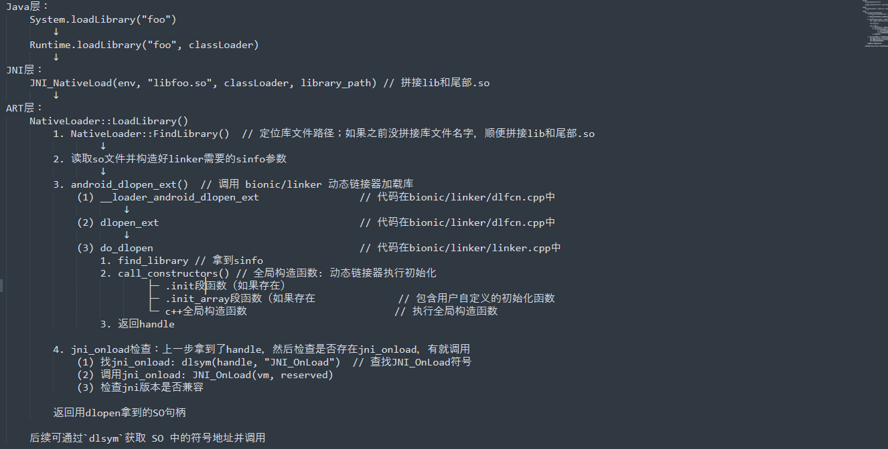

   根据这个图，我们可以获取到准确的so加载和退出的流程；

   在这个图中，我们做逆向需要关注的是：

   - so的名字
   
     >  如果没找到的话，就通过hook dlopen拿到;
   
   - so定义的初始化函数
   
     > 可能内部存在检测函数
   
   - jni_onload函数
   
     > 可能内部存在检测函数


4. System.LoadLibrary

   这个方法的实现在 `Java` 层，其源代码在 `libcore/ojluni/src/main/java/java/lang/System.java` [源代码在线查看](https://cs.android.com/android/platform/superproject/main/+/main:libcore/ojluni/src/main/java/java/lang/System.java?q=libcore%2Fojluni%2Fsrc%2Fmain%2Fjava%2Fjava%2Flang%2FSystem.java)

   

   这里的 `Runtime` 是什么？

   `Runtime` 是 Java 中**管理运行时环境的核心类**，每个 Java 应用程序都通过它直接与 `JVM `交互。

   继续跟代码 `libcore/ojluni/src/main/java/java/lang/Runtime.java` [源代码在线查看](https://cs.android.com/android/platform/superproject/main/+/main:libcore/ojluni/src/main/java/java/lang/Runtime.java;l=1010;drc=61197364367c9e404c7da6900658f1b16c42d0da;bpv=1;bpt=1)

   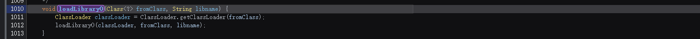

   继续跟代码（这里我去掉原始注释，加上我自己的注释）

   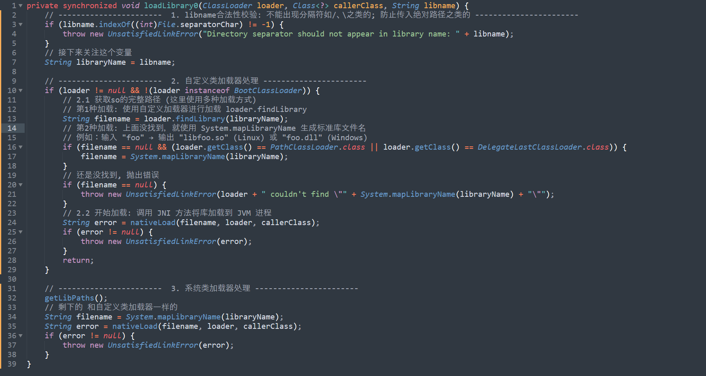

   主要做的就是:

   - 路径处理, 也就是 `foo -> libfoo.so` 
   - 调用 `nativeLoad` 进行加载

   

   这一方法开始进入 `JNI` 层，其实现代码，需要深入底层虚拟机（JVM 或 Android Runtime）的源码。

   其实现位于 **`libcore/ojluni/src/main/native/Runtime.c`文件的 `Runtime_nativeLoad`**。  [源码地址](https://cs.android.com/android/platform/superproject/main/+/main:libcore/ojluni/src/main/native/Runtime.c;l=1;drc=61197364367c9e404c7da6900658f1b16c42d0da;bpv=1;bpt=1?q=libcore%2Fojluni%2Fsrc%2Fmain%2Fnative%2FRuntime.c&sq=&ss=android%2Fplatform%2Fsuperproject%2Fmain)

   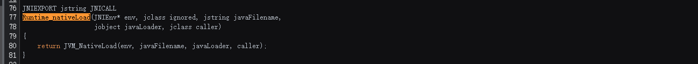

   继续跟

   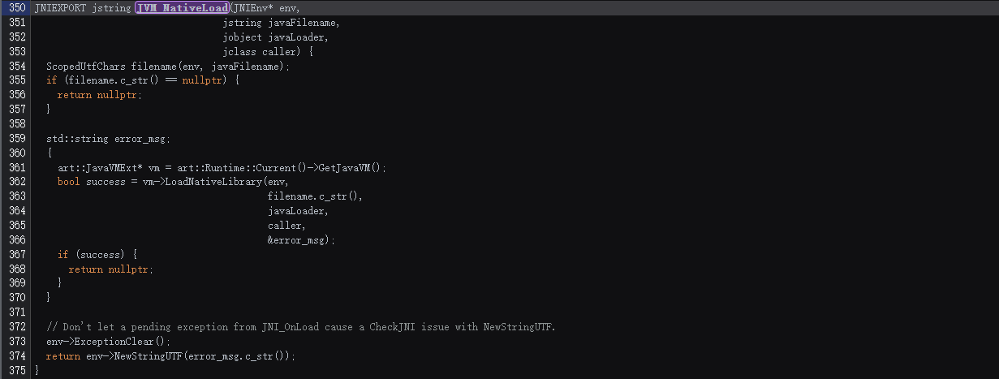

   核心就是

   - 先换成`cstring` 类型`javaFilename -> filename ` 

   - 调用 `vm->LoadNativeLibrary(env, filename.c_str(), javaLoader, caller, &error_msg);`

   接下来就是 `LoadNativeLibrary` ，进入了 `ART` 层，这个函数代码很多，接下来我将分为几部分，分析截图如下；

   1. 第一部分：合法性校验

      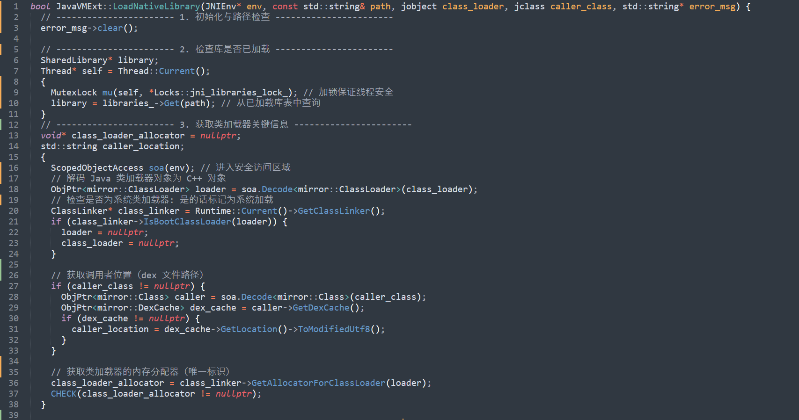

      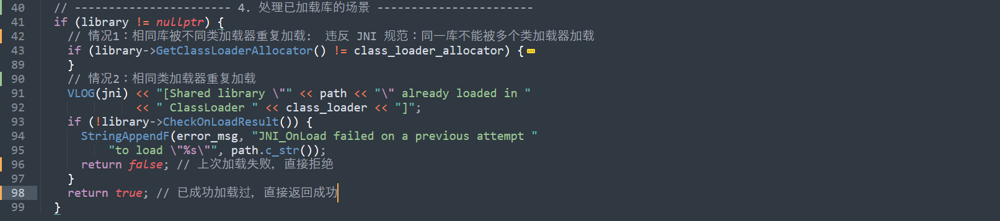

   2. 第二部分：**实际加载** 调用 `dlopen`
   
      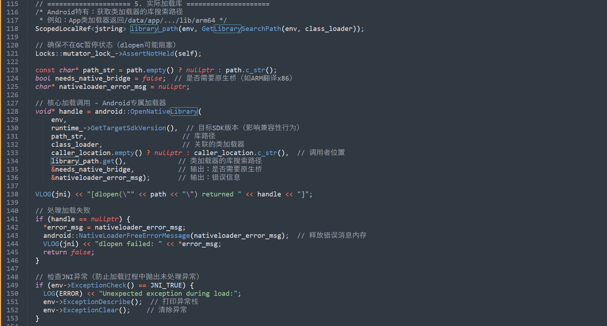
   
      在这里调用了`android::OpenNativeLibrary` 其内部调用`dlopen`（这一点我们可以看下面的log）
   
   3. 第三部分：记录已经加载的库，后续已经已经加载就直接拿，如果加载失败，下次直接不加载（这一点前面有代码）；
   
      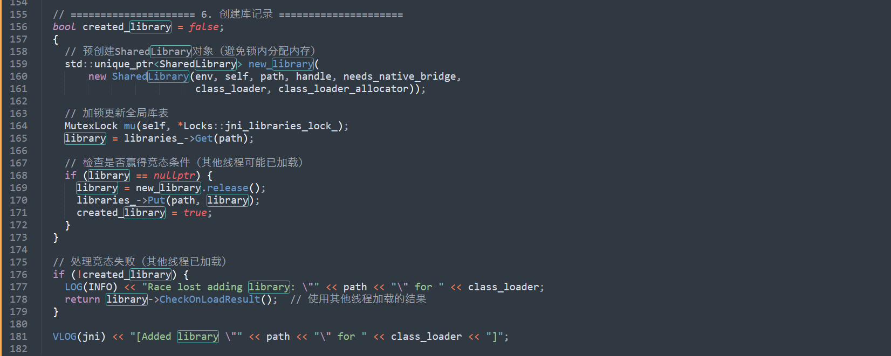
   
   4. 第四部分：调用`jni_onload`；
   
      如果（1）有就找到并且调用，并且进行版本合法性检查，通过就正常退出（2）没有就正常退出；
   
      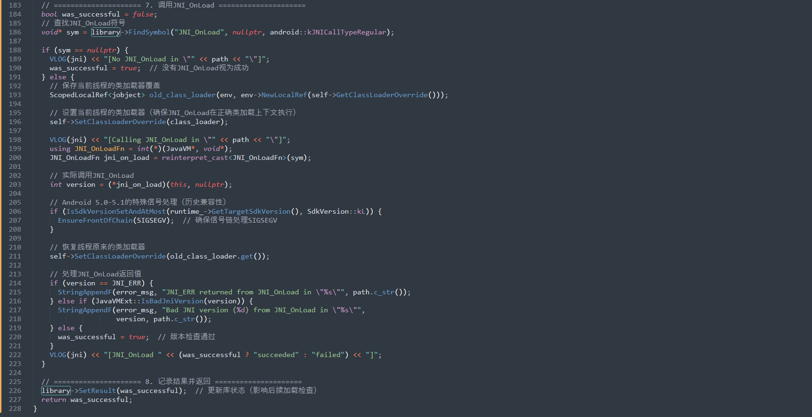

5. `android::OpenNativeLibrary` 

   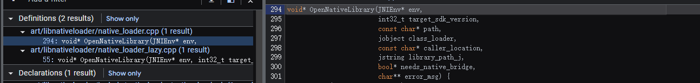

   定义的地方有两个

   在 Android 源码中，`OpenNativeLibrary` 函数存在两种定义（立即加载与延迟加载），其中的 **`lazy` 模式**特指**符号解析的延迟执行**机制。

   1. **立即加载模式（Eager）**
      在库被加载到内存后，**立即解析并绑定所有符号**（函数、变量等）。
      **适用场景**：需预先验证所有符号可用性，或在启动阶段确保全部依赖就绪。
   2. **延迟加载模式（Lazy）**
      仅在实际调用函数时**按需解析符号**，加载库时不进行全局符号绑定。
      **对应源码标志**：`RTLD_LAZY`。

   > 最终都是调用的 `dlopen`，只是会传入一个标志位进行区分；

   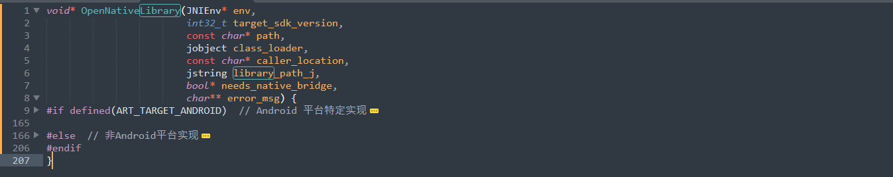

   我们只看 `Android` 平台的实现；

   1. 启动类加载器处理

      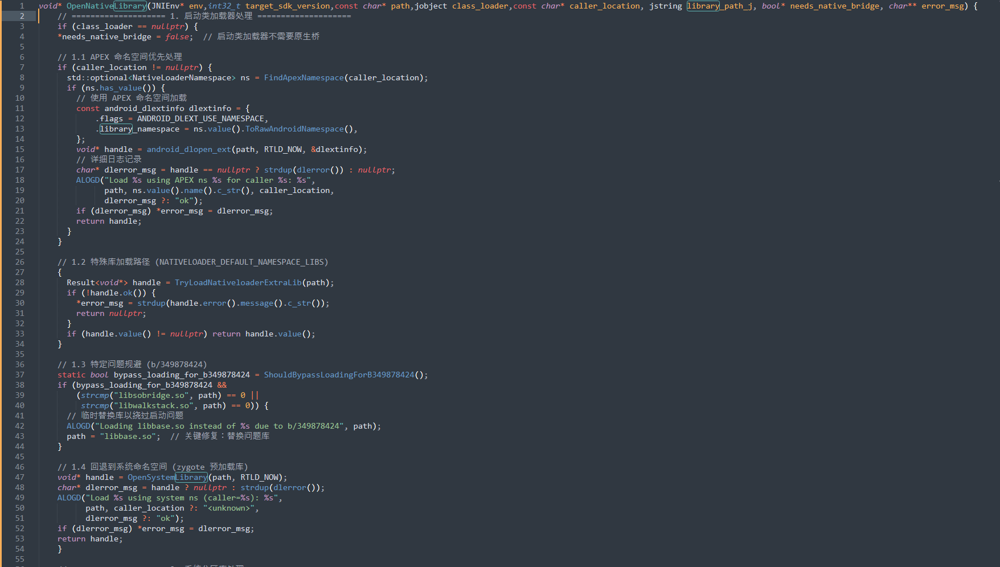

   2. 系统分区库处理

      

   3. 普通类加载器处理

      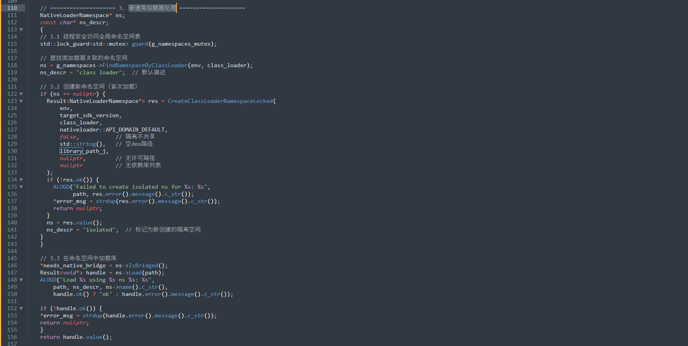

   核心代码为 `        void* handle = android_dlopen_ext(path, RTLD_NOW, &dlextinfo);`

   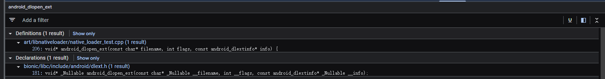

   这里函数声明是在 `dlext.h` 上，实际上函数的具体实现是在 `libdl.so` 中；

   对应代码 `bionic/libdl/libdl.cpp` 中，[地址](https://cs.android.com/android/platform/superproject/main/+/main:bionic/libdl/libdl.cpp;l=1;drc=61197364367c9e404c7da6900658f1b16c42d0da;bpv=0;bpt=0)

   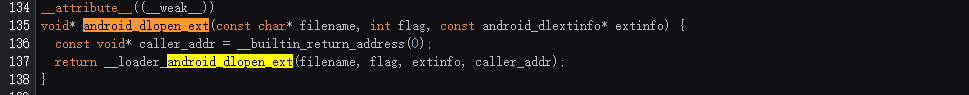

   继续跟 `__loader_android_dlopen_ext` 的代码在 `bionic/linker/dlfcn.cpp` 中

   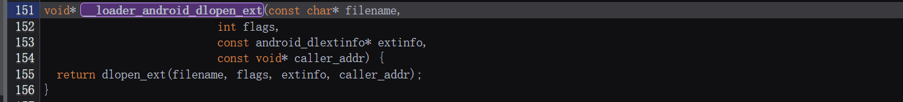

   继续跟

   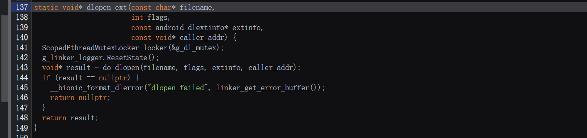

   跟到了 `do_dlopen` 代码在 `bionic/linker/linker.cpp` 中 [链接](https://cs.android.com/android/platform/superproject/main/+/main:bionic/linker/linker.cpp;l=2116;drc=61197364367c9e404c7da6900658f1b16c42d0da;bpv=0;bpt=1)

   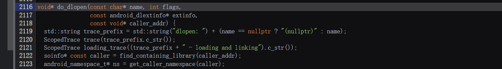

   这里的 `flags` 就是前面提到的，根据不同加载方式设置标志位；

   其核心代码如下:

   ```cpp
   // find_library 加载库
   ProtectedDataGuard guard; // 保护关键数据结构
   soinfo* si = find_library(ns, translated_name, flags, extinfo, caller);
   loading_trace.End(); // 结束加载跟踪
   
   // 成功加载后，调用库的初始化函数，并返回句柄。
   if (si != nullptr) {
     void* handle = si->to_handle(); // 转换为句柄
     si->call_constructors(); // 调用库的构造函数（包括.init_array和.init）
     failure_guard.Disable(); // 禁用失败处理（因为成功了）
     return handle; 
   }
   return nullptr;
   ```

   这里通过 `find_library` 拿到 `soinfo` 结构体， 然后调用 `to_handle` 转句柄；

   之后调用 `soinfo` 结构体的`call_constructors` 函数，我们一般称 `call_constructors` 为初始化函数，他负责so的初始化操作；内部实际调用的 `init` 和 `init_array` 段的函数来进行的初始化；源码在 `bionic/linker/linker_soinfo.cpp` 中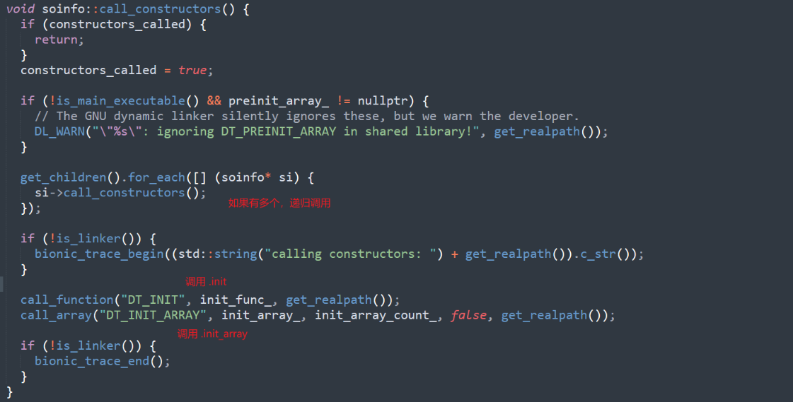

   这个 `call_constructors` 

   - 先拿到 `soinfo` 结构体的  `children`，有的话循环调用孩子的 `call_constructors`；

     > 所以我们hook这个 call_constructors 会打印很多个的原因，就是因为会递归调用所有依赖库的构造函数；
     >
     > 所以需要进行额外处理；
     >
     > 1. 设置唯一标志位
     > 2. 使用 `listener` 的 `detach` 分离
     > 3. 只监听对应so的 `call_constructors` ；这里需要使用 `get_soname`

   - 如果文件含有.init和.init_array节区的话，就先执行.init节区的代码再执行.init_array节区的代码

     > .init节区 一般是编译器生成的初始化，.init_array节区 一般是开发者定义的初始化函数

   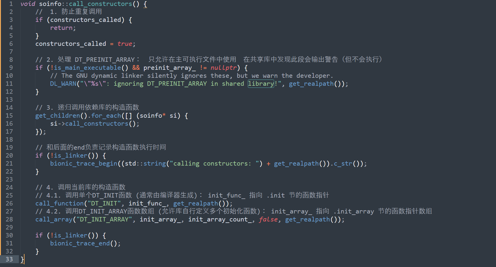

    

   


### 对应hook

#### 获取linker地址

拿 `linker` 的地址还是比较简单的；可以用 `Module.getBaseAddress` 和 `Process.findModuleByName` 再 `base`

通用脚本 

```js
// 1. 拿到linker地址
// 根据位数获取对应的linker模块
let module_linker = Process.findModuleByName(Process.pointerSize * 8 == 64? "linker64" : "linker");
if (!module_linker) {
    console.error("[*] error: can't find linker!")
} else{
    let address_linker = module_linker.base;
    console.warn(`[*] linker address: ${address_linker}, path: ${module_linker.path}!`);
}
```

> 上面的路径有可能并不是最终路径，高版本安卓会把其指向apex模块

我自己的手机

```js
// 直接拿到地址
const address_linker64 = Module.getBaseAddress('linker64');
```


而根据安卓系统的位数不同，linker也不同

- 32位系统：`/system/bin/linker`（模块名 "linker"）
- 64位系统：`/system/bin/linker64`（模块名 "linker64"）

所以如果你是32位，寻找 `linker` 就行

> 高版本的安卓(**Android 10+**)，linker的加载路径 被 `apex` 集成了，所以是 `/apex/com.android.runtime/bin/linker64`；
>
> 而实际上，为了兼容低版本安卓，一般会有一个链接指向的问题，不过不是很重要；
>
> `/system/bin/linker ->  /apex/com.android.runtime/bin/linker`；
>
> `/system/bin/linker64 ->  /apex/com.android.runtime/bin/linker64`


#### 获取call_constructors地址

- 去手机中用 `readelf` 工具读取 `linker` 的符号表拿到

  > 有的手机没有 `readelf` 工具.... 比如小米，不知道啥原因

  ```bash
  # 这里的linker路径，要根据安卓版本&安卓系统位数来确定，具体看上面一节
  readelf -sW /apex/com.android.runtime/bin/linker64 | grep call_constructors 
  ```

  > ```bash
  > C:\Users\xxxx>adb shell
  > taimen:/ $ readelf -sW /apex/com.android.runtime/bin/linker64 | grep call_constructors
  >    730: 000000000004a258   556 FUNC    LOCAL  HIDDEN    11 __dl__ZN6soinfo17call_constructorsEv
  > ```
  >
  > `-> 0x4a258`

- 用frida的api自动拿

  ```js
  // 1. 拿到linker地址
  // 根据位数获取对应的linker
  
  var address_linker = module_linker = null;
  var module_linker = Process.findModuleByName(Process.pointerSize * 8 == 64? "linker64" : "linker"); // 拿到的是module
  if (!module_linker) {
      console.error("[*] error: can't find linker!")
  } else{
      address_linker = module_linker.base;
      console.warn(`[*] linker address: ${address_linker}, path: ${module_linker.path}!`);
  }
  
  // 2. 寻找call_constructors地址
  let address_call_constructors = null;
  let symbols = module_linker.enumerateSymbols();
  for (let index = 0; index < symbols.length; index++) {
      let symbol = symbols[index];
      // 查找名为"__dl__ZN6soinfo17call_constructorsEv"的符号地址
      if (symbol.name == "__dl__ZN6soinfo17call_constructorsEv") {
          address_call_constructors = symbol.address;
      } 
  }
  
  if (!address_call_constructors){
      console.warn("[*] not found call_constructors!")
  } else{
      console.warn(`[*] call_constructors address: ${address_call_constructors}, offest: ${address_call_constructors.sub(address_linker)}!`)
  }
  ```

  

#### 获取soname

```js
// 1. 拿到linker地址
// 根据位数获取对应的linker
var address_linker = module_linker = null;
var module_linker = Process.findModuleByName(Process.pointerSize * 8 == 64? "linker64" : "linker"); // 拿到的是module
if (!module_linker) {
    console.error("[*] error: can't find linker!")
} else{
    address_linker = module_linker.base;
    console.warn(`[*] linker address: ${address_linker}, path: ${module_linker.path}!`);
}

// 2. 寻找call_constructors地址
let address_call_constructors = null;
let symbols = module_linker.enumerateSymbols();
for (let index = 0; index < symbols.length; index++) {
    let symbol = symbols[index];
    // 查找名为"__dl__ZN6soinfo17call_constructorsEv"的符号地址
    if (symbol.name == "__dl__ZNK6soinfo10get_sonameEv") {
        address_get_soname = symbol.address;
    } 
}

if (!address_get_soname){
    console.warn("[*] not found get_soname!")
} else{
    console.warn(`[*] get_soname address: ${address_get_soname}, offest: ${address_get_soname.sub(address_linker)}!`)
}
```


#### init_array自吐

参考博客：[frida hook init_array自吐新解](https://bbs.kanxue.com/thread-280135.htm)

> 经过安卓源码比对，从Android 8 ~ 14，结构体中`init_array`的位置都很稳定，提取部分头文件信息在CModule中定义一个soinfo结构体，接着定义一个接受一个`soinfo`指针参数和一个`callback`函数的函数，输出`init_array`信息


这里用到了frida的cmodule的api

```js
let cm_include = `
#include <stdio.h>
#include <gum/gumprocess.h>
`
 
let cm_code = `
#if defined(__LP64__)
#define USE_RELA 1
#endif
 
// http://aosp.app/android-14.0.0_r1/xref/bionic/libc/include/link.h
#if defined(__LP64__)
#define ElfW(type) Elf64_ ## type
#else
#define ElfW(type) Elf32_ ## type
#endif
 
// http://aosp.app/android-14.0.0_r1/xref/bionic/libc/kernel/uapi/asm-generic/int-ll64.h
typedef signed char __s8;
typedef unsigned char __u8;
typedef signed short __s16;
typedef unsigned short __u16;
typedef signed int __s32;
typedef unsigned int __u32;
typedef signed long long __s64;
typedef unsigned long long __u64;
 
// http://aosp.app/android-14.0.0_r1/xref/bionic/libc/kernel/uapi/linux/elf.h
typedef __u32 Elf32_Addr;
typedef __u16 Elf32_Half;
typedef __u32 Elf32_Off;
typedef __s32 Elf32_Sword;
typedef __u32 Elf32_Word;
typedef __u64 Elf64_Addr;
typedef __u16 Elf64_Half;
typedef __s16 Elf64_SHalf;
typedef __u64 Elf64_Off;
typedef __s32 Elf64_Sword;
typedef __u32 Elf64_Word;
typedef __u64 Elf64_Xword;
typedef __s64 Elf64_Sxword;
 
typedef struct dynamic {
  Elf32_Sword d_tag;
  union {
    Elf32_Sword d_val;
    Elf32_Addr d_ptr;
  } d_un;
} Elf32_Dyn;
typedef struct {
  Elf64_Sxword d_tag;
  union {
    Elf64_Xword d_val;
    Elf64_Addr d_ptr;
  } d_un;
} Elf64_Dyn;
typedef struct elf32_rel {
  Elf32_Addr r_offset;
  Elf32_Word r_info;
} Elf32_Rel;
typedef struct elf64_rel {
  Elf64_Addr r_offset;
  Elf64_Xword r_info;
} Elf64_Rel;
typedef struct elf32_rela {
  Elf32_Addr r_offset;
  Elf32_Word r_info;
  Elf32_Sword r_addend;
} Elf32_Rela;
typedef struct elf64_rela {
  Elf64_Addr r_offset;
  Elf64_Xword r_info;
  Elf64_Sxword r_addend;
} Elf64_Rela;
typedef struct elf32_sym {
  Elf32_Word st_name;
  Elf32_Addr st_value;
  Elf32_Word st_size;
  unsigned char st_info;
  unsigned char st_other;
  Elf32_Half st_shndx;
} Elf32_Sym;
typedef struct elf64_sym {
  Elf64_Word st_name;
  unsigned char st_info;
  unsigned char st_other;
  Elf64_Half st_shndx;
  Elf64_Addr st_value;
  Elf64_Xword st_size;
} Elf64_Sym;
typedef struct elf32_phdr {
  Elf32_Word p_type;
  Elf32_Off p_offset;
  Elf32_Addr p_vaddr;
  Elf32_Addr p_paddr;
  Elf32_Word p_filesz;
  Elf32_Word p_memsz;
  Elf32_Word p_flags;
  Elf32_Word p_align;
} Elf32_Phdr;
typedef struct elf64_phdr {
  Elf64_Word p_type;
  Elf64_Word p_flags;
  Elf64_Off p_offset;
  Elf64_Addr p_vaddr;
  Elf64_Addr p_paddr;
  Elf64_Xword p_filesz;
  Elf64_Xword p_memsz;
  Elf64_Xword p_align;
} Elf64_Phdr;
 
// http://aosp.app/android-14.0.0_r1/xref/bionic/linker/linker_soinfo.h
typedef void (*linker_dtor_function_t)();
typedef void (*linker_ctor_function_t)(int, char**, char**);
 
#if defined(__work_around_b_24465209__)
#define SOINFO_NAME_LEN 128
#endif
 
typedef struct {
  #if defined(__work_around_b_24465209__)
    char old_name_[SOINFO_NAME_LEN];
  #endif
    const ElfW(Phdr)* phdr;
    size_t phnum;
  #if defined(__work_around_b_24465209__)
    ElfW(Addr) unused0; // DO NOT USE, maintained for compatibility.
  #endif
    ElfW(Addr) base;
    size_t size;
   
  #if defined(__work_around_b_24465209__)
    uint32_t unused1;  // DO NOT USE, maintained for compatibility.
  #endif
   
    ElfW(Dyn)* dynamic;
   
  #if defined(__work_around_b_24465209__)
    uint32_t unused2; // DO NOT USE, maintained for compatibility
    uint32_t unused3; // DO NOT USE, maintained for compatibility
  #endif
   
    void* next;
    uint32_t flags_;
   
    const char* strtab_;
    ElfW(Sym)* symtab_;
   
    size_t nbucket_;
    size_t nchain_;
    uint32_t* bucket_;
    uint32_t* chain_;
   
  #if !defined(__LP64__)
    ElfW(Addr)** unused4; // DO NOT USE, maintained for compatibility
  #endif
   
  #if defined(USE_RELA)
    ElfW(Rela)* plt_rela_;
    size_t plt_rela_count_;
   
    ElfW(Rela)* rela_;
    size_t rela_count_;
  #else
    ElfW(Rel)* plt_rel_;
    size_t plt_rel_count_;
   
    ElfW(Rel)* rel_;
    size_t rel_count_;
  #endif
   
    linker_ctor_function_t* preinit_array_;
    size_t preinit_array_count_;
   
    linker_ctor_function_t* init_array_;
    size_t init_array_count_;
    linker_dtor_function_t* fini_array_;
    size_t fini_array_count_;
   
    linker_ctor_function_t init_func_;
    linker_dtor_function_t fini_func_;
} soinfo;
 
void tell_init_info(soinfo* ptr, void (*cb)(int, void*, void*)) {
    cb(ptr->init_array_count_, ptr->init_array_, ptr->init_func_);
}
`
 
let cm = null;
let tell_init_info = null;
 
function setup_cmodule() {
    if (Process.pointerSize == 4) {
        cm_code = cm_include + "#define __work_around_b_24465209__ 1" + cm_code;
    } else {
        cm_code = cm_include + "#define __LP64__ 1" + cm_code;
    }
    cm = new CModule(cm_code, {});
    tell_init_info = new NativeFunction(cm.tell_init_info, "void", ["pointer", "pointer"]);
}
 
function get_addr_info(addr) {
    let mm = new ModuleMap();
    let info = mm.find(addr);
    if (info == null) return "null";
    return `[${info.name} + ${addr.sub(info.base)}]`;
}
 
function hook_call_constructors() {
    let get_soname = null;
    let call_constructors_addr = null;
    let hook_call_constructors_addr = true;
 
    let linker = null;
    if (Process.pointerSize == 4) {
        linker = Process.findModuleByName("linker");
    } else {
        linker = Process.findModuleByName("linker64");
    }
 
    let symbols = linker.enumerateSymbols();
    for (let index = 0; index < symbols.length; index++) {
        let symbol = symbols[index];
        if (symbol.name == "__dl__ZN6soinfo17call_constructorsEv") {
            call_constructors_addr = symbol.address;
        } else if (symbol.name == "__dl__ZNK6soinfo10get_sonameEv") {
            get_soname = new NativeFunction(symbol.address, "pointer", ["pointer"]);
        }
    }
    if (hook_call_constructors_addr && call_constructors_addr && get_soname) {
        Interceptor.attach(call_constructors_addr,{
            onEnter: function(args){
                let soinfo = args[0];
                let soname = get_soname(soinfo).readCString();
                tell_init_info(soinfo, new NativeCallback((count, init_array_ptr, init_func) => {
                    console.log(`[call_constructors] ${soname} count:${count}`);
                    console.log(`[call_constructors] init_array_ptr:${init_array_ptr}`);
                    console.log(`[call_constructors] init_func:${init_func} -> ${get_addr_info(init_func)}`);
                    for (let index = 0; index < count; index++) {
                        let init_array_func = init_array_ptr.add(Process.pointerSize * index).readPointer();
                        let func_info = get_addr_info(init_array_func);
                        console.log(`[call_constructors] init_array:${index} ${init_array_func} -> ${func_info}`);
                    }
                }, "void", ["int", "pointer", "pointer"]));
            }
        });
    }
}
 
function main(){
    setup_cmodule();
    hook_call_constructors();
}
 
setImmediate(main);
 
// frida -U -f pkg_name -l hook.js -o hook.log
```


#### 监控call_constructors

```js
function hook_call_constructors() {
    // 初始化变量
    let get_soname = null;
    let call_constructors_addr = null;
    let hook_call_constructors_addr = true;
    // 根据进程的指针大小找到对应的linker模块
    let linker = null;
    if (Process.pointerSize == 4) {
        linker = Process.findModuleByName("linker");
    } else {
        linker = Process.findModuleByName("linker64");
    }
    // 枚举linker模块中的所有符号
    let symbols = linker.enumerateSymbols();
    for (let index = 0; index < symbols.length; index++) {
        let symbol = symbols[index];
        // 查找名为"__dl__ZN6soinfo17call_constructorsEv"的符号地址
        if (symbol.name == "__dl__ZN6soinfo17call_constructorsEv") {
            call_constructors_addr = symbol.address;
        // 查找名为"__dl__ZNK6soinfo10get_sonameEv"的符号地址，获取soname
        } else if (symbol.name == "__dl__ZNK6soinfo10get_sonameEv") {
            get_soname = new NativeFunction(symbol.address, "pointer", ["pointer"]);
        }
    }
    // 如果找到了所有需要的地址和函数
    if (hook_call_constructors_addr && call_constructors_addr && get_soname) {
        // 挂钩call_constructors函数
        Interceptor.attach(call_constructors_addr,{
            onEnter: function(args){
                console.log("[+] call_constructors onEnter!")
                // 从参数获取soinfo对象
                let soinfo = args[0];
                // 使用get_soname函数获取模块名称【这个函数是linker自带的】
                let soname = get_soname(soinfo).readCString();
                // 调用tell_init_info函数并传递一个回调，用于记录构造函数的调用信息
                tell_init_info(soinfo, new NativeCallback((count, init_array_ptr, init_func) => {
                    console.log(`[call_constructors] ${soname} count:${count}`);
                    console.log(`[call_constructors] init_array_ptr:${init_array_ptr}`);
                    console.log(`[call_constructors] init_func:${init_func} -> ${get_addr_info(init_func)}`);
                    // 遍历所有初始化函数，并打印它们的信息
                    for (let index = 0; index < count; index++) {
                        let init_array_func = init_array_ptr.add(Process.pointerSize * index).readPointer();
                        let func_info = get_addr_info(init_array_func);
                        console.log(`[call_constructors] init_array:${index} ${init_array_func} -> ${func_info}`);
                    }
                }, "void", ["int", "pointer", "pointer"]));
            },
            onLeave: function(retval){
                console.log("[-] call_constructors onLeave!")
            }
        });
    }
}

```


# 安卓逆向环境 r0env


# unidbg补环境方案


# rpc方案

目前没有比较好的课程，只看到了珍惜大佬之前的架构图；以及xp模块；

其他的还没搜索到；

目前手里有一个shopee的rpc的xp模块，可以用于学习；

## rpc原理

frida 提供了一种跨平台的 rpc(就是Remote Procedure Call 远程过程调用) 机制，通过 frida rpc 可以在主机和目标设备之间进行通信，并在目标设备上执行代码，简单理解就是可以不需要分析某些复杂加密，通过传入参数获取返回值，进而来实现python或易语言来调用的一系列操作，多用于爬虫。


attach启动

```python
import frida


rdev = frida.get_usb_device()
session = rdev.attach("蝦皮購物")
with open("6-rpc调用.js") as f:
    script = session.create_script(f.read())

script.load()

# 脚本载入内存后，我们可以拿到这个函数来调用
def calc_hash(url_string, body_string):
    return script.exports_sync.calc_hash(url_string, body_string)


if __name__ == '__main__':
    url_string = "1"
    body_string = "2"
    sign_map = calc_hash(url_string, body_string)
    print(sign_map)

# 871e62682efc22e99a67151201199a37174fa6c9a718bd8a0ec6

```

```js
// js中定义一个函数
rpc.exports = {
    // 接收两个参数，然后返回字符串
    calcHash: function (url_string, body_string) {
        var res;
        Java.perform(function () {
            let wvvvuwwu = Java.use("com.shopee.shpssdk.wvvvuwwu");
            var string_ = Java.use("java.lang.String"); 
            // 原始native函数需要传入字节数组，所以我们这里调用string来生成
            var arg1 = string_.$new(url_string).getBytes();
            var arg2 = string_.$new(body_string).getBytes();
            res = wvvvuwwu["vuwuuwvw"](arg1, arg2); // 主动调用拿到计算后的数据
        });
        return res;
    }
}
```


如果是spawn启动

```python
pid = device.spawn(["包名"])    #以挂起方式创建进程
process = device.attach(pid)
```

切换其他端口

```python
manager = frida.get_device_manager()
process = manager.add_remote_device('192.168.1.22:6666').attach('包名')
```


## rpc使用案例


## rpc优化方案


# xposed技术


# 持久化hook技术


## magisk模块

[FridaManager](https://github.com/hanbinglengyue/FridaManager)

思路:基于magisk模块方案注入frida-gadget，实现加载和hook。
优点:无需重打包、灵活性较强
缺点:需要过root检测，magsik检测


## fridainject框架

思路:基于jshook封装好的fridainject框架实现hook

[me.jsonet.jshook](https://github.com/Xposed-Modules-Repo/me.jsonet.jshook)


# app脱壳与修复

脱壳网站：[APK加固安全测试](https://56.al/)

修复dex：[DexRepair](https://github.com/luoyesiqiu/DexRepair)


## 加壳原理

dex放入了so中，运行的时候再把代码还原回来加载到内存


## 加壳厂商

腾讯，梆梆，爱加密，360，阿里，淘宝；自定义加壳


## dexdump


## fundex


# frida检测与对抗

小佳的课程讲的好

## 检测原因与对应so

1. 为啥app要做检测？
   - 防止爬虫
   - 保护代码被窃取（竞品公司）
   - 防止自动化（抢票，自动付款等等）

   
   
2. 什么时候出现frida检测？

   - 广告sdk自带（免费的）

     > libmsaoaidsec.so
   
   - 加固厂商（收费）

     | 公司名称   | 对应的壳包名                                                 |
     | ---------- | ------------------------------------------------------------ |
     | 爱加密     | libexec.so, libexecmain.so，ijiami.dat                       |
     | 梆梆       | libsecexe.so, libsecmain.so                                  |
     | 梆梆企业版 | libDexHelper.so libSecShell.so                               |
     | 360        | libprotectClass.so,libjiagu.so，libjiagu_art.so，libjiagu_x86.so |
     | 百度       | libbaiduprotect.so                                           |
     | 腾讯       | libshellx-2.10.6.0.so，libBugly.so，libtup.so, libexec.so，libshell.so，stub_tengxun |
     | 网易易盾   | libnesec.so                                                  |
     | 娜迦       | libchaosvmp.so , libddog.solibfdog.so                        |
     | 通付盾     | libegis.so，libNSaferOnly.so                                 |
     | 网秦       | libnqshield.so                                               |
     | 阿里聚安全 | aliprotect.dat，libsgmain.so，libsgsecuritybody.so           |
     | 腾讯御安全 | libtosprotection.armeabi.so，libtosprotection.armeabi-v7a.so，libtosprotection.x86.so |
     | APKProtect | libAPKProtect.so                                             |
     | 几维安全   | libkwscmm.so, libkwscr.so, libkwslinker.so                   |
     | 顶像科技   | libx3g.so                                                    |


## 检测原理

特征文件

crc校验


chan


## 对抗分析

### 对抗思路

思路：

1. 找到检测的so文件
2. 找到hook时机
3. 找到so中检测点
4. hook掉关键函数


### so的加载流程

**加载so**->**链接so**->**初始化(init_proc)**->**数组初始化(init_array)**->**jni_onLoad**

[Android-so加载流程剖析](https://www.jianshu.com/p/9b7202786803)

先了解一下java如何导入的so以及加载流程

可以看一下经典的两张图


第一张图可以快速了解执行顺序，第二张图可以了解具体的调用顺序


### libmsaoaidsec&libsecsdk

一次性讲清楚这个so

1. 这个so的背景？是谁做出来的？

   由某某研究院和某某安全企业、某某高等院校、某某研究机构共同推出的，主要用来生成和获取手机OAID参数的一个SDK。这个SDK中自带的，主要是在一定程度上防止调试用的。[参考文章链接](https://www.52pojie.cn/thread-2022770-1-1.html)

   名字拆分：

   - msa: 移动安全联盟 (Mobile Security Alliance)
   - oaid：匿名设备标识符（Open Anonymous Device Identifier）
   - sec：安全（secure）

2. oaid是什么？拿oaid参数一般做什么？

   [oaid介绍](#oaid)

   

3. 这个so都检测了什么？

   1. adb检测

      

   2. 反Frida检测: 这是最常见的检测。

      - 扫描内存: 遍历 /proc/self/maps，查找是否存在 "frida-agent"、"frida-gadget"、"gum-js-loop" 等Frida相关的特征字符串。

      - 端口检测: 尝试连接Frida Server的默认端口27042，如果能连上，说明Frida正在运行。

      - D-Bus检测: Frida会使用D-Bus进行通信，它会检测D-Bus上是否有Frida相关的服务名。

      - 检测常见Hook点: 检查 libc.so 中的 open, read, write, strcmp 等函数是否被hook，因为Frida常常从这里入手。

   3. 反调试检测 (Anti-Debugging)

      - TracerPid检测: 读取 /proc/self/status 文件，检查 TracerPid 这一项的值。如果值不为0，说明正被调试器附加。

      - ptrace检测: 自己调用 ptrace(PTRACE_TRACEME, ...)，如果失败，说明已经被别的进程（调试器）ptrace了。这是最经典的反调试手段。

      - 时间差检测: 在两段代码之间插入获取时间戳的指令，如果中间有断点，执行的时间差会变得非常大。

   4. Root环境检测:

      - 检查su文件: 查找 /system/bin/su, /system/xbin/su 等文件是否存在。

      - 执行su命令: 尝试执行 su 命令，看是否能成功。

      - 检查Root管理应用: 检查设备上是否安装了 Magisk、SuperSU 等App的包名。

   5. 模拟器检测:

      - 检测特征文件: 检查是否存在 /dev/qemu_pipe 等模拟器特有的文件或驱动。

      - 检测Build属性: 读取 ro.product.model, ro.hardware 等系统属性，检查是否包含 "sdk", "google_sdk", "generic", "goldfish", "ranchu" 等模拟器特征值。

4. 绕过思路

   1. 直接删除

      优点：简单高效，不用hook；

      缺点：很多so都不行了，直接删会导致各种崩溃；

   2. 静态修改so文件并重打包

      定位到关键的检测函数，直接在文件层面将其代码修改掉。然后将修改后的SO文件放回App中。

      优点：不用hook了

      缺点：破坏签名以及可能重打包失败；而且对于协议逆向的意义不大，一般是直接动态hook；

   3. 找到关键检测函数hook禁用： “治本”

      优点：一次就搞定；

      缺点：寻找起来相对困难；且可能检测函数中内嵌业务和检测；

   4. 拦截线程寻找检测函数置空：“治标”不治本

      hook拦截线程创建，计算出检测函数地址，然后干掉

      优点：更加通用；

      缺点：有时只有部分函数才能干掉；仍然存在耦合的问题；

   5. Hook系统调用

      许多检测最终都依赖于操作系统提供的服务。例如，检测su文件依赖于open或access系统调用；检测TracerPid依赖于读取/proc/self/status文件，这也需要open, read等系统调用。检测frida会用libc下的strstr，strcmp；

      优点：比较通用。

      缺点：实现复杂，而且很容易遗漏；

5. 通用hook脚本的开发

   这是一个公用的sdk，而且官方要求不能随便修改这里面的sdk，而且企业也不会闲着蛋疼去改这个so；

   所以这个so有一个问题就是，他不会随便大的更新，更新也没有那么及时；所以我们可以通过计算so的签名从而自动给出对应的绕过脚本；

   而由于github上的和npm下载的都比较老，我们下载b站所有的app版本，然后提取里面的so来获取签名与生成对应脚本；

   | md5                              |    对应so名字    | 对应解决办法   | 对应app和版本                                     | oaid_sdk.aar版本 |
   | -------------------------------- | :--------------: | -------------- | ------------------------------------------------- | ---------------- |
   | 94cec457b8c5568e6391e4e66efebec3 | libmsaoaidsec.so |                | 小红书8.90.0                                      |                  |
   | 2d1d28677edd90e46ddc993a228222e5 | libmsaoaidsec.so | 干掉 `0x1B924` | 哔哩哔哩8.15<br />哔哩哔哩8.52<br />小红书v8.88.0 | ?                |
   | 2ebaee26c127e4613841165274df2f0d | libmsaoaidsec.so |                | 小红书7.77.0                                      | ?                |
   | fefefc1679484360e19a40fa141d5cd3 | libmsaoaidsec.so |                | 哔哩哔哩7.74.0                                    | oaid_sdk_2.3.0   |
   | cf2d1398c6d5292014acf32c115aca59 | libmsaoaidsec.so |                |                                                   | oaid_sdk_1.2.1   |
   | 647a141ececb9e1612df7de0b0176977 | libmsaoaidsec.so |                |                                                   | oaid_sdk_1.1.0   |
   | e867f5577ce4d9ca3b1a40476fb1c9e5 |   libsecsdk.so   |                |                                                   | oaid_sdk_1.0.23  |
   | 9cddebae7bd7142b18456382ef56851f |  lib39285EFA.so  |                |                                                   | msa_mdid_1.0.13  |

   

最终脚本：

```js
function anti_libmsaoaidsec() {
    Interceptor.attach(Module.findExportByName(null, "android_dlopen_ext"), {
        onEnter: function (args) {
            var pathptr = args[0];
            if (pathptr !== undefined && pathptr != null) {
                this.fileName = ptr(pathptr).readCString();
                // console.log(`[+] dlopen onEnter ==> ${this.fileName}`); // 所有so的加载, 日志太多可注释
                // 针对 libmsaoaidsec.so 的hook
                if (this.fileName.indexOf("libmsaoaidsec.so") !== -1) { 
                    this.match_libmsaoaidsec = true; // 退出的时候用，就不用再次过滤了
                    console.log(`[+] dlopen onEnter ==> ${this.fileName}`); // 关键检测点，日志打开
                    // 检测点在init.proc，所以我们要hook linker的 call_constructors中
                    hook_linker64_call_constructors( );
                }
            }
        },
        onLeave: function (retval) {
            // 针对 libmsaoaidsec.so 的hook
            if (this.match_libmsaoaidsec) {
                // 确定是否在jni_onload进行的检测
                let JNI_OnLoad = Module.getExportByName(this.fileName, 'JNI_OnLoad');
                if (JNI_OnLoad){
                    console.warn(`[*] JNI_OnLoad address: ${JNI_OnLoad}`)
                    Interceptor.attach(JNI_OnLoad, {
                         onEnter: function (args) {
                             console.log(`[+] JNI_OnLoad onEnter!`); // 关键检测点，日志打开
                         }, onLeave: function (retval){
                             console.log(`[-] JNI_OnLoad onLeave!`); // 关键检测点，日志打开
                         }
                    });
                }
                console.log(`[-] dlopen onLeave ==> ${this.fileName}`);
            }
            // console.log(`[-] dlopen onLeave ==> ${this.fileName}`); // 所有so的加载完毕 
        }
    });
}


function hook_linker64_call_constructors() {
    // init_proc函数对应安卓源码就是linker64的call_constructors函数
    // 我们需要拿到call_constructors在linker64中的相对偏移，这个偏移地址与手机有关，手机执行下面命令可以拿到
    // readelf -sW /apex/com.android.runtime/bin/linker64 | grep call_constructors
    let address_call_constructors = Module.getBaseAddress('linker64').add(0x4a258); // 这个0x4a258要从上面的指令拿到offest
    let listener = Interceptor.attach(address_call_constructors, {
        onEnter: function (args) {
            console.log('[+] call_constructors onEnter');
            let secmodule = Process.findModuleByName("libmsaoaidsec.so");
            if (secmodule != null) {
                // 思路一：最直接的，外层检测函数，直接干掉就行，不同版本有区别
                // 常见的: 0x1B924、0x1A5B0、0x1BEC4；挨个试试就行
                replace(secmodule.base.add(0x1B924)); 
                // 思路二：定位杀进程函数然后置空（一般是一个，最好找全；）
                // replace(secmodule.base.add(0x1B8D4));
                // replace(secmodule.base.add(0x1B380));
                // replace(secmodule.base.add(0x19E0C));
                // replace(secmodule.base.add(0x1AB2C));
                // 思路三：找线程创建函数pthread_create，对检测函数置空（有时还没创建线程就闪退了；）

                // 思路四: 改汇编代码强行跳转或者直接nop函数 绕过app退出，但是不退出有可能卡死（和思路二差不多）
                
                // 这里是因为call_constructors中还有child的call_constructors, 我们只hook最外层的就行了
                // listener.detach() 是 Frida API 的一个方法，它的作用是移除（或称“分离”）一个之前通过 Interceptor.attach 创建的钩子（hook）。我们的这个替换操作只需要做一次就够了。
                listener.detach(); 
            }
        }, onLeave: function (retval) {
            console.log("[-] call_constructors onLeave");
        }
    })
}

function replace(addr) { // 让函数啥也不干
    Interceptor.replace(addr, new NativeCallback(function () {
        console.warn(`[*] replace function, address: ${addr}!`)
    }, 'void', []));
}
```


分析过程（案例：豆瓣v7.100.0）

1. 先确认是否存在frida检测，而不是其他检测导致的

   >  不开frida啥事没有，开了之后，稍微用一下frida的api就闪退；

2. 定位具体检测的so文件

   > dlopen是负责加载so的

3. 确认检测时机

   > 看dlopen是否完全加载；
   >
   > 如果完全加载了，说明是开线程检测的；如果没有完全加载说明是在so中检测的，或者还没退出就开了线程检测到了；

   我们这里是没有正常dlopen结束；

   我们hook jni_onload

   

# frida源码


## frida-inject


## frida-gadget

这个so需要注入app中，所以需要重打包app；

优点：1）免root；2）稳定

不过我们一般需要改系统，让系统注入so，就不要重打包了。

> xposed是把代码注入了zygote。


# 风控对抗

一些博客

1. [我是如何让爬虫在小红书风控下“偷数据”的？xhs爬虫这些骚操作你可能想不到](https://blog.csdn.net/klj3388/article/details/146016922)

2. [突破Shopee平台数据采集的风控挑战与技术解决方案](https://blog.csdn.net/klj3388/article/details/145820992)


## 代理ip

### 搭建免费代理池

### 付费代理


### 使用心得

多类型代理组合：采用高匿名住宅代理（模拟真实用户IP）与数据中心代理（高并发需求）混合策略，结合IP轮换频率与目标国家后缀（如.com.my、.vn）动态匹配14。

    智能IP调度系统：根据IP封禁率、响应速度自动剔除低效节点，并通过Bright Data等工具实现请求失败后的自动重试与切换39。


## 指纹

指纹混淆工具：引入Canvas指纹混淆库（如FingerprintJS）或修改WebGL参数，使爬虫的浏览器指纹与真实用户一致310。


## 账号

### 账号来源

搭建cookie池


### 行为轨迹

 真人刷小红书时会干嘛？划到一半锁屏回微信，看到广告立刻滑走，甚至误触点赞又取消。

模拟真人行为

        随机划屏速度（有时飞速下滑，有时卡顿）
    
        模拟误操作（比如先点赞再取消，重复3次）
    
        半夜“装睡”（凌晨2-5点降低活跃度）
    
    	蹭热点伪装

鼠标移动速度、点击间隔

       给每台手机植入不同的“生活痕迹”——比如相册里存几百张随手拍，通讯录塞满虚拟联系人


### 社交关系

不能一次性关注太多，得循序渐进


### 活跃时间

连刷机时间都做差异化：有的设置凌晨3点自动重启，有的只在下午活跃


## 打码验证


## 养号

  养号玄学：账号不是工具，是得“宠”的祖宗
见过有人花一周抓数据，结果花一个月养号吗？新注册的账号如果直接开爬，活不过2小时。现在我们的 SOP 是：
前3天只刷不爬：随机点赞宠物/美食笔记（避开敏感类目）
第4天开始关注5-10个普通用户（不能是万粉大V）
第7天假装真人互动：在评论区发“姐妹求链接！”或者“这个色号显白吗？”
——是的，连爬虫都得学会“装闺蜜”


## 采集心得

   随机化请求间隔：在爬虫代码中引入随机延迟（如1-5秒），并模拟“浏览-点击-滚动”等用户行为链，降低行为模式的可预测性48。

调用频率限制


分阶段采集：优先通过Shopee搜索页或分类页获取商品ID列表，再异步请求详情页数据，分散高频操作风险19。


 优先用4G动态IP，每小时切换一次。抓上海用户的笔记就用本地IP，凌晨切到二三线城市降低风控概率。


## 验证码

OCR与打码平台集成：针对简单图像验证码，使用Tesseract OCR本地识别；复杂验证码则对接第三方打码服务（如2Captcha），实现人工干预自动化89。


## 自动化

### app群控

### 设备信息伪造

刷机时间

重启时间


### web浏览器

selenium

drissionpage

Playwright


## 后续技术方向

  AI驱动的反反爬技术：利用强化学习模型自适应调整请求策略，实时规避风控规则10。

  边缘计算与CDN解析：通过边缘节点就近访问目标页面，减少延迟并降低IP封禁概率10。

    合规化数据服务：与Shopee官方API或授权数据供应商合作，平衡效率与合规性19。


# 代码混淆技术

## 混淆技术


## js常用混淆工具


## java常用混淆工具

代码混淆技术


### 简单混淆

### 第三方包混淆

- 在安卓开发中，对于第三方的包是可以进行混淆的，例如：`OKHttp3.Http.Cert.check` 被混淆后可以是`a.f.c.b` 形式。
- 在安卓开发中，系统包是无法混淆的，例如：`java.security.KeyStore`不会被混淆。

此时，有些frida脚本没法使用

```
 Java.use('okhttp3.CertificatePinner');  
 Java.use('com.squareup.okhttp.internal.tls.OkHostnameVerifier');
```

所以只能用安卓底层的

```
 Java.use("java.security.KeyStore");
```


解决方案

1. Hook系统底层必走的核心方法，获取调用栈
2. 根据调用栈向上寻找 客户端证书校验 代码位置，**找他其被混淆后的 类名和方法名。**
3. 用frida Hook脚本的方式绕过。


控制流混淆

什么是控制流混淆


## java层控制流混淆


### 如何进行java层控制流混淆

[DEX控制流混淆: BlackObfuscator](https://github.com/CodingGay/BlackObfuscator)


### 对抗

1. jeb对抗

   

   

   案例: [细品sec2023安卓赛题 ](https://bbs.kanxue.com/thread-278648.htm)

   

2. [ZenTracer](https://github.com/hluwa/ZenTracer) 2020年10月已archived【作者：hluwa】

   使用缺点：无法打印调用栈，无法`hook`构造函数

   稳定使用环境: 

   ```bash
   python==3.8.8
   frida==14.2.18
   frida-tools==9.2.4
   还需要安装pyqt5的库
   ```

   如何使用：

   ```bash
   //使用说明
   1.运行server端
   2.点击action
   3.点击Match Regex设置过滤标签
   4.输入包名(或者方法名等可以过滤的标签)，点击add
   5.点击action的start
   6.点击应用触发相应的逻辑
   7.可左上角fils-Export JSON来导出日志分析
   ```

   

3. [r0tracer](https://github.com/r0ysue/r0tracer)最新维护：2023-6-15【作者：r0ysue】

    兼容最新版本

    如何使用
    
    ```bash
    //A. 简易trace单个lei
    //traceClass("com.zj.wuaipojie2023_1.MainActivity")
    //B. 黑白名单trace多个函数，第一个参数是白名单(包含关键字)，第二个参数是黑名单(不包含的关键字)
    hook("com.zj.wuaipojie2023_1", "$");
    //hook("ViewController","UI")
    //C. 报某个类找不到时，将某个类名填写到第三个参数，比如找不到com.roysue.check类。（前两个参数依旧是黑白名单）
    // hook("com.roysue.check"," ","com.roysue.check");    
    //D. 新增hookALL() 打开这个模式的情况下，会hook属于app自己的所有业务类，小型app可用 ，中大型app几乎会崩溃，经不起
    // hookALL()
    
    //日志输出
    frida -U -f 【2023春节】解题领红包之四 -l r0tracer.js -o Log.txt
    ```


1. 