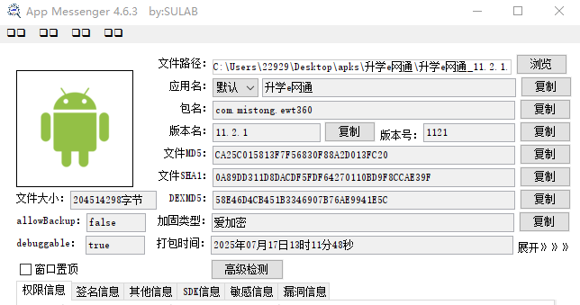
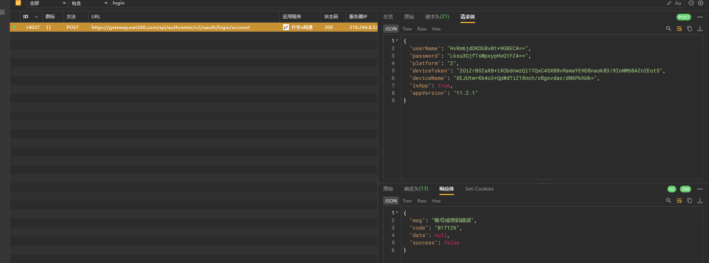
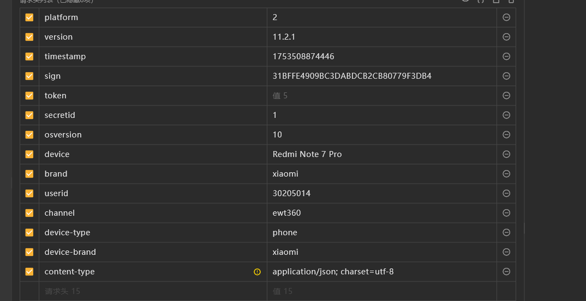

# app分析



爱加密

我们看看sdk

```bash
APK检测工具 - 扫描配置:
- 文件路径: 升学e网通_11.2.1.apk
- 检测类型: ROOT(true) 模拟器(true) 反调试(true) 代理(true) SDK(true) 硬编码(false) 证书(true)
- 最大文件大小: 500 MB
- 递归扫描: true
---------------------------------------------------
正在扫描APK文件: 升学e网通_11.2.1.apk

===================== 加固特征扫描结果 =====================

[加固特征]
    Other  爱加密企业版 -> assets/ijiami.ajm
    Other  爱加密 -> assets/ijiami.dat

===================== 安全检测特征扫描结果 =====================

[ROOT检测特征]
    classes2.dex -> /sbin/su (系统分区SU文件)
    classes2.dex -> /system/bin/su (系统内置SU)
    classes2.dex -> /system/sbin/su (系统分区备用SU路径)
    classes2.dex -> /system/xbin/su (常见SU存放路径)
    classes2.dex -> /vendor/bin/su (厂商分区SU文件)
    classes2.dex -> /system/xbin/ (常见Root工具目录（分段检测）)
    classes2.dex -> /vendor/bin/ (厂商Root工具目录（分段检测）)
    classes2.dex -> com.noshufou.android.su (Superuser官方包名)
    classes2.dex -> eu.chainfire.supersu (Chainfire SuperSU)
    classes2.dex -> com.kingroot.kinguser (KingRoot主程序)
    classes2.dex -> com.speedsoftware.rootexplorer (Root Explorer)
    classes2.dex -> com.keramidas.TitaniumBackup (钛备份)
    classes2.dex -> com.dianxinos.optimizer.duplay (点心Root)
    classes4.dex -> /data/local/bin/su (SU二进制文件常见路径)
    classes4.dex -> /data/local/su (SU二进制备用路径)
    classes4.dex -> /data/local/xbin/su (Xposed框架SU路径)
    classes4.dex -> /sbin/su (系统分区SU文件)
    classes4.dex -> /su/bin/su (Systemless SU路径)
    classes4.dex -> /system/bin/failsafe/su (故障安全模式SU)
    classes4.dex -> /system/bin/su (系统内置SU)
    classes4.dex -> /system/sd/xbin/su (SD卡扩展SU路径)
    classes4.dex -> /system/xbin/su (常见SU存放路径)
    classes4.dex -> /system/xbin/ (常见Root工具目录（分段检测）)
    classes9.dex -> /data/local/bin/su (SU二进制文件常见路径)
    classes9.dex -> /data/local/su (SU二进制备用路径)
    classes9.dex -> /data/local/xbin/su (Xposed框架SU路径)
    classes9.dex -> /sbin/su (系统分区SU文件)
    classes9.dex -> /su/bin/su (Systemless SU路径)
    classes9.dex -> /system/bin/failsafe/su (故障安全模式SU)
    classes9.dex -> /system/bin/su (系统内置SU)
    classes9.dex -> /system/sd/xbin/su (SD卡扩展SU路径)
    classes9.dex -> /system/xbin/su (常见SU存放路径)
    classes9.dex -> /system/xbin/ (常见Root工具目录（分段检测）)
    classes9.dex -> /vendor/bin/ (厂商Root工具目录（分段检测）)

[模拟器检测特征]
    classes2.dex -> test-keys (测试版系统特征)
    classes2.dex -> goldfish (Android模拟器内核标识)
    classes2.dex -> 000000000000000 (模拟器默认IMEI)
    classes2.dex -> /dev/socket/qemud (QEMU守护进程socket)
    classes2.dex -> /dev/qemu_pipe (QEMU管道通信接口)
    classes2.dex -> ro.kernel.qemu (QEMU内核属性标识)
    classes2.dex -> emulator (模拟器标识)
    classes3.dex -> 000000000000000 (模拟器默认IMEI)
    classes4.dex -> test-keys (测试版系统特征)
    classes4.dex -> goldfish (Android模拟器内核标识)
    classes4.dex -> 000000000000000 (模拟器默认IMEI)
    classes4.dex -> emulator (模拟器标识)
    classes4.dex -> eth0 (模拟器网络接口)
    classes8.dex -> 000000000000000 (模拟器默认IMEI)
    classes8.dex -> eth0 (模拟器网络接口)
    classes9.dex -> test-keys (测试版系统特征)
    classes9.dex -> goldfish (Android模拟器内核标识)
    classes9.dex -> 000000000000000 (模拟器默认IMEI)
    classes9.dex -> emulator (模拟器标识)

[反调试检测特征]
    classes9.dex -> ptrace (Ptrace调试检测)
    classes9.dex -> /proc/self/status (TracerPid状态检测)

[代理检测特征]
    classes10.dex -> Ljavax/net/ssl/X509TrustManager; (自定义证书信任管理器)
    classes2.dex -> Ljavax/net/ssl/X509TrustManager; (自定义证书信任管理器)
    classes3.dex -> Ljavax/net/ssl/X509TrustManager; (自定义证书信任管理器)
    classes4.dex -> Ljavax/net/ssl/X509TrustManager; (自定义证书信任管理器)
    classes6.dex -> Ljavax/net/ssl/X509TrustManager; (自定义证书信任管理器)
    classes7.dex -> Ljavax/net/ssl/X509TrustManager; (自定义证书信任管理器)
    classes9.dex -> Ljavax/net/ssl/X509TrustManager; (自定义证书信任管理器)

===================== 第三方SDK特征扫描结果 =====================

[Alibaba]
    阿里云短视频 SDK -> lib/arm64-v8a/libalivcffmpeg.so
    阿里云短视频 SDK -> lib/armeabi-v7a/libalivcffmpeg.so

[Aliyun]
    日志服务  SLS -> lib/arm64-v8a/libsls_producer.so
    日志服务  SLS -> lib/armeabi-v7a/libsls_producer.so

[Android]
    C++ 共享库 -> lib/arm64-v8a/libc++_shared.so
    C++ 共享库 -> lib/armeabi-v7a/libc++_shared.so

[Bilibili]
    IJKPlayer -> lib/arm64-v8a/libijkffmpeg.so
    IJKPlayer -> lib/arm64-v8a/libijkplayer.so
    IJKPlayer -> lib/arm64-v8a/libijksdl.so
    IJKPlayer -> lib/armeabi-v7a/libijkffmpeg.so
    IJKPlayer -> lib/armeabi-v7a/libijkplayer.so
    IJKPlayer -> lib/armeabi-v7a/libijksdl.so

[GNU]
    iconv -> lib/arm64-v8a/libiconv.so
    iconv -> lib/armeabi-v7a/libiconv.so

[Google]
    Flutter -> lib/arm64-v8a/libapp.so
    Flutter -> lib/arm64-v8a/libflutter.so
    Flutter -> lib/armeabi-v7a/libapp.so
    Flutter -> lib/armeabi-v7a/libflutter.so
    Jetpack Camera -> lib/arm64-v8a/libimage_processing_util_jni.so
    Jetpack Camera -> lib/armeabi-v7a/libimage_processing_util_jni.so
    Pdfium -> lib/arm64-v8a/libjniPdfium.so
    Pdfium -> lib/arm64-v8a/libmodft2.so
    Pdfium -> lib/arm64-v8a/libmodpdfium.so
    Pdfium -> lib/arm64-v8a/libmodpng.so
    Pdfium -> lib/armeabi-v7a/libjniPdfium.so
    Pdfium -> lib/armeabi-v7a/libmodft2.so
    Pdfium -> lib/armeabi-v7a/libmodpdfium.so
    Pdfium -> lib/armeabi-v7a/libmodpng.so

[Huawei]
    HMS Scan Kit -> lib/arm64-v8a/libscannative.so
    HMS Scan Kit -> lib/armeabi-v7a/libscannative.so

[Tencent]
    Bugly -> lib/arm64-v8a/libBugly_Native.so
    Bugly -> lib/arm64-v8a/libbugly_dumper.so
    Bugly -> lib/armeabi-v7a/libBugly_Native.so
    Bugly -> lib/armeabi-v7a/libbugly_dumper.so
    MMKV -> lib/arm64-v8a/libmmkv.so
    MMKV -> lib/armeabi-v7a/libmmkv.so
    腾讯云实时音视频 SDK -> lib/arm64-v8a/libtxsoundtouch.so
    腾讯云实时音视频 SDK -> lib/armeabi-v7a/libtxsoundtouch.so
    腾讯云短视频 SDK -> lib/arm64-v8a/libliteavsdk.so
    腾讯云短视频 SDK -> lib/arm64-v8a/libtxffmpeg.so
    腾讯云短视频 SDK -> lib/armeabi-v7a/libliteavsdk.so
    腾讯云短视频 SDK -> lib/armeabi-v7a/libtxffmpeg.so

[koral--]
    android-gif-drawable -> lib/arm64-v8a/libpl_droidsonroids_gif.so
    android-gif-drawable -> lib/armeabi-v7a/libpl_droidsonroids_gif.so

[spadix]
    ZBar -> lib/arm64-v8a/libzbar.so
    ZBar -> lib/armeabi-v7a/libzbar.so

[北京智游网安科技有限公司]
    爱加密 -> lib/arm64-v8a/libijm-emulator.so
    爱加密 -> lib/armeabi-v7a/libijm-emulator.so

[智齿科技]
    智齿客服 SDK -> lib/arm64-v8a/libsobot.so
    智齿客服 SDK -> lib/armeabi-v7a/libsobot.so

===================== 证书扫描结果 =====================

[证书文件: META-INF/WLEAVES.RSA]
    解析证书失败: x509: malformed tbs certificate

[证书文件: assets/license.crt]
    解析证书失败: x509: malformed certificate
	发现内嵌APK文件: res/origin.apk
	内嵌APK大小: 171.03 MB, 读取限制: 171.03 MB

===================== 加固特征扫描结果 =====================

[加固特征]
    Sopath  爱加密 -> assets/ijm_lib/armeabi/libexec.so
    Soname  爱加密 -> assets/ijm_lib/armeabi/libexecmain.so
    Soname  爱加密 -> assets/ijm_lib/arm64-v8a/libexecmain.so
    Soname  爱加密 -> assets/ijm_lib/x86/libexecmain.so
    Soname  爱加密 -> assets/ijm_lib/x86_64/libexecmain.so
    Soname  爱加密 -> assets/ijm_lib/armeabi/libexec.so
    Soname  爱加密 -> assets/ijm_lib/arm64-v8a/libexec.so
    Soname  爱加密 -> assets/ijm_lib/x86/libexec.so
    Soname  爱加密 -> assets/ijm_lib/x86_64/libexec.so
    Other  爱加密 -> assets/af.bin
    Other  爱加密 -> assets/signed.bin
    Other  爱加密 -> assets/ijiami.dat
    Sopath  爱加密5代壳 -> assets/libijmDataEncryption.so
    Soname  爱加密5代壳 -> assets/libijmDataEncryption.so
    Other  爱加密5代壳 -> assets/IJMDal.Data
    Other  爱加密企业版 -> assets/ijiami.ajm

===================== 安全检测特征扫描结果 =====================

===================== 第三方SDK特征扫描结果 =====================

[Alibaba]
    阿里云短视频 SDK -> lib/arm64-v8a/libalivcffmpeg.so
    阿里云短视频 SDK -> lib/armeabi-v7a/libalivcffmpeg.so

[Aliyun]
    日志服务  SLS -> lib/arm64-v8a/libsls_producer.so
    日志服务  SLS -> lib/armeabi-v7a/libsls_producer.so

[Android]
    C++ 共享库 -> lib/arm64-v8a/libc++_shared.so
    C++ 共享库 -> lib/armeabi-v7a/libc++_shared.so

[Bilibili]
    IJKPlayer -> lib/arm64-v8a/libijkffmpeg.so
    IJKPlayer -> lib/arm64-v8a/libijkplayer.so
    IJKPlayer -> lib/arm64-v8a/libijksdl.so
    IJKPlayer -> lib/armeabi-v7a/libijkffmpeg.so
    IJKPlayer -> lib/armeabi-v7a/libijkplayer.so
    IJKPlayer -> lib/armeabi-v7a/libijksdl.so

[GNU]
    iconv -> lib/arm64-v8a/libiconv.so
    iconv -> lib/armeabi-v7a/libiconv.so

[Google]
    Flutter -> lib/arm64-v8a/libapp.so
    Flutter -> lib/arm64-v8a/libflutter.so
    Flutter -> lib/armeabi-v7a/libapp.so
    Flutter -> lib/armeabi-v7a/libflutter.so
    Jetpack Camera -> lib/arm64-v8a/libimage_processing_util_jni.so
    Jetpack Camera -> lib/armeabi-v7a/libimage_processing_util_jni.so
    Pdfium -> lib/arm64-v8a/libjniPdfium.so
    Pdfium -> lib/arm64-v8a/libmodft2.so
    Pdfium -> lib/arm64-v8a/libmodpdfium.so
    Pdfium -> lib/arm64-v8a/libmodpng.so
    Pdfium -> lib/armeabi-v7a/libjniPdfium.so
    Pdfium -> lib/armeabi-v7a/libmodft2.so
    Pdfium -> lib/armeabi-v7a/libmodpdfium.so
    Pdfium -> lib/armeabi-v7a/libmodpng.so

[Huawei]
    HMS Scan Kit -> lib/arm64-v8a/libscannative.so
    HMS Scan Kit -> lib/armeabi-v7a/libscannative.so

[Tencent]
    Bugly -> lib/arm64-v8a/libBugly_Native.so
    Bugly -> lib/arm64-v8a/libbugly_dumper.so
    Bugly -> lib/armeabi-v7a/libBugly_Native.so
    Bugly -> lib/armeabi-v7a/libbugly_dumper.so
    MMKV -> lib/arm64-v8a/libmmkv.so
    MMKV -> lib/armeabi-v7a/libmmkv.so
    腾讯云实时音视频 SDK -> lib/arm64-v8a/libtxsoundtouch.so
    腾讯云实时音视频 SDK -> lib/armeabi-v7a/libtxsoundtouch.so
    腾讯云短视频 SDK -> lib/arm64-v8a/libliteavsdk.so
    腾讯云短视频 SDK -> lib/arm64-v8a/libtxffmpeg.so
    腾讯云短视频 SDK -> lib/armeabi-v7a/libliteavsdk.so
    腾讯云短视频 SDK -> lib/armeabi-v7a/libtxffmpeg.so

[koral--]
    android-gif-drawable -> lib/arm64-v8a/libpl_droidsonroids_gif.so
    android-gif-drawable -> lib/armeabi-v7a/libpl_droidsonroids_gif.so

[spadix]
    ZBar -> lib/arm64-v8a/libzbar.so
    ZBar -> lib/armeabi-v7a/libzbar.so

[北京智游网安科技有限公司]
    爱加密 -> assets/ijm_lib/arm64-v8a/libexec.so
    爱加密 -> assets/ijm_lib/arm64-v8a/libexecmain.so
    爱加密 -> assets/ijm_lib/armeabi/libexec.so
    爱加密 -> assets/ijm_lib/armeabi/libexecmain.so
    爱加密 -> assets/ijm_lib/x86/libexec.so
    爱加密 -> assets/ijm_lib/x86/libexecmain.so
    爱加密 -> assets/ijm_lib/x86_64/libexec.so
    爱加密 -> assets/ijm_lib/x86_64/libexecmain.so
    爱加密 -> assets/libijmDataEncryption.so
    爱加密 -> assets/libijmDataEncryption_arm64.so
    爱加密 -> assets/libijmDataEncryption_x86.so
    爱加密 -> assets/libijmDataEncryption_x86_64.so
    爱加密 -> lib/arm64-v8a/libijm-emulator.so
    爱加密 -> lib/armeabi-v7a/libijm-emulator.so

[智齿科技]
    智齿客服 SDK -> lib/arm64-v8a/libsobot.so
    智齿客服 SDK -> lib/armeabi-v7a/libsobot.so

===================== 证书扫描结果 =====================

[证书文件: assets/license.crt]
    解析证书失败: x509: malformed certificate

[证书文件: META-INF/MISTONG.RSA]
    解析证书失败: x509: malformed tbs certificate

```


dex文件很多，而且用了很多sdk；但是又用了flutter开发； 所以可能我们需要的参数可能在

- java层或者自写so层
- flutter的libapp.so层

而且有RSA文件，可能某些地方用到了，都需要注意一下；

用了很多视频的sdk，说明这里面视频比较多；结合app名字猜测是一个放网课之类的；

# 登录接口

## 抓包分析



响应体明文返回；

请求体：`userName`、`password`

另外两个device和设备有关系



请求头，主要是时间戳和签名

```bash
C:\Users\xxxx>python
Python 3.12.7 (tags/v3.12.7:0b05ead, Oct  1 2024, 03:06:41) [MSC v.1941 64 bit (AMD64)] on win32
Type "help", "copyright", "credits" or "license" for more information.
>>> "31BFFE4909BC3DABDCB2CB80779F3DB4".__len__()
32
```

签名像是md5


## sign

算法助手pro可以吐出来

`17535088744464dcc69ed56d6 -> 31bffe4909bc3dabdcb2cb80779f3db4 -> 转大写`

 调用堆栈

```python
at com.mistong.android.common.utils.m.k(EncryptUtils.java:12)
at com.mistong.android.common.utils.m.l(EncryptUtils.java:9)
at p9.c$a.intercept(GatewayClient.kt:35)
at com.mistong.android.http.okhttp.OkChain.proceed(OkChain.kt:80)
at r9.a.intercept(BlockInterceptor.kt:62)
at com.mistong.android.http.okhttp.OkChain.proceed(OkChain.kt:80)
at com.mistong.android.http.okhttp.InterceptorInterceptor.intercept(InterceptorInterceptor.kt:27)
at do.g.e(RealInterceptorChain.java:158)
at do.g.a(RealInterceptorChain.java:6)
at okhttp3.z.d(RealCall.java:115)
at okhttp3.z$b.k(RealCall.java:10)
at ao.c.run(NamedRunnable.java:16)
at java.util.concurrent.ThreadPoolExecutor.runWorker(ThreadPoolExecutor.java:1167)
at java.util.concurrent.ThreadPoolExecutor$Worker.run(ThreadPoolExecutor.java:641)
at java.lang.Thread.run(Thread.java:919)
```

明文内容

- 时间戳：`1753508874446`
- 盐：`4dcc69ed56d6`

python还原如下

```python
import hashlib


def calc_sign(timstamp_ms_str: str) -> str:
    salt_str = "4dcc69ed56d6"
    sign_str = timstamp_ms_str + salt_str
    return hashlib.md5(sign_str.encode("utf8")).hexdigest()
```


## username

先算法助手自吐一下

```python
AES/ECB/PKCS7Padding
加密密钥(String): eo^nye1j#!wt2%v)
加密内容(String): 1

加密结果(Base64): HvRm6jdOKDG8v0t+9G0ECA==

调用堆栈
    at com.mistong.android.common.utils.m.h(EncryptUtils.java:22)
    at com.mistong.android.common.utils.m.j(EncryptUtils.java:23)
    at og.g.U2(LoginPagePresenter.java:13)
    at com.mistong.ewt360.user.view.activity.LoginPageActivity.Aa(LoginPageActivity.java:63)
    at com.mistong.ewt360.user.view.activity.LoginPageActivity.ba(LoginPageActivity.java:47)
    at com.mistong.ewt360.user.view.activity.LoginPageActivity.Y8(LoginPageActivity.java:1)
    at com.mistong.ewt360.user.view.activity.b.invoke(R8$$SyntheticClass:6)
    at com.mistong.ewt360.user.view.dialog.BottomPrivacyDialog.d9(BottomPrivacyDialog.kt:11)
    at com.mistong.ewt360.user.view.dialog.BottomPrivacyDialog.V8(BottomPrivacyDialog.kt:1)
    at com.mistong.ewt360.user.view.dialog.f.onClick(R8$$SyntheticClass:2)
    at com.mistong.ewt360.core.mose.proxy.MosesClickListener.onClick(MosesClickListener.kt:4)
    at android.view.View.performClick(View.java:7189)
    at android.view.View.performClickInternal(View.java:7166)
    at android.view.View.access$3500(View.java:819)
    at android.view.View$PerformClick.run(View.java:27682)
    at android.os.Handler.handleCallback(Handler.java:883)
    at android.os.Handler.dispatchMessage(Handler.java:100)
    at android.os.Looper.loop(Looper.java:224)
    at android.app.ActivityThread.main(ActivityThread.java:7592)
    at java.lang.reflect.Method.invoke(Native Method)
    at com.android.internal.os.RuntimeInit$MethodAndArgsCaller.run(RuntimeInit.java:539)
    at com.android.internal.os.ZygoteInit.main(ZygoteInit.java:950)
```

重新抓包，发现值不变，说明key也不便咯


## password

同样，算法助手自吐

```python
AES/ECB/PKCS7Padding
加密密钥(String): eo^nye1j#!wt2%v)
加密内容(String): 123456

加密结果(Base64): Lkxu3GjfTsWpxypHoQ1FZA==

调用堆栈
        at com.mistong.android.common.utils.m.h(EncryptUtils.java:22)
        at com.mistong.android.common.utils.m.i(EncryptUtils.java:14)
        at og.g.U2(LoginPagePresenter.java:26)
        at com.mistong.ewt360.user.view.activity.LoginPageActivity.Aa(LoginPageActivity.java:63)
        at com.mistong.ewt360.user.view.activity.LoginPageActivity.ba(LoginPageActivity.java:47)
        at com.mistong.ewt360.user.view.activity.LoginPageActivity.Y8(LoginPageActivity.java:1)
        at com.mistong.ewt360.user.view.activity.b.invoke(R8$$SyntheticClass:6)
        at com.mistong.ewt360.user.view.dialog.BottomPrivacyDialog.d9(BottomPrivacyDialog.kt:11)
        at com.mistong.ewt360.user.view.dialog.BottomPrivacyDialog.V8(BottomPrivacyDialog.kt:1)
        at com.mistong.ewt360.user.view.dialog.f.onClick(R8$$SyntheticClass:2)
        at com.mistong.ewt360.core.mose.proxy.MosesClickListener.onClick(MosesClickListener.kt:4)
        at android.view.View.performClick(View.java:7189)
        at android.view.View.performClickInternal(View.java:7166)
        at android.view.View.access$3500(View.java:819)
        at android.view.View$PerformClick.run(View.java:27682)
        at android.os.Handler.handleCallback(Handler.java:883)
        at android.os.Handler.dispatchMessage(Handler.java:100)
        at android.os.Looper.loop(Looper.java:224)
        at android.app.ActivityThread.main(ActivityThread.java:7592)
        at java.lang.reflect.Method.invoke(Native Method)
        at com.android.internal.os.RuntimeInit$MethodAndArgsCaller.run(RuntimeInit.java:539)
        at com.android.internal.os.ZygoteInit.main(ZygoteInit.java:950)
```

和username一样


## deviceToken

算法助手自吐

```python
AES/ECB/PKCS7Padding
加密密钥(String): eo^nye1j#!wt2%v)
加密内容(String): 04420ef3-9f01-3a40-94ec-6771ba52fdd5
加密结果(Base64): 2OiZrBSIaX8+iXObdnwzQi1TQxC4SXBBvRamaYEHO8naokB3/9IoNM6BAZn2Eot5

调用堆栈
        at com.mistong.android.common.utils.m.h(EncryptUtils.java:22)
        at com.mistong.android.common.utils.m.j(EncryptUtils.java:23)
        at og.g.U2(LoginPagePresenter.java:51)
        at com.mistong.ewt360.user.view.activity.LoginPageActivity.Aa(LoginPageActivity.java:63)
        at com.mistong.ewt360.user.view.activity.LoginPageActivity.ba(LoginPageActivity.java:47)
        at com.mistong.ewt360.user.view.activity.LoginPageActivity.Y8(LoginPageActivity.java:1)
        at com.mistong.ewt360.user.view.activity.b.invoke(R8$$SyntheticClass:6)
        at com.mistong.ewt360.user.view.dialog.BottomPrivacyDialog.d9(BottomPrivacyDialog.kt:11)
        at com.mistong.ewt360.user.view.dialog.BottomPrivacyDialog.V8(BottomPrivacyDialog.kt:1)
        at com.mistong.ewt360.user.view.dialog.f.onClick(R8$$SyntheticClass:2)
        at com.mistong.ewt360.core.mose.proxy.MosesClickListener.onClick(MosesClickListener.kt:4)
        at android.view.View.performClick(View.java:7189)
        at android.view.View.performClickInternal(View.java:7166)
        at android.view.View.access$3500(View.java:819)
        at android.view.View$PerformClick.run(View.java:27682)
        at android.os.Handler.handleCallback(Handler.java:883)
        at android.os.Handler.dispatchMessage(Handler.java:100)
        at android.os.Looper.loop(Looper.java:224)
        at android.app.ActivityThread.main(ActivityThread.java:7592)
        at java.lang.reflect.Method.invoke(Native Method)
        at com.android.internal.os.RuntimeInit$MethodAndArgsCaller.run(RuntimeInit.java:539)
        at com.android.internal.os.ZygoteInit.main(ZygoteInit.java:950)
```

像是个uuid加密


## deviceName

```python
AES/ECB/PKCS7Padding
加密密钥(String): eo^nye1j#!wt2%v)
加密内容(String): xiaomi Redmi Note 7 Pro

加密结果(Base64): XEJUtwrKb4o3+QpWdTiZ18nch/xBgxvdaz/dN6PkhUk=
调用堆栈
        at com.mistong.android.common.utils.m.h(EncryptUtils.java:22)
        at com.mistong.android.common.utils.m.j(EncryptUtils.java:23)
        at og.g.U2(LoginPagePresenter.java:88)
        at com.mistong.ewt360.user.view.activity.LoginPageActivity.Aa(LoginPageActivity.java:63)
        at com.mistong.ewt360.user.view.activity.LoginPageActivity.ba(LoginPageActivity.java:47)
        at com.mistong.ewt360.user.view.activity.LoginPageActivity.Y8(LoginPageActivity.java:1)
        at com.mistong.ewt360.user.view.activity.b.invoke(R8$$SyntheticClass:6)
        at com.mistong.ewt360.user.view.dialog.BottomPrivacyDialog.d9(BottomPrivacyDialog.kt:11)
        at com.mistong.ewt360.user.view.dialog.BottomPrivacyDialog.V8(BottomPrivacyDialog.kt:1)
        at com.mistong.ewt360.user.view.dialog.f.onClick(R8$$SyntheticClass:2)
        at com.mistong.ewt360.core.mose.proxy.MosesClickListener.onClick(MosesClickListener.kt:4)
        at android.view.View.performClick(View.java:7189)
        at android.view.View.performClickInternal(View.java:7166)
        at android.view.View.access$3500(View.java:819)
        at android.view.View$PerformClick.run(View.java:27682)
        at android.os.Handler.handleCallback(Handler.java:883)
        at android.os.Handler.dispatchMessage(Handler.java:100)
        at android.os.Looper.loop(Looper.java:224)
        at android.app.ActivityThread.main(ActivityThread.java:7592)
        at java.lang.reflect.Method.invoke(Native Method)
        at com.android.internal.os.RuntimeInit$MethodAndArgsCaller.run(RuntimeInit.java:539)
        at com.android.internal.os.ZygoteInit.main(ZygoteInit.java:950)
```

分成两部分：

- 手机品牌 brand
- 手机具体型号 model