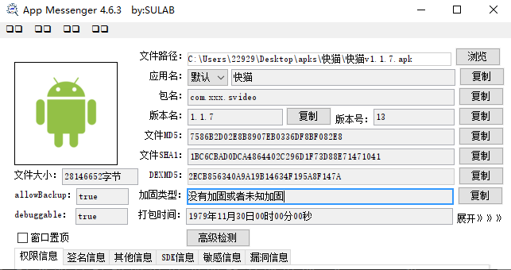
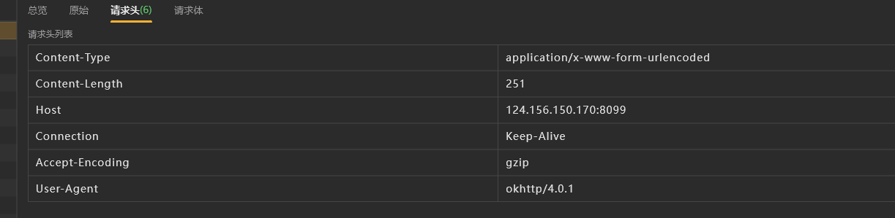
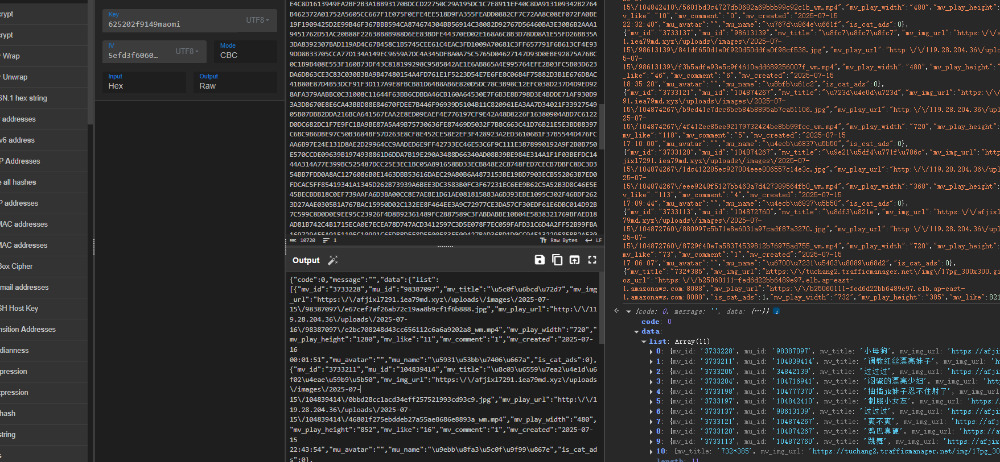

懂得都懂

# 抓包分析

抓个包看看

看看请求头

没啥东西

这个ua有点用，告诉我们是okhttp说明这个是java层发包的

如果是dart一般就是flutter开发的app了

> 这个对于瑟瑟app的逆向很有帮助

请求体和响应体

请求体的data，响应体都是加密的

我们看 https://www.bilibili.com/video/BV198unzREkm 

其实知道了是aes加密，而且是java层的，我们直接算法助手pro就行

所以这篇文章主要是这个sig

# 参数分析

## 请求头data

算法助手pro搜到了，aes加密

- 明文：`{"email":"161661615@qq.com","password":"shhdhsjs"}`
- 密钥：`6252********`
- IV：`5efd3*******`

- 加密结果（**hex**）：`9928ef89df484************************************************************************************2eb214633d618757f4787acf733fb86b996e1` 大写

## 请求体

和上面一样，同样的key和iv

密文：数据包转小写`b08020d0facfdaf81db468************************************************************************************88112d8467fd688c79cc7ea83f27440577350e8168c2560368616` 

明文：`{"code":1,"message":"\u5bc6\u7801\u9519\u8bef","data":[]}`

## sig

算法助手md5

明文：`_app_version=1.1.7&_device_type=RedmiNote7Pro&_device_version=10&_sdk_version=29&data=9928EF89DF48************************************************************************************F733FB86B996E1maomi_pass_xyz`

签名：`1516017c777*******5c757ed3e5f8b3`

这里的明文：数据包请求体参数排序后拼接，然后加一个 `maomi_pass_xyz`

接下来去找下别的接口

视频的评论，《真白》

> 大晚上看的，确实白啊

我这里点了 `广场` 获取视频

然后解密一下，懂得都懂

图片随便看，视频不能放

视频需要额外更改一下域名才能正常访问，比如我这个版本的是 `https://bjf***hew.wt***7.xyz/`  

然后拼接链接的后续部分就可以了

