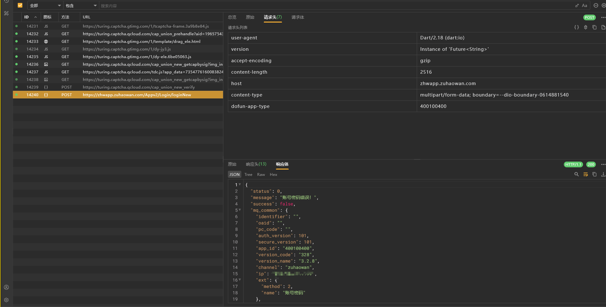

# app分析

这个app是群友投稿给我的，他做的单子；


有个网易易盾的壳

用专业工具检测一下

```bash
APK检测工具 - 扫描配置:
- 文件路径: 掌上商软.apk
- 检测类型: ROOT(true) 模拟器(true) 反调试(true) 代理(true) SDK(true) 硬编码(false) 证书(true)
- 最大文件大小: 500 MB
- 递归扫描: true
---------------------------------------------------
正在扫描APK文件: 掌上商软.apk

===================== 加固特征扫描结果 =====================

[加固特征]
    Soname  网易易盾 -> lib/armeabi-v7a/libnesec.so
    Soname  网易易盾 -> lib/arm64-v8a/libnesec.so

===================== 安全检测特征扫描结果 =====================

[ROOT检测特征]
    classes.dex -> /data/local/bin/su (SU二进制文件常见路径)
    classes.dex -> /data/local/su (SU二进制备用路径)
    classes.dex -> /data/local/xbin/su (Xposed框架SU路径)
    classes.dex -> /sbin/su (系统分区SU文件)
    classes.dex -> /su/bin/su (Systemless SU路径)
    classes.dex -> /system/app/Superuser.apk (Superuser安装包)
    classes.dex -> /system/bin/failsafe/su (故障安全模式SU)
    classes.dex -> /system/bin/su (系统内置SU)
    classes.dex -> /system/sd/xbin/su (SD卡扩展SU路径)
    classes.dex -> /system/xbin/daemonsu (SuperSU守护进程)
    classes.dex -> /system/xbin/su (常见SU存放路径)
    classes.dex -> Superuser.apk (Superuser安装包（分段检测）)
    classes.dex -> /system/xbin/ (常见Root工具目录（分段检测）)
    classes.dex -> com.koushikdutta.superuser (Koush's Superuser)
    classes.dex -> com.noshufou.android.su (Superuser官方包名)
    classes.dex -> com.thirdparty.superuser (第三方Superuser应用)
    classes.dex -> eu.chainfire.supersu (Chainfire SuperSU)
    classes.dex -> de.robv.android.xposed.installer (Xposed安装器)

[模拟器检测特征]
    classes.dex -> test-keys (测试版系统特征)
    classes.dex -> goldfish (Android模拟器内核标识)
    classes.dex -> 000000000000000 (模拟器默认IMEI)
    classes.dex -> /dev/socket/qemud (QEMU守护进程socket)
    classes.dex -> /dev/qemu_pipe (QEMU管道通信接口)
    classes.dex -> ro.kernel.qemu (QEMU内核属性标识)
    classes.dex -> emulator (模拟器标识)
    classes.dex -> 10.0.2.15 (默认NAT网关IP)
    classes.dex -> eth0 (模拟器网络接口)
    classes.dex -> dns.google (模拟器默认DNS)

[反调试检测特征]
    classes.dex -> com.android.internal.os.ZygoteInit (Zygote初始化检测)
    classes.dex -> com.saurik.substrate.MS$2 (Substrate框架检测)
    classes.dex -> de.robv.android.xposed.XposedBridge (Xposed框架检测)
    classes.dex -> ro.debuggable (系统调试属性检测)
    classes.dex -> ptrace (Ptrace调试检测)
    classes.dex -> /proc/self/status (TracerPid状态检测)
    classes.dex -> com.saurik.substrate (Substrate框架检测)

[代理检测特征]
    classes.dex -> Lokhttp3/internal/proxy/NullProxySelector; (OkHttp空代理选择器)
    classes.dex -> Ljavax/net/ssl/X509TrustManager; (自定义证书信任管理器)

===================== 第三方SDK特征扫描结果 =====================

[Android]
    C++ 共享库 -> lib/arm64-v8a/libc++_shared.so
    C++ 共享库 -> lib/armeabi-v7a/libc++_shared.so

[Baidu]
    Paddle Lite -> lib/arm64-v8a/libpaddle_light_api_shared.so
    Paddle Lite -> lib/armeabi-v7a/libpaddle_light_api_shared.so
    百度人脸识别 -> lib/arm64-v8a/libbd_unifylicense.so
    百度人脸识别 -> lib/arm64-v8a/libbdface_sdk.so
    百度人脸识别 -> lib/arm64-v8a/libliantian.so
    百度人脸识别 -> lib/armeabi-v7a/libbd_unifylicense.so
    百度人脸识别 -> lib/armeabi-v7a/libbdface_sdk.so
    百度人脸识别 -> lib/armeabi-v7a/libliantian.so

[Bytedance]
    火山引擎云手机 SDK -> lib/arm64-v8a/libvegamearm64-v8a.so

[FFmpeg]
    FFmpeg -> lib/arm64-v8a/libavcodec.so
    FFmpeg -> lib/arm64-v8a/libavdevice.so
    FFmpeg -> lib/arm64-v8a/libavfilter.so
    FFmpeg -> lib/arm64-v8a/libavformat.so
    FFmpeg -> lib/arm64-v8a/libavutil.so
    FFmpeg -> lib/arm64-v8a/libswresample.so
    FFmpeg -> lib/arm64-v8a/libswscale.so
    FFmpeg -> lib/armeabi-v7a/libavcodec.so
    FFmpeg -> lib/armeabi-v7a/libavdevice.so
    FFmpeg -> lib/armeabi-v7a/libavfilter.so
    FFmpeg -> lib/armeabi-v7a/libavformat.so
    FFmpeg -> lib/armeabi-v7a/libavutil.so
    FFmpeg -> lib/armeabi-v7a/libswresample.so
    FFmpeg -> lib/armeabi-v7a/libswscale.so

[Google]
    Conscrypt -> lib/arm64-v8a/libconscrypt_jni.so
    Conscrypt -> lib/armeabi-v7a/libconscrypt_jni.so
    Flutter -> lib/arm64-v8a/libapp.so
    Flutter -> lib/arm64-v8a/libflutter.so
    Flutter -> lib/armeabi-v7a/libapp.so
    Flutter -> lib/armeabi-v7a/libflutter.so
    Jetpack Camera -> lib/arm64-v8a/libimage_processing_util_jni.so
    Jetpack Camera -> lib/armeabi-v7a/libimage_processing_util_jni.so

[Netease]
    网易易盾 -> lib/arm64-v8a/libnesec-x86.so
    网易易盾 -> lib/arm64-v8a/libnesec.so
    网易易盾 -> lib/armeabi-v7a/libnesec-x86.so
    网易易盾 -> lib/armeabi-v7a/libnesec.so

[Tencent]
    Bugly -> lib/arm64-v8a/libBugly-webank.so
    Bugly -> lib/armeabi-v7a/libBugly-webank.so
    腾讯优图 SDK -> lib/arm64-v8a/libYTCommonLiveness.so
    腾讯优图 SDK -> lib/arm64-v8a/libYTLiveness.so
    腾讯优图 SDK -> lib/armeabi-v7a/libYTCommonLiveness.so
    腾讯优图 SDK -> lib/armeabi-v7a/libYTLiveness.so

[asLody]
    Sandhook -> lib/arm64-v8a/libsandhook.so
    Sandhook -> lib/armeabi-v7a/libsandhook.so

[koral--]
    android-gif-drawable -> lib/arm64-v8a/libpl_droidsonroids_gif.so
    android-gif-drawable -> lib/armeabi-v7a/libpl_droidsonroids_gif.so

===================== 证书扫描结果 =====================

[证书文件: assets/ag_sdk_cbg_root.cer]
    主题: CN=Huawei CBG Root CA,OU=Huawei CBG,O=Huawei,C=CN
    发行者: CN=Huawei CBG Root CA,OU=Huawei CBG,O=Huawei,C=CN
    序列号: 62C2CB4DE8405E96
    有效期: 2017-08-21 10:56:27 至 2042-08-15 10:56:27
    签名算法: SHA256-RSA
    SHA1指纹: AAC4D37947E86E236BEFF0A96C22733D7A1969A1
    密钥用途: 证书签名

[证书文件: META-INF/SHANGHUB.RSA]
    解析证书失败: x509: malformed tbs certificate

```

确实是网易易盾，可能有frida检测，不过一般的server好像就能过；

代码看不了，需要脱壳才能看；而且注意到用了flutter框架，加上朋友告诉我他的核心参数都在flutter中，所以这里懒得脱壳了；

注意到这个app，有很多sdk，什么人脸/视频/地图，再根据名字猜测，应该是类似超市那种app；


# 登录接口

## 抓包分析



请求头和响应体没啥东西，而且看到是dart的ua，说明基本上就是在libapp.so中发包的；

注意到这里还有个multipart/form-data


这里面参数很多，主要的有

- username，明文
- password，明文
- sign：不确定是什么签名
- signature：不确定是什么签名
- randstr：看名字就知道是随机
- signature_nonce：这个nonce一般就是随机的


## sign

猜测是md5

```bash
C:\Users\xxx>python
Python 3.12.7 (tags/v3.12.7:0b05ead, Oct  1 2024, 03:06:41) [MSC v.1941 64 bit (AMD64)] on win32
Type "help", "copyright", "credits" or "license" for more information.
>>> "a1662cbd286c78a611d3acde7eb3085b".__len__()
32
```


