app是找群友要的；

# app分析

先看看信息

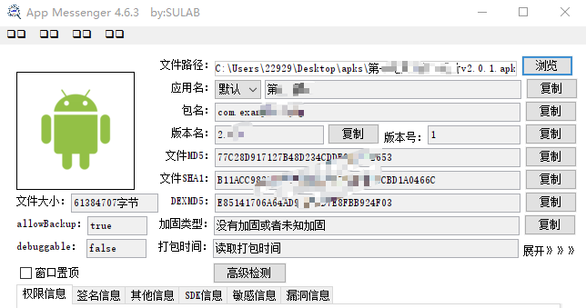

然后上专业工具看一下sdk之类的

```bash
C:\software\ApkCheck\ApkCheckPack_windows_amd64.exe -f ***v2***.apk > ***v2***--app分析.txt

APK检测工具 - 扫描配置:
- 文件路径: ***v2***.apk
- 检测类型: ROOT(true) 模拟器(true) 反调试(true) 代理(true) SDK(true) 硬编码(false) 证书(true)
- 最大文件大小: 500 MB
- 递归扫描: true
---------------------------------------------------
正在扫描APK文件: ***v2***.apk

===================== 加固特征扫描结果 =====================

未发现加固特征

===================== 安全检测特征扫描结果 =====================

[模拟器检测特征]
    classes.dex -> goldfish (Android模拟器内核标识)
    classes.dex -> emulator (模拟器标识)

[代理检测特征]
    classes.dex -> Ljavax/net/ssl/X509TrustManager; (自定义证书信任管理器)

===================== 第三方SDK特征扫描结果 =====================

[Google]
    Flutter -> lib/arm64-v8a/libapp.so
    Flutter -> lib/arm64-v8a/libflutter.so
    Flutter -> lib/armeabi-v7a/libapp.so
    Flutter -> lib/armeabi-v7a/libflutter.so
    Flutter -> lib/x86_64/libapp.so
    Flutter -> lib/x86_64/libflutter.so

[Huawei]
    HMS Scan Kit -> lib/arm64-v8a/libscannative.so
    HMS Scan Kit -> lib/armeabi-v7a/libscannative.so

[Mpv]
    LibMpv -> lib/arm64-v8a/libmpv.so
    LibMpv -> lib/armeabi-v7a/libmpv.so
    LibMpv -> lib/x86/libmpv.so
    LibMpv -> lib/x86_64/libmpv.so

===================== 证书扫描结果 =====================

[!] 未发现证书文件

```

开发一个视频软件，又没用啥sdk，而且这里还是flutter开发的，那么大概率核心功能在`libapp.so`中；


# 搜索接口和获取评论接口

## 抓包分析

这种app基本上没啥特别的加密，也就是用个flutter框架稍微限制下，开发者也不太会flutter的混淆等其他操作，所以比较简单；

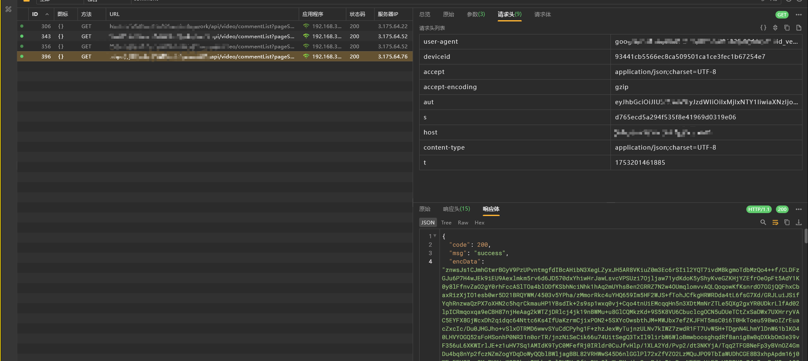

这里以视频评论的包来进行分析；请求头没啥玩意儿，看起来可疑的有 `aut`、`s`

但是与其他包对比发现，aut不变，s参数偶尔会变，主要是启动app的时候；

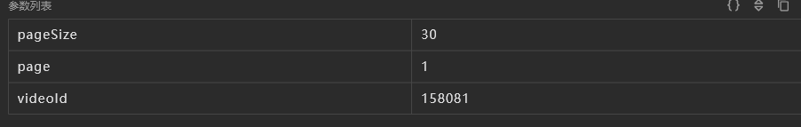

请求参数就是和视频有关的了，没啥值得说的；没有请求体；

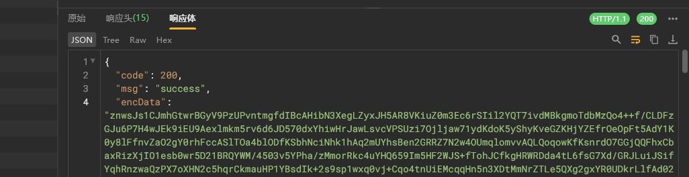

响应体有一个encData


我们再看看搜索接口

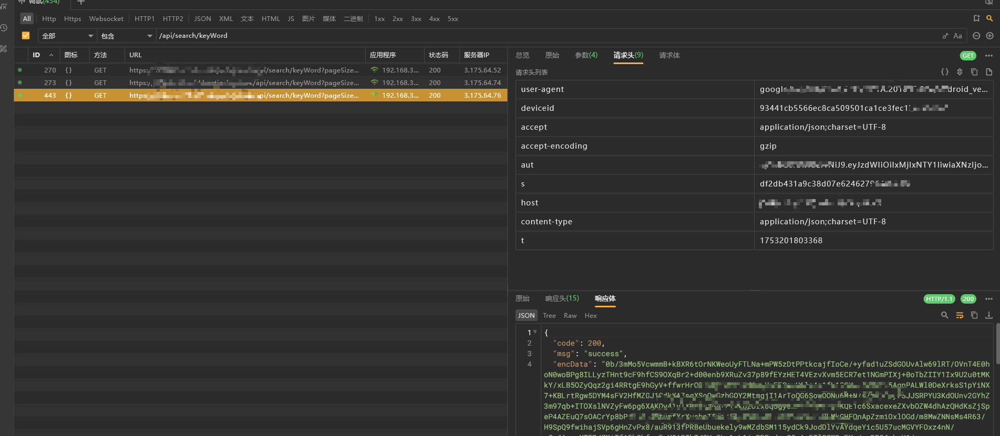

也是一样；

那我们主要去逆向一下这个响应体解密


## encData

先去jadx看看，能不能搜到

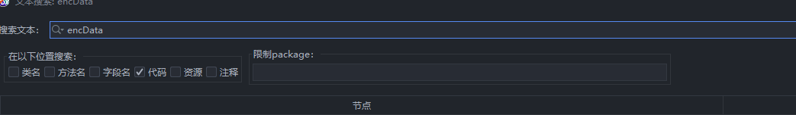

毛都没一根，所以直接去libapp.so找就行；

在加载libapp.so的过程中，我们用blutter还原一下符号；

> 这个app使用flutter并没有进行混淆或者其他恶心的操作，所以拿来学习是比较合适的；

打开 `x64 Native Tools Command Prompt for VS 2022`

```cmd
# 激活python虚拟环境，如果用的是全局可跳过
C:\codes\reverse\.venv\Scripts\activate
# 进入blutter目录
cd C:\codes\reverse\blutter
# 执行blutter脚本，这里的arm64是存储libapp.so和libflutter.so
python blutter.py xxx\xxxxxxx\arm64 xxx\xxxxxxx\out 
```

然后等待libapp.so加载完毕，之后ida导入脚本，能看到左侧函数表符号被还原大半就行；


搜下字符串，看看有没有这个变量用于定位

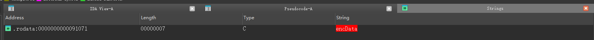

这里存在这个字符串，但是没有生成变量，所以只能确认libapp.so大概率用了这个；

接下来分析算法特点，首先是密文要能被解密，那么可能是 纯编码&对称&非对称算法；

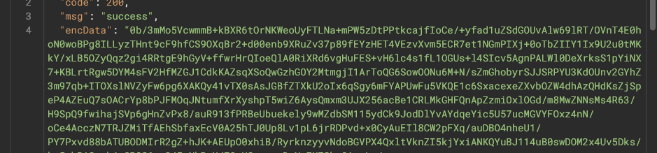

一个一个来，首先看这个样子就像是b64；我们拿去解一下试试，虽然肯定不行（）

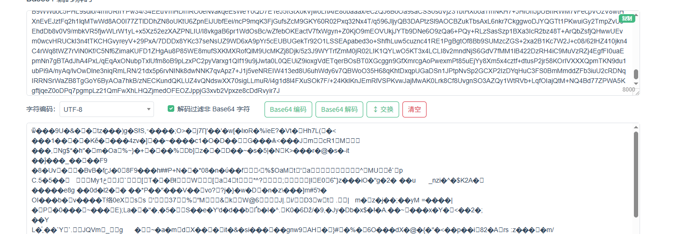

utf8解不了，那基本就只能解hex了

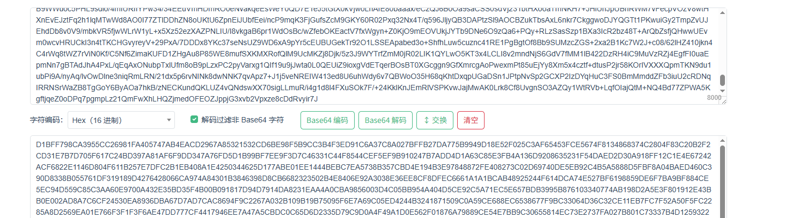

接下来排除对称和非对称；很明显非对称容易排除；


前面的工具扫了，没找到证书，而flutter开发一般是会把证书丢在文件夹下的，没有的话大概率就没有用非对称了；

当然，也可以硬编码，不过概率小了很多；于是跳过；


接下来分析对称，无非就是des，3des，aes，sm4这些，那么哪种使用比例并且容易实现呢，肯定是aes了

接下来学习一下flutter中如何实现aes


正向开发一般使用的是  `encrypt` 加密库

支持很多模式，`CBC` `ECB` `CFB-64` `OFB-64` `SIC`

```dart
class AESUtil {
    static String generateAES(String data, String keyStr, String ivStr) {
        final plainText = data;
        final key = Key.fromUtf8(keyStr);
        final iv = IV.fromUtf8(ivStr);
        final encrypter = Encrypter(AES(key, mode: AESMode.cbc));// 指定使用CBC模式(AES/CBC/PKCS5PADDING)
        final encrypted = encrypter.encrypt(plainText, iv: iv);
        // final encrypter = Encrypter(AES(key, mode: AESMode.cbc)); 默认是AESMode.sic
        // final encrypter = Encrypter(AES(key, mode: AESMode.cbc, padding: null)); // NoPadding

        print("generateAES:" + encrypted.base64);
        return encrypted.base64;
    }
}
```

这里的key是通过AES传的；iv和明文是通过encrypt传的；


下面给出逆向方法，以及一个案例的截图

1. 首先要判断出AES

   > 根据AES算法特点, **bytes字节数是16的倍数** ; 这只能代表可能是AES

2. 搜AES寻找 `encrypt` `encryptBytes` `convert` 之类的;

   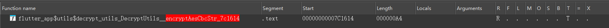

   > 目的是寻找key和iv

   

   > 这里就能找到key&iv了,按道理也能找到明文; 不过这里都只是初始化函数, 我们可以hook更直接的加密函数;
   >
   > hook这里涉及到的函数就能找到mode了;

   或者在去找这里的 `encrypt` 然后交叉引用找到AES验证顺便找key和iv

   > 这里的 `encrypt` 一般是为了找aes明文的

   

   这个一般会继续调用 `encryptBytes`

   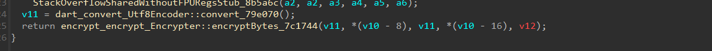

   继续跟

   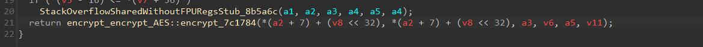

   这几个 `encrypt` 函数都包含了明文,找一个方便的就行; 解密同理，换成 `decrypt`就行


接下来就来实战分析吧，搜下aes

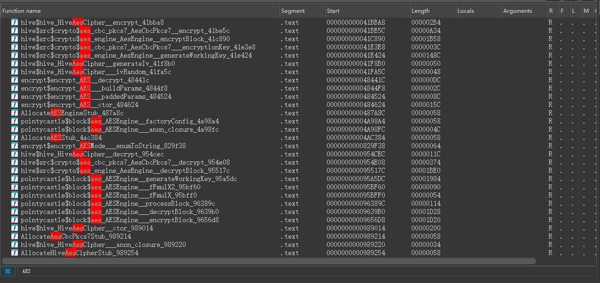

正好看见了个 `encrypt$` ，这代表这个app用了 `encrypt` 库，而且用了AES

接下来我们找一个比较可疑的就行，就 `encrypt$encrypt_AES__decrypt_48441c`就行

接下来就是hook确认是否走这里了；验证过确实走了这里；

那么就按X寻找调用，也可以hook打印调用栈；

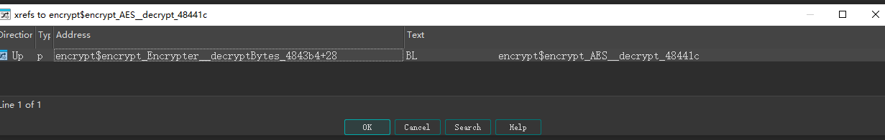

有的，我们跳过去

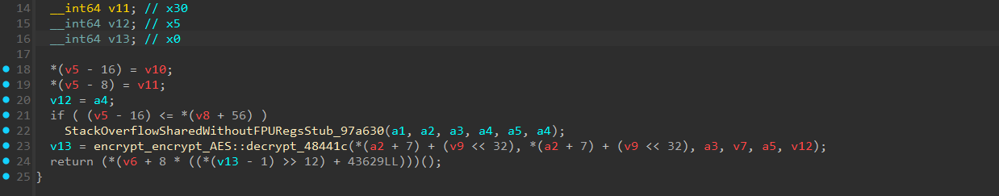

感觉没啥东西，继续跳

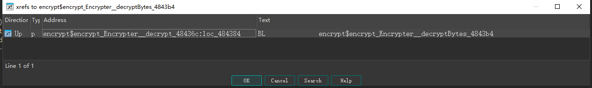

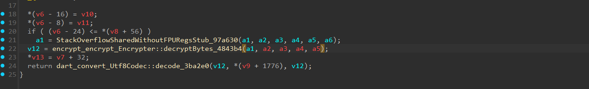

这里也没看到aes，继续跳

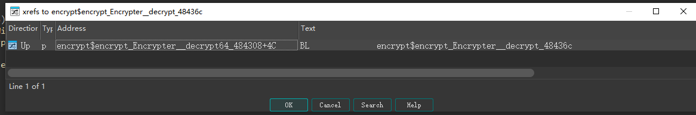

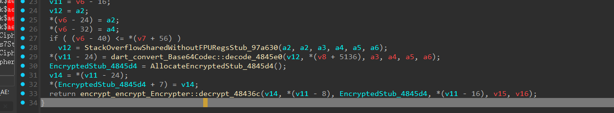

这里看到了b64了，其实可疑hook看一下哪个参数是明文；这里测试发现是a3；

但是我们没有发现aes以及设置key和iv的地方，继续跟

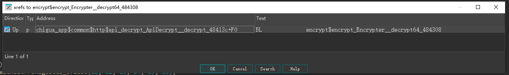

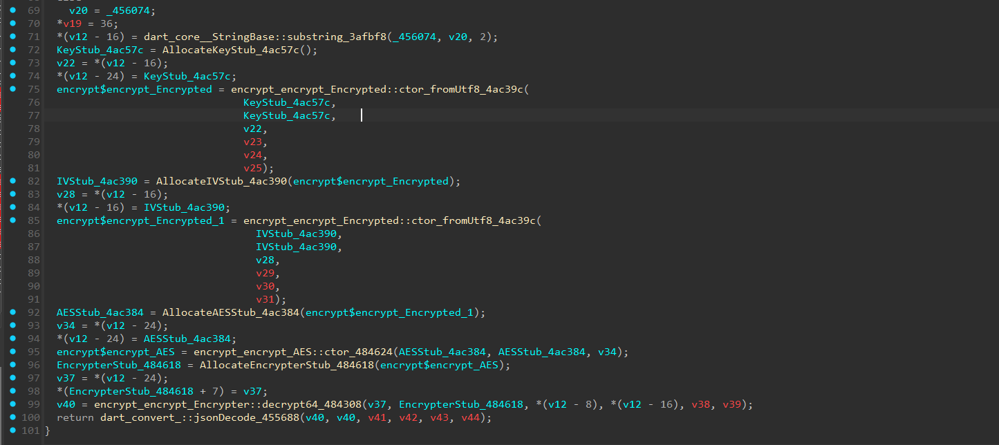

这里其实就是了，你如果调过来肯定有些函数没参数，需要点进去然后退出来F5；

然后我们去hook这个 `fromUtf8` 也行；然后hook这个就能拿到key和iv了，我们去解密工具中试一下就知道了；

目前已知，密文用了b64编码，然后走的大概率是aes/cbc，然后从抓包中扣个密文过来就行

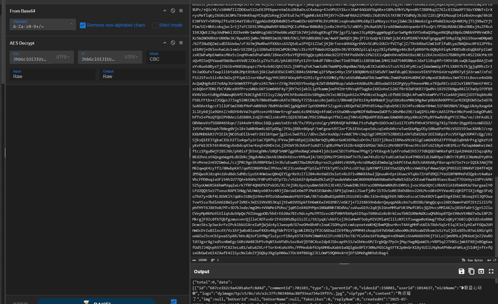

因为特别原因，这里的密文解密后的明文就只展示一部分；ok至此就搞定了，试试其他接口吧；

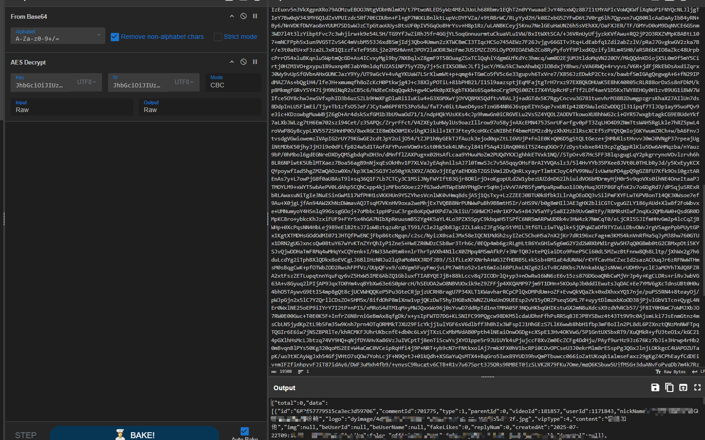

评论接口也是没问题的；收工！

这个app没啥难度，如果你确实需要，可以加星球获取资料；

