# 绕过frida反调试

思路：

1. 找到检测的so文件
2. 找到hook时机
3. 找到so中检测点
4. hook掉关键函数


## 确定检测的so

使用版本: v7.98.0 ，包名 `com.douban.frodo` 

1. hook修改了内存中的函数就报错，程序闪退

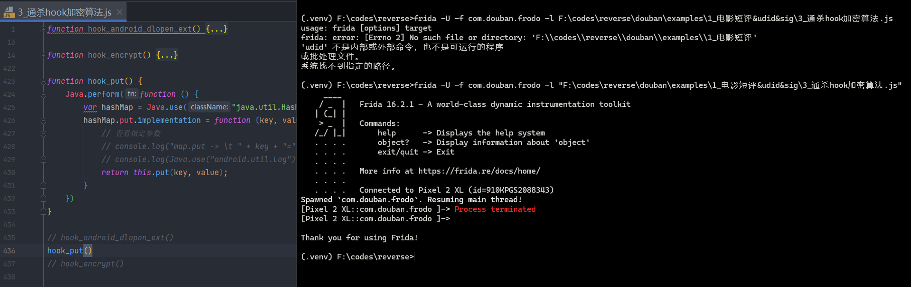

2. 我们不hook，正常使用就没问题 

   说明存在frida检测，我们看一下加载到哪个so文件的时候程序闪退

3. 定位具体so文件

我们需要去hook安卓的dlopen【负责加载so】，这在libdl.so中


hook脚本如下


发现是 `libmsaoaidsec.so` 没有leave


## 尝试删除so

我们测试发现，这个so文件不能删除，删除之后就打不开软件了


那我们需要保证这个so正确加载的同时，又不检测到我们的frida

所以需要手动去hook过一下检测


## 确定hook点

[Android-so加载流程剖析](https://www.jianshu.com/p/9b7202786803)

先了解一下java如何导入的so以及加载流程


### dlopen&jni_onload

我们hook一下dlopen，加载的时候打印，退出的时候打印顺便看一下jni_onload有没有加载


这里ida中是由jni_onload的


发现没有打印jni_onload，甚至onleave都没有，说明


在这个过程中进行了反调试；这张图的逻辑不够好，我们用自己分析的源码流程


准确的是这样，其实就是dlopen加载的过程中，调用了初始化函数，然后创建了检测线程

所以我们hook这个 call_constructors

因为这个函数是把so读到内存后立马执行的函数，这一步代表已经有了so了；

那已经有了so的基地址，我们就顺便打印一下


正常退出了，说明 call_constructors函数的初始化函数成功了，


说明断在这里了，但是我们的jni_onload是在ida中查看是正常存在的。

说明他在前面的的初始化函数中并没有直接检测退出，而是将检测函数丢给创建的线程，从而来进行执行检测。


我们阅读源码可知，这里要hook初始化函数

## hook一下so初始化函数

call_constructors函数

- 去手机中在找到`call_constructors`的offset

```bash
readelf -sW /apex/com.android.runtime/bin/linker64 | grep call_constructors
```


-> `4a258` 


分析到这里了，懒得写了，去看b站视频吧，相对清晰一点....


## 定位检测位置

如何查看加载的线程，`libc.so` 中有一个函数叫 `pthread_create`


我们hook一下，拿到创建的线程

看一下参数，我们需要拿第三个参数，拿到执行函数的地址；

我们与so文件的基地址做偏移计算，就能找到检测函数了


顺利的话


豆瓣的这个so反而结果不是这样


而是这样，这说明了还没创建线程就被杀掉了；

我们仔细观察发现call_constructors并不是所有的都返回了

我们阅读源码可知。call_constructors内部也调用了call_constructors，也就是存在递归处理；


call_constructors源代码如上，这说明了

最外层的call_constructors给他的children都执行了初始化函数之后，还额外做了一些操作，

- 比如在init或者init_array中初始检测了一次frida之后才执行完自身的call_constructors


进入ida搜一下init


点进去


随便翻翻就发现有很明显的frida特征检测；所以我们只要过掉这个函数的检测就可以让他创建后续的线程了

而这个init函数的流程图非常难绷，不想挨个去读


代码很明显混淆了，我们把代码交给ai


我们去看一下这几个关键函数

一个一个来吧


## init_proc绕过分析

### 123f0 

**获取当前 Android 系统的 SDK 版本号**


### 12550


### 95c8

代码基本读不了，直接看ai怎么说吧


### c830

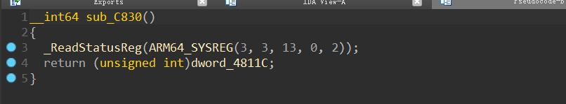

代码跟没有一样


### 13728

代码有点小多，给ai把


### 23724


好像也没啥用


## 基础frida特征绕过

我们这里可以让ai针对上面的init函数进行对抗，我们直接拿hook代码

最后测试


这个就可以解决了


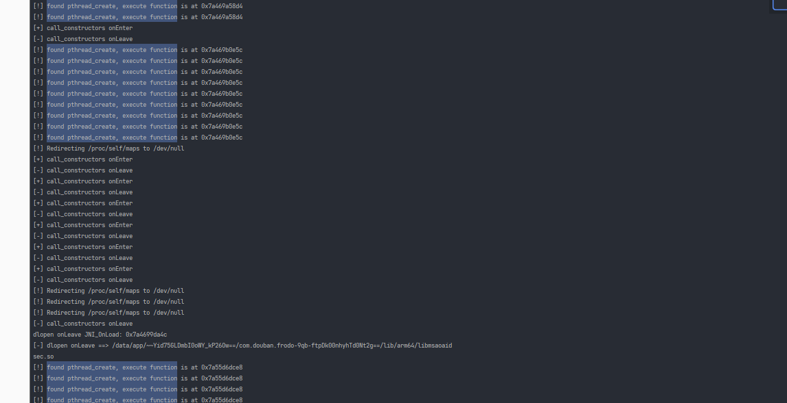


最后找到3个关键检测函数，我们


# 安卓so加载流程分析

## java层

### System.loadLibrary

```java
System.loadLibrary(name); 
```

> System.load(absolute_filepath)；这里可以直接加载绝对路径
>
> 比如这种系统库，路径固定的话我们直接调用


### Runtime.loadLibrary

调用系统库

```java
Runtime.loadLibrary(name, caller)
```

### Runtime.nativeLoad

调用native方法

```java
Runtime.nativeLoad(name, classLoader, ldLibraryPath)
```

然后进入jni层


## jni层

JNIHelp.cpp中

```c
JNI_NativeLoad(env, path, classLoader, detail)
```

然后进入ART层


## ART层

ART虚拟机的 art/runtime/native_loader.cc中

```c
NativeLoader::LoadLibrary(...)
```


### NativeLoader::LoadLibrary

我们看下这个函数都干了什么

1. 查找so文件，这一步在拼接lib和so后缀

   ```c++
   std::string error_msg;
   std::string resolved_library_path;
   if (!FindLibrary(library_path, &resolved_library_path, &error_msg)) {
       return false;
   }
   ```

2. 准备info参数

   1. 打开文件获取文件描述符

      ```c++
      base::UniqueFd fd(OpenLibrary(resolved_library_path, &error_msg));
      ```

   2. 构造info参数

      ```c++
      android_dlextinfo extinfo = {};
      extinfo.flags = ANDROID_DLEXT_USE_RELRO;
      extinfo.library_fd = fd.get();
      extinfo.library_offset = 0;
      ```

3. 调用安卓 android_dlopen_ext 加载so，最后返回handle

       void* handle = android_dlopen_ext(
           resolved_library_path.c_str(),
           RTLD_NOW | RTLD_LOCAL,
           &extinfo
       );

4. 查找并调用JNI_OnLoad（如果存在）

       if (handle != nullptr) {
           jni_on_load = reinterpret_cast<jint (*)(JavaVM*, void*)>(
               dlsym(handle, "JNI_OnLoad"));
           if (jni_on_load != nullptr) {
               jint version = (*jni_on_load)(vm, nullptr);
               // 验证JNI版本
           }
       }


### NativeLoader::FindLibrary

我们看一下是如何拼接的so路径 


### android_dlopen_ext

这里调用安卓底层dlopen，高版本安卓都是dlopen_ext 

```c
dlopen(path, RTLD_NOW)
android_dlopen_ext(...)
```

目的：调用Bionic动态链接器加载库

我们去看安卓dlopen源码，在此之前先了解一下dlopen

- dlopen基本信息

    1. dlopen命名: Dynamic Linking

    2. 函数的 库来源以及声明

       - 库来源: dlfcn（dynamic linking function）

       - 函数声明

         ```c
         void* dlopen(const char* filename, int flags);
         ```

         > 成功返回void*句柄，不成功NULL
         >
         > filename：文件路径
         >
         > flags：加载模式， 默认RTLD_LAZY（延迟绑定）与RTLD_LOCAL（符号仅当前 dlopen 调用可见）

         延迟绑定：不会立即执行；只有在调用dlsym获取符号，从而获取函数地址之后才会开始执行


- 简单使用

    - c中

      ```c
      #include <dlfcn.h>

      void* handle = dlopen("libmath.so", RTLD_LAZY);
      typedef int (*AddFunc) (int, int);
      AddFunc add = (AddFunc)dlsym(handle, "add");

      int result = add(3, 5);

      dlclose(handle);
      ```

    - java中

      ```java
      System.loadLibrary("native-lib"); // native-lib -> libnative-lib.so
      
      // 在native中的c代码 
      void* handle = dlopen("libnative-lib.so", RTLD_NOW);
      ```

 

- 找到dlopen源码

dlopen源码地址：[github地址](https://github.com/bminor/glibc/blob/08d7243a6179d5a1f3f65a53aba1ec0803895aeb/dlfcn/dlopen.c)

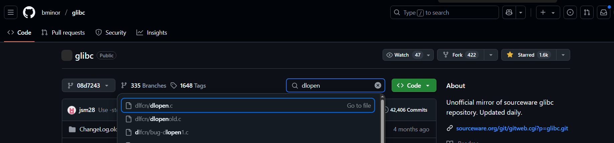

dlopen源码分析博客：[dlopen源码分析](https://datawine.github.io/dlopen-source-code.html)


好的我们继续分析，这里我们肯定是需要找到安卓源码的，linux的有一点区别 [aosp]

我这里找github上的aosp代码镜像，用的是 [aosp-mirror](https://github.com/aosp-mirror)

在 Android 源码中，`dlopen`函数的代码位于`bionic/linker/dlfcn.c`文件


#### do_dlopen

android_dlopen_ext的代码在[dlext.h](https://github.com/aosp-mirror/platform_bionic/blob/731631f300090436d7f5df80d50b6275c8c60a93/libc/include/android/dlext.h#L112-L185)中

```c
void* _Nullable android_dlopen_ext(const char* _Nullable __filename, int __flags, const android_dlextinfo* _Nullable __info);
```

那么这个函数是怎么调用的呢，其实是 [dlfcn.cpp](https://github.com/aosp-mirror/platform_bionic/blob/main/linker/dlfcn.cpp#L151) 的 `__loader_android_dlopen_ext` 调用的

```c
void* __loader_android_dlopen_ext(
    const char* filename,
    int flags,
    const android_dlextinfo* extinfo,
    const void* caller_addr) 
{
  return dlopen_ext(filename, flags, extinfo, caller_addr);
}
```

接下来看dlopen_ext

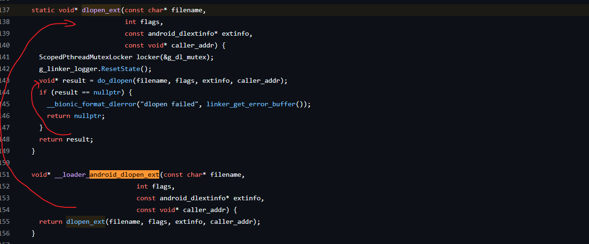

```c
void* result = do_dlopen(filename, flags, extinfo, caller_addr);
```

这里走的是 `do_dlopen` 代码实现在 [linker.cpp](https://github.com/aosp-mirror/platform_bionic/blob/main/linker/linker.cpp#L2116) 中

定位关键点


先进行了 `find_library` 拿到so信息

```c
soinfo* si = find_library(ns, translated_name, flags, extinfo, caller);
```

再调用了 `call_constructors()` 构造函数进行初始化

```c
si->call_constructors()
```


#### call_constructors

在 `do_dlopen` 成功加载库后，会调用 `si->call_constructors()` 来完成库的初始化。

这些构造函数（constructors）一般包括：

- `.init_array` 段中的函数指针
- DT_INIT 动态段指定的函数
- 其他与初始化相关的回调


我们看下  [代码](https://github.com/aosp-mirror/platform_bionic/blob/main/linker/linker_soinfo.cpp#L463)


### jni_onload


# 抓电影短评

apk: v7.98.0 v7.0.1


## 抓包与参数分析

api触发


- 翻页参数变化：向下滑，发现start变了


- 更换电影：发现url变了


那么这个url中的数字就是movieid


参数解释


感觉这里面udid、_sig需要逆向，至于apikey，听这个名字就代表固定


## sig参数逆向

sig参数每次都会变，很明显随时间变化，因为相同的包只有时间变了，sig就变了

换个时间发包，就报错


观察发现sig很像b64，我们直接b64尝试解密，如果存在魔改，那么python直接报错


直接成功，查看字符串长度: 40位，感觉是sha1

我们拿时间戳测试一下


发现不对


我们直接hook通杀一下sha1算法，看下参数是什么

先拿一下包名：`com.douban.frodo`

我们直接拿hook通杀脚本来hook所有加密算法，过程中发现闪退


我们不注入hook脚本单纯启动frida


正常进入frida就没问题


我们hook加密的过程中同时Hook android_dlopen_ext查看加载的so，我们多试几次找到准确的so


这个so文件搞的鬼

- 尝试删除


给他换个名字，如果豆瓣没法正常使用再改回来，免得重装app


继续hook，报错了，说找不到这个so文件


我们现在有3个方案

- 反编译java代码 纯静态分析
- 找低版本的app再次尝试
- 去so中查看检测代码，针对性绕过


我这里先选择第一个


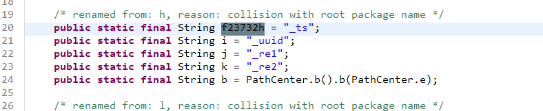

说明这个位置大概率正确


理一下:

- 首先根据传入参数str2进行初始化
- 加入了encode函数返回值，由decode而来
- 有可能加了str3
- 加时间戳


关于decode


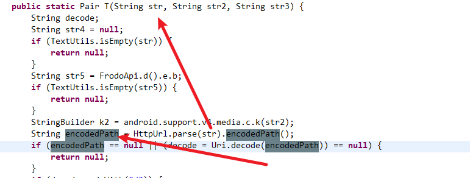

decode->encodePath->str

至此，3个传入参数都有用，我们需要hook一下hmac_sha1的明文，所以我们得找一个没有frida检测或者想办法绕过检测


- 寻找低版本app

我们这里直接找了个v7.0.1版本的app，发现各方面功能都没问题

用一下hook通杀脚本


这里搜sig具体值没搜到，我们搜一下时间戳，发现前面的sig实际上做了urlencode

`j%2FqHeOHTmqmq6cdd9pRzkIYFSh4%3D`

我们扣出来，再搜


没搜到，按道理来说是经历了b64的，所以能搜到b64返回值的


我们换个方案，hook T函数和toString函数

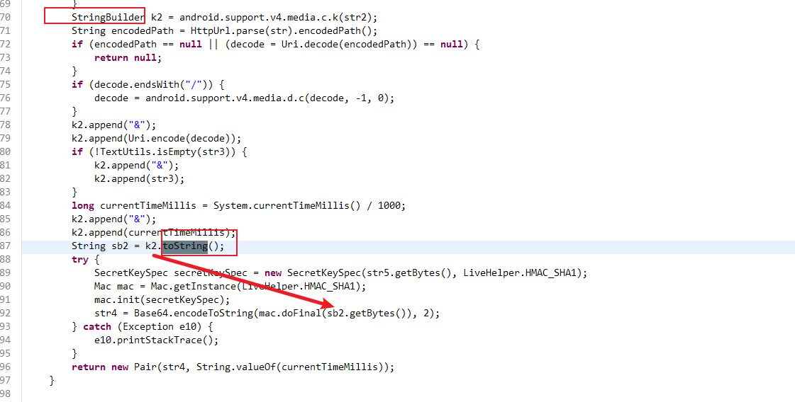

我们这里需要去找豆瓣v7.0.1这个地方是怎么写的


我们直接hook这个a函数和hmachash1.a函数的参数


我们先b64解码一下


再把数据丢到加密网站


好了搞定


## sig算法还原


我们把data进行urldecode一下


这样就行了


把函数整理到类中


## udid参数逆向


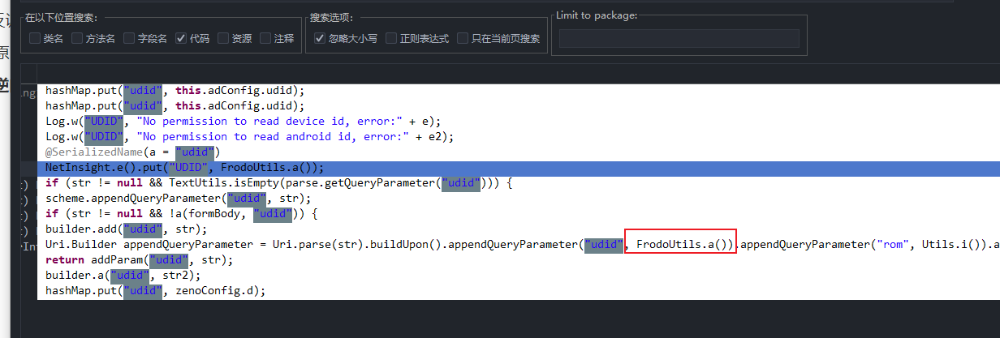

看这个比较像


看其他参数也比较像


看这样子就是xml中取的

我们观察一下udid : `5620bdbc7460970449a7af7db3e2e77c9eba30dc`


感觉像是某种hash，我们hook通杀算法看一下【记得清除缓存】，没找到。。。

那就继续逆向


看一下a（）


有两个位置


这是个按照key取值的函数，我们要找this.g对这个key赋值的位置


xml，肯定不是这里了


我们找this.h的另一个赋值位置


好几个地方都调用了，数量不算多，我们一个个看

- 第一个


b（）生成的


点进去好几个a


我们把最后面的a函数命名成last_a，跳进去找一下


我们发现如果上面的str4没拿到的话就用uuid代替，我们直接用uuid模拟

> 因为用了sha1不可逆算法，我们不用担心服务端对这个udid进行封号
>
> 如果没有用uuid，也可以随便造一个字符串进行sha1加密，反正解密不了...

接下来看c函数


转字节数组，所以我们只需要关心a函数在干什么就行


看不太懂，问下ai


所以实际上是转16进制


## udid算法实现


转换成类的写法


## 接口实现

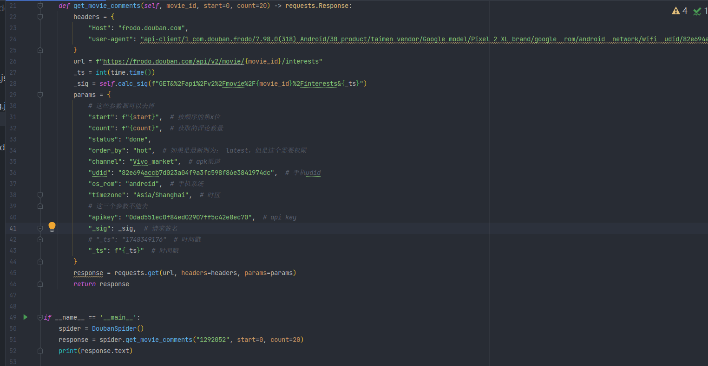

这里我们把udid也伪造一下


## 效果图


至此搞定

我们稍微解析一下


# 用户密码登录

## 抓包与参数分析


POST /service/auth2/token

url参数是


请求头参数


请求体


测试发现client_id不变


## 逆向client_id


看这个函数名就知道固定的


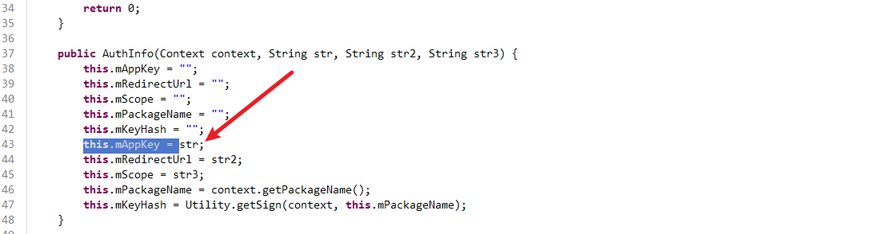


跟抓包的不一致，说明是另一个

	从bundle中取出来


搜这个parse函数没找到。。。。


找其他的this.mAppKey

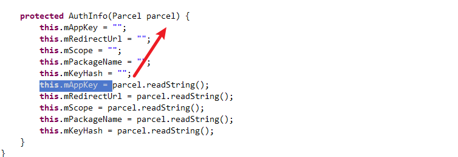


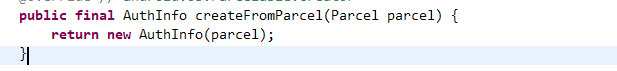

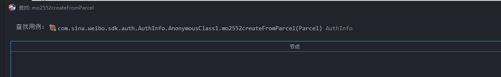
神经。。。

问一下ai这个parcel是啥


说明在某个地方传入了parcel


我们试着搜一下writeString	


有点多。。

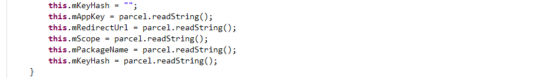

这是写的地方，那么肯定挨着写了很多，其中下一个就是url


还是正则搜key吧


找不到。。。

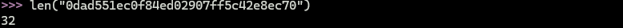

观察client_id, 长度32

我们直接hook加密算法吧，

搜`0dad551ec0f84ed02907ff5c42e8ec70` 发现有36个

搜`apikey=0dad551ec0f84ed02907ff5c42e8ec70`发现还是有36个。。。

搞了半天就是apikey。。。。


## 接口实现


如果缺失参数，会报缺参数


## 效果图


这就代表没问题了，当然最好用个争取的账号密码测试


# 发送手机验证码 - 图片文字识别

## 抓包与参数分析

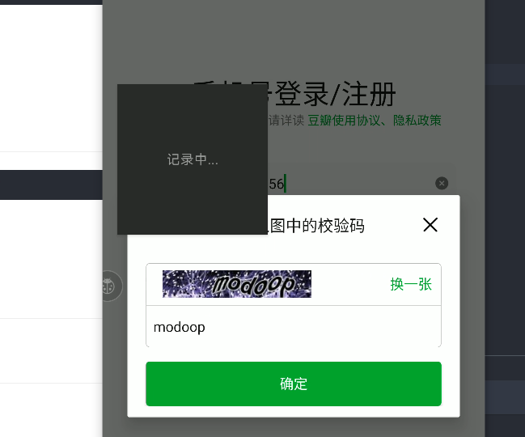

需要输入验证码。首先要发验证码


只有请求体内的参数需要想办法代码完成


## 接口实现流程

1. 首先获取到这个id
2. 根据这个id获取图片
3. 把图片下载下来
4. 把图片用ocr技术识别或者打码平台识别
5. 再把识别的验证码和id放入请求体，发包即可


### 拿到id


这个包响应体内有id

POST /j/app/login/request_phone_code
没啥需要逆向的参数，传入手机号就行


代码实现

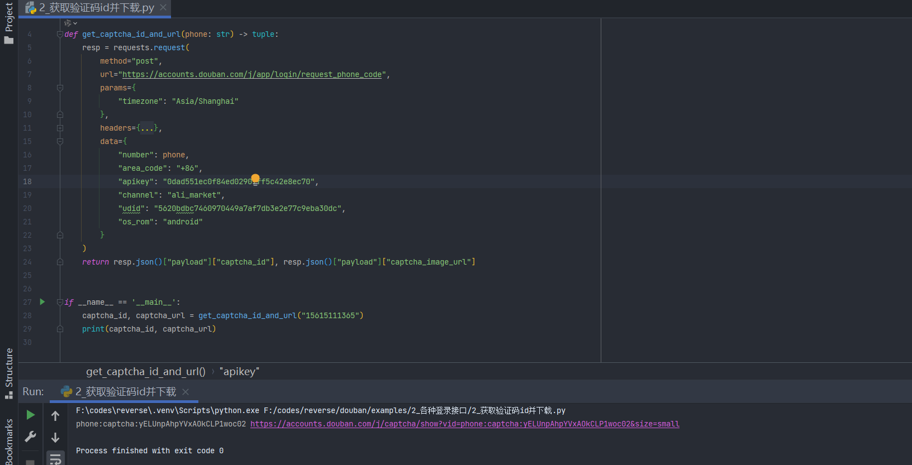


### 拿到图片


GET /j/captcha/show?vid=phone:captcha:68rDdkSB3Qbc85yZlUUGyVtU&size=small

这个传入id就行


### 下载图片

我们先手动下载一下

代码下载

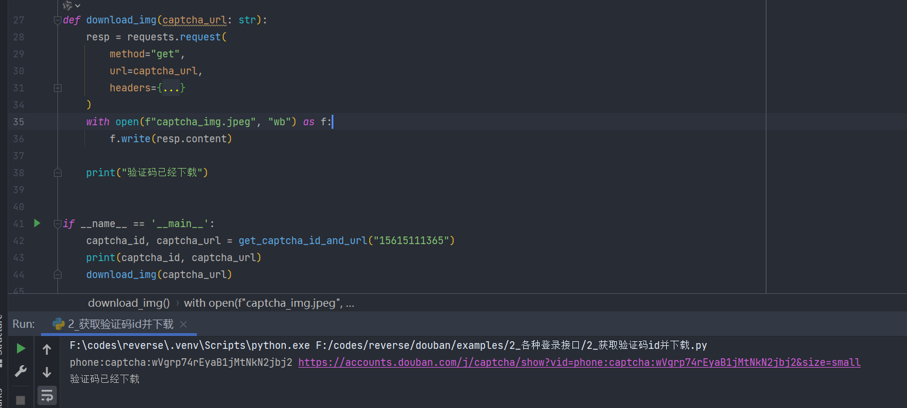


### 识别验证码


交给ddddocr


### 发送请求


https://accounts.douban.com/j/app/login/request_phone_code


## 接口实现


先拿到id&url


再下载


再识别


带上验证码发登录包


整理代码调用一下


## 效果图


如果手机号输入错了，就会提示


如果正确发送了，结果啥也没有，因为抓包，正确发送也没数据


# 发送手机验证码 - 滑块验证

v7.98.0

## 数据包分析


首先抓到我们的手机发送的数据包

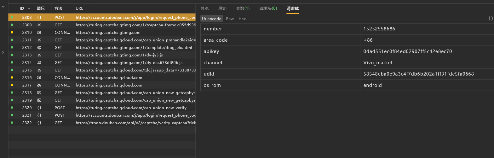


输入手机号，拿到 tc_app_id


下一个包


传入参数的callback代表最后返回的东西，没啥用；


而参数aid是之前返回回来的tc_app_id，只有这个不能去掉

响应数据如下


我们根据这两个url可以直接下载到图片


下一个触发验证的包【拖动滑块然后松手】


里面的sess是前面的prehandle中拿到的


验证码成功之后再次调用 request_phone_code


对比前面的


只有ticket变了，而ticket是从上一个 cap_union_new_verify 中返回的

对比其他包，发现还有randstr，我们搜索发现 randstr是前一个请求返回的

【关键点】：获取到ticket，以及这里的randstr

-> 过验证码检测


## 验证码包分析


sess我们可以从prehandle拿到

collect、tlg、eks可疑，不知道是干嘛的


对于pow开头的，pow_answer不知道是什么，pow_calc_time看样子是我们验证码的完成时间

我又发了一次包，这次时间是139


反编译开搜


url对不上，不过只有这个也没办法


hook验证一下走不走


这是截止拿到验证码图片的流程

我们继续触发，进行验证


那么这个传入的参数实际上不走if循环，我们交叉引用找一下

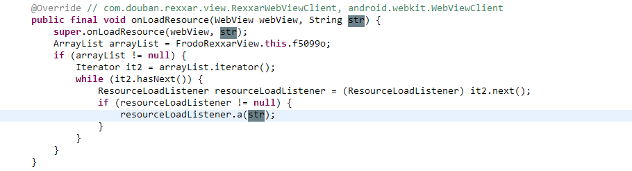

url是传进来的

hook一下这个函数打印调用栈


这里我们查资料发现


## 腾讯滑块验证码

[2025-04-29 collect参数](https://blog.csdn.net/weixin_43411585/article/details/123810961)

[baase64&tea算法](https://www.cnblogs.com/reddest/p/9554948.html)

[2021-09-29 collect参数研究 & jsvmp](https://www.52pojie.cn/thread-1521480-1-1.html)

[2021-11-28 vm算法分析](https://mp.weixin.qq.com/s/EmwuL3ToKwDFwCILZTM1AQ)

[2023-03-20 collect参数](https://blog.csdn.net/weixin_44437016/article/details/131785557)


# 验证码登录

## 抓包

先抓包拿到，参数没啥需要逆向的

https://accounts.douban.com/j/app/login/verify_phone_code


## 接口实现


## 效果图


我们可以把代码整理在一起


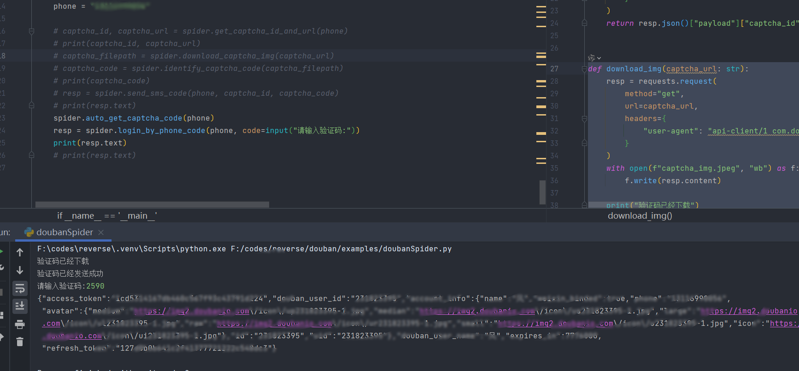


# cookie登录

## 抓包与参数分析


太多了，不像的就删掉

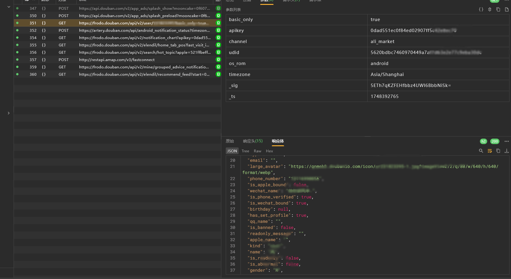

找到这个包，接下来是看请求头和请求体参数


GET /api/v2/user/你的uid


authorization参数需要逆向

没有请求体


## authorization参数定位

不知道是不是其他请求返回的时候设置的，也有可能软件中生成的


先搜一下


好家伙，说明这个方法很早就有了，有可能是登录时返回的数据


我们先反编译搜一下


很明显了，这里有一个accesstoken，根据这个名字猜测一下，估计是登陆时候返回的


重新登陆一下，这次不清除抓包信息 


很明显了，登陆成功后返回的acesstoken


这里拿到的

## 接口实现

我们拿之前登录得到的access_token进行cookie登录就行


注意这里的sig参数计算逻辑，我在测试的时候发现请求失败，然后我拿抓包的时间戳计算，发现不对

重新hook看一下sig传入的参数，这里还添加了accesstoken，别忘了！


这里


## 效果图


# 帖子点赞与取消点赞


## 抓包与参数分析


请求头中携带了cookie

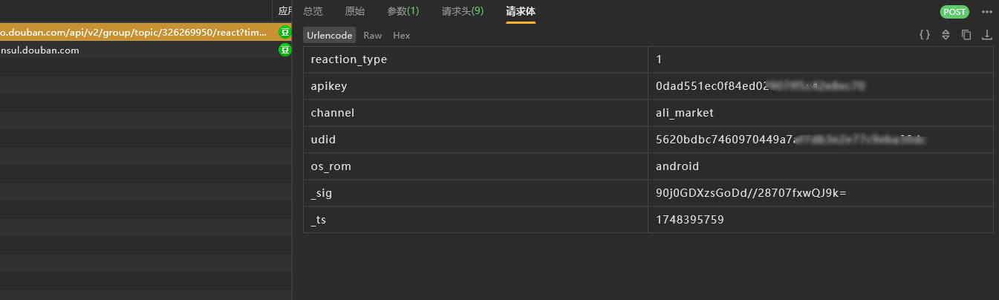

请求体没啥重要的

## 接口实现


取消点赞把type改成0


## 效果图

先取消刚刚那个账号的点赞


成功点赞


# 帖子评论

## 抓包与参数分析


请求头如下


请求体如下，注意是multipart

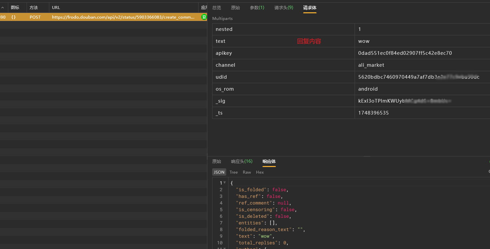


## 接口实现

我们先换chrales抓包，对这种multiparts方便进行复制粘贴


## 效果图


# 采集帖子内容

## 抓包与参数分析

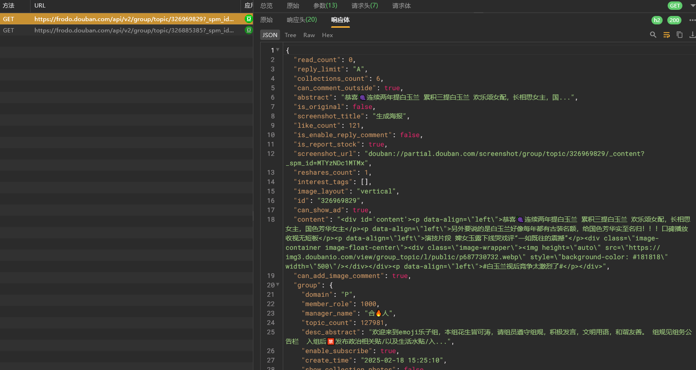

域名中传入帖子id

请求头中只有cookie信息

url参数

我们多发几个包测试一下

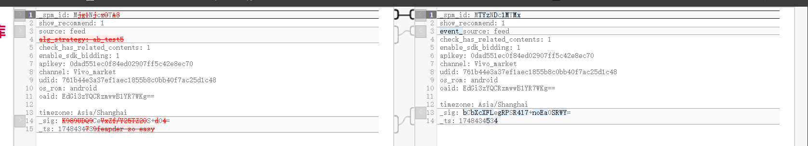


参数太多了，我们改包发一下


很明显就两个参数有用


## 接口实现

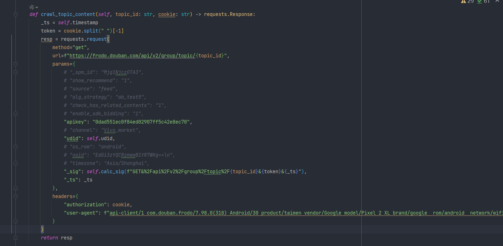


## 效果图


# 采集帖子评论

## 抓包与参数实现


改包发一下


请求参数这次必须带spmid，且更换帖子后使用原来的spmid不可以


## spmid参数逆向


hook一下


发现走了i函数中的d函数生成的


d返回 `com.douban.frodo.group.activity.GroupTopicActivity@47e6e94` 

i返回 `douban://douban.com/group/topic/326191288?_spm_id=NTMwNTc5NTI&show_recommend=1&event_source=feed`

i已经拿到了_spm_id了


我们先观察加密方式，感觉像是b64


验证一下，没问题，可以解开【如果解不开则返回乱码，python如果比b64解码失败会报错】

这里我们找一下这个数字怎么来的，感觉和帖子有关，但又不是status后面的数字

我们看一下是不是帖子id

`result=douban://douban.com/group/topic/327143092?_spm_id=NTcyNzM0NzY&show_recommend=1&event_source=feed`

`NTcyNzM0NzY` -> `57273476` 

搜一下


看下图片


很明显和发帖者有关


这里意外抓包，发现有两个评论接口

- /group/topic/326191288
- /status/6031220384


我们继续逆向


# 帖子转发

