# buvid

## 抓包分析

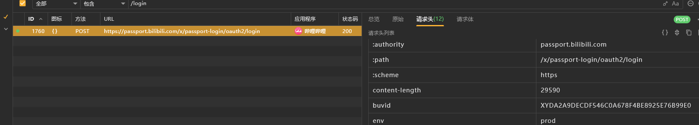

`XYDA2A9DECDF546C0A678F4BE8925E76B99E0`

清空存储，测试发现固定，疑似与设备有关


## buvid定位

版本6.68.0

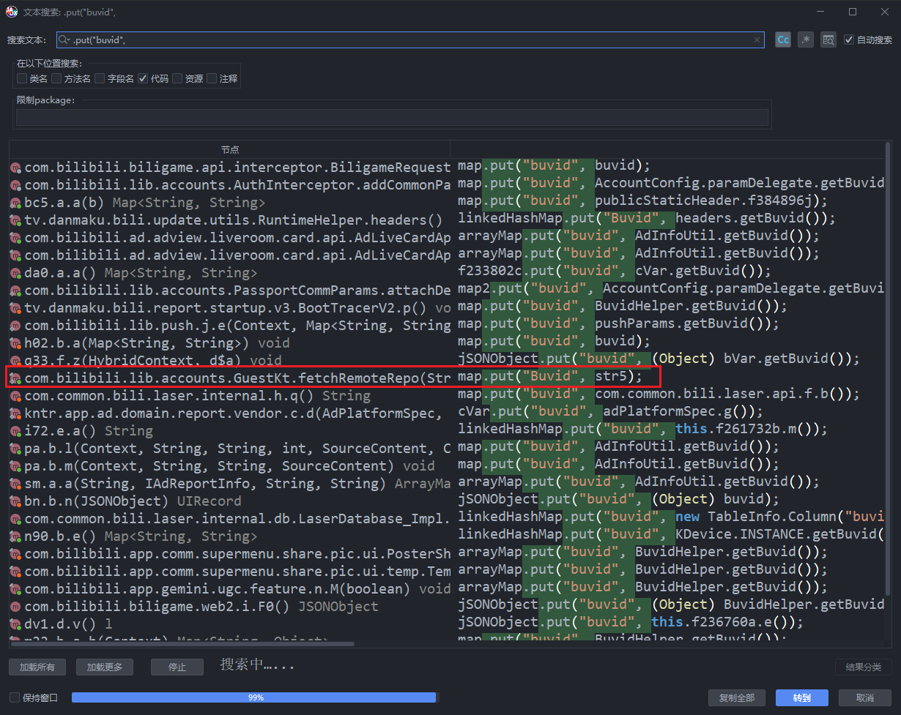

先搜一下put，找个看得过眼的试试，

> 注意这里的参数以抓包为准，抓包是小写，但是有可能app，put的时候存在大写。


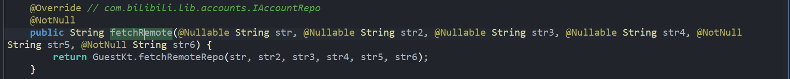

继续退到外层


我们去看一下这个buvid如何获得的


是个接口，我们找对应的类；


找到之后去搜对应的方法

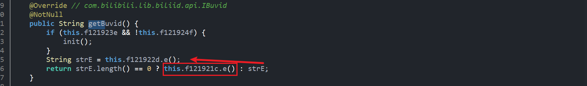

先尝试 `d.e()` 


继续.f


好像价值不大，我们去看看 `c.e`


这里有3个生成位置，看着比较像，我们挨个点进去看看

1. a.a()

   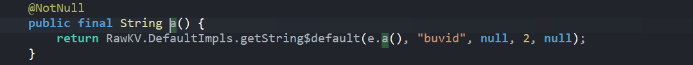

   >  又回到了最初的起点，记忆中你青涩的脸（

2. f

   

   继续 `a.c`

   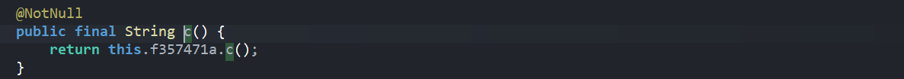

   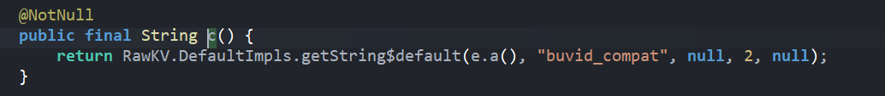

3. g

   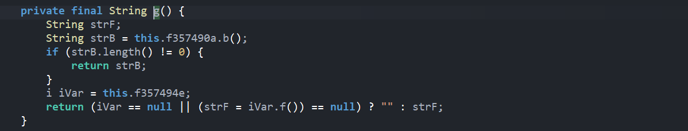

   

   

好吧，看来都是同一个；我们也不是无所收获，毕竟确定了这么多都是同一个东西（）

所以现在的需要做的就是看看 `e.a` 这个东西内部如何赋值的


说实话到这里还是不太像


我们搜一下这个buvid的前缀 `XY`


点进去查找引用


一路找


其实这个地方还慢像的，先是拿到前缀，然后把两个东西接到后面，第二部分是由第三部分计算出来的

我们看看strc怎么得到的，也就是`d.c`

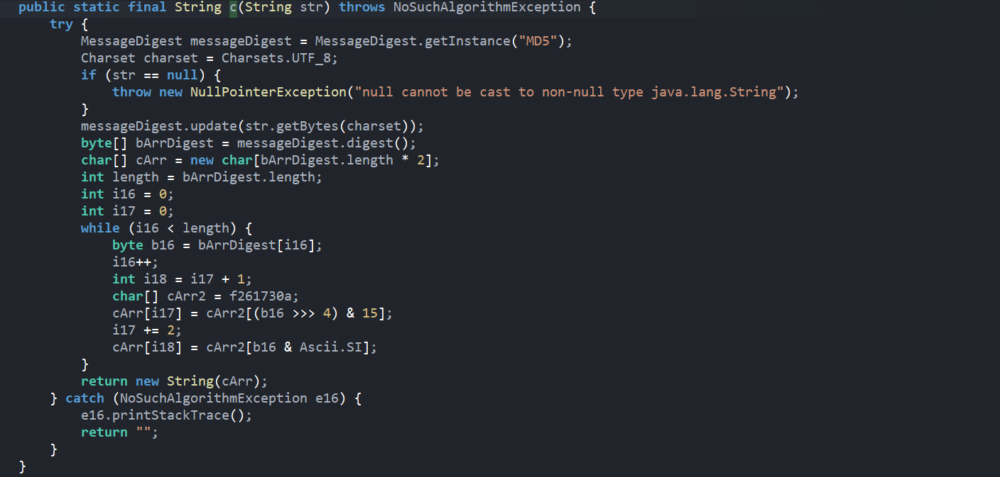

像是一个md5，我们暂且认定为md5，之后来验证

我们看一下d.d做了什么


这就很明显了，说明是

- 先计算某个`strD`的md5（可能是）
- 再去取出2，12，22部分
- 再拼接上前缀

其实到这里我们都不需要验证md5，以及strD是什么了，因为这个算法只要和md5有关，那么明文是没法还原的，所以只要按照这个格式生成即可。

我们这里去手机内存中主动调用一下，验证一下d.c是不是标准md5


验证了一下，就是大写md5而已


## 尝试还原

### python伪造

本质上就是hash取特定字符，而摘要算法没办法还原

- 我们只需要随便生成一段hash值然后取其2，12，22再拼接即可；这里随便塞一个uuid

- 也可以跟他的算法一样

这里取一下随机uuid进行计算


# deviceid

版本6.28.0

## 抓包分析


这里随便抓一个


## deviceid定位


挺多的，感觉最后一个比较像

这里看见了jsonobject，我们去找找是不是请求返回的

我们把手机信息清除多抓包几次，然后把值拿去搜一下

```bash
adb shell pm clear tv.danmaku.bili
```

再次抓包


很容易就定位到了

我们看一下这个接口要什么参数

请求头


参数

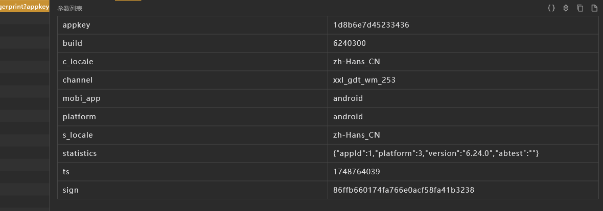

请求体


参数很多，我们用python测试一下


看样子只有key和content比较重要


## key&content定位


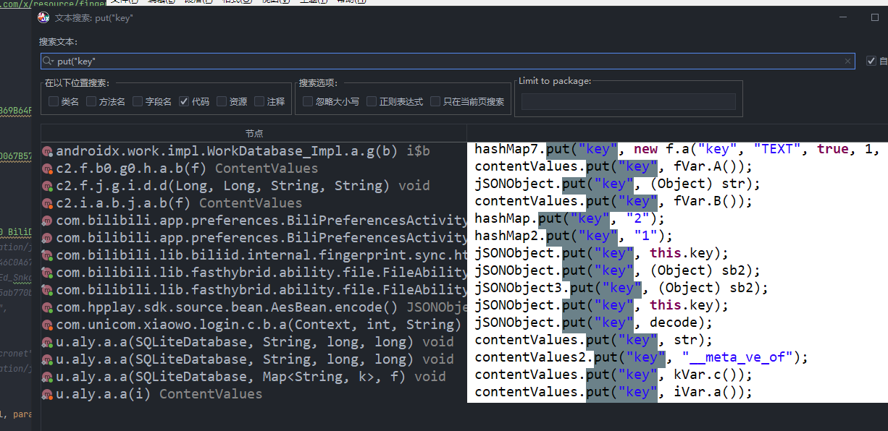

还是蛮多的


这个也挺多的，我们hook一下 hashmap的put来尝试定位

脚本如下，记得过滤一下


我们跟栈找一下


在这里发了包，看样子这个new对象是请求体之类的东西，我们观察发现这三个参数也就只能是key和ciphered了

- 一是因为他们是在同一个函数内部
- 参数名

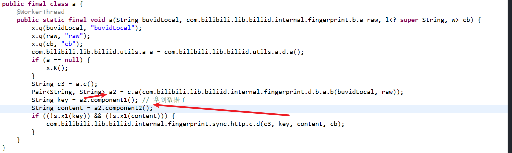

继续跟栈，到这里拿到了`pair`

我们把参数名字改成key和content方便分析，接下来去看看 `c.a` 怎么声明的


传入字节数组，最后生成两个字符串

我们把参数名和函数名都改一下；我们还发现上面有个pem，这就很明显是rsa加密了

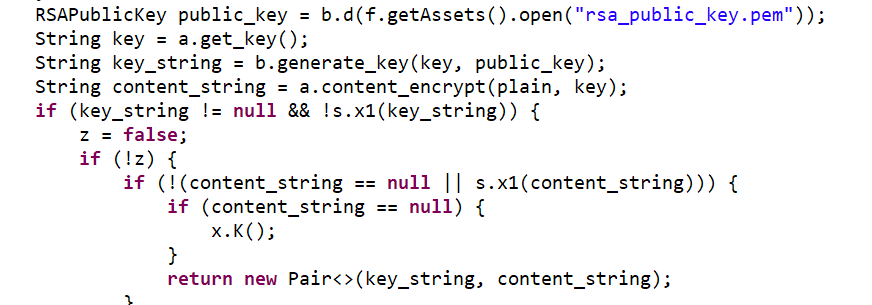

嗯，这样舒服多了，所以实际上是

- 生成一个不依赖参数的密钥【固定或随机】

- 然后拿公钥对密钥进行加密得到最终的key

- 再用这个key对明文进行加密得到密文

  > 最终把密钥和密文传给服务器，服务器拿到之后先拿私钥解密密钥得到加密用的密钥，再拿这个密钥对密文进行解密，最后根据用户信息分配一个deviceid给我们


接下来我们要确定的是：

- 密钥怎么生成的
- 这个公钥对密钥加密有没有其他额外操作
- 密文是什么加密方式


1. 密钥怎么生成的


接着看外层a干了什么

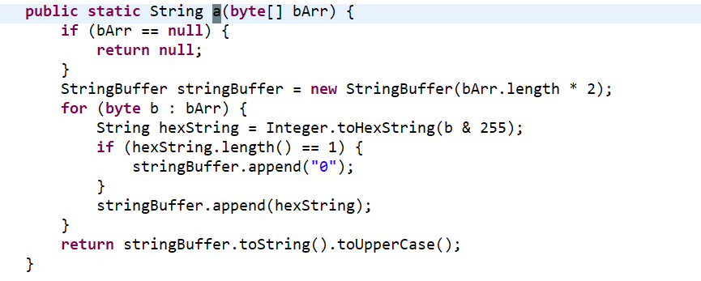

看样子是转16进制，最后转大写


2. 公钥有没有对密钥有其他操作


第一个	参数是生成的随机密钥，第二个是公钥，看这样子是一个按块填充操作

我看不出来是不是标准的rsa加密，只知道一个大致逻辑，我们问一下ai

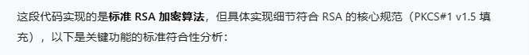

ok，加密算法是标准的就好！不过使用的v1.5填充， 这有一定随机性，导致我们在验证的过程中不是很方便


3. 密文的加密方式


ok啊，最标准的aes加密；沼泽里还有个f(str)感觉很明显是个getBytes


ok，整个流程很清晰了，我们去复现一下流程


## aes加密

先hook一下找个数据


python还原一下


## rsa加密aes密钥


由于这个填充方式的随机性，最后的结果不一样，不过不影响


## 寻找最初明文

接下来我们要去寻找这个明文是怎么来的


接下来我们去看a.b是怎么来的


这里把两个参数传进来，然后进行a操作，最后转字节数组

我们看看a函数


点进去非常长，我们先hook一下看看入参


第一个是我们的老熟人，buvid，所以只需要看第二个参数就行

第二个参数类型：com.bilibili.lib.biliid.internal.fingerprint.b.a


看着还行，没有奇怪的东西，

返回值类型：c2.f.s.a.a.b


完全看不懂，不过看到个protobuf，看这样子是使用了protobuf协议。。

这个我完全没遇到过啊，教程也没看到过；不管了，开干！


我们继续看函数内部干了什么

入参

- str：buvid，我们已知
- aVar：一个自定义类


先是定义了一个w2；然后从aVar中取出map，每存在一个就找到对应的函数操作一下

我们回到aVar的类


他的.a也就是main，.b是propery；.f13181c是sys；

对应了a() b() c()

而这个数据我们已经hook到了

我们看看w2最后怎么返回的

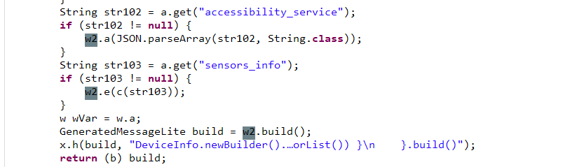


执行的是build函数，返回的b对象，然后在外层转字节数组

我们去找一个w2的函数看一下


嗯，传进来然后返回了this，一个完美的链式调用逻辑；我们需要看一下R2都做了什么；


把传进来的值赋值给了str，其他的应该也是这个逻辑

然后最后执行.build函数在拼接起来，我们去看一下build函数怎么写的

点击w2跳转到了`com.google.protobuf`，我佛

点击build看看具体的实现

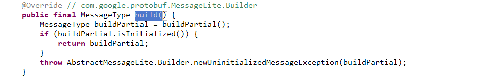

点击这个buildPartial函数还跳不进去


到这里就思路卡死了

我只能回头看


看到这里的a对象继承的protobuf的Builder，怪不得直接跳转过去了

找了半天，没有思路，于是把代码全部丢给ai，问他这个build函数执行的代码是什么


问了下格式转换


这是我们最外层调用的函数


看一下build函数作用

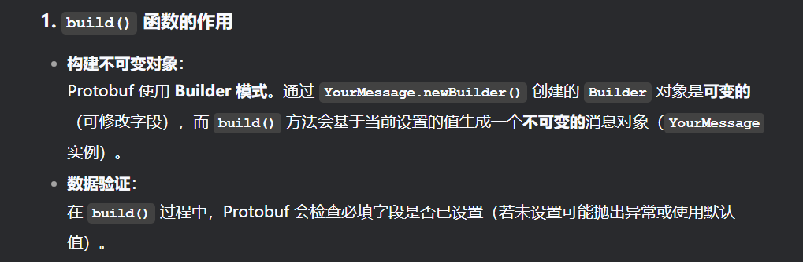


# fp_local

用于请求账户相关 REST API, 及 gRPC Metadata 生成.

我的：`6c54488e435ab770bfa7b64aa03bf27f202506111048378b7de42ce6a7db7ef5`


挨个定位

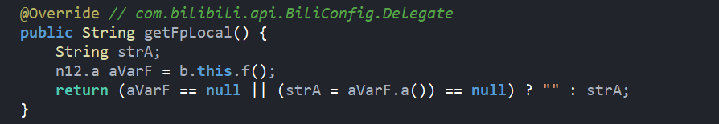

最后定位到


搜一下putstring


三个生成位置，

- 读取已有的
- d生成
- a.a生成

看了半天，第三个比较像

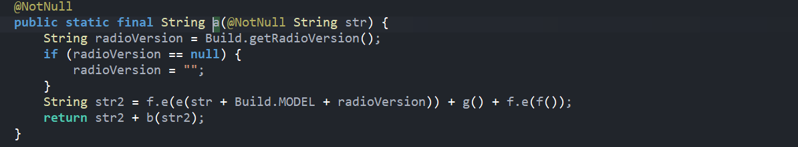

看样子前半部分是某个玩意儿，后半部分经过b操作一下；

我们把这个函数用到的所有函数全部hook一下

其中f函数是一个随机8字节

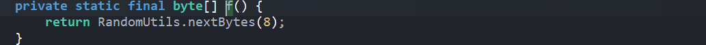


初步猜测f.e就是单纯的转16进制；我们先去看一下这个a.b是做什么的


一个自定义的函数，用于计算十六进制校验和，我们让python先复现一下这个算法


ok，没什么问题

接下来我们看一下 `e` 做了什么


简单的md5，我们验证一下，发现没什么问题

接下来我们去看一下 `f.e`


看不太懂，我们问下ai；

ai说的和我们猜测的一致，就是把每个字符串16进制，再进行拼接

我们对照发现确实是这样


至此算法核心已被搞明白了

1. buvid+手机品牌+手机无线通信基带版本，计算md5，转16进制
2. 当前时间，精确到s
3. 随机8字节的16进制
4. 计算16进制校验和


python还原一下


# fp_remote


与fp_local很像，我们对比一下

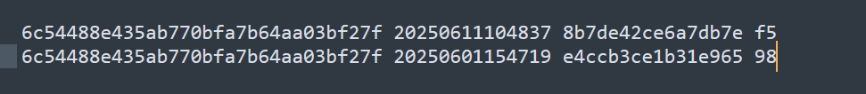

算法应该是一样的，我们在hook`fp_local` 的时候没有发现多余的打印，说明这个值不是我们自己生成的

我们抓包搜一下

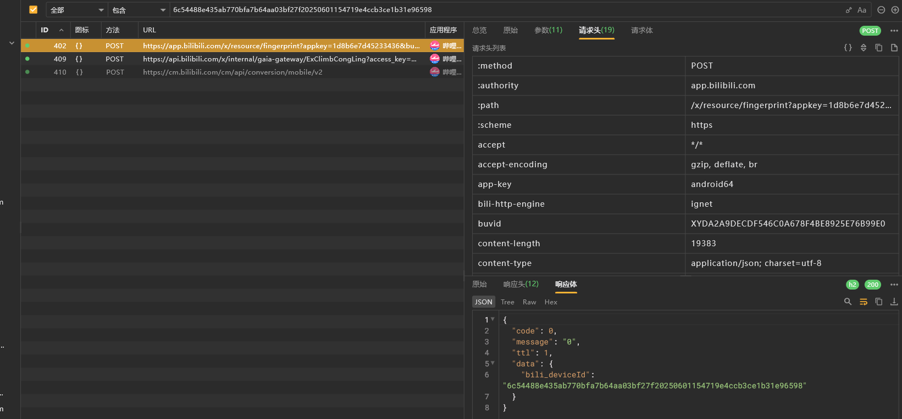

发现是某个接口返回回来的，我们去找一下

- url: https://app.bilibili.com/x/resource/fingerprint

- method: post

- 参数

  ```python
  {
    "appkey": "1d8b6e7d45233436",
    "build": "8480300",
    "c_locale": "zh_CN",
    "channel": "alifenfa",
    "disable_rcmd": "0",
    "mobi_app": "android",
    "platform": "android",
    "s_locale": "zh_CN",
    "statistics": "{\"appId\":1,\"platform\":3,\"version\":\"8.48.0\",\"abtest\":\"\"}",
    "ts": "1749615894",
    "sign": "4b6211ce36fcf143b2211ce41df7a9ce"
  }
  ```

- 请求头

  ```python
  {
    "app-key": "android64",
    "bili-http-engine": "ignet",
    "buvid": "XYDA2A9DECDF546C0A678F4BE8925E76B99E0",
    "content-type": "application/json; charset=utf-8",
    "env": "prod",
    "fp_local": "6c54488e435ab770bfa7b64aa03bf27f2025061112245456745c6834a57daa80",
    "session_id": "6ac9b856",
    "user-agent": "Mozilla/5.0 BiliDroid/8.48.0 (bbcallen@gmail.com) os/android model/Pixel 2 XL mobi_app/android build/8480300 channel/alifenfa innerVer/8480310 osVer/11 network/2",
    "x-bili-locale-bin": "CggKAnpoGgJDThIOCgJ6aBIESGFucxoCQ04iDUFzaWEvU2hhbmdoYWkqBiswODowMA",
    "x-bili-metadata-ip-region": "CN",
    "x-bili-net-bin": "DWqCcT8gAQ",
    "x-bili-trace-id": "b740eaa4caaaab774dfe832092684905:4dfe832092684905:0:0"
  }
  ```

- 请求体

  参数太长了，我们就用图片展示

  


我们多次发包测试

参数中核心的是这三个

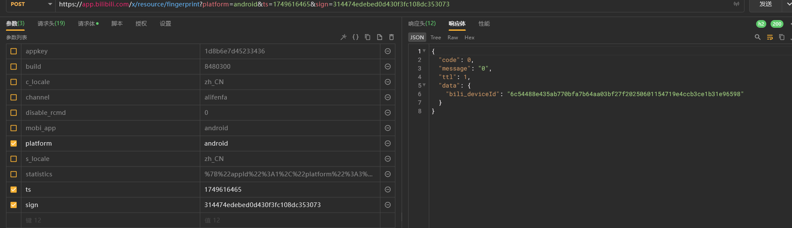

请求头中，都不重要


请求体的key和content，以及参数中的sign是我们需要分析的

[sign](#sign)的讲解在下面，点击就能跳转


接下来就是key和content了


# sign

先简单静态分析一下

搜`“sign”`就一个


但是引用挺多的

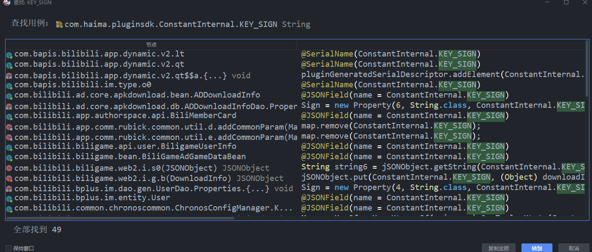

稍微看看，还蛮多的，我们换个别的搜索方式吧

我们hook一下map的put，然后对比抓包找一下


发现没有

换一个搜


这里好像就比较像了了，我们随便找一个

也可以挨个hook验证

我这里直接hook了stringBuilder，


发现很多参数中包含sign的走的是native那个，我们


我们找赋值位置


搜交叉引用没搜到，我们去hook看一下调用栈

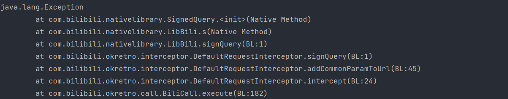

跟这个s方法


看样子是在内部生成好了s然后调用了jni方法进行sign赋值的

我们hook一下入参，这里是map，我们需要转`gson` 打印

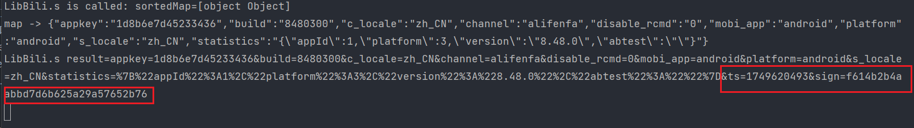

发现确实是这个s函数进入之后生成好`ts` 和 `sign` 的
接下来我们去看so层代码

先看看有没有static块


感觉说不定就是libbili.so了，我们去看一下有没有这个so

看一下是否注册，不是静态注册，我们找 `jni_onload` 的函数偏移表


代码存在非常强的混淆，以及字符串加密

我们写hook脚本查看是否注册了


确实在这个so中，我们ida按`G` 输入`9050` 跳转

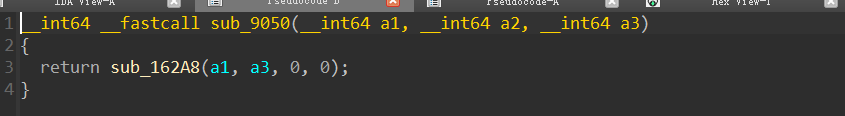

这里把env和map作为参数传入`162A8`了

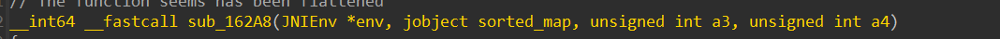

变量类型稍微改改

接下来倒着看so

找return


看这样子也就只能是v26，和v22


v26就是我们传入的map进行操作后得到的


v22是 &v29转字符串


v29和v27有关，其实也就是v26长度

这里我们查一下jni函数的`NewObject` 函数声明


说明v26和v22是我们java层创建对象时传入的参数


这里说明v22就是我们的sign了

接下来我们只需要观察v29怎么来的就行

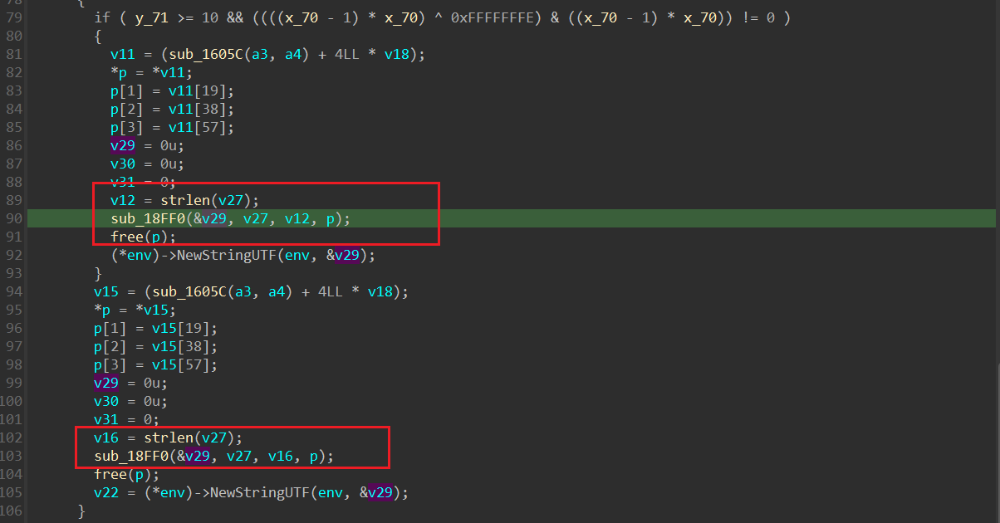

这里其实可以看出来，主要就是这个`18FF0` 计算出sign

我们hook看一下参数都是什么


我们这里猜测一下这个是什么加密


这里测试一下，发现不是md5，我们进去看代码怎么写的

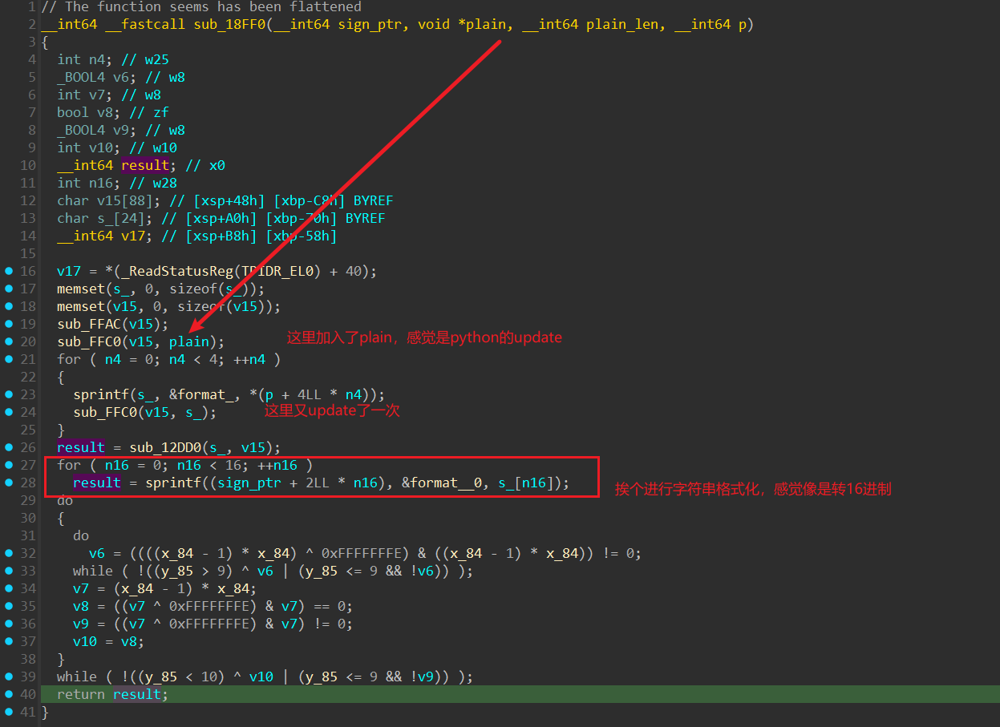

感觉确实是md5，我们看他 `FFC0` 都加了多少东西


后面两个应该没啥用，我们加盐测试一下看看


确实是md5

ok，至此，我们的sign已经搞定