# auth

随便抓个包都有

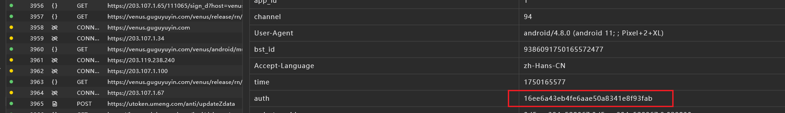

## 定位

先看包名相关的

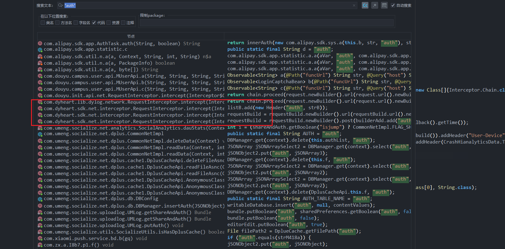

继续跟

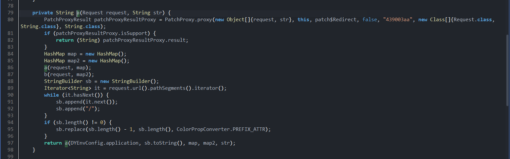

继续

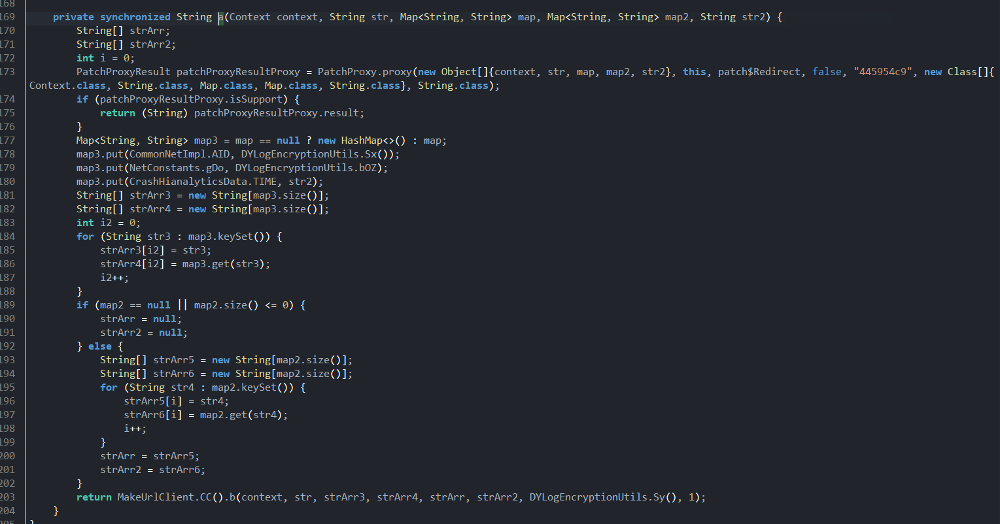

继续跟b函数

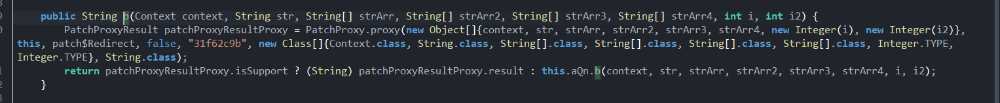

这里继续跟

最后跟到这里

hook验证

存在frida检测，是libmsao，随便过一下就行

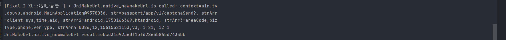

点击登录后确实走了这里，对比抓包也没问题

稍微抓包对比一下

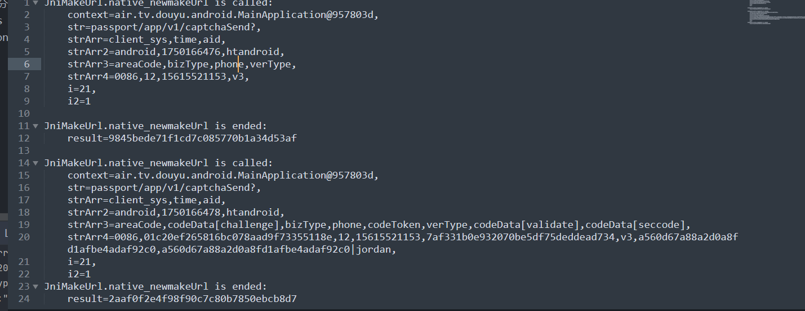

对比抓包看一下

其中猜测参数意思

1. url路径
2. strArr 固定的3个参数：url参数+请求头参数： `client_sys,time,aid`
3. strArr2 的内容对应了 strArr的value
4. strArr3好像是请求体的key
5. strArr4是请求体对应的value
6. 至于i和i2，不确定

接下来看so层怎么写的就行

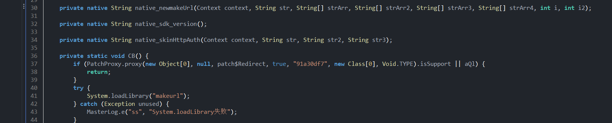

下面就有导入的，所以是 `libmakeurl.so`

不是静态注册，找偏移表

 

没看到直接的函数表

hook注册时绑定的地址拿一下

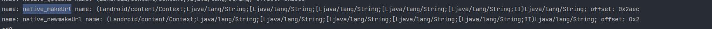

`2aec`

倒着看

跟 `ptr_5`

这里不会是全局变量的，跟`ptr`

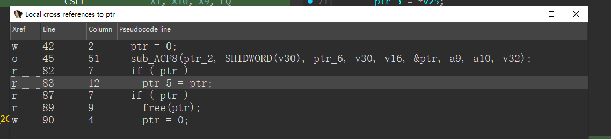

看样子关键函数是 `acf8`

函数平坦化了一部分

不过我们看到了什么 `auth=` 的东西的东西

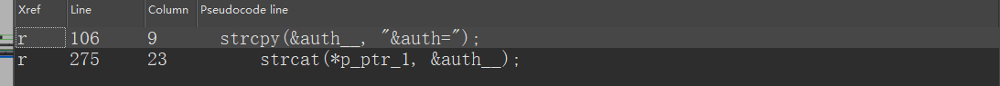

跟`p_ptr_1`

加个两个东西，正好也是返回值，所以实际上的 src_2是我们的 `auth` 值

这里好像存在一些问题，反编译有点问题

对照着汇编看一下，这个应该是一个日志打印函数，然后用的寄存是X27，上面的汇编也用到了，

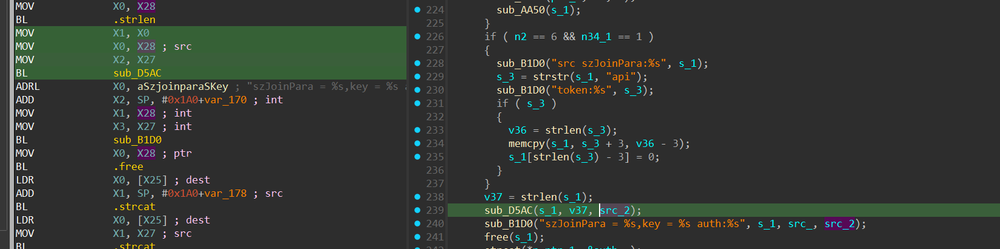

这里根据x27没有其他改变，而且d5ac也用了；所以我们点进d5ac后退出重新反编译；

这样就有了

我们观察v37是`s_1` 的长度，所以src_2是由`s_1` 得到的

hook一下明文看看

发现都是可见字符，所以直接readCstring

发现明文主要是 由 

1. 路径

2. 3个公共参数 aid client_sys time

3. 一个神秘字符串 `vOXGo3ad7hLHyTw4Zgu2blCjEBQDcx6z`

   > 测试发现是固定的

4. 其他参数

拼接而成，接下来进行算法测试，测试出来就是md5

注意这里的其他参数，java层传给so层是有很多的，但是只选了一部分、

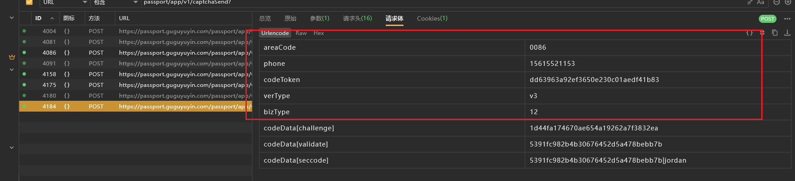主要就是这几个 `areaCode,bizType,phone,verType` 这里不包含codeToken的部分

我们去看一下神秘字符串是不是固定的

- 搜string没搜到
- 跟踪s_1

用的还是蛮多的，其中有些地方是在循环内

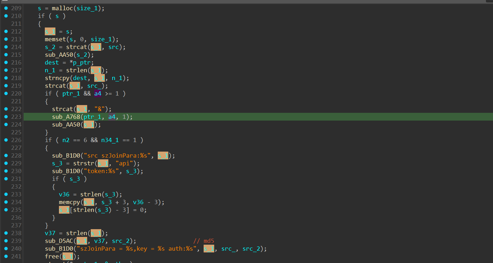

观察了一下，主要有用的应该只有 `a768` 了

好像和a4有关，我们干脆直接hook这个外面的函数传入的参数

`[+] 0xACF8: args[0] is at: 0x6dcb6b4950, arg[1] is at : 0x3, arg[2] is at: 0x6dbb711370, arg[3] is at: 0x2, arg[4] is at: 0x6dab696ef0, arg[5] is at: 0x6d11c61558, arg[6] is at: 0x15, arg[7] is at: 0x1, arg[8] is at: 0x6d11c61560
`

把这里面是地址的都dump一下， 02458

观察发现args[4]是路径，其他没啥东西，所以可能是二级指针之类的

接下来看看其他参数

第一个参数好像是个二级指针 `70 b3 6c ab 6d` 根据小端序，倒着排，所以 `6d ab 6c b3 70` 好像是个地址，我们 `readPointer` 再dump

验证一下，确实是，继续验证 args[2]

这里是有的内容的

不过好像不全，应该是其他参数是根据循环来进行取的，循环过程中计算出新的地址

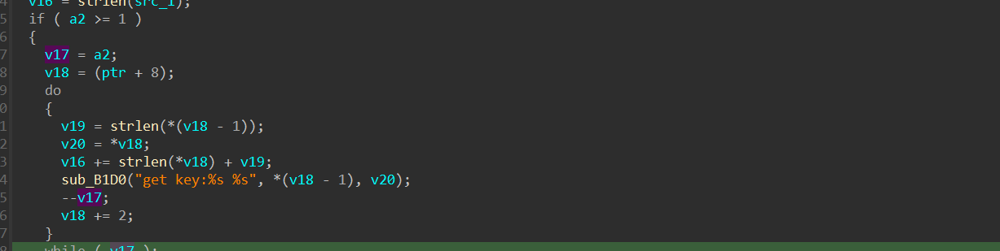

这里循环v17次也就是a2次，a2传进来的是个证书，然后取的key和value应该对应v18和20

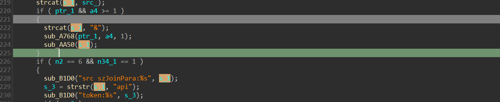

其实稍微找找发现 神秘字符串应该是token之类的东西

之后就不找了。。

## 算法还原

前面已经分析过了，这里就不进行代码编写了

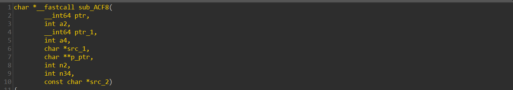

带到一个，args[5]是二级偏移（二级指针），所以我们 `ptr` 一下