# 博主实盘信息接口

这个app提供模拟器用的so，所以模拟器也能用


这个接口


点击这个触发


其中主要参数位请求头sign，请求体data


## sign

### 定位

搜sign比较多，直接搜url，因为其他url相对出现sign几率比较小


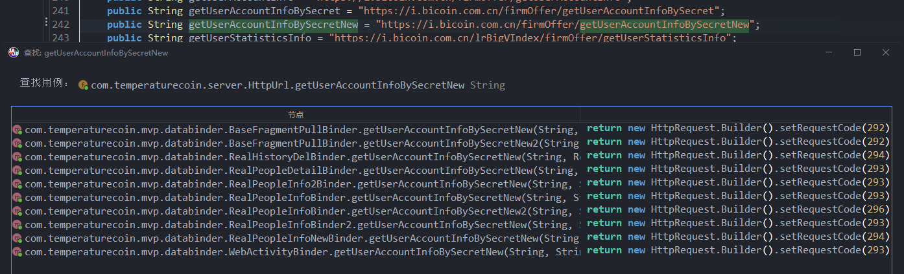

发现用的还是比较多，不过都是什么 `secretNew` 和 `secretNew2`

点了第一个

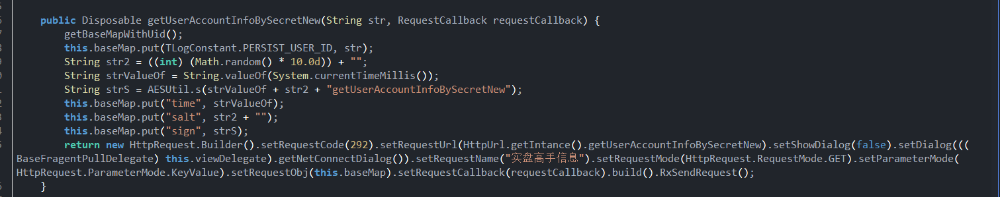


嗯，这里该有的都有，对比抓包一个不落

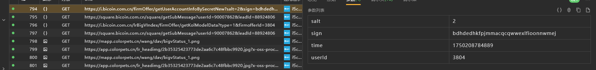


四个参数都有，走的put方法

稍微分析一下，salt是str2，是一个随机小数（0-1）*10，也就是随机0-10整数

然后time是当前时间戳

sign走的是s方法，传入了 `time+salt+接口路径` 作为参数


最后定位到native函数，

下面有个加载so


找一下具体名字


所以是 `libns.so`

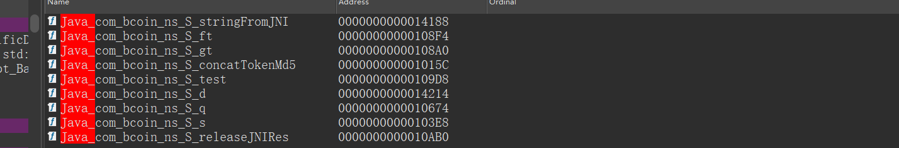


静态注册的，找一下对应的函数


变量类型稍微调整一下

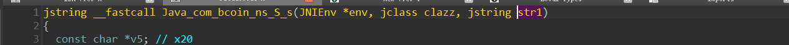


然后倒着找

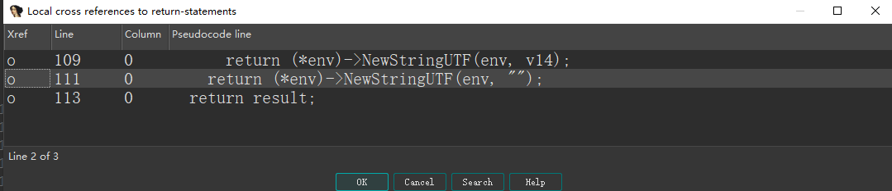

3个return，主要是result和v14

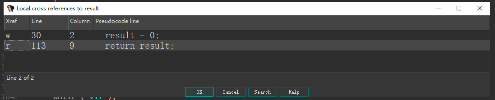

result啥也没做，我们看v14

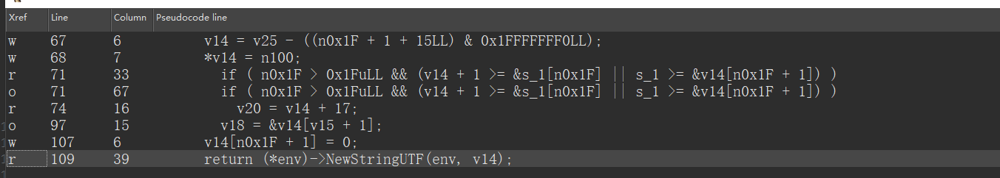

看着还是蛮像的，这里先是填充块

然后给了n100，再在代码块中设置了值

这里我们去hook一下java层参数，以及写一个主动调用


稍微触发一下

```python
S.s is called: str=17502097628048getUserAccountInfoBySecretNew
S.s result=d3d53603fe524438ddc68e544e84cc970
```

`1750209762804` `8` `getUserAccountInfoBySecretNew` 三部分，我们主动调用一下


好像有很多种，不过我们不关心，只要是明文相同，最后传哪一个都行的


让ai解析一下函数作用


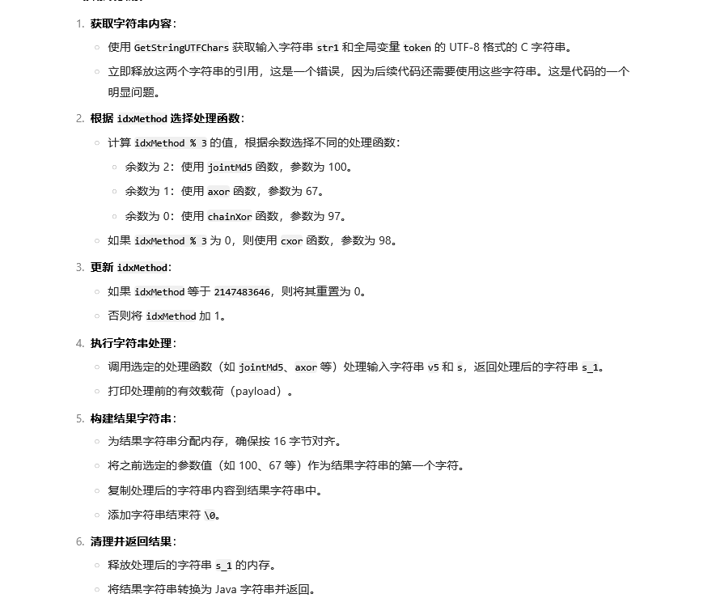


所以关键函数就是这个三个方法了

输入参数是v5和s返回s_1，调用的是3个方法，看名字是什么 md5，异或之类的

这里我们先试试md5，发现java的字符串直接md5得不到正确的


这里我们关注一下v5和s


首先v5是由java层明文转cstring得到

然后传入了p_cxor

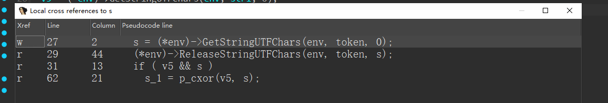

而这个s是由token得到的

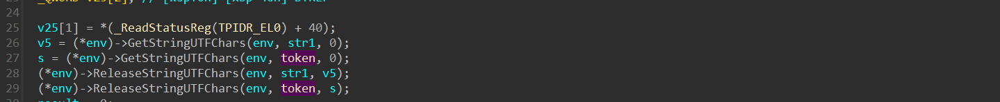

token是一个全局变量


bss段就是为了存储一些全局变量用的，我们之后hook入参就行


接下来我们看这三个函数

先看md5


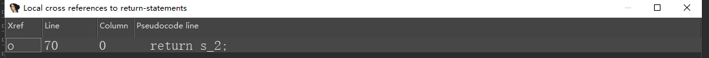


s_2来源比较多，引诱由free，所以我们关注s_3就行

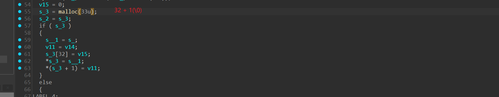

看样子主要是和s_1和v11有关

s_1又和s_有关

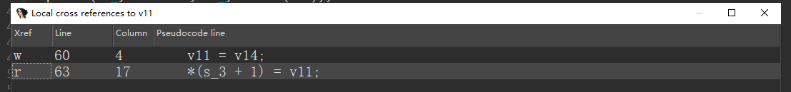


v11与v14有关


这里往上看发现了md5看样子主要与`s_`有关，`s_` 负责接收格式化字符串

然后由v16和v17传入


我们hook一下update的传入数据，主要是第二个


前面加了点盐

`2b641e2dec449b95019792f537557bb817502097628048getUserAccountInfoBySecretNew` 拿去测试一下


对比发现前面加了个d，可能是用于做标识符什么的，比如告诉服务器我这用了什么算法

我们再换一个


发现前面部分没变

同样的，对比其他算法，`axor`前面开头b，`chainXor` 开头固定C

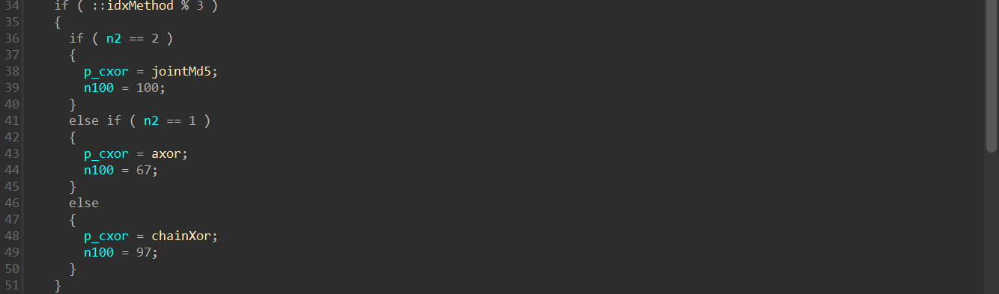

这里的n100就是第一个字符，这里设置了第一个字符的ascii，100就是d

到这里我们就可以直接拿md5进行发包了

对于剩下的算法我们可以不逆向，因为是异或，ai对这种比较熟，我们直接让ai写代码


### 算法还原

1. md5

   

2. axor

   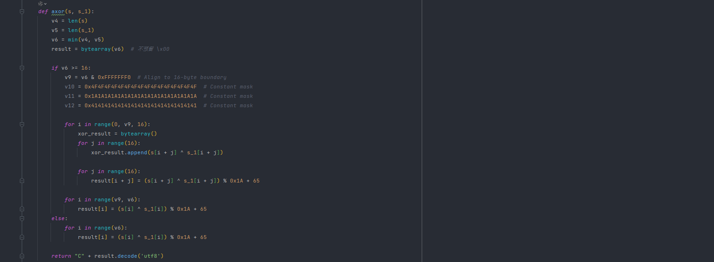

3. cxor

   这里测试了一下，发现不走chainXor

   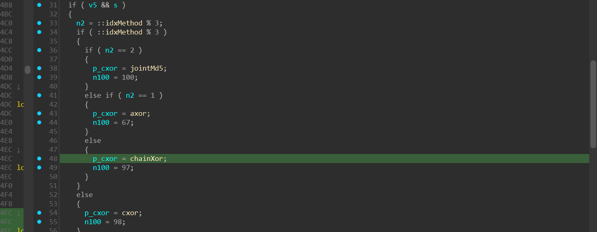

   而是下面的cxor

   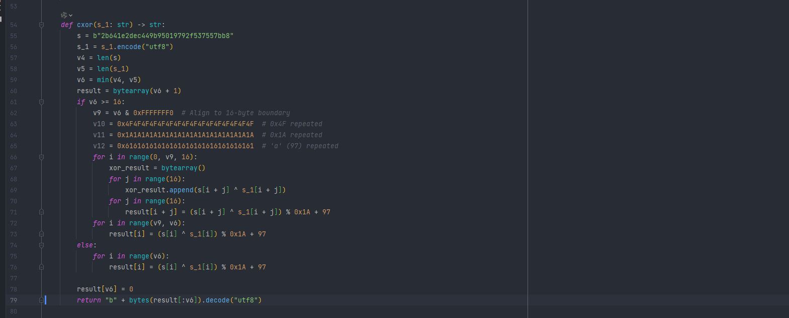


发个全部版截图


与内存中计算的对比一下


没啥问题，都算好了才发现有一个算法只有大小写区别；当然chainXor也有，不过爬虫尽可能别用这种，否则可能会被标记


## data

我们前面的地方是猜测的一个位置，只是最后调用了s而已；

所以我们需要跟栈找到正确位置，在前面发请求那里加个打印调用栈


最后定位到

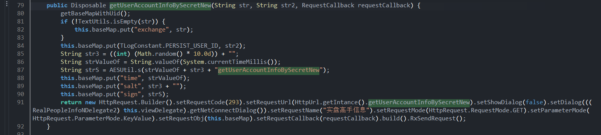

这里一直跟`semdRequest`

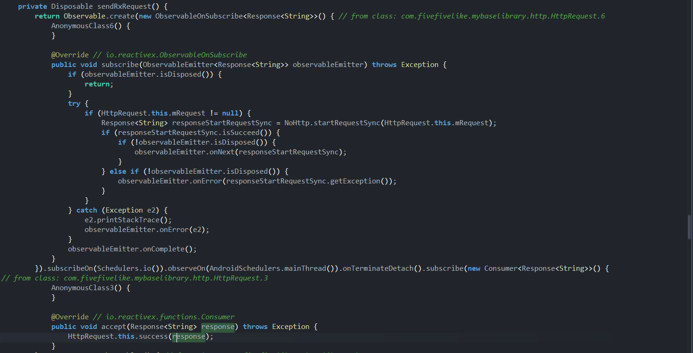

找到了这里有一个success

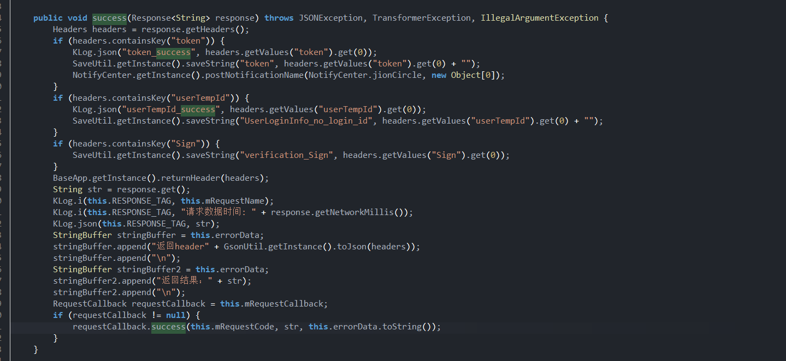

发现实际上走的是最后的success

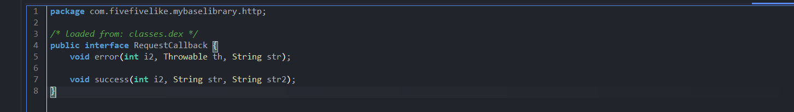

接口，回去找 `requestCallback -> this.mRequestCallback`


这里找到赋值位置，所以时前面的build塞进去的requestCallback


hook一下就行


下面这个方法有点问题

由于是响应搜 JSONobject相关的


hook验证走了这里，然后i3是code，正常返回的话是0

所以走 `onDataSuccess`

然后继续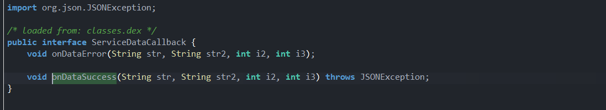

是个接口，我们去找调用这个的实例，hook打印一下

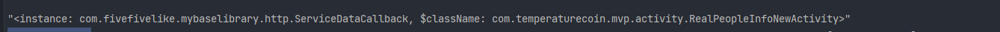

拿到类名，去搜一下

发现没搜到，可能反编译有点问题

最后实际上在 `com.fivefivelike.mybaselibrary.base.BaseDataBindFragment`，这可能安卓activity进行绑定有关

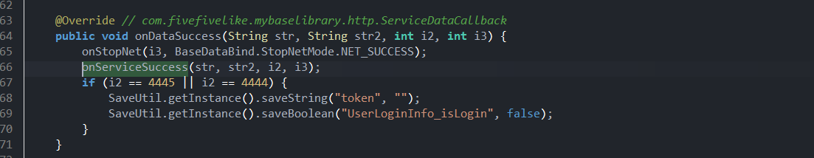


点进去


找到这里用了


看so层


点进去看看

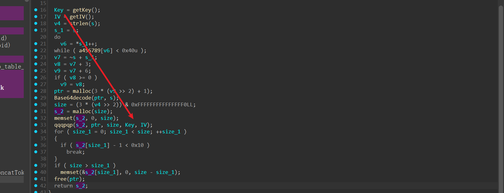

先是b64解码然后再进入 `qqqpqp` 中进行解密，解好了给s_2最后返回

我们先看看key和iv

直接hook函数拿到值


key和iv都是一样的

进到函数拿的都是全局变量


`e6 5e a7 02 3d 74 8f f5 22 56 6e 32 ca df ae 88`

我们去测试一下

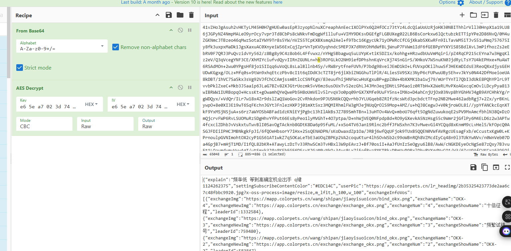

没啥问题

接下来写一下python


搞定