# 获取小说内容

随便点一个小说，指定章节点击

## 接口分析

抓包看看


发包测试一下


这里面主要是vchter必须带着，看这名字像是characpter

请求参数中：主要是vpage变了，而且疑似第六章的vpage是7，数字是额外+1；其他参数没变，暂时不确定是什么

接下来看请求头

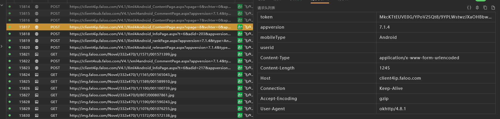


，发现可疑的只有token，发包测测


但是测试发现主要是这两个得带着

测试过程中发现，如果去掉了，得到的结果是固定的

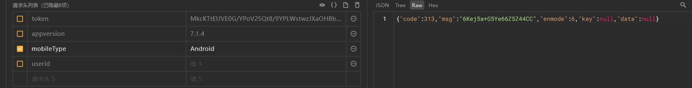

直接b64解码尝试


发现是汉字，说明这里存在b64，我们把正确的值拿来解一下

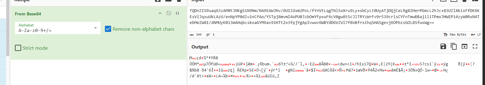

这样是乱码，可能是还有其他操作

请求体

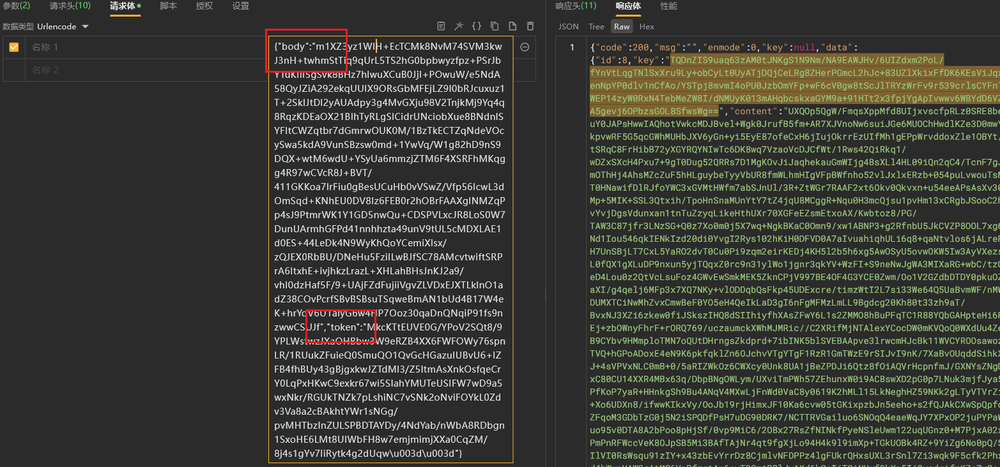

有个body，然后还有个token，token和请求头的一致，我们尝试删除

把删了之后给的msg解密一下

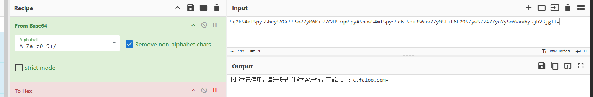

不能删，删了之后返回的msg解密是这样

观察响应体


看这样子主要是key和content，这很像是rsa+aes之类的


## 定位

我怀疑这个用到了java自带的加密，因为手写rsa什么的不算很方便；

所以使用算法助手pro进行hook


一个一个来

### token

`KSVgtrV0yvKFnpdsBbhOvjLyt` 

从抓包的数据中复制一部分去算法助手搜

找到了

```text
RSA/ECB/PKCS1Padding
key(b64): MIIBIjANBgkqhkiG9w0BAQEFAAOCAQ8AMIIBCgKCAQEAtRszcgwT8IKs+apnMyo13tRbZrwXio+o5M2eS6dSjbQHQRaT1vi30lzWIr5O/7AhN+0B7xqa1J7Sgot1MB45i4ncoUVoXFYXJ85PS5v6CIlFV3PiL10AlIe9Q+l+1KWyjAQ6izyDjNwlevlVb6oWGDmi6IOE6IjpYy3JZ2+AtXz6MrUYBvpdVIDoDXjfaeiwYLe/aYqQM3s9y49Lw3SYaalit9afcb9SnStMYE2Nq1VTGiDollO09tWZyspE1gA/ltB8Kqe+U0vfv2N2ndI0BPAMGJybmR64nhnOfgoO6UB8MnVjC8gQjoXvBaD22cVCxmDjwBXGDyRNFvx+GxF9kQIDAQAB

plain(string): e55553384352085b1a55748300b274c1
plain(b64): ZTU1NTUzMzg0MzUyMDg1YjFhNTU3NDgzMDBiMjc0YzE=
plain(hex): 6535353535333338343335323038356231613535373438333030623237346331

加密结果b64就是token了
```

我们观察一下，感觉明文像是 `e55553384352085b1a55748300b274c1`，长度32，可能是某个的md5之类的

观察发现是pkcs1填充，这会导致加密结果随机，所以我们再次抓一个包看明文是不是一样的

string变成 `81d70adb392bb83145be6b6ff223de37` 了，我们搜一下这个看看能不能找到是不是md5


看见了md5，甚至还有aes；看样子某个地方用了这个token进行加密

md5明文是`1750247506981` 得到 `81d70adb392bb83145be6b6ff223de37` 再进行RSA得到token

这是个时间戳，对比抓包的参数，好像只有body内会携带这个东西了

接下来我们看aes

```text
AES/CBC/PKCS5Padding
key(string): 81d70adb392bb83145be6b6ff223de37
iv(hex): 00000000000000000000000000000000
	iv(string): 空, 所以我们用hex

plain: id=1216400&n=7&ispic=0&tid=2&time=2025-06-18 19:51:46.978&isdanben=0&key=94FFEFC439A8EAAD0D0B64BC42C3C2DE&isvip4node=0&time=2025-06-18 19:51:46.978&appversion=7.1.4&type=Android&channel=MAIN&p1=18ddb809396515f1a2146de36f6dc9a9_oaid_md5&p2=2712&p3=google_Pixel 2 XL_11_30&p4=taimen&p5=1440&p7=30&p8=&p9=0&p10=4.5.4.1&p11=1&p12=1&CPU=arm64-v8a&prid=18071adc031fff34c8c&umid=&imei=&oaid=18ddb809396515f1a2146de36f6dc9a9_oaid_md5&uuid=18ddb809396515f1a2146de36f6dc9a9_oaid_md5&lang=cn&mac=30:32:3A:30:30:3A:30:30:3A:30:30:3A:30:30:3A:30:30&lip=192.168.84.209&cip=&aid=&xp=0
```

解析成json看看

```python
{ 
    "id": "1216400",
    "n": "7",
    "ispic": "0",
    "tid": "2",
    "time": "2025-06-18 19:51:46.978",
    "isdanben": "0",
    "key": "94FFEFC439A8EAAD0D0B64BC42C3C2DE",
    "isvip4node": "0",
    "appversion": "7.1.4",
    "type": "Android",
    "channel": "MAIN",
    "p1": "18ddb809396515f1a2146de36f6dc9a9_oaid_md5",
    "p2": "2712",
    "p3": "google_Pixel 2 XL_11_30",
    "p4": "taimen",
    "p5": "1440",
    "p7": "30",
    "p8": "",
    "p9": "0",
    "p10": "4.5.4.1",
    "p11": "1",
    "p12": "1",
    "CPU": "arm64-v8a",
    "prid": "18071adc031fff34c8c",
    "umid": "",
    "imei": "",
    "oaid": "18ddb809396515f1a2146de36f6dc9a9_oaid_md5",
    "uuid": "18ddb809396515f1a2146de36f6dc9a9_oaid_md5",
    "lang": "cn",
    "mac": "30:32:3A:30:30:3A:30:30:3A:30:30:3A:30:30:3A:30:30",
    "lip": "192.168.84.209",
    "cip": "",
    "aid": "",
    "xp": "0"
}
```

好像主要都是设备信息，这里面还有什么id和n感觉像是章节信息

加密后的数据就是body


总上，token是请求当前时间戳，进行md5，再进行rsa加密后，最后进行b64编码


### body

前面提到了是对设备信息和当前小说信息进行了加密

我们再次抓包看看明文变化

```python
params = {
    "id": "1216400",
    "n": "8",
    "ispic": "0",
    "tid": "2",
    "time": "2025-06-18 19:51:46.975",
    "isdanben": "0",
    "key": "9712F9FCA92C3D93ABA77491504F79F3",
    "isvip4node": "0",
    "appversion": "7.1.4",
    "type": "Android",
    "channel": "MAIN",
    "p1": "18ddb809396515f1a2146de36f6dc9a9_oaid_md5",
    "p2": "2712",
    "p3": "google_Pixel 2 XL_11_30",
    "p4": "taimen",
    "p5": "1440",
    "p7": "30",
    "p8": "",
    "p9": "0",
    "p10": "4.5.4.1",
    "p11": "1",
    "p12": "1",
    "CPU": "arm64-v8a",
    "prid": "18071adc031fff34c8c",
    "umid": "",
    "imei": "",
    "oaid": "18ddb809396515f1a2146de36f6dc9a9_oaid_md5",
    "uuid": "18ddb809396515f1a2146de36f6dc9a9_oaid_md5",
    "lang": "cn",
    "mac": "30:32:3A:30:30:3A:30:30:3A:30:30:3A:30:30:3A:30:30",
    "lip": "192.168.84.209",
    "cip": "",
    "aid": "",
    "xp": "0"
}
```

和之前的对比一下

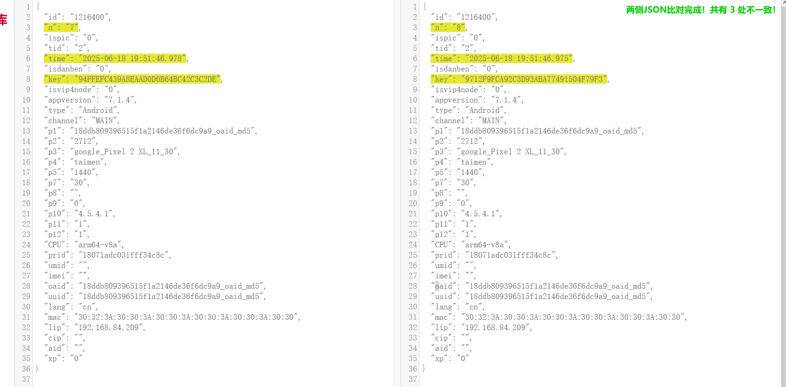


key变了，实际是id应该也变了，我们换一本书再次尝试

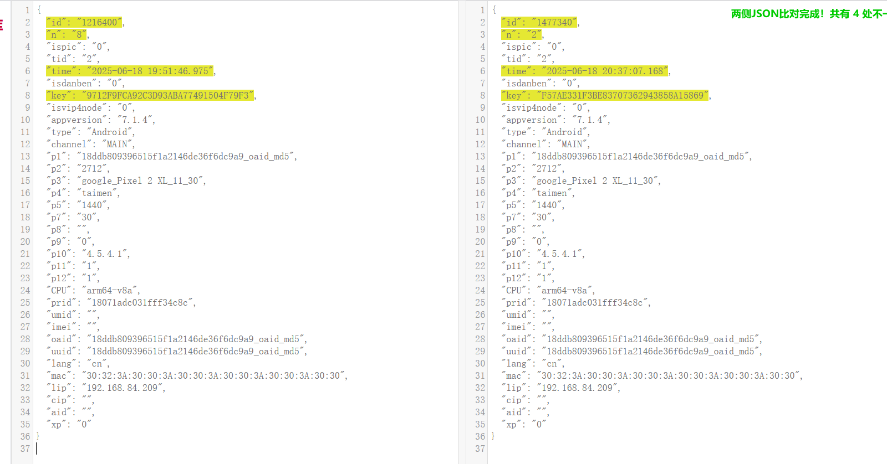


看样子id是书籍id，n是章节号


1750250227171

f1f30f81dcdf1b546fc9394f50a9d371

### body的key

body中有个key


算法助手找一下, 是md5然后大写

```python
~1216400$8^2025{06}18@19*51<46>-0o4MQlyrz2pQPRMLN2/TYAVBDkYN6FwTown1V1AAQJBANDww8VC6nqRM+teVqNNbzPbxzQLJUjgNzJ6FdX4OXhSDGQrYN62czDtUTfTXVOzZuDjJq7h+E17hd7ue/yQezsXuPPTsPKflgWOKCGhlKowdTNFABBdmq39hAkB1fhd/VSB/1G7zb/iCzoC84m2QsDVrfgLQSC3jGdeiLgJsbZdCP/oIqaPzOMqCyVzqNVwMkFiHJa2NM/AWnaFJAkB/a7.1.4
# md5 
9712f9fca92c3d93aba77491504f79f3
9712F9FCA92C3D93ABA77491504F79F3
```

这里看不太懂是啥，我们多找几个


```python
~1216400$7^2025{06}18@19*51<46>-0o4MQlyrz2pQPRMLN2/TYAVBDkYN6FwTown1V1AAQJBANDww8VC6nqRM+teVqNNbzPbxzQLJUjgNzJ6FdX4OXhSDGQrYN62czDtUTfTXVOzZuDjJq7h+E17hd7ue/yQezsXuPPTsPKflgWOKCGhlKowdTNFABBdmq39hAkB1fhd/VSB/1G7zb/iCzoC84m2QsDVrfgLQSC3jGdeiLgJsbZdCP/oIqaPzOMqCyVzqNVwMkFiHJa2NM/AWnaFJAkB/a7.1.4
# md5 
94ffefc439a8eaad0d0b64bc42c3c2de
94FFEFC439A8EAAD0D0B64BC42C3C2DE
```

好像和请求体有关


### 响应体key&data

算法助手没搜到,

我们搜一下解密后的汉字

<div>
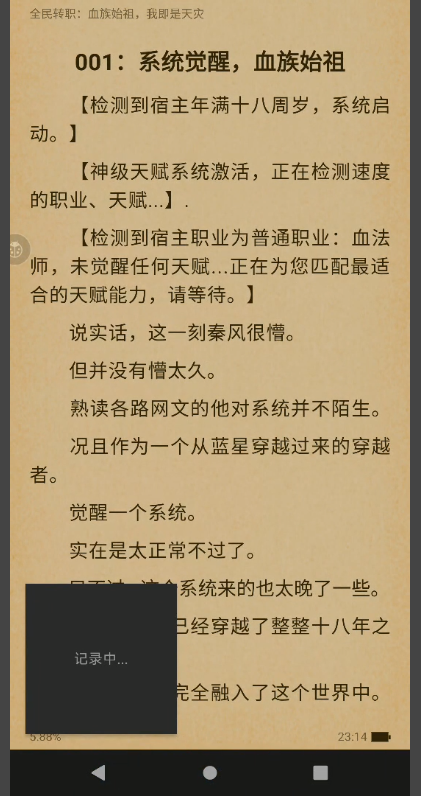
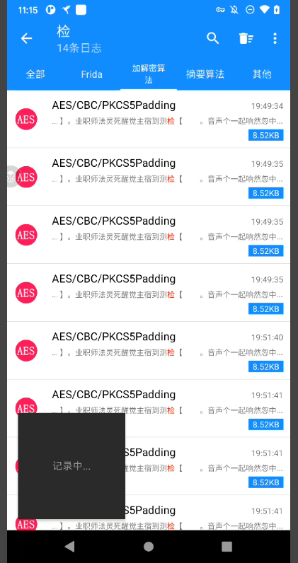
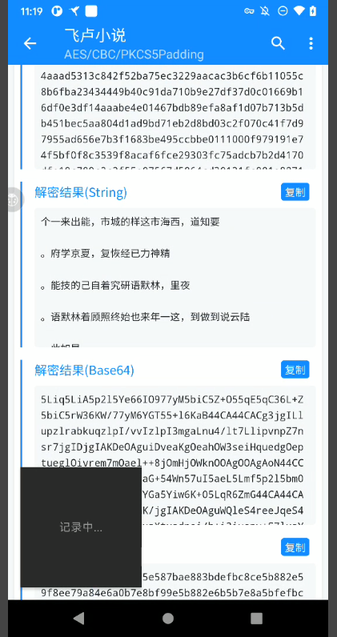
</div>

​    

所以实际上是有的，


<div>


</div>

这次我们倒着搜，确实有，和内容也对的上；


```python
AES/CBC/PKCS5Padding
key:bcde03204d418b66ca4adcb58dbc1695
iv:00000000000000000000000000000000
    
密文: e5c8a50eb7d035533667a12abbd88（只展示一部分）
解密效果：天【　　

。出跳次再，板面的新全个一，刻一下　　

。钮按】能技赋天【击点，奇好着带风秦　　

”？力能动主有拥还，赋天个这非莫“　　
所：二注备　　

。次1：数次余剩前目。力能的拥初次一得获将都，次一职转每：一注备　　

```

这里的key一定和返回的key有关，应该是返回的key经过rsa私钥解密得到

我们搜一下密文来源，也没搜到；


我们只能去看调用栈了

```python
at com.faloo.util.AES.decrypt(Proguard:238)
at com.faloo.util.EncryptUtil._e11(Native Method)
at com.faloo.util.EncryptUtil.jieHunXiaoString4DeCode(Proguard:412)
at com.faloo.common.encry.EncryptionUtil.getChapterContent(Proguard:234)
at com.faloo.app.read.weyue.utils.BookManager.getChapterData_e11(Proguard:243)
at com.faloo.app.read.weyue.widget.page.NetPageLoader.getChapterData(Proguard:218)
at com.faloo.app.read.weyue.widget.page.NetPageLoader.loadPageList(Proguard:170)
at com.faloo.app.read.weyue.widget.page.PageLoader$6.subscribe(Proguard:3615)
at io.reactivex.internal.operators.observable.ObservableCreate.subscribeActual(Proguard:40)
at io.reactivex.Observable.subscribe(Proguard:12246)
at io.reactivex.internal.operators.observable.ObservableSubscribeOn$SubscribeTask.run(Proguard:96)
at io.reactivex.Scheduler$DisposeTask.run(Proguard:578)
at io.reactivex.internal.schedulers.ScheduledRunnable.run(Proguard:66)
at io.reactivex.internal.schedulers.ScheduledRunnable.call(Proguard:57)
```

app记得脱壳，还需要修复；使用了腾讯加固


跟栈

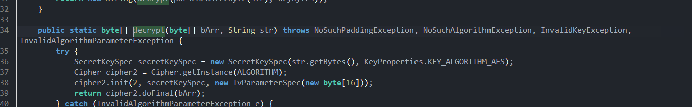

这里的bArr是密文，然后str是用作key了，iv是空的，也就是16个 `\0`

我们继续跟栈`com.faloo.util.EncryptUtil._e11`

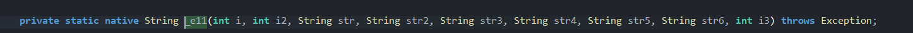

这个意思是native函数内部调用了java方法，也就是说so层调用了jni方法去寻找decrypt

这里我们可疑hook这个函数查看传参


存在frida检测，替换检测函数就行

```
EncryptUtil._e11 is called: 
    i=1216400,  # 书籍id
    i2=7,  # 章节id
    str=Wz5k8gj8boB4bH3h3QIsfl5Fb3SMHoSPm6MTg(省略很长部分),  # 密文
    str2=EDD371E61C93B7FC55C038FC0DE268BA, # 
    str3=,  # usename，没登录就没有
    str4=18ddb809396515f1a2146de36f6dc9a9_oaid_md5, # 设备信息
    str5=121640070, # 书籍id
    str6=, 
    i3=2
```

所以主要就是这个str2，我们算法助手找一下，嗯。没搜到

接下来继续跟栈 `com.faloo.util.EncryptUtil.jieHunXiaoString4DeCode` 

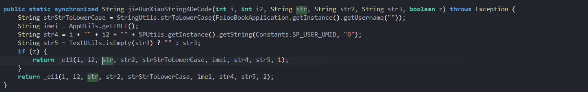

继续跟

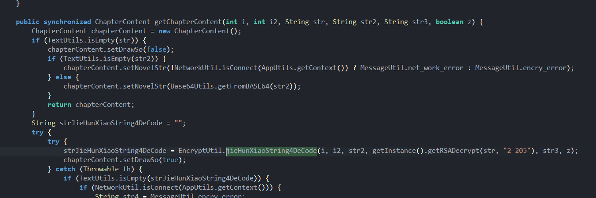


这里发现第四个参数是 `rsadecrypt` 得到的，传入了str；而str2是密文

hook看看


这里发现与抓包的对应了，接下来看看是如何生成的key


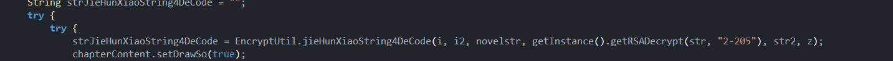

点进去


一般都是第一次就解出来了，所以我们直接看第一个return

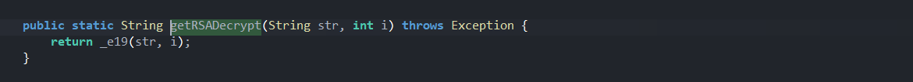


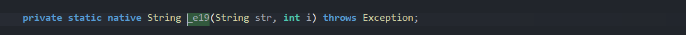

先hook看看第二个参数是什么，

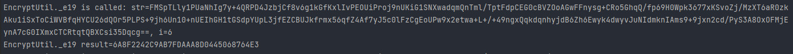

固定6


这下流程搞清楚了，响应体的key是传入e19进行解密，拿到key之后传给e11进行解密content


接下来去看so层

首先是定位so，发现这个类没有，我们使用hook注册去找


接下来去看so层 `2c2cd4` 和 `2c49e4`


调整一下参数类型

倒着看


跟v35


这里有很强的控制流混淆

我们跟v11就行

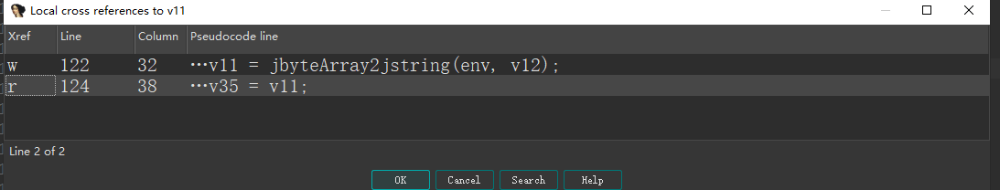

这里是v12转的


v12是调用了一个jni方法得到的

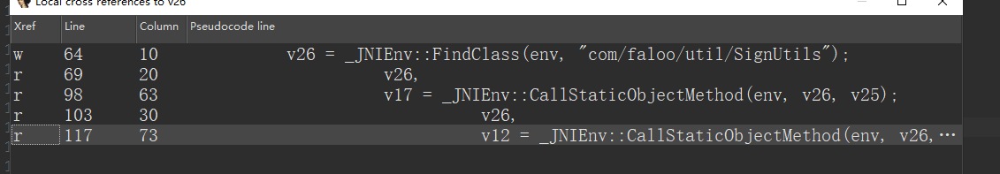

先搞懂是哪个类的 `com/faloo/util/SignUtils`


v16是这个方法，这里先是传了参数，但是调用的时候没传，反编译出了点问题

不过不影响

我们看这个函数签名，应该是java语言的东西，加下来只需要知道传入的参数是什么就行

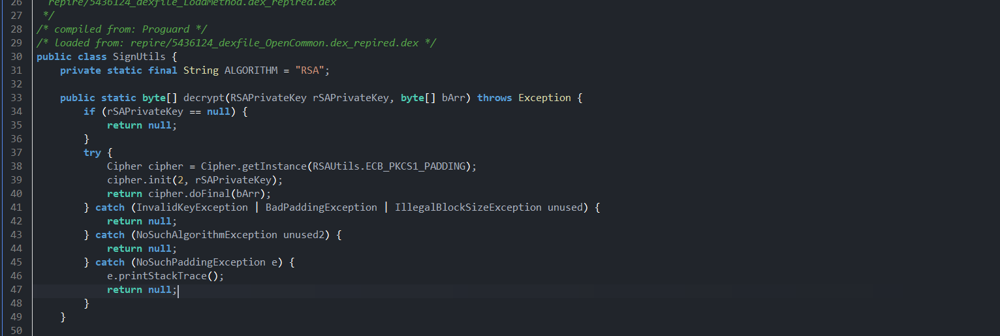

java层传入的直接就是解密好的 `rSAPrivateKey` 了

所以我们需要找到so层哪个地方解密的


反编译有点问题，不太好跟变量，不过这里看见了一个这个

我们去java层看看

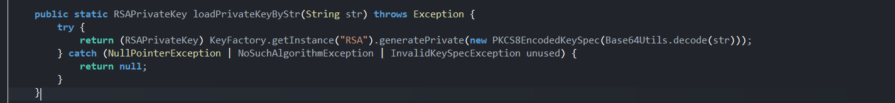

这个意思就是，传过来的私钥字符串时pkcs8格式的

这个我们只需要hook传入的私钥字符串然后python实现就行

代码看后面


到这里我们已经能解析出加密用的密钥了

我们把密钥拿去算法助手搜一下，发现走了某个md5, 看看堆栈

<div>


</div>

堆栈中走了e11方法，也就是前面提到的解密出文本的函数

我们搜一下md5之后的数据 `3adf70822980793d5308c9ff79fb6093`，结果发现有aes用了

<div>

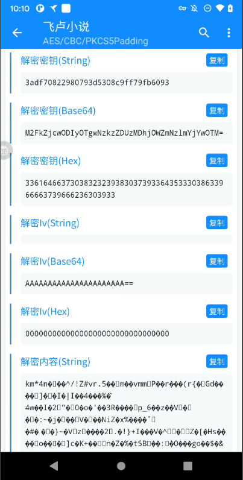

</div>
看这样子走的是aes加密，密钥就是这个md5，iv是空

密钥md5是如何生成的，看一下明文

`BC8760AB2EEB5F1B2E3101234669301B1444973200(-32jslwxwfqwcdceewwqz08-9fj2:J18ddb809396515f1a2146de36f6dc9a9_oaid_md5`

第一部分 `BC8760AB2EEB5F1B2E3101234669301B` 是rsa解密的key

最后一部分有一个oaid `18ddb809396515f1a2146de36f6dc9a9_oaid_md5`

剩下的 `1444973200(-32jslwxwfqwcdceewwqz08-9fj2:J`


对比一下，有一个章节相关信息字符串 `1444973200`（这里我截图并不完全正确，不过影响不大

这个str5 字符串，准确来说是小说字符串：书籍id+章节号+0

剩下 `(-32jslwxwfqwcdceewwqz08-9fj2:J` 不确定，我们搜一下，搜出来184条，感觉是固定的，去ida中验证一下


也就是e11 `0x2c49e4`

函数参数类型改改 `jstring __fastcall __a_O_(_JNIEnv *env, jclass clazz, jint bookId, jint chapterId, jstring content, jstring key, jstring str3_null, jstring oaid_md5, jstring bookId_str, jint str6_null, jint num_2)
`


让ai解析一下这个函数

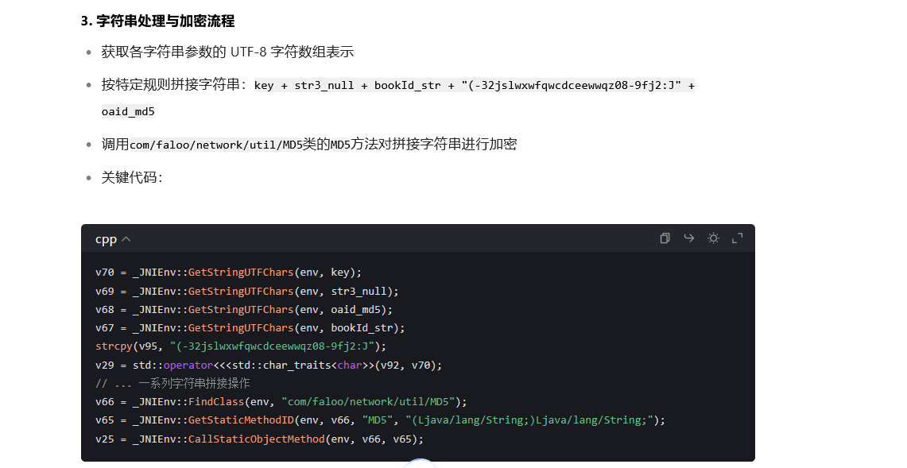

这是前面的key拼接的地方，和我们分析的一样

我们在算法助手中找到的密文，与java层传入的不一致，所以可能做了额外处理，问下ai


接下来去研究如何进行交换的


首先是找到那里native方法调用解密的函数位置

```python
at com.faloo.util.AES.decrypt(Proguard:238)
at com.faloo.util.EncryptUtil._e11(Native Method)
at com.faloo.util.EncryptUtil._e11(Native Method)
at com.faloo.util.EncryptUtil.jieHunXiaoString4DeCode(Proguard:410)
```

decrypt函数 我们去看一下java层签名

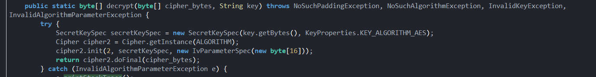


`decrypt([BLjava/lang/String;)[B`

去ida搜一下

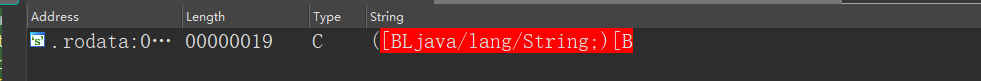

找到对应的变量

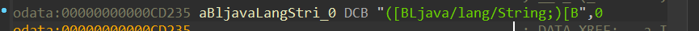

再查找引用


找到了


这个函数是在 `__a_I`中的，我们解密的外层函数是 ` __a_0`


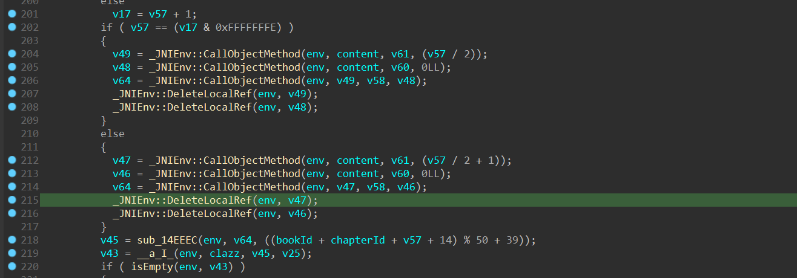

找到了，是这里，传入的v45就是处理过的

我们先弄明白参数是什么

首先是v57


这里可疑看出来是调用了一个jni方法得到的数字，然后调用的对象是content，调用的方法是length，所以实际是传入的密文长度

接下来看v64

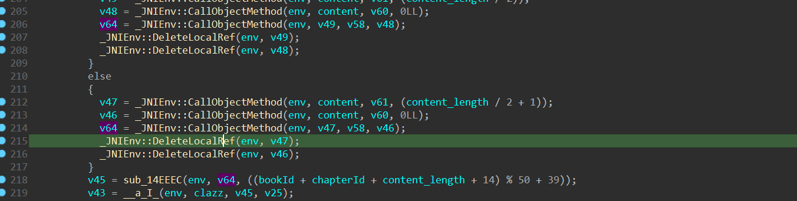

v64是调用了一个方法，主要是和v47，v58，v46有关

v47是一个方法返回来的


v58是v47调用了concat方法，传入了v46

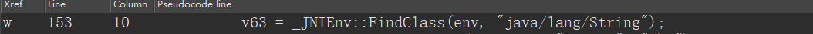

v63是字符串，所以实际上是进行了字符串拼接

把v47和v46拼接起来了；还有一种情况是，v49和v48拼接了

接下来看看这两个是字符串是怎么生成的

v47是调用了 密文的v61方法，传入了后面的索引


这是一个切片方法，说白了就是取后半部分


而v49也是，不过这里没有+1


v60也是，不过传入的是两个索引

我们看一下判断条件


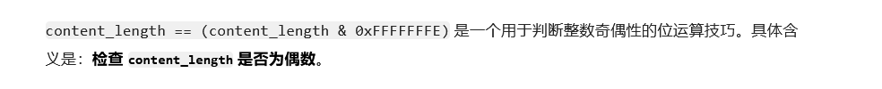

如果长度是偶数就把后半部分取出来，

这里v48可能是反编译有点问题，丢失了一个参数，应该是前半部分，我们点击函数，把参数改成可变参数

再退出来进行反编译就正确了


接下来看sub_14EEEc怎么做的


这里进去之后把名字改改


## 算法还原

### token


### body

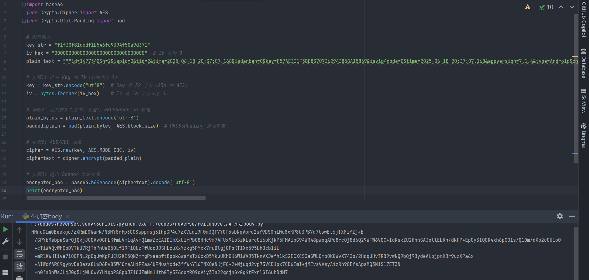


### key


### 拿到私钥


`BC8760AB2EEB5F1B2E3101234669301B1444973200(-32jslwxwfqwcdceewwqz08-9fj2:J18ddb809396515f1a2146de36f6dc9a9_oaid_md5`

第一部分 `BC8760AB2EEB5F1B2E3101234669301B` 是rsa解密的key

最后一部分有一个oaid `18ddb809396515f1a2146de36f6dc9a9_oaid_md5`

剩下的 `1444973200(-32jslwxwfqwcdceewwqz08-9fj2:J`

照这个格式赛一下计算一下就行


### content

先写个交换


然后进行分块处理

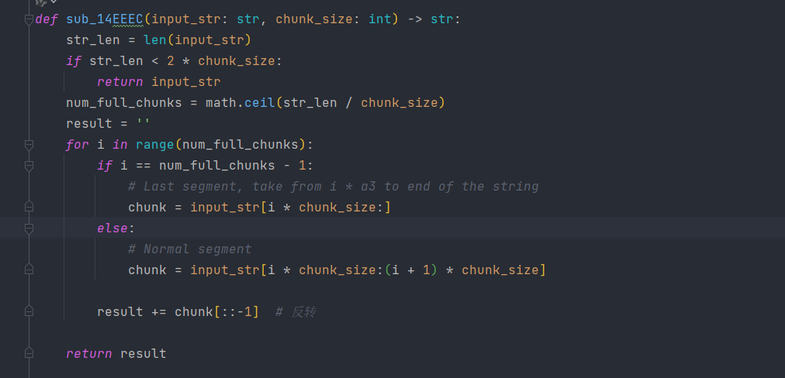


这样就行

最后再走一个aes解密

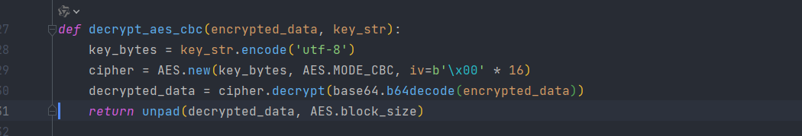

搞定

