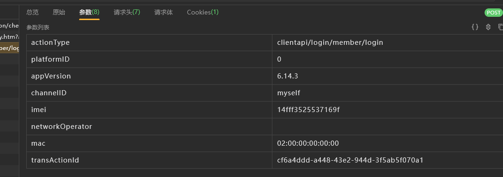
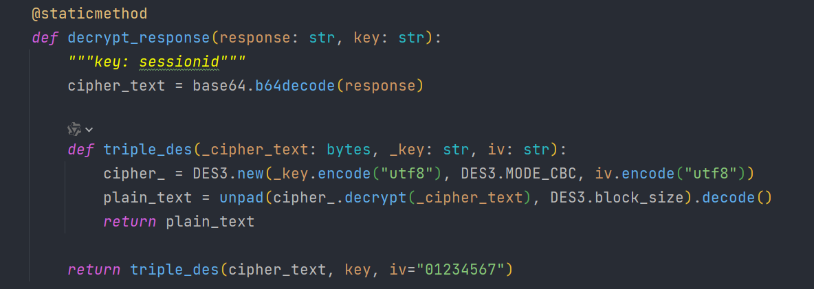
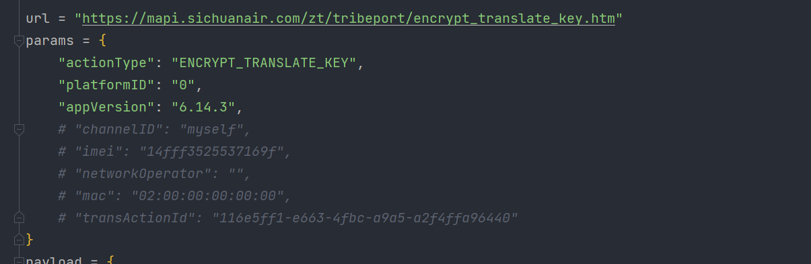
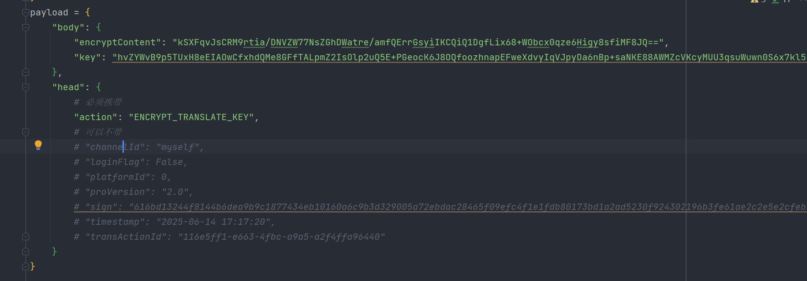

# 登录接口

## 抓包分析


请求参数



没啥特殊的，imei应该是标准算法，mac随机搞一个，transActionId应该是随机uuid

请求头


有一个sessionid要注意一下，长度32，疑似md5

请求体


很明显加密了


响应体也是很明显加密了


## sessionid

算法助手配合抓包分析一下

1. 某个请求返回回来的，解密得到sessionid

2. 加密请求体

   


## 请求头加密

算法助手配合抓包找一下

这个key是sessionid的前24部分


python还原一下


## 响应体解密





# sessionid获取接口

## 发包分析

python发包测试一下



请求参数，主要是这3个得带上



请求体中，主要是这三个，其中有两个加密的；

看这样子像是rsa


请求头参数可以不带


## encryptContent

算法助手搜一下，好像没啥东西

```python
算法类型：desede/CBC/PKCS5Padding
加密秘钥（文本）：&platformID=0&appVersion
加密Iv（文本）：01234567

加密内容（文本）：&platformID=0&appVersion=6.14.3&channelID=myself&imei=14fff3525
加密结果（Base64）：kSXFqvJsCRM9rtia/DNVZW77NsZGhDWatre/amfQErrGsyiIKCQiQ1DgfLix68+WObcx0qze6Higy8sfiMF8JQ==
调用堆栈：
        at com.bw.zsch.client.android.service.util.DESedeUtil.encryptThreeDESECB(DESedeUtil.java:25)
        at com.bw.zsch.client.android.service.encrypt.EncrypInterfaceVerifyUtil.encryptVerfication(EncrypInterfaceVerifyUtil.java:37)
        at com.bw.zsch.client.android.EncryptBeforeReqManager.moreRequest(EncryptBeforeReqManager.java:73)
        at com.bw.zsch.client.android.service.encrypt.EncryptUtils.encrypt(EncryptUtils.java:43)
        at com.bw.zsch.client.android.service.ServiceDataImpl.queryHotCity(ServiceDataImpl.java:548)
        at com.bw.zsch.VersionUpdateUtils.getHotCitList(VersionUpdateUtils.java:162)
        at com.bw.zsch.VersionUpdateUtils.initData(VersionUpdateUtils.java:98)
        at com.bw.zsch.MainActivityTab.onCreate(Native Method)
        at android.app.Activity.performCreate(Activity.java:8000)
        at android.app.Activity.performCreate(Activity.java:7984)
        at android.app.Instrumentation.callActivityOnCreate(Instrumentation.java:1309)
        at android.app.ActivityThread.performLaunchActivity(ActivityThread.java:3422)
        at android.app.ActivityThread.handleLaunchActivity(ActivityThread.java:3601)
        at android.app.servertransaction.LaunchActivityItem.execute(LaunchActivityItem.java:85)
        at android.app.servertransaction.TransactionExecutor.executeCallbacks(TransactionExecutor.java:135)
        at android.app.servertransaction.TransactionExecutor.execute(TransactionExecutor.java:95)
        at android.app.ActivityThread$H.handleMessage(ActivityThread.java:2066)
        at android.os.Handler.dispatchMessage(Handler.java:106)
        at android.os.Looper.loop(Looper.java:223)
        at android.app.ActivityThread.main(ActivityThread.java:7656)
        at java.lang.reflect.Method.invoke(Native Method)
        at com.android.internal.os.RuntimeInit$MethodAndArgsCaller.run(RuntimeInit.java:592)
        at com.android.internal.os.ZygoteInit.main(ZygoteInit.java:947)


```

## key

算法助手

```python
算法类型：RSA

加密秘钥（Base64）：MIGfMA0GCSqGSIb3DQEBAQUAA4GNADCBiQKBgQCdqp4yZcGX2yVCsM2itn3R35JW1rJwqEXHTHw+QkdMYKqFUo9svO7LD+U/tqXGjKeSu3oLc3B49P3j62Ex2w1As9Q75Ibf53fUkox4MwzwjaouMurpzwNwMJg7BE+8zwAUJFZvwP7P/ses87N2nje/m/wy7Xm2zREkOfhfNAaY5QIDAQAB

加密Iv（Base64）：bnVsbA==

加密内容（文本）：&platformID=0&appVersion=6.14.3&channelID=myself&imei=14fff3525
加密结果（Base64）：hvZYWvB9p5TUxH8eEIAOwCfxhdQMe8GFfTALpmZ2IsOlp2uQ5E+PGeocK6J8OQfoozhnapEFweXdvyIqVJpyDa6nBp+saNKE88AWMZcVKcyMUU3qsuWuwn0S6x7kl5RfI5qVZFVJYYdYYkE94UCGlQRtyrcs8NCtKVCIpsC/Ook=

调用堆栈：
        at com.bw30.zsch.security.BwSecurityNative.sign(Native Method)
        at com.bw.zsch.client.android.service.encrypt.EncrypInterfaceVerifyUtil.encryptVerfication(EncrypInterfaceVerifyUtil.java:42)
        at com.bw.zsch.client.android.EncryptBeforeReqManager.moreRequest(EncryptBeforeReqManager.java:73)
        at com.bw.zsch.client.android.service.encrypt.EncryptUtils.encrypt(EncryptUtils.java:43)
        at com.bw.zsch.client.android.service.ServiceDataImpl.queryHotCity(ServiceDataImpl.java:548)
        at com.bw.zsch.VersionUpdateUtils.getHotCitList(VersionUpdateUtils.java:162)
        at com.bw.zsch.VersionUpdateUtils.initData(VersionUpdateUtils.java:98)
        at com.bw.zsch.MainActivityTab.onCreate(Native Method)
        at android.app.Activity.performCreate(Activity.java:8000)
        at android.app.Activity.performCreate(Activity.java:7984)
        at android.app.Instrumentation.callActivityOnCreate(Instrumentation.java:1309)
        at android.app.ActivityThread.performLaunchActivity(ActivityThread.java:3422)
        at android.app.ActivityThread.handleLaunchActivity(ActivityThread.java:3601)
        at android.app.servertransaction.LaunchActivityItem.execute(LaunchActivityItem.java:85)
        at android.app.servertransaction.TransactionExecutor.executeCallbacks(TransactionExecutor.java:135)
        at android.app.servertransaction.TransactionExecutor.execute(TransactionExecutor.java:95)
        at android.app.ActivityThread$H.handleMessage(ActivityThread.java:2066)
        at android.os.Handler.dispatchMessage(Handler.java:106)
        at android.os.Looper.loop(Looper.java:223)
        at android.app.ActivityThread.main(ActivityThread.java:7656)
        at java.lang.reflect.Method.invoke(Native Method)
        at com.android.internal.os.RuntimeInit$MethodAndArgsCaller.run(RuntimeInit.java:592)
        at com.android.internal.os.ZygoteInit.main(ZygoteInit.java:947)


```


## sign

```python
时间：2025-06-14 17:17:20

算法类型：RSA

Key类型：com.android.org.conscrypt.OpenSSLRSAPublicKey
加密秘钥（Base64）：MIGfMA0GCSqGSIb3DQEBAQUAA4GNADCBiQKBgQCdqp4yZcGX2yVCsM2itn3R35JW1rJwqEXHTHw+QkdMYKqFUo9svO7LD+U/tqXGjKeSu3oLc3B49P3j62Ex2w1As9Q75Ibf53fUkox4MwzwjaouMurpzwNwMJg7BE+8zwAUJFZvwP7P/ses87N2nje/m/wy7Xm2zREkOfhfNAaY5QIDAQAB

加密内容（文本）：b0a65721cf391e9673865bd5c5c79b1a
加密内容（Base64）：YjBhNjU3MjFjZjM5MWU5NjczODY1YmQ1YzVjNzliMWE=
加密内容（Hex）：6230613635373231636633393165393637333836356264356335633739623161

加密结果（Hex）：616bd13244f8144b6dea9b9c1877434eb10160a6c9b3d329005a72ebdac28465f09efc4f1e1fdb80173bd1a2ad5230f924302196b3fe61ae2c2e5e2cfebb91776b81032db9a7ef6d6e2cff648fc9aa7ecc01a1e981b69c2c1173143f5b9fd051f7a5ec106d035ecb2d1c8c749cc5cd5df3b1d951612e8def924cff11e5091dd4


调用堆栈：
        at com.bw30.zsch.security.BwSecurityNative.reqSign(Native Method)
        at com.bw.zsch.client.android.service.encrypt.EncrypInterfaceVerifyUtil.encryptVerfication(EncrypInterfaceVerifyUtil.java:61)
        at com.bw.zsch.client.android.EncryptBeforeReqManager.moreRequest(EncryptBeforeReqManager.java:42)
        at com.bw.zsch.client.android.service.encrypt.EncryptUtils2.encrypt(EncryptUtils2.java:43)
        at com.bw.zsch.client.android.service.ServiceDataImpl.callWeb2(ServiceDataImpl.java:4443)
        at com.bw.zsch.member.login.LoginActivity.lambda$doLogin$16$com-bw-zsch-member-login-LoginActivity(LoginActivity.java:500)
        at com.bw.zsch.member.login.LoginActivity$$ExternalSyntheticLambda19.onToken(Unknown Source:4)
        at com.bw.zsch.dxrisk.DXRiskUtils$1.run(DXRiskUtils.java:69)


```

搜一下 `b0a65721cf391e9673865bd5c5c79b1a`


```python
签名类型：MD5
签名数据（文本）：2025-06-14116e5ff1-e663-4fbc-a9a5-a2f4ffa964402822563731
			   2025-06-14 -> 当前日期
						 116e5ff1-e663-4fbc-a9a5-a2f4ffa96440 -> transActionId
        													 2822563731 -> ?
签名结果（Hex）：b0a65721cf391e9673865bd5c5c79b1a
签名结果（Base64）：sKZXIc85HpZzhlvVxcebGg==

调用堆栈：
        at UNUyF.fpXjgXI.r.wzvoOk.JungeSpoxedBridge$LegacyApiSupport.handleAfter(Unknown Source:33)
        at org.lsposed.lspd.impl.LSPosedBridge$NativeHooker.callback(Unknown Source:279)
        at LSPHooker_.digest(Unknown Source:8)
        at java.security.MessageDigest.digest(MessageDigest.java:448)
        at java.lang.reflect.Method.invoke(Native Method)
        at ZjzvstKulQll.h.Hyvu.CYYNUEz.L.HookBridge.invokeOriginalMethod(Native Method)
        at org.lsposed.lspd.impl.LSPosedBridge$NativeHooker.callback(Unknown Source:187)
        at LSPHooker_.digest(Unknown Source:11)
        at com.bw30.zsch.security.BwSecurityNative.reqSign(Native Method)
        at com.bw.zsch.client.android.service.encrypt.EncrypInterfaceVerifyUtil.encryptVerfication(EncrypInterfaceVerifyUtil.java:61)
        at com.bw.zsch.client.android.EncryptBeforeReqManager.moreRequest(EncryptBeforeReqManager.java:42)
        at com.bw.zsch.client.android.service.encrypt.EncryptUtils2.encrypt(EncryptUtils2.java:43)
        at com.bw.zsch.client.android.service.ServiceDataImpl.callWeb2(ServiceDataImpl.java:4443)
        at com.bw.zsch.member.login.LoginActivity.lambda$doLogin$16$com-bw-zsch-member-login-LoginActivity(LoginActivity.java:500)
        at com.bw.zsch.member.login.LoginActivity$$ExternalSyntheticLambda19.onToken(Unknown Source:4)
        at com.bw.zsch.dxrisk.DXRiskUtils$1.run(DXRiskUtils.java:69)


```

