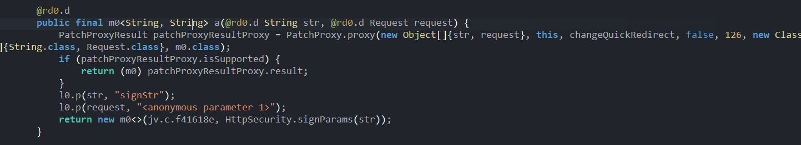
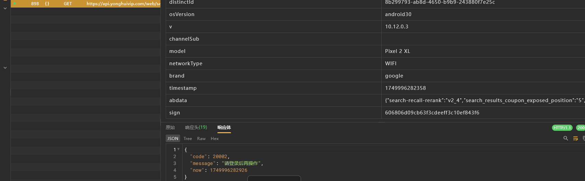
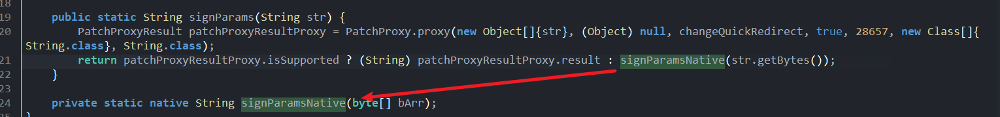
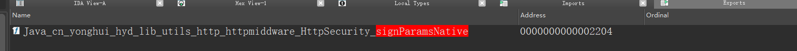
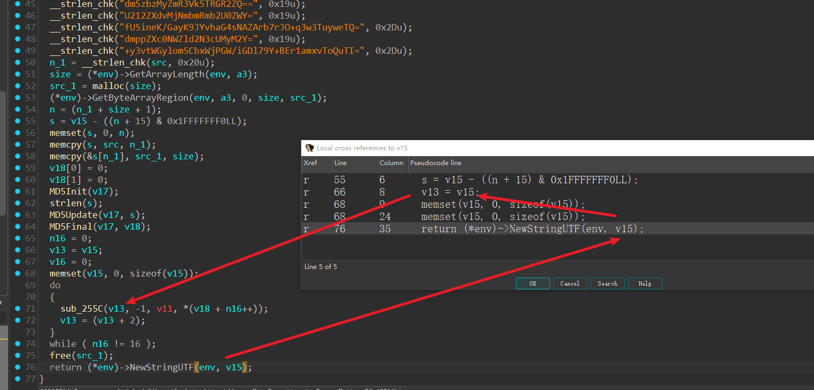
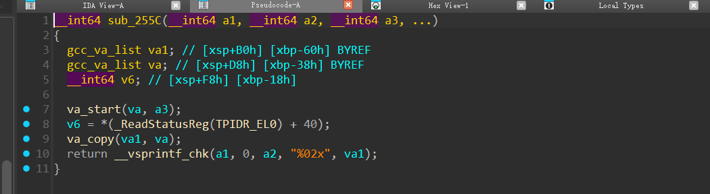
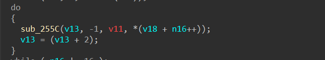

#  sign

永辉生活v10.12.0.3 难度很低

这里找一下搜索接口


抓包中的这个sign

直接搜一下


去掉一些杂七杂八的sdk，关注软件自身的包



其中的signparams比较可疑，hook确认一下


配合抓包



hook日志中搜一下 `606806d09cb63f3cdeeff3c10ef843f6`


这里发现确实是，我们看如何 `signparams` 怎么写的



所以实际上是传入了map字符串，然后转字节，在进入native函数

拿一下传入参数，验证是否是常用加密

```python
abdata{"search-recall-rerank":"v2_4","search_results_coupon_exposed_position":"5","participial_phrase":"search_recall_newseg","search_algo_search_v7_reRank_level":"no_model","search_public_ab":"level_test","category_predict":"v2","search_v7_reRank":"search_rank_normal","ngram_version":"ngram_v2","search_results_nostock_sku_v8100":"0","app_searchResult_billboard_abt_9110":"1"}brandgooglechannelqqchannelMainofficialchannelSubdeviceid16f91a54-8cbc-4877-9ca8-748151e313eedistinctId8b299793-ab8d-4650-b9b9-243880f7e25celderly0enableCorrection1jysessionide416cdfb-8fef-4934-b11b-56296d506379keywordhhhh2modelPixel 2 XLnetworkTypeWIFIorder0ordertype0osandroidosVersionandroid30page0platformAndroidproductLineYhStorescreen1440*2712sellerid22shopidWTT002timestamp1749996282358v10.12.0.3
```

md5: `dbcc1f19e094189a38311b5d62a86ffc`

发现匹配不上，我们去so中查看代码


打开ida，导入so



发现是静态注册的

进去后，env啥的改一改


接下来看代码



直接找return，发现是v15，但是v15没有明显操作，找一下指针赋值位置

赋值给了v13，而v13经过了sub_255c，多次循环操作（16次）

点进去看



感觉就是个转16进制

我们推出去继续看v13来源



v13很明显和v18有关，所以主要观察v18


v18经过md5函数得到，传入参数v17

这里v17很像是一个 上下文那种，比如python的 hash_obj

所以我们去看v17相关


看样子只update了一个s进去

我们hook一下这个update函数以及dofinal函数

找到对应偏移 `ED0` 和 `1CC0`


这里发现ED0和我们传入的参数有关系，但是前面都加了点东西	`qUyo7xqCt5x8CdPS`

```python
qUyo7xqCt5x8CdPSabdata{"search-recall-rerank":"v2_4","search_results_coupon_exposed_position":"5","participial_phrase":"search_recall_newseg","search_algo_search_v7_reRank_level":"no_model","search_public_ab":"level_test","category_predict":"v2","search_v7_reRank":"search_rank_normal","ngram_version":"ngram_v2","search_results_nostock_sku_v8100":"0","app_searchResult_billboard_abt_9110":"1"}brandgooglechannelqqchannelMainofficialchannelSubdeviceid16f91a54-8cbc-4877-9ca8-748151e313eedistinctId8b299793-ab8d-4650-b9b9-243880f7e25celderly0enableCorrection1jysessionide416cdfb-8fef-4934-b11b-56296d506379keywordhhhh2modelPixel 2 XLnetworkTypeWIFIorder0ordertype0osandroidosVersionandroid30page0platformAndroidproductLineYhStorescreen1440*2712sellerid22shopidWTT002timestamp1749997478034v10.12.0.3
```

再次md5比对后，发现就是这段内容直接md5

