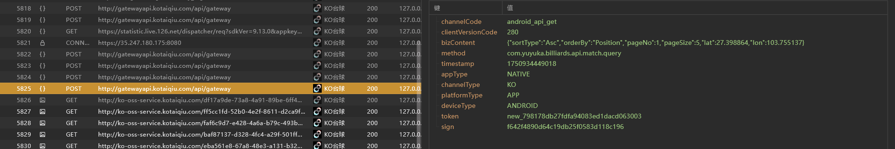
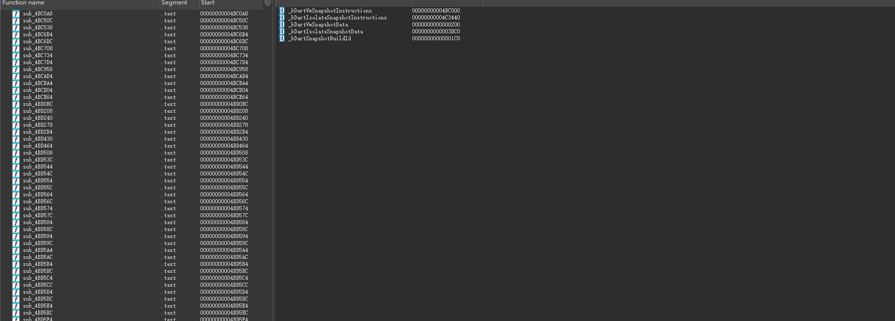
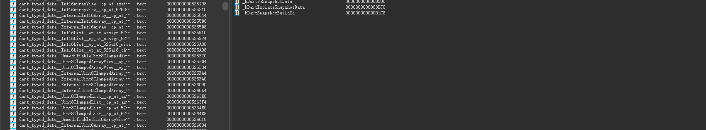
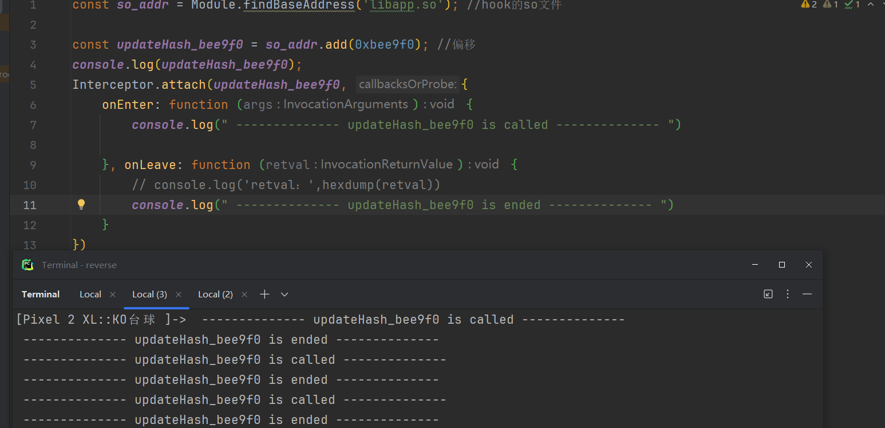
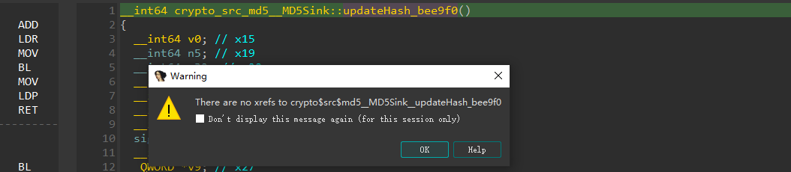
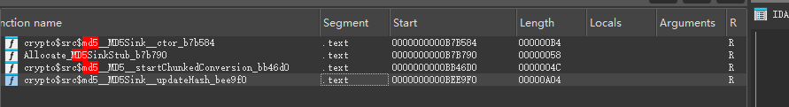
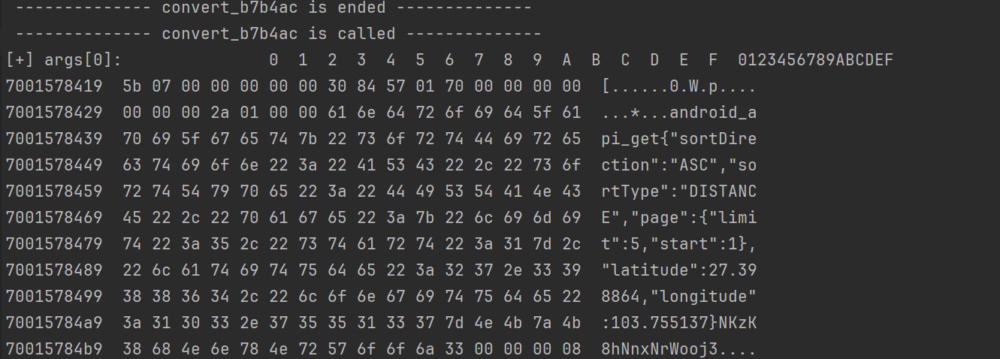
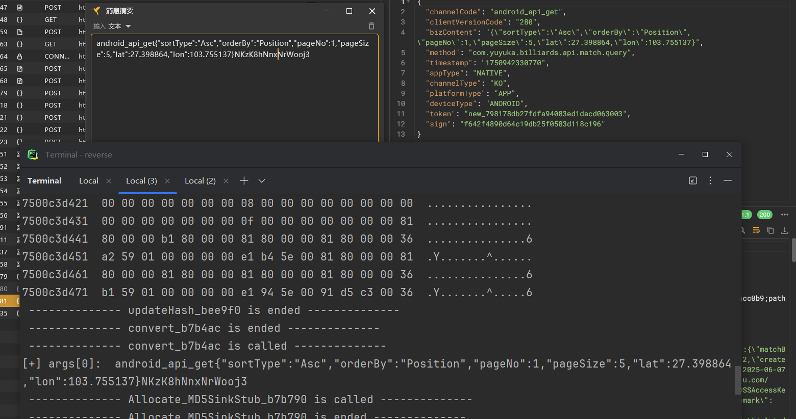

这个案例来自 带带弟弟学爬虫，有详细讲解视频，建议去看他的

# sign

## 定位

目标是抓首页的比赛信息


这实际上是一个flutter开发的app


但是我们使用reqable能够抓很多flutter开发的app的包，这是reqable在抓包的时候处理的；

如果我们使用其他抓包，可以使用proxybin，否则使用hook脚本进行去除flutter自带的ssl验证

接下来我们继续看参数

主要是请求体



其中, 我们发现主要是 经纬度，以及时间戳，还有就是token和sign


我们的目标就是解决sign加密

接下来打开jadx反编译看一下


没啥java代码，尝试搜一下也搜不到，这个实际代码走的是so层，也就是libapp.so

ida打开，代码比较多，我们等一下



函数特点是这样，全都是sub开头的，导出导入也很少；

既然我们知道了是使用flutter开发，那么一般都会使用flutter提供的api，所以我们可以拿flutter的api与这些sub函数进行比对，如果像的我们就把名字改了

那这里的话肯定是使用脚本来完成，我们使用开源项目blutter


首先是基础配置，去看blutter的使用说明；

然后是针对我们这个libapp.so进行操作，

打开 `x64 Native Tools Command Prompt for VS 2022`

然后进入到我们的blutter根目录 `cd C:\codes\reverse\blutter`

激活对应的python虚拟环境，然后执行命令【如果你是全局安装的话就不需要虚拟环境】

```bash
(.venv) C:\codes\reverse\blutter>python blutter.py C:\Users\xxx\Desktop\apks\ko台球\arm64 C:\Users\xxx\Desktop\apks\ko台球\out
```

这里的arm64存储了 `libapp.so` 和 `libflutter.so` ，然后后面的out是存储目录（生成对应的脚本）；out目录如下


我们主要关心的是ida脚本，用于还原符号

接下来打开ida -> File -> Script file -> 导入ida_script目录下的py文件 `addName.py`



等待ida加载完成后，大部分函数就还原回去了

接下来我们要做的就是在so层寻找加密函数，可以结合github上的futter源码判断是否是标准加密，如md5

我们这里去看一下flutter是如何实现的md5

我们问一下ai，加密模块在哪？

> ### 1. 查看 Flutter 官方 `crypto` 包（Dart 原生实现）
>
> https://github.com/dart-lang/crypto
>
> - md5：[`lib/src/md5.dart`](https://github.com/dart-lang/crypto/blob/master/lib/src/md5.dart)
> - hash：[`lib/src/hash.dart`](https://github.com/dart-lang/crypto/blob/master/lib/src/hash.dart)

我们扣下来看，注意是用dart语言实现的，所以我们大致读一下就行

```dart
// Copyright (c) 2012, the Dart project authors.  Please see the AUTHORS file
// for details. All rights reserved. Use of this source code is governed by a
// BSD-style license that can be found in the LICENSE file.

import 'dart:convert';
import 'dart:typed_data';

import 'digest.dart';
import 'hash.dart';
import 'hash_sink.dart';
import 'utils.dart';

/// An implementation of the [MD5][rfc] hash function.
///
/// [rfc]: https://tools.ietf.org/html/rfc1321
///
/// **Warning**: MD5 has known collisions and should only be used when required
/// for backwards compatibility.
const Hash md5 = _MD5._();

/// An implementation of the [MD5][rfc] hash function.
///
/// [rfc]: https://tools.ietf.org/html/rfc1321
///
/// **Warning**: MD5 has known collisions and should only be used when required
/// for backwards compatibility.
///
/// Use the [md5] object to perform MD5 hashing.
class _MD5 extends Hash {
  @override
  final int blockSize = 16 * bytesPerWord;

  const _MD5._();

  @override
  ByteConversionSink startChunkedConversion(Sink<Digest> sink) =>
      ByteConversionSink.from(_MD5Sink(sink));
}

/// Data from a non-linear mathematical function that functions as
/// reproducible noise.
const _noise = [
  0xd76aa478, 0xe8c7b756, 0x242070db, 0xc1bdceee, 0xf57c0faf, 0x4787c62a, //
  0xa8304613, 0xfd469501, 0x698098d8, 0x8b44f7af, 0xffff5bb1, 0x895cd7be,
  0x6b901122, 0xfd987193, 0xa679438e, 0x49b40821, 0xf61e2562, 0xc040b340,
  0x265e5a51, 0xe9b6c7aa, 0xd62f105d, 0x02441453, 0xd8a1e681, 0xe7d3fbc8,
  0x21e1cde6, 0xc33707d6, 0xf4d50d87, 0x455a14ed, 0xa9e3e905, 0xfcefa3f8,
  0x676f02d9, 0x8d2a4c8a, 0xfffa3942, 0x8771f681, 0x6d9d6122, 0xfde5380c,
  0xa4beea44, 0x4bdecfa9, 0xf6bb4b60, 0xbebfbc70, 0x289b7ec6, 0xeaa127fa,
  0xd4ef3085, 0x04881d05, 0xd9d4d039, 0xe6db99e5, 0x1fa27cf8, 0xc4ac5665,
  0xf4292244, 0x432aff97, 0xab9423a7, 0xfc93a039, 0x655b59c3, 0x8f0ccc92,
  0xffeff47d, 0x85845dd1, 0x6fa87e4f, 0xfe2ce6e0, 0xa3014314, 0x4e0811a1,
  0xf7537e82, 0xbd3af235, 0x2ad7d2bb, 0xeb86d391
];

/// Per-round shift amounts.
const _shiftAmounts = [
  07, 12, 17, 22, 07, 12, 17, 22, 07, 12, 17, 22, 07, 12, 17, 22, 05, 09, 14, //
  20, 05, 09, 14, 20, 05, 09, 14, 20, 05, 09, 14, 20, 04, 11, 16, 23, 04, 11,
  16, 23, 04, 11, 16, 23, 04, 11, 16, 23, 06, 10, 15, 21, 06, 10, 15, 21, 06,
  10, 15, 21, 06, 10, 15, 21
];

/// The concrete implementation of `MD5`.
///
/// This is separate so that it can extend [HashSink] without leaking additional
/// public members.
class _MD5Sink extends HashSink {
  @override
  final digest = Uint32List(4);

  _MD5Sink(Sink<Digest> sink) : super(sink, 16, endian: Endian.little) {
    digest[0] = 0x67452301;
    digest[1] = 0xefcdab89;
    digest[2] = 0x98badcfe;
    digest[3] = 0x10325476;
  }

  @override
  void updateHash(Uint32List chunk) {
    assert(chunk.length == 16);

    var a = digest[0];
    var b = digest[1];
    var c = digest[2];
    var d = digest[3];

    int e;
    int f;

    for (var i = 0; i < 64; i++) {
      if (i < 16) {
        e = (b & c) | ((~b & mask32) & d);
        f = i;
      } else if (i < 32) {
        e = (d & b) | ((~d & mask32) & c);
        f = ((5 * i) + 1) % 16;
      } else if (i < 48) {
        e = b ^ c ^ d;
        f = ((3 * i) + 5) % 16;
      } else {
        e = c ^ (b | (~d & mask32));
        f = (7 * i) % 16;
      }

      var temp = d;
      d = c;
      c = b;
      b = add32(
          b,
          rotl32(add32(add32(a, e), add32(_noise[i], chunk[f])),
              _shiftAmounts[i]));
      a = temp;
    }

    digest[0] = add32(a, digest[0]);
    digest[1] = add32(b, digest[1]);
    digest[2] = add32(c, digest[2]);
    digest[3] = add32(d, digest[3]);
  }
}
```

我们就可以通过里面的函数进行突破，比如 `updateHash` 这个函数，我们只需要hook就可以验证是否走md5，以及传入明文

我们直接ida搜这个函数


很好

接下来写hook脚本



然后去触发一下（下拉），确实是走了这里的

接下来我们要去了解flutter是如何传入明文的

```dart
import 'package:crypto/crypto.dart';
import 'dart:convert'; // 用于字符串编码

void main() {
  // 示例：计算字符串的 MD5
  String input = "Hello, Flutter MD5!";
  
  // Step 1: 将字符串转换为字节列表
  List<int> bytes = utf8.encode(input);
  
  // Step 2: 计算 MD5 哈希
  Digest md5Hash = md5.convert(bytes);
  
  // Step 3: 获取 16 进制字符串结果
  print("MD5 Hash: ${md5Hash.toString()}");
  // 输出：MD5 Hash: 6cd3556deb0da54bca060b4c39479839
}
```

这里我们让ai写了一份，主要调用的是convert函数，传入的字节进行计算，我们接下来去定位这个函数

我们按X找一下交叉引用，去找convert调用的updateHash，发现没有



非常的奇怪，这种一般是反编译不够准，或者是地址是临时计算得到的

我们搜convert


这样搜还是蛮多的，我们试着搜一下md5



这样就轻松找到了，很明显是第三个

我们hook看看

很遗憾，没走这里

我们试试第一个


走了


这个函数看不出所以然来，我们先打印一下这个参数，看着像是地址，有可能存有明文；

测试发现没有

>  我们把这里面用到的所有函数全部点进去一下，然后退出再f5，尽可能参数准确方便阅读

最后发现这四个函数中主要是 `b7b790` `b7b584` `bee9f0` 执行了，但是hook也没拿到有用的参数，我们去找一下他们的上层


其实这个就比较像了，也有一个convert

我们hook测试



嗯确实有，因为里面没有变化参数，比如时间戳之类的，所以最后的sign是一样的，我们拿这个明文测试

这里观察发现大部分都是可读的字符，所以猜测前面的字符没啥用，我们直接跳着读，也就是23


然后拿到 `android_api_get{"sortType":"Asc","orderBy":"Position","pageNo":1,"pageSize":5,"lat":27.398864,"lon":103.755137}NKzK8hNnxNrWooj3`

我们md5测试 `579abf584febfe909efa1df724ab9fd9`



嗯，确实是md5


## py算法还原


搞定


总结：so定位比较难，得多做一些案例积累经验