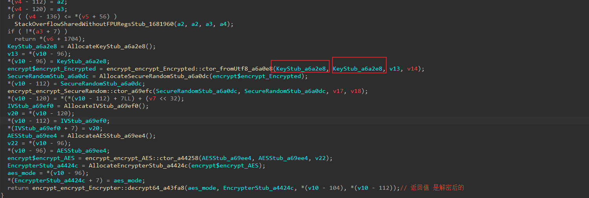

目标就是随便刷个动态，解密响应体

手机向下拖然后就能拿到data了，我们猜测算法

这是个经典b64，我们直接还原然后数字节数

满足aes分块加密的特点，猜测是AES加密，然后rsa编码

直接blutter然后开始搜aes

这很明显这个 `bitfrog$utils$aes_utils_AESUtils__decryptData_a43cc8` 非常可疑

这里估计走了decrypt函数，然后再走了json decode

这里点进 decrypt函数研究一下

这里hook返回值这个函数，

最后调整一下偏移，然后打印字符串

这里的密文和明文都有了，算法模式也有了，只差密钥了

这个函数闯入了，而且也是 `fromUtf8`；

> 这个encrypt库的fromUtf8函数一般都是用来传入明文密文，key和iv，主要是转字节用的

hook看看

这个很可疑，我们拿去测试

ok，没问题啊，轻松搞定