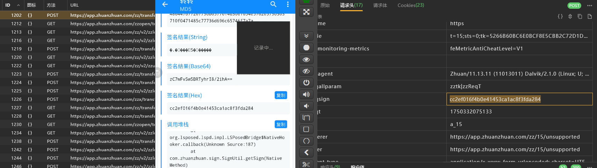
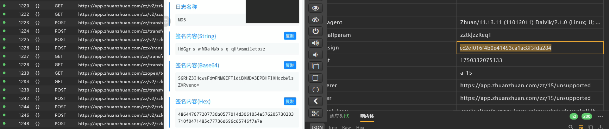
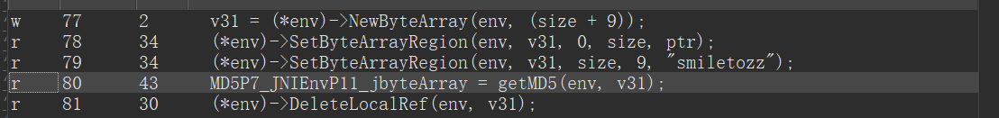
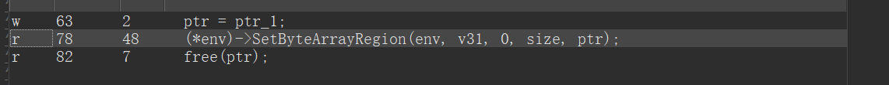
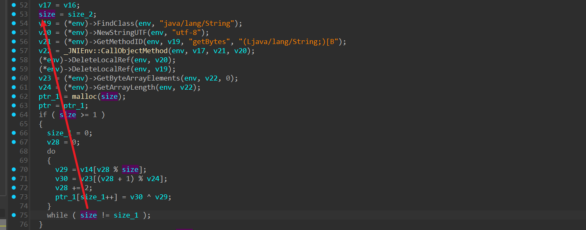
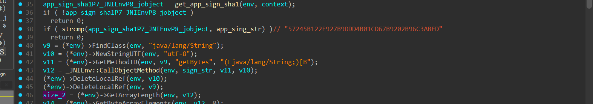
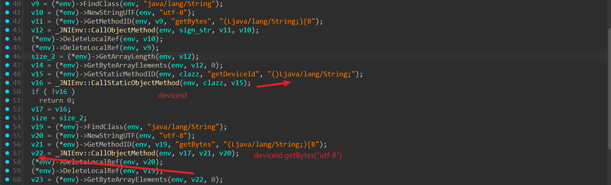
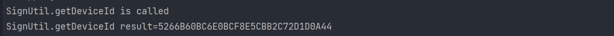

# zzreqsign

## 定位

随便找个接口就行


算法助手搜



明文好像不能直接是字符串



疑似某个东西的md5

我们跟栈看一下 `com.zhuanzhuan.sign.SignUtil.getSign`


我们看栈

```python
at com.zhuanzhuan.sign.SignUtil.getSign(Native Method)
at com.zhuanzhuan.sign.SignUtil.getSign(SignUtil.java:3)
at com.wuba.zhuanzhuan.framework.network.interceptor.SignInterceptor.intercept(SignInterceptor.java:43)
at okhttp3.internal.http.RealInterceptorChain.proceed(RealInterceptorChain.java:10)
at com.android.volley.NetworkDispatcher.run(NetworkDispatcher.java:2)
```

这里说明是java方法调用了native方法

我们接下来hook一下


随便hook了一个，对比抓包看看


然后解析一下 url解码一下`goodPriceInputAb=AtabPostId=["myloveinfo"]zzReqT=1750332744564zztk=`


像是把请求体参数倒着排序然后按照`k=v` 再进行空白字符连接，

最后把请求头里的 `zzreqt` 变成 `zzReqT` 顺便把值拼接上，再拼接zztk，在进行url编码


我们多抓几个包看看


先url解码一下 `callbackParam={"checkSuffix":"22558","name":"OCDFeed轮播","resourceType":"FEED_CARD"}groupName=
ApageId=G1001postId=22558type=0zzReqT=1750333110602zztk=`

这次没有请求体，


像是参数进行顺序排序，然后拼接，最后加上 `zzreqt` 和 `zztk`


接下来去看so层怎么写的


稍微翻翻就发现sign计算时用到的一些参数；so是`libsignLib.so`


静态注册


调整一下

倒着看


就一个


像是v31得到的，这里的v31就是之前算法助手抓到的



这里先是分配了内存，size+9长度

第一部分是ptr，第二部分是固定字符串 `smiletozz`

> 这里的setByteArrayRegion查一下；
>
> 主要作用是将一段数据从 **本地代码（C/C++）** 复制到 **Java 虚拟机 (JVM) 堆** 中的一个 **Java byte 数组** 的指定区域。
>
> 简单来说：**它允许你的本地（Native）C/C++ 代码修改一个 Java byte[] 对象的内容。**
>
> 声明 `void SetByteArrayRegion(JNIEnv *env, jbyteArray array, jsize start, jsize len, const jbyte *buf);`
>
> 
>
> 1. **JNIEnv \*env**: 指向 JNI 环境的指针。这是访问 JNI 功能的入口点，所有 JNI 函数都需要它。
> 2. **jbyteArray array**: 这是你要修改的目标 Java `byte[]` 对象。你之前通常需要通过 JNI 调用（如 `GetObjectField` 或作为方法参数）获取到这个对象的引用。
> 3. **jsize start**: 目标 Java 数组中的起始索引（从 0 开始），表示你要从数组的哪个位置开始写入数据。
> 4. **jsize len**: 要复制到 Java 数组中的字节数（长度）。
> 5. **const jbyte \*buf**: 指向本地 C/C++ 内存缓冲区的指针。这个缓冲区包含了你要复制到 Java 数组中的数据源。它的类型是 `jbyte*`，通常就是 C/C++ 中的 `signed char*` 或 `char*`（如果用于存储字节数据）。

我们现在需要知道ptr是怎么搞来的



跟ptr_1


像是再后面的循环中添加了点东西


主要来源是v30和v29做异或

>在大多数语言中（如C、C++、Java、JavaScript、Python、C#等），`^` 表示按位异或（XOR）操作。
>
>它的规则是：两个操作数的对应位相同则结果为0，不同则结果为1。

说明这里面是二进制数据

先看一下循环次数



跟size_2



这里是我们传入的字符串的字节长度

接下来确定v30和v29

和v14和v23有关，我们看一下

1. 数据源

   1. v14

      

      这里的返回v14的是java数组的地址指针，所以v14就是传入的 `sign_str` 的字节数组

      > `GetByteArrayElements` 是  (JNI) 中的一个关键函数，它允许本地代码（C/C++）**直接访问 Java 字节数组(byte[])的内存内容**。

   2. v23

      

      说白了就是设备信息的字节

      接下来我们要去找这个deviceId怎么传到服务器的，或者hook这个方法，他的类是 `clazz`所以就是同一个类

      直接主动调用或者hook然后再次发包就行

      

      抓包找找

      

      看这样子不得不传cookie，我们拦截为空试试，好像没啥影响（真奇怪？ 

      算了不管了，我们继续，接下来找索引

2. 索引

   

第一个是v28，v28是循环变量，每次变化+2，和size有关，是传入的字符串长度

第二个是v24，是v22长度，v22是设备id


接下来手持sign_str 和 deviceId就行


