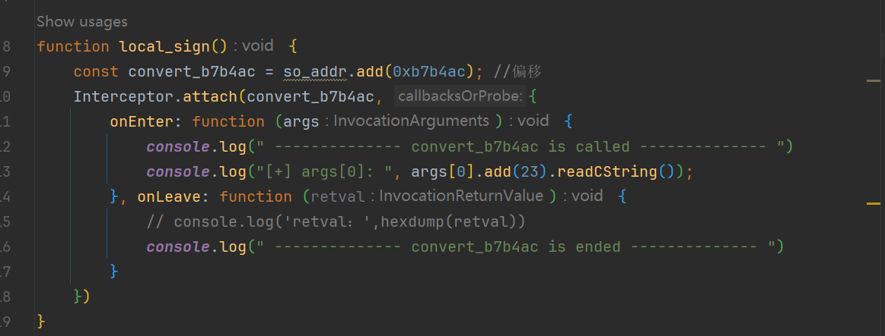
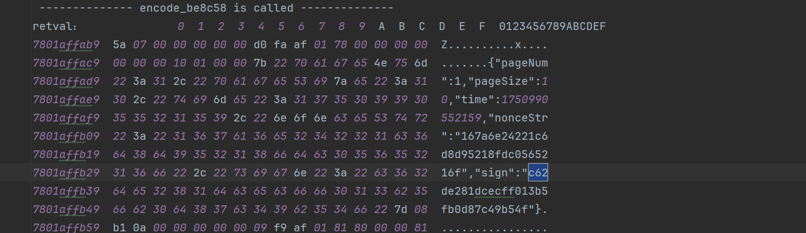
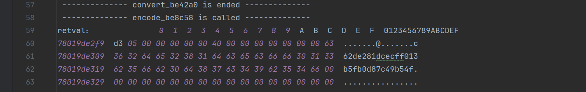

这个案例来自带带弟弟学爬虫，主要是因为是flutter开发的

# sign

## 定位

我们测试一些接口发现有些含有sign

其中 sign 为 `e90f1862dbf4114c69c326f2df747028`，32位

我们ida打开 `libapp.so`

然后打开 `x64 Native Tools Command Prompt for VS 2022`

先激活虚拟环境，然后cd到blutter目录下

1. `C:\codes\reverse\.venv\Scripts\activate``
2. ``cd C:\codes\reverse\blutter`
3. `python blutter.py C:\Users\xx\Desktop\apks\入魂一番赏\arm64 C:\Users\xx\Desktop\apks\入魂一番赏\out`

然后我们ida载入脚本

搜一下md5

感觉像是第二个

我们看一下这个函数（记得把里面所有函数都点进去然后重新f5）

我们在ko台球的案例中也讲到了，md5一般是使用convert来传输明文字符串的，所以我们去看一下；

这是上一期的脚本，我们积累经验，所以就先hook这个

而这里的encode大概率是md5后的返回值；

我们把这两都hook一下

有好几个数据，我们去找抓包的数据进行对比

`c62de281dcecff013b5fb0d87c49b54f`

好家伙，直接全部拿到了可还行

继续往上，还有一个也是；接下来我们看看明文

我们只拿可读字符就行

加一点偏移然后重新读

验证一下，确实是md5

看着样子是把前面的4个参数进行了md5签名

我们看看这个nonceStr，这个nonce名字基本上就代表随机了，逆向做多了就有经验了

所以这个是随机小数然后进行md5的

## 

# py算法还原

