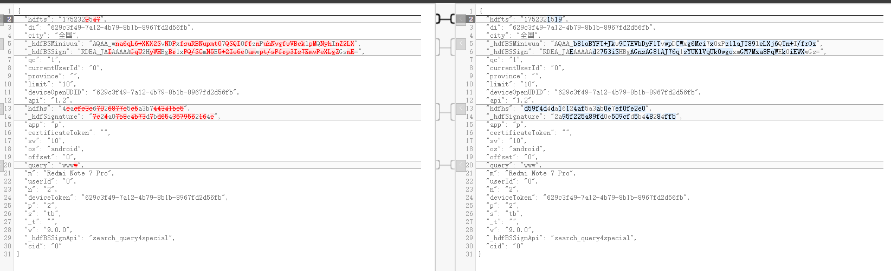
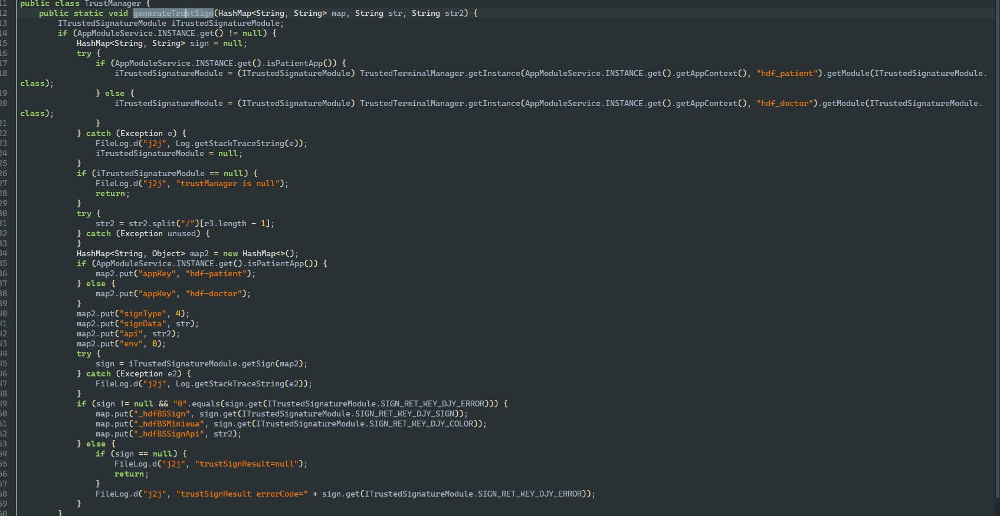
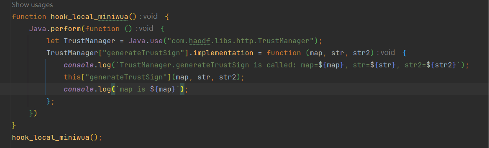
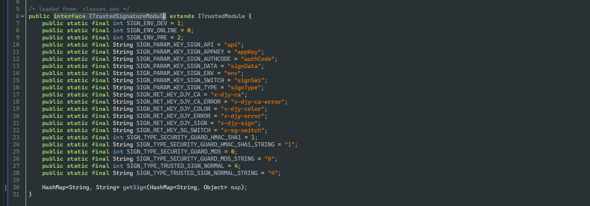
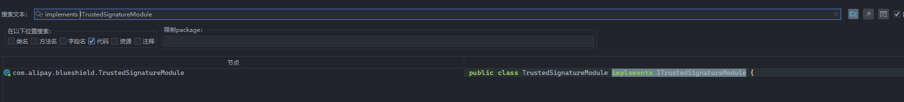

免责说明：由于传播、利用本仓库所提供的信息而造成的任何直接或者间接的后果及损失，均由使用者本人负责，一旦造成后果请自行承担！文章如有侵权烦请告知，作者会进行删除！

# app说明

今天要弄的app是：好大夫在线v9.0.0


查壳看看，爱加密，而且还是5代壳

那代码不用想了，直接脱不可能有业务代码了；

所以必须脱壳；这里我用的是[网站](https://56.al/upload.php)脱壳，脱的效果很不错，然后对于我们逆向来说，只需要过掉检测就可以不对脱壳后的app进行修复了；

而爱加密的frida检测，目前使用小佳的gadget就可以搞定了，所以懒得找人去修复了（一是主要是我不会，二是搞这个然后发给别人是违法的，如果我自己一个人用也没有必要修复嘛）


接下来就正常抓包就行

# 抓包分析


这里就以搜索接口来进行参数的分析了，对于其他需求，什么挂号抢票这种，本人不会发也不会做的；


## 请求体

这里我们多发几个包，看看主要变化的参数都有哪些



主要就是 `hdfts`、`_hdfBSMiniwua`、`_hdfBSSign`、`hdfhs`、`_hdfSignature` 以及这个接口对应的 `query`

## 请求参数


有个ck不知道是干嘛的

`ap900f-j1-0-0-1cec759f-e176-482b-aaab-cd3421ac3382`

`ap900f-j1-0-0-2df8338e-a4c2-4dfa-ac3d-3d316937bbdc`

对比发现只有尾部变化了

感觉是个随机uuid，


## cookie

经过测试，可以不带

# 参数分析

## ck【猜测】

搜下试试


这里我一样就发现了 `com.haodf.ainxz.utils.OkHttpSSEUtil` 比较像


看看这个 `httpModuleService.onGenerateHttpRequestCk()`


跳过去没代码，有没有native，说明应该是 `interface`


交叉引用找找，太多了，86个

我们搜 `HttpModuleService`


很好

跳过去再去搜我们要的 `onGenerateHttpRequestCk`


服了。。。

找一下so


这个函数其实是加载对应的so然后进行函数绑定的，这个是爱加密常用的java2c混淆，一般的hook动态注册是定位不到对应的so的；

目前我还不太会搞这个；

所以目前只能猜测：我们多抓点包观察一下 `ap900f-j1-0-0-ceb90d11-bf76-428f-bad0-ee4703e100de`

只有尾部变化，猜测是uuid了

```python
import uuid


def generate_ck()->str:
    return f"ap900f-j1-0-0-{uuid.uuid4()}"
```


## hdfts

这肯定就是个时间戳了呗，s级别的

```python
def timestamp_s()->str:
    return str(int(time.time()))

```


## _hdfSignature

接下来优先分析签名参数，这个参数算法助手pro直接拿到了


明文

`_t=&api=1.2&app=p&certificatetoken=&cid=0&city=全国&currentuserid=0&deviceopenudid=629c3f49-7a12-4b79-8b1b-8967fd2d56fb&devicetoken=629c3f49-7a12-4b79-8b1b-8967fd2d56fb&di=629c3f49-7a12-4b79-8b1b-8967fd2d56fb&limit=10&m=Redmi Note 7 Pro&n=2&offset=0&os=android&p=2&province=&qc=1&query=wwwwjdjdn&s=tb&sv=10&userid=0&v=9.0.0&hdfSignatureStr=hdfnbplus`

把这个拆成json

```json
{
    "_t": "",
    "api": "1.2",
    "app": "p",
    "certificatetoken": "",
    "cid": "0",
    "city": "全国",
    "currentuserid": "0",
    "deviceopenudid": "629c3f49-7a12-4b79-8b1b-8967fd2d56fb",
    "devicetoken": "629c3f49-7a12-4b79-8b1b-8967fd2d56fb",
    "di": "629c3f49-7a12-4b79-8b1b-8967fd2d56fb", 
    "limit": "10",
    "m": "Redmi Note 7 Pro",
    "n": "2",
    "offset": "0",
    "os": "android",
    "p": "2",
    "province": "",
    "qc": "1",
    "query": "wwwwjdjdn",
    "s": "tb",
    "sv": "10",
    "userid": "0",
    "v": "9.0.0",
    "hdfSignatureStr": "hdfnbplus"
}
```

把请求头的拿过来对比一下

```json
{
  "hdfts": "1752331716",
  "di": "629c3f49-7a12-4b79-8b1b-8967fd2d56fb",
  "city": "全国",
  "_hdfBSMiniwua": "AQAA_kjIfdvakIvnd/x25K45phhQ1pSABSuflfmnPAS4J8fDJh1e7Nhx5bmJ+yrYojIV9",
  "_hdfBSSign": "RDEA_JAQAAAAA4xNNXCeHBgAEwBqAnEiUyaaoA4erXr2MhF/Ni0gJlk9ySW4vKo+99xMPDP0=",
  "qc": "1",
  "currentUserId": "0",
  "province": "",
  "limit": "10",
  "deviceOpenUDID": "629c3f49-7a12-4b79-8b1b-8967fd2d56fb",
  "api": "1.2",
  "hdfhs": "2c4b690087d9c7e13aceb580fb2cf562",
  "_hdfSignature": "61ecb2be7b1483a41b453a2b7f12a2c2",
  "app": "p",
  "certificateToken": "",
  "sv": "10",
  "os": "android",
  "offset": "0",
  "query": "wwwwjdjdn",
  "m": "Redmi Note 7 Pro",
  "userId": "0",
  "n": "2",
  "deviceToken": "629c3f49-7a12-4b79-8b1b-8967fd2d56fb",
  "p": "2",
  "s": "tb",
  "_t": "",
  "v": "9.0.0",
  "_hdfBSSignApi": "search_query4special",
  "cid": "0"
}
```

对比一下


看样子用到了一部分参数，然后key也变成小写了

key变小写：`certificateToken`、`currentuserid`、`deviceopenudid`、`devicetoken`、`userid`

额外参数：`hdfSignatureStr`

然后用到了请求头里面的一部分参数

这里就不写算法还原了，因为这是个医疗app，不适合搞这个，知道是md5就行了，如果要看调用栈可以在算法助手复制然后去定位

思路就是提取出公共参数，然后这个接口有一些特别的参数，最后生成左侧这个字典，然后再构造对应字符串，再md5就行


## hdfhs

也是经典md5

明文 `timestamp=1752331695&ck=ap900f-j1-0-0-1cec759f-e176-482b-aaab-cd3421ac3382&2315692cf50613f509a5e7604fbe1638`

这里的时间戳就是请求包里的 `hdfts`

所以这个发包的签名是多个参数一起起到防篡改的作用的

这里的ck是url里面的参数


后面加了个 2315692cf50613f509a5e7604fbe1638

感觉是md5，我们数一下长度，是32

看看是否是固定的，如果是变化的我们就去算法助手搜

`timestamp=1752390644&ck=ap900f-j1-0-0-26691d35-9fdf-4a33-8fca-96bbf5dceac6&2315692cf50613f509a5e7604fbe1638`

又抓了一个，是固定的

```python
import hashlib

def calc_hdfhs(timstamp: str, ck: str) -> str:
    _salt = "&2315692cf50613f509a5e7604fbe1638"
    sign_string = f"timestamp={timestamp}&ck={ck}" + _salt
    return hashlib.md5(sign_string.encode("utf8")).hexdigest()
```


## _hdfBSMiniwua

先把里面的复制出来，分析一下

`AQAA_wna6qL6+XKX2SvNDPxfsuRBNupmt07QSQI0ffznPuhNvgfwVBcklpMQNyhInZ2LX`

`AQAA_b81oBYFT+Jkw9C7EVbDyF1TvwpDCWxg6Mci7x0zPz1laJT89leLXj6QTn+I/frOz`

观察感觉是后面部分是b64

我们数一下后半部分长度


4的倍数，更可疑了

我们直接用算法助手搜这个，结果没搜到，我们直接hook base64来定位吧，我也不想静态搜参数了再去hook验证了


发现没有打印，说明没在java层用已有的b64的api；

可能是自写base64，或者so层实现，或者没用base64；

所以还是只能先搜搜来找找了；


两个都很像



第一个使用了put，我们hook这个 `generateTrustSign` 函数看走没有，发现走了的；

我们接下来就去拿到第一个参数，我们看看返回时这个参数是否加入了 `miniwua`




确实有的

这个是被get拿到的，我们关注sign就行

sign是`getSign`传入一个map生成的



我们先静态搜一下




反编译g了，我们换个版本的；


