这个app案例来自带带弟弟学爬虫

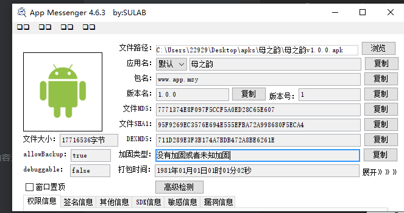

这是个黄色app，所以不截图app了


# data

## 定位

我们发现很多接口都包含了data，我们这里去找一个简单的接口，比如登录接口

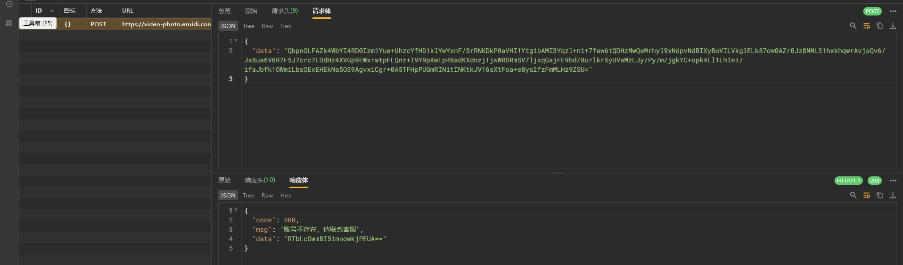

b64编码后的数据，我们再次搜索判断是否是rsa

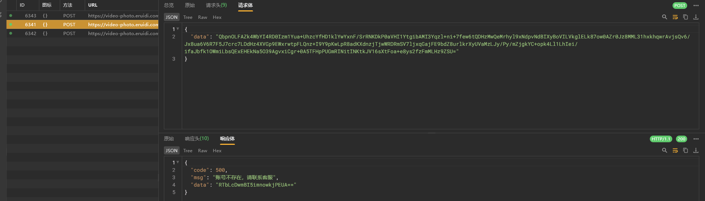

发现有一些变化，可能是rsa

这种黑灰app基本都是用flutter开发的，我们验证一下


这说明部分或者全部代码用flutter开发；

我们也可以jadx看看


这种app代码基本都会混淆，不过好在没加固

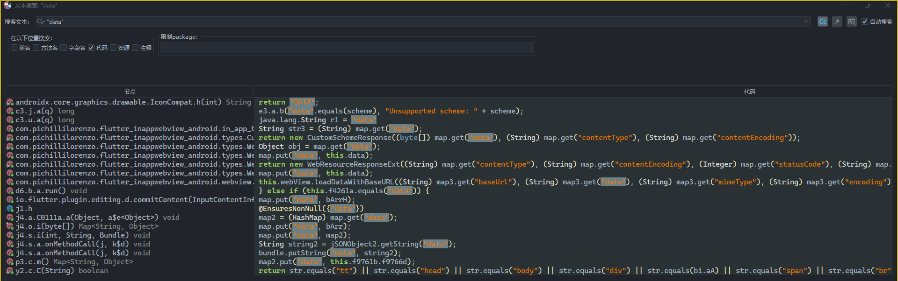

我们试着搜一下

看着鬼样子全是flutter，我们hook一下java层的put方法

没反应

搜一下url尝试


没反应，说明核心代码都在flutter中

接下来用blutter还原


还原后根据算法特性检索

感觉像是RSA加密，因为密文都在变；


搜了还是很多的，不过没有encrypt函数

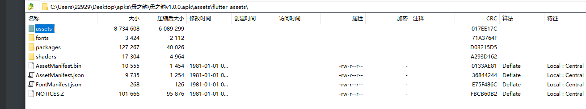

而且也没看到哪里有公钥私钥

说明可能是其他加密

我们思考一下，常见的可逆加密主要是对称加密和非对称加密

而RSA被我们排除了，接下来去看看是不是AES

我们可以验证一下AES的特征


我们把b64的解开然后对比十六进制数据

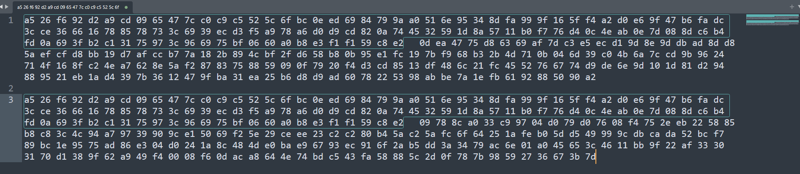

最后发现前半部分不变，后面就开始变化了

数一下长度

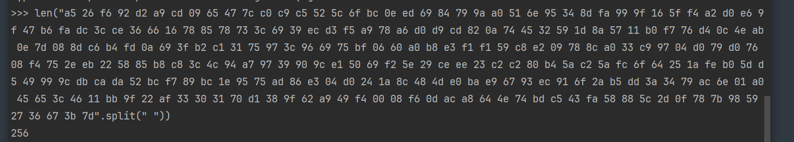

256

这是16的倍数，很可能是分组加密

常见的分组加密又是对称加密的，很像AES

＞　AES 是分组加密算法，固定分组大小为 **128 比特（16 字节）**。无论密钥长度是 128、192 还是 256 比特，分组大小始终是 16 字节。

我们多抓几个包


发现都符合这个１６倍数的特点

所以我们去ida中搜AES

这里贴一下flutter开发中AES的常用实现

一般使用的是  `encrypt` 加密库

支持很多模式，`CBC` `ECB` `CFB-64` `OFB-64` `SIC`

```dart
class AESUtil {
    static String generateAES(String data, String keyStr, String ivStr) {
        final plainText = data;
        final key = Key.fromUtf8(keyStr);
        final iv = IV.fromUtf8(ivStr);
        final encrypter = Encrypter(AES(key, mode: AESMode.cbc));// 指定使用CBC模式(AES/CBC/PKCS5PADDING)
        final encrypted = encrypter.encrypt(plainText, iv: iv);
        // final encrypter = Encrypter(AES(key, mode: AESMode.cbc)); 默认是AESMode.sic
        // final encrypter = Encrypter(AES(key, mode: AESMode.cbc, padding: null)); // NoPadding

        print("generateAES:" + encrypted.base64);
        return encrypted.base64;
    }
}
```

这里的key是通过AES传的；iv和明文是通过encrypt传的；


所以我们ida中搜索的AES去找encrypt

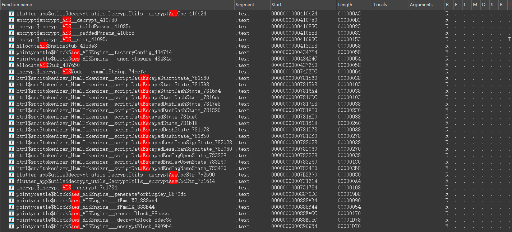

很明显前面几个比较像，以及靠后的位置有 `encrypt`

我们hook验证


这个函数确实走了

我们打印一下参数

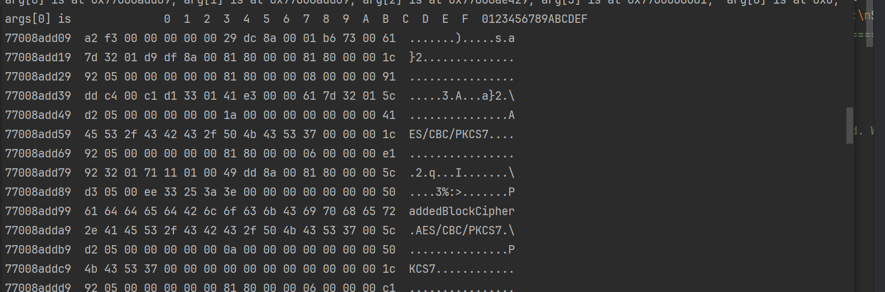

第一个参数好像是存了AES的加密模式

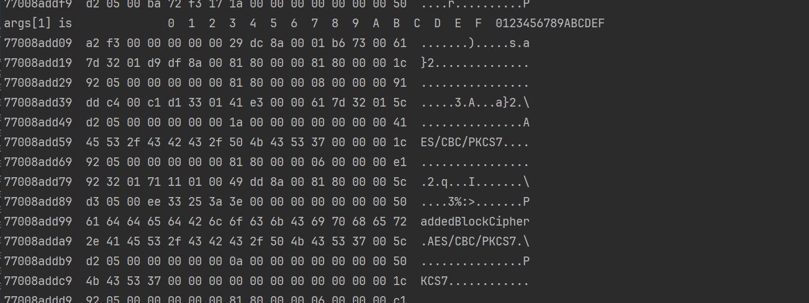

第二个也差不多


第三个存储了很多信息，其中包含了我们的明文密码


第四个参数啥也没有


我们重新去打印数据，用utf8


我们把明文复制出来

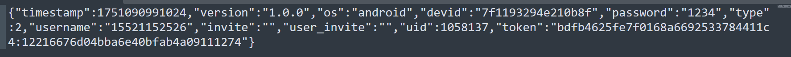

加密的东西还挺多，其中uid（游客信息）和devid以及token和设备信息账号信息都有关，不过多说了；

接下来我们需要找到其key和iv

前面的AES总结中，会在前面实例化key对象 

```dart
 final encrypter = Encrypter(AES(key, mode: AESMode.cbc));// 指定使用CBC模式(AES/CBC/PKCS5PADDING)
```


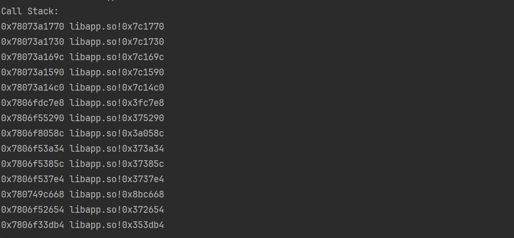

这里我们跟栈


没有，我们交叉引用找一下

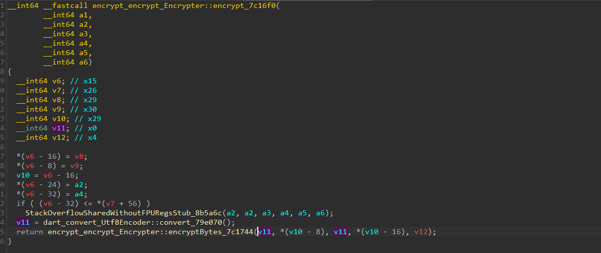

这里的(v10-8)就是我们指定的AES模式，v11是我们的明文

这里还是没看见key和iv

我们继续查找交叉引用


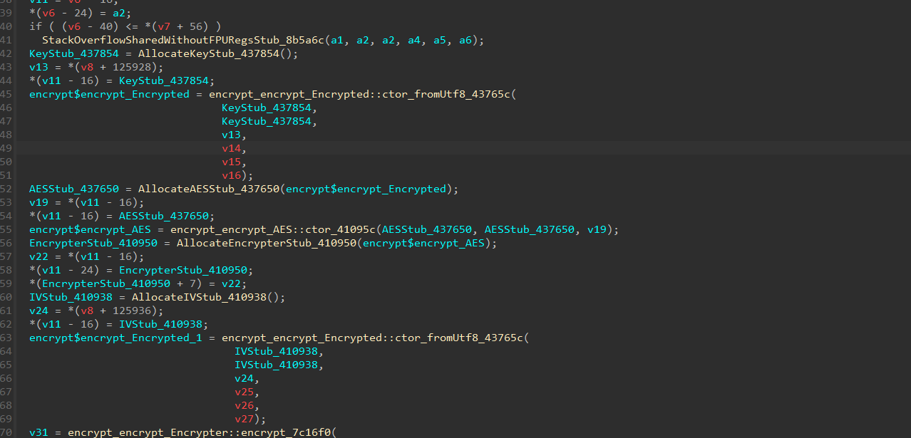

这里面就有key和iv了

我们去hook `43765c`的

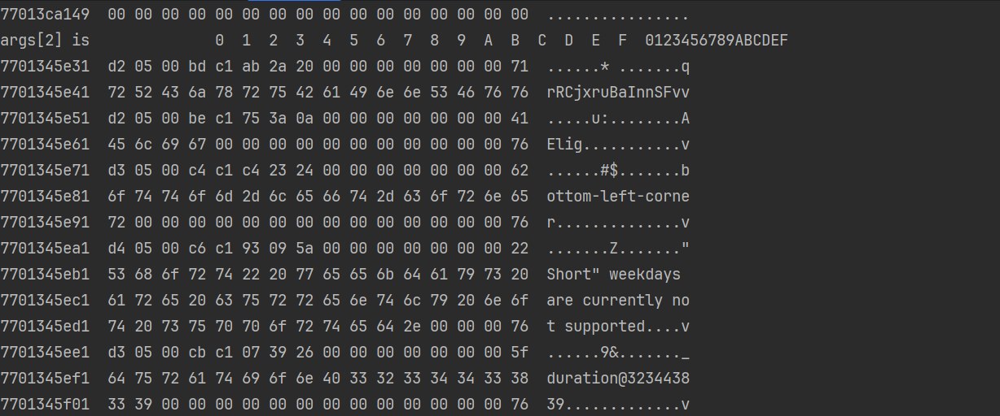

发现第三个也就是v13可能包含了key的信息，这里比较像的就是 `qrRCjxruBaInnSFvv` 部分了

由于AES的key有一定要求，所以可能是 `qrRCjxruBaInnSFv` 或者 `rRCjxruBaInnSFvv`

接下来hook一下iv，走的函数实际上是同一个


所以这里可能是 `S58LowsUeDkyX4KT` 或者 `58LowsUeDkyX4KTv`

接下来我们去测试key和iv


和抓包比对，不对，更换key和iv

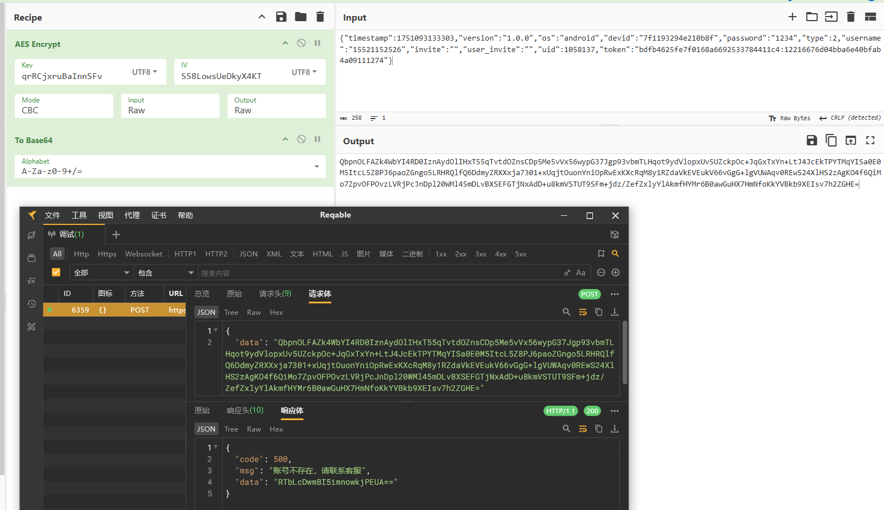

最后测试发现这样就是正确的了

我们测试一下响应体的data

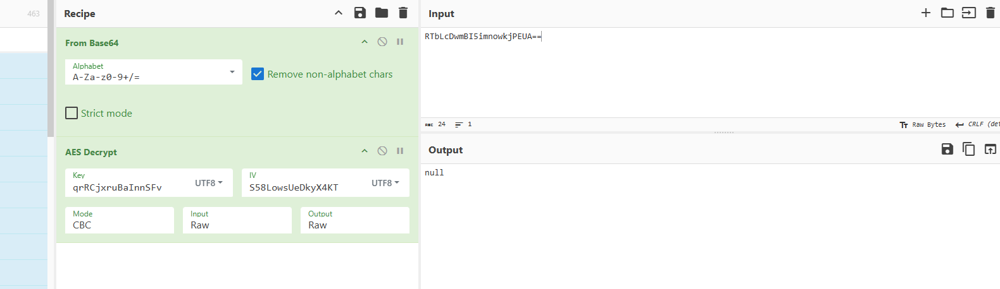

发现也是同样的key和iv

其他接口估计也可以，我们尝试一下

搜索接口的明文我们可以通过解密拿到


`{"type":1,"page":1,"keyword":"111","page_size":20,"devid":"7f1193294e210b8f","invite":"","os":"android","timestamp":1751094678892,"user_invite":"","version":"1.0.0","uid":1058137,"token":"bdfb4625fe7f0168a6692533784411c4:12216676d04bba6e40bfab4a09111274"}`

其中包含了我输入的关键词


懂得都懂。。。。


## 算法还原

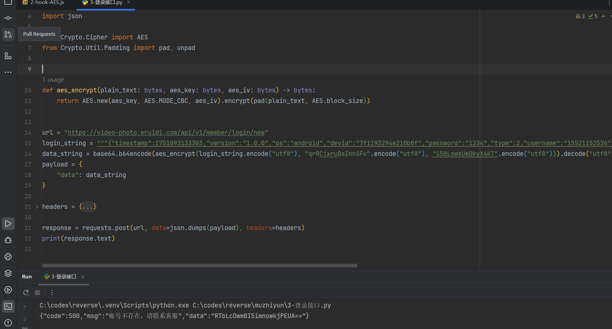


测试发现
