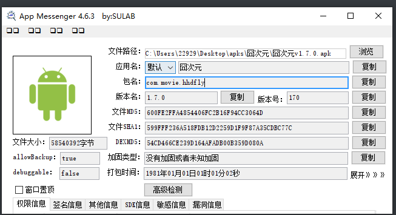
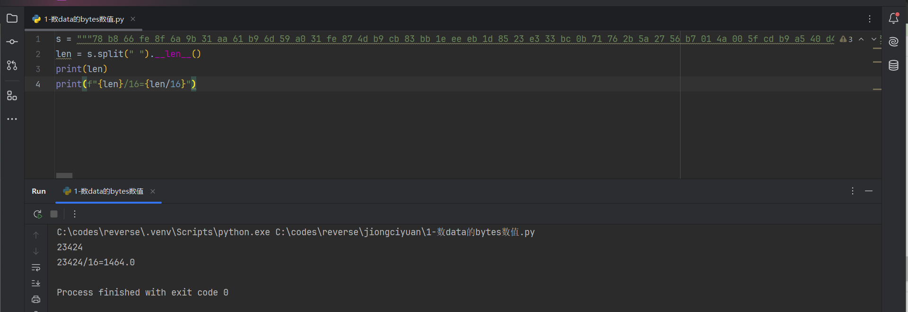
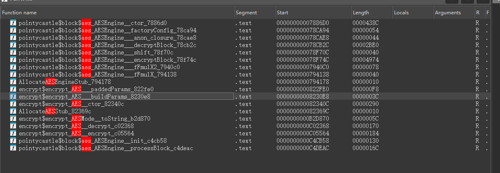
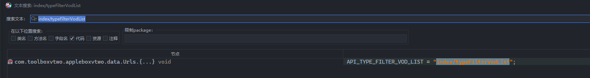

案例来源：带带弟弟学爬虫




# data


目标就是这个搜索接口的响应体加密

## 定位

经典flutter的app

我们先观察响应体，像是base64编码后的，我们去解码一下


转16进制切片数数量



符合aes加密的分组大小（16）

多次抓包，看看是否发生变化：发现值完全不变！

所以我们使用aes定位



挺少的

按照我们之前的经验，我们直接去看 `c02368`

直接去hook

发现压根找不到 `libapp.so`

我们hook dlopen看一下


完全没有so

所以说明可能我这个版本的app没有调用flutter框架

我们去jadx寻找




有个混淆，交叉引用找不到

换个思路，既然是在java层加密或者其他so加密的，我们先用通杀脚本hook看看

这里使用算法助手pro进行注入


aes解密

```python
AES/CBC/PKCS5Padding
解密密钥(String)
672263e98f232a05
解密Iv(String)
672263e98f232a05
解密内容(base64)
eLhm/o9qmzGqYbltWaAx/odNucuDux7u6x2FI+MzvAtxditaJ1a3AUoAX825pUDUW+qznLcQi/JNNMU1pBaK9SR0Lp9IvdrMXugL5lEbZWlHG00WF0/qdnL/GY2uUx5DwGiMOb9QkrJm/QqDpDv0Z7k8U6RjEAmTTJgyNtvg7ftra0hzOaEKoEUYO+kFHBTD6PtGR1EgRNJ7I2NshN0WoBLLXg4l9uSnJswPJYKStHewxfmKCG5E8CVWnBylsEgukpw5IXd6bYb89K+l4ou1lgBRsIv6mJwERp+Nu9Bw+Ra8P2zKZ+JKIx33xH1/JZFcuY9Om92p3C/RUnbyvkN4HuDZLLkwtdMpPUbFHE8Yh49xy6R7r8R9et5e0pha3ByCfu28vGUSS+C7wurGsdT6K+mw75sOEAxrrvmyxAmGpJ8/0elKHoruG99rgOJrsutEKyaSYwqbZrWZ+dKo5YrOyDaMG0VXXhd18p2dDHEuP7ZeW42PJgNs5GX6W5dKPNhBcqkG3iCcWs25JDKycAIximY54ksR2XRDkpVbIvMQTQuixJEByb1UO6bebOqmWmfeUirDTrwNy4Crp/HBsd3JHSHFb4QJS/WZPi6poUKY7OmUk4UNWx0G6JGBEM+2G+oPrP76B7NH6HWDFwZVPozJLZn/7e146e8yXGhsrPDiaX1pL
解密结果(string)
{"search_list":[{"vod_id":7645,"vod_name":"\u8fdb\u51fb\u7684\u5de8\u4eba","vod_pic":"https:\/\/img.cycimg.me\/pic\/cover\/l\/78\/c9\/55770_HsJfh.jpg","vod_pic_slide":"","vod_remarks":"\u516825\u96c6","vod_sub":"\u5854\u5854\u5f00\uff0c\u81ea\u7531\u4e4b\u7ffc,\u9032\u64ca\u7684\u5de8\u4eba,Attack on Titan,Shingeki no Kyojin,","vod_class":"\u8fdb\u51fb\u7684\u5de8\u4eba,\u70ed\u8840,\u6cfd\u91ce\u5f18\u4e4b,2013\u5e744\u6708,TV\u52a8\u753b,\u65e5\u672c\u52a8\u6f2b","vod_actor":"\u6d45\u91ce\u606d\u53f8,\u526f\uff1a\u5c3e\u5d0e\u667a\u7f8e,\u80a5\u585a\u6b63\u53f2,\u534f\u529b\uff1a\u5c71\u7530\u6b69,\u9580\u8107\u8061,\u8c37\u5185\u512a\u7a42,","vod_score":"3.0","vod_year":"2013","vod_lang":"\u65e5\u8
```


## 算法还原


搞定