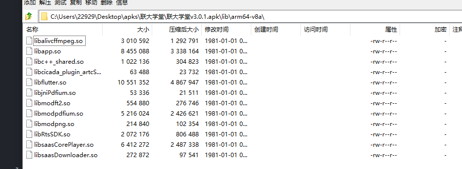
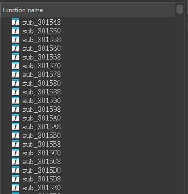
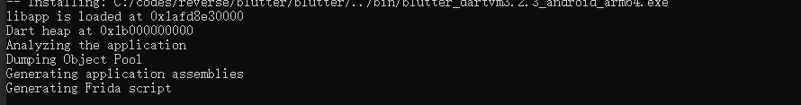
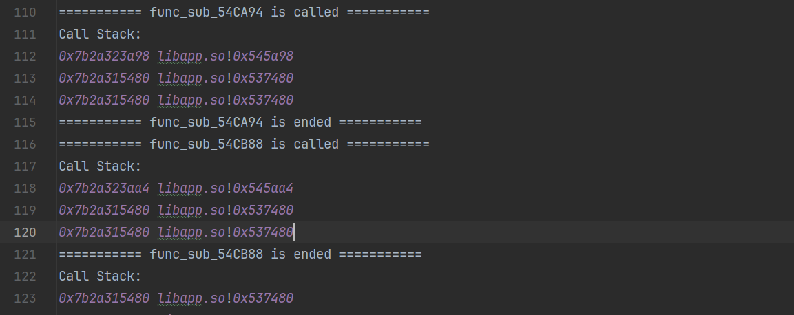
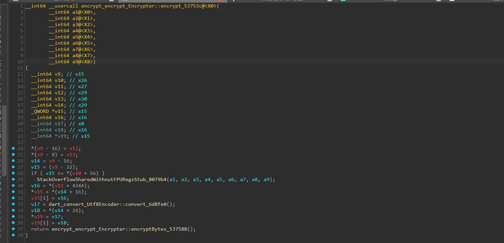
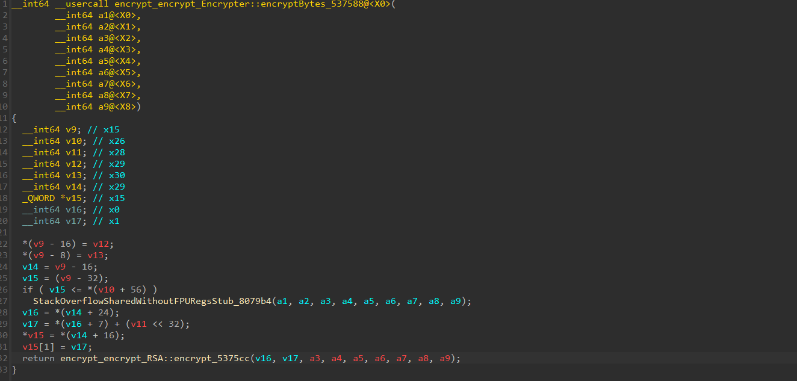
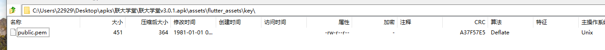
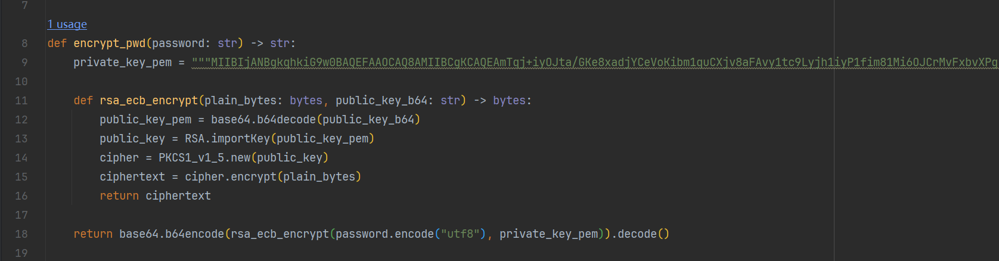

联大学堂v3.0.1，案例来源：带带弟弟学爬虫

目标：抓登录包


主要是这里面的pwd参数


# pwd

## 定位


有个360加固，代码很少，而且相关的包中包含 anim、animator这种，猜测是flutter



包含了 `libapp.so` 和 `libflutter.so`，这说明这个app有部分或者全部业务是由flutter开发的，业务代码在 `libapp.so` 中


ida打开这个so，


一般flutter开发的app，导出函数一般就这几个，其中比较关键的是第一个个 `_kDartVmSnapshotInstructions`

实际业务代码在左侧的 `function` 中



但是这种都是没有名字的


接下来我们尝试在字符串表中搜pwd


感觉 `encodePwd` 可疑，说明密码加密实现就在so中

我们再次抓包测试


对比之前的包，发现主要是时间和pwd变化了；

由于加密存在变化，这很像RSA的特征；


接下来使用`blutter`还原函数表的名字

1. 打开 `x64 native tools`
2. 激活包含了blutter环境的python虚拟环境
3. 执行blutter.py进行还原

```bash
C:\software\Microsoft Visual Studio\2022\Community>cd C:\codes\reverse\blutter

C:\codes\reverse\blutter>..\.venv\Scripts\activate

(.venv) C:\codes\reverse\blutter>python blutter.py C:\Users\22929\Desktop\apks\联大学堂\arm64 C:\Users\22929\Desktop\apks\联大学堂\out
```



最后执行到这一步就代表成功了

接下来ida载入 `out\ida_script` 下的 `addName.py`

还原效果如下：


接下来搜RSA，结果有点多


这实在是太多了，所以我们最好是去搜一下flutter如何实现RSA


这里顺便学习一下 参数加密时常用的一些算法在flutter是如何实现的

下面是一些参考blog

- https://blog.csdn.net/EthanCo/article/details/121352110

- https://juejin.cn/post/7157290993669111816

我们总结一下 **常用 **正向实现的写法

- base64

  dart自带的convert库

  ```dart
  import 'dart:convert';
  
  void encryptBase64(String str) {
      print("Base64加密前文本：" + str);
      var content_bytes = utf8.encode(str);
      var digest = base64Encode(content_bytes); // 在这里直接调用
      base64String = digest.toString();
      // 还有的会手动创建编码器，底层实现也是convert
      // var encoder = new Base64Encoder();
      // var base64String = encoder.convert(content_bytes); // 得到字符串
      
      print("Base64加密后文本：" + base64String);
  }
  
  void decryptBase64() {
      print("Base64解密前文本：" + base64String);
      base64String = String.fromCharCodes(base64Decode(base64String)); // 在这里直接调用
      print("Base64解密后文本：" + base64String);
  }
  
  ```

  所以可以搜 `base64Encode/decode` 来寻找

  

- hash

  1. 使用的是 [`crypto` ](https://pub-web.flutter-io.cn/packages/crypto)第三方加密库：md5，sha，hmac

     ```dart
     import 'package:crypto/crypto.dart';
     import 'dart:convert'; // utf8.encode()需要这个引用
     
     // md5,sha
     void main() {
         var bytes = utf8.encode("需要加密的数据"); // data being hashed
     	var digest = sha256.convert(bytes); // 直接调用对应算法对象，然后传入字节
         // 其他hash算法
         // var digest = sha1.convert(bytes);
         // var digest = md5.convert(bytes);
     
         print("Digest as bytes: ${digest.bytes}");
         print("Digest as hex string: $digest");
     }
     // hmac
     void encryptHMACSHA256(String hmacKey, String hmacValue) {
         print("加密前文本：key:$hmacKey value:$hmacValue");
         var key = utf8.encode(hmacKey);
         var bytes = utf8.encode(hmacValue);
         //第一个参数算法类型就不多说了
         var hmacSha256 = Hmac(sha256, key); // HMAC-SHA256, 这里构造一个对象，传入算法和key
         var digest = hmacSha256.convert(bytes);
         final encryptStr = digest.toString();
         print("SHA256的HMAC加密后文本：key:$hmacKey value:$encryptStr");
     }
     // 分块输入
     import 'dart:convert';
     import 'package:convert/convert.dart';
     import 'package:crypto/crypto.dart';
     
     void main() {
         var firstChunk = utf8.encode("foo");
         var secondChunk = utf8.encode("bar");
     	
         var output = AccumulatorSink<Digest>(); 
         // 创建输入流
         var input = sha1.startChunkedConversion(output);
         input.add(firstChunk);
         input.add(secondChunk); // call `add` for every chunk of input data
         // 输入完毕
         input.close();
         var digest = output.events.single; // 拿到十六进制字符串
     
         print("Digest as bytes: ${digest.bytes}");
         print("Digest as hex string: $digest");
     }
     ```

     

     这里面主要是convert传入加密的数据，所以我们逆向的时候，遇到参数像是哈希算法的时候主要找convert的调用

     这里值得注意的是，调用都是  `对象.convert` 所以是可以动态调整对象的；也就是常说的面向对象中的鸭子模型

  2. 使用第三方库 `cryptography`

     ```dart
     //只有一个加密这么导入就行了
     import 'package:cryptography/cryptography.dart'
     //如果同时使用了两个加密，很容易冲突，使用模块化导出即可
     import 'package:cryptography/cryptography.dart' as cryptography;
     
     //SHA1加密
     Future<void> encryptSHA1ByCryptography(String str) async {
         print("SHA1ByCryptograph加密前文本:" + str);
         final message = utf8.encode(str);
         final algorithm = cryptography.Sha1();
         final hash = await algorithm.hash(message); // 构造算法对象，然后执行.hash
         //转化成16进制字符串
         final encryptStr = getHexString(hash.bytes);
         print("SHA1ByCryptograph加密后文本:" + encryptStr);
     }
     
     //SHA256加密
     Future<void> encryptSHA256ByCryptography(String str) async {
         print("SHA256ByCryptograph加密前文本:" + str);
         final message = utf8.encode(str);
         final algorithm = cryptography.Sha256();
         final hash = await algorithm.hash(message); // 构造算法对象，然后执行.hash
         final encryptStr = getHexString(hash.bytes);
         print("SHA256ByCryptograph加密后文本:" + encryptStr);
     }
     
     //SHA256的HMAC加密
     Future<void> encryptHMACSHA256ByCryptography(String hmacKey, String hmacValue) async {
         print("SHA256ByCryptograph加密前文本:key:$hmacKey value:$hmacValue");
         var key = utf8.encode(hmacKey);
         final bytes = utf8.encode(hmacValue); //这个转化的是accii码走的
         final secretKey = cryptography.SecretKey(key);
     
         final hmac = cryptography.Hmac.sha256(); 
         final mac = await hmac.calculateMac(
             bytes,
             secretKey: secretKey,
         ); // 构造算法对象时传入key，然后执行.calculateMac
         
         //返回的内容是16进制数组，需要转化成16进制字符串，因此不能使用utf8.decode
         final encryptStr = getHexString(mac.bytes);
         print("SHA256ByCryptograph加密后文本:" + encryptStr);
     }
     
     //将16进制数组转化成字符串
     String getHexString(List<int> ints) {
         return ints.map((e) {
             //toRadixString 转化 成 16 进制
             String text = e.toRadixString(16);
             return text.length > 1 ? text : '0$text';
         }).join('');
     }
     ```

     如果使用了这个库，我们需要去找 `.hash` 和 `calculateMac` 方法

  3. 使用第三方库 [crypt](https://pub-web.flutter-io.cn/packages/crypt)

     ```dart
     import 'package:crypt/crypt.dart';
     
     void main() {
         // Creating crypt strings
     
         // Default rounds and random salt generated
         final c1 = Crypt.sha256('p@ssw0rd');
     
         // Random salt generated
         final c2 = Crypt.sha256('p@ssw0rd', rounds: 10000);
     
         // Default rounds
         final c3 = Crypt.sha256('p@ssw0rd', salt: 'abcdefghijklmnop');
     
         // No defaults used
         final c4 = Crypt.sha256('p@ssw0rd', rounds: 10000,
                                 salt: 'abcdefghijklmnop');
     
         // SHA-512
         final d1 = Crypt.sha512('p@ssw0rd');
     	
         // Crypt 对象包含哈希值（hash） 使用的盐（salt） 哈希算法类型（type，这里是 sha512） 迭代轮数（rounds，默认值取决于库的实现）
         // 直接打印会出现 $6$salt$hashedpassword: 6代表算法sha512；salt是随机盐值；hashedpassword是最终结果
         // 所以一般用这个库会指定盐
         print(c1);
         print(c2);
         print(c3);
         print(c4);
         print(d1);
     
         // Comparing a value to a crypt hash
     
         for (final hashString in [
             r'$5$zQUCjEzs9jnrRdCK$dbo1i9WjQjbUwOC4JCRAZHpfd31Dh676vI0L6w0dZw1',
             c1.toString(),
             c2.toString(),
             c3.toString(),
             c4.toString(),
             d1.toString(),
         ]) {
             // Parse the crypt string: this extracts the type, rounds and salt
             final h = Crypt(hashString);
     
             const correctValue = 'p@ssw0rd';
             const wrongValue = '123456';
     
             if (!h.match(correctValue)) {
                 print('Error: unexpected non-match: $correctValue');
             }
     
             if (h.match(wrongValue)) {
                 print('Error: unexpected match: $wrongValue');
             }
         }
     }
     ```

     

- AES

  使用的是  `encrypt` 加密库

  支持很多模式，`CBC` `ECB` `CFB-64` `OFB-64` `SIC`

  ```dart
  class AESUtil {
      static String generateAES(String data, String keyStr, String ivStr) {
          final plainText = data;
          final key = Key.fromUtf8(keyStr);
          final iv = IV.fromUtf8(ivStr);
          final encrypter = Encrypter(AES(key, mode: AESMode.cbc));// 指定使用CBC模式(AES/CBC/PKCS5PADDING)
          final encrypted = encrypter.encrypt(plainText, iv: iv);
          // final encrypter = Encrypter(AES(key, mode: AESMode.cbc)); 默认是AESMode.sic
          // final encrypter = Encrypter(AES(key, mode: AESMode.cbc, padding: null)); // NoPadding
  
          print("generateAES:" + encrypted.base64);
          return encrypted.base64;
      }
  }
  ```

  这里的key是通过AES传的；iv和明文是通过encrypt传的；

- RSA

  1. 首先pubspec.yaml中添加依赖
  
  2. 在`assets` 目录下新建`rsa_key`文件夹，用来存储我们的公钥私钥文件
  
     > 我们逆向时去assets下寻找密钥
  
  3.  在`pubspec.yaml`文件中添加公钥私钥文件。
  
      ```yaml
      flutter:
        # The following line ensures that the Material Icons font is
        # included with your application, so that you can use the icons in
        # the material Icons class.
        uses-material-design: true
      
        # To add assets to your application, add an assets section, like this:
        assets:
          - assets/fonts/iconfont.json
          - assets/rsa_key/rsa_public_key.pem
          - assets/rsa_key/rsa_private_key.pem
          #   - images/a_dot_burr.jpeg
          #   - images/a_dot_ham.jpeg
          - assets/images/home_logo.png
      ```
  
  4. 在`lib/utils`目录下新建`rsa_encrypt.dart`文件，用来开发我们的加密解密工具类。
  
     ```dart
     import 'dart:convert';
     import 'package:encrypt/encrypt.dart';
     import 'package:flutter/services.dart';
     import 'package:pointycastle/asymmetric/api.dart';
     class Encrypt {
         ///  加密
         static encryption(content) async {
             final parser = RSAKeyParser();
             // 加载密钥
             String publicKeyString = await rootBundle.loadString('assets/rsa_key/rsa_public_key.pem'); 
             print('publicKeyString=$publicKeyString'); // 注意这一行的输出
             // 实现加密
             RSAPublicKey publicKey = parser.parse(publicKeyString) as RSAPublicKey;
             final encrypter = Encrypter(RSA(publicKey: publicKey));
             // 转base64
             return encrypter.encrypt(content).base64;
         }
         /// 解密
         static Future<String> decrypt(String decoded) async {
             final parser = RSAKeyParser();
             String privateKeyString = await rootBundle.loadString('assets/rsa_key/rsa_private_key.pem');
             final privateKey = parser.parse(privateKeyString) as RSAPrivateKey;
             final encrypter = Encrypter(RSA(privateKey: privateKey));
             return encrypter.decrypt(Encrypted.fromBase64(decoded));
         }
     }
     
     ```
  
  

至此我们以及了解了flutter常见加密算法的实现，我们这个案例大概率是RSA，所以我们搜索parse寻找明文；


这些比较可以，挨个hook测试


最后手动搞一个树状图理解，接下来去看这几个重点函数；



看一下调用栈，其实都是 `537480` 调用的


找到了


是这个函数调用的

交叉引用看一下


这里就有我们需要的东西了，说明确实是这里

我们把这里面可疑的函数都找一下，然后去找encrypt函数



感觉显示这个，我们hook这里面的 `537588`


这和我们输入的密码一样，再换个密码


确实是这里



他又执行了 `5375cc` 这里我们也能看到 v16是传入的参数，v16又为 v14偏移24位，正好对应我们内存dump的数据

我们去把这里面的函数都点一下，没发现硬编码的密钥

那估计就是正常开发时放到 assets 中的，我们去找一下



在这个目录就找到了


## 算法还原




发包测试，ok，没啥问题了
