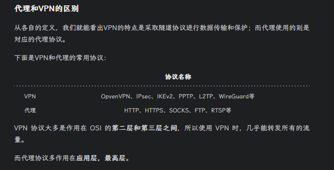

美之图


证书校验

v3.8.0


# 脱壳

app反编译后代码少的可怜，所以需要脱壳


我们使用 `frida-dexdump` 脱壳处理 [github地址](https://github.com/hluwa/frida-dexdump)

- 安装

  ```bash
  pip install frida-dexdump
  ```

  > 其他参数
  >
  > ```
  > -o OUTPUT, --output OUTPUT  Output folder path, default is './<appname>/'.
  > -d, --deep-search           Enable deep search mode.
  > --sleep SLEEP               Waiting times for start, spawn mode default is 5s.
  > ```

- 拿到包名

  ```bash
  frida-ps -Ua
  ```

  > com.mmzztt.app

- 执行脱壳

  ```bash
  frida-dexdump -U -f com.mmzztt.app -d 
  ```


效果图


打包一下，丢进jadx


尝试反编译后发现报错，说明需要修复，我们这里换一个脱壳工具

FunDex

这个直接就搞定了


# 抓包

先看一篇文章 [APP代理和VPN检测绕过对抗](https://sanshiok.com/archive/8.html)

开reqable抓不到包，关了就能正常使用

分析一下检测点

## 代理检测


我们这里是没使用代理的

然后继续抓包测试


这里补一下代理检测的知识

1. 使用SystemProperties类

   ```js
   import android.os.SystemProperties;
   
   String proxyHost = SystemProperties.get("http.proxyHost");
   String proxyPort = SystemProperties.get("http.proxyPort");
   
   if (proxyHost != null && proxyPort != null) {
       // 代理已设置
   } else {
       // 未设置代理
   }
   ```

2. 使用ConnectivityManager类

   ```js
   import android.content.Context;
   import android.net.ConnectivityManager;
   import android.net.NetworkInfo;
   
   public boolean isProxySet(Context context) {
       ConnectivityManager cm = (ConnectivityManager) context.getSystemService(Context.CONNECTIVITY_SERVICE);
       NetworkInfo activeNetwork = cm.getActiveNetworkInfo();
   
       if (activeNetwork != null && activeNetwork.isConnected()) {
           if (activeNetwork.getType() == ConnectivityManager.TYPE_WIFI) {
               // Wi-Fi连接，无需代理
               return false;
           } else if (activeNetwork.getType() == ConnectivityManager.TYPE_MOBILE) {
               String proxyHost = android.net.Proxy.getDefaultHost();
               return (proxyHost != null && proxyHost.length() > 0);
           }
       }
   
       return false; // 未设置代理
   }
   ```

3. 使用Java的URL类

   ```js
   import java.net.Proxy;
   import java.net.URL;
   import java.net.URLConnection;
   
   try {
       URL url = new URL("http://www.example.com");
       URLConnection connection = url.openConnection(Proxy.NO_PROXY);
       // 无代理设置
   } catch (Exception e) {
       // 代理设置
   }
   ```

   > NO_PROXY实际上就是type属性为DIRECT的一个Proxy对象，这个type有三种：
   >
   > - DIRECT
   > - HTTP
   > - SOCKS
   >   所以，`Proxy.NO_PROXY`的意思是connection的请求是直连。
   >   此时若通过系统进行代理，app对外请求会失效，也就是视觉上看到的卡死状态，就是不让走系统代理。

如果有代理检测，我们的解决办法

1. hook

2. 使用基于VPN模式的转发软件

   > Postern、VProxid
   >
   > `VProxid`据说可以理解是`Proxifier`的手机版；有时 `postern` 抓不了的我们用 `VProxid`

3. 使用基于iptables的转发软件

   > ProxyDroid、[PCAPdroid](https://github.com/emanuele-f/PCAPdroid)
   
   > iptable原理：
   >
   > - linux内核提供的防火墙工具是**Netfilter/Iptables**。
   > - **Netfilter**是由linux内核集成的IP数据包过滤系统，其工作在内核内部，而**Iptables**则是让用户定义规则集的表结构。
   > - 也就是，**iptables**是一个命令行工具，位于用户空间，它真正操作的框架实现在内核当中。
   > - `Iptables`主要工作在OSI七层的2.3.4层，好像也没比VPN的工作协议低，反而还有高的，但是测试结果证明，是我想错了，iptables不是由于协议低，而是没有出现`tun0`或者`ppp0`这两个关键的网卡特征，所以成功绕过了VPN的检测。
   > - 基于iptables这个流量转发，有的叫做叫做`“透明代理”`，iptables的转发模式就是这种。

 [一篇文章解析 各种代理区别](https://zhuanlan.zhihu.com/p/68560128)


## vpn检测



### 原理

开了vpn后，手机ip路由会走 `tun0` 和 `ppp0` 字样；具体实验看2.2.2


java检测代码

1. 使用ConnectivityManager类

    ```java
    import android.content.Context;
    import android.net.ConnectivityManager;
    import android.net.NetworkInfo;

    public class VPNChecker {
        public static boolean hasVPN(Context context) {
            // context的getSystemService可以拿到链接信息
            ConnectivityManager cm = (ConnectivityManager) context.getSystemService(Context.CONNECTIVITY_SERVICE);

            // 高版本安卓 Android 6.0 (API 23) 及以上 【低版本的自己去搜】
            Network network = cm.getActiveNetwork();

            if (network != null) {
                NetworkCapabilities capabilities = cm.getNetworkCapabilities(network);

                if (capabilities != null) {
                    // hook这个hasTransport返回值就可以
                    return capabilities.hasTransport(NetworkCapabilities.TRANSPORT_VPN);
                }
            }

            return false;
        }
    }
    ```

2. 使用NetworkInterface类 

   > - `java.net.NetworkInterface` 的 `getNetworkInterfaces` 拿到连接信息，可迭代对象
   > - 遍历取出，去找 `nextElement` 的三个函数 `isUp` 、`isVirtual`、`isLoopback`

   ```js
   import java.net.NetworkInterface;
   import java.net.SocketException;
   import java.util.Enumeration;
   
   public boolean isVpnConnected() {
       try {
           Enumeration<NetworkInterface> networkInterfaces = NetworkInterface.getNetworkInterfaces();
   
           while (networkInterfaces.hasMoreElements()) {
               NetworkInterface networkInterface = networkInterfaces.nextElement();
   
               if (networkInterface.isUp() && networkInterface.isVirtual() && !networkInterface.isLoopback()) {
                   return true; // 连接了VPN
               }
           }
       } catch (SocketException e) {
           e.printStackTrace();
       }
   
       return false; // 未连接VPN
   }
   ```

3. 使用系统属性检测

    > `System.getProperty("net.dns1")`拿到dns服务器
    >
    > 如果是vpn，包含 `10.0.0.0` 

    ```js
    public boolean isVpnConnected() {
        String dnsServers = System.getProperty("net.dns1");
    
        if (dnsServers != null && dnsServers.contains("10.0.0.0")) {
            return true; // 连接了VPN
        }
    
        return false; // 未连接VPN
    }
    ```

    


### 小实验

查看手机ip路由 

```bash
ip link show
```


左边是没开reqable，右边开了；就会是这样的结果，有tun0


### 解决方案

hook绕过


1. hook--`java.net.NetworkInterface` 的 `getName` 和 `getAll` 的返回值

   检测到 `ppp0` 和tun0修改成正常的 `eth0` `wlan0` `rmnet0` ``rmnet_data0` `

   > - Wi-Fi 连接：通常是 `wlan0`; 
   > - 移动数据：通常是 `rmnet0`、`rmnet_data0` 或类似名称
   > - **VPN 连接**：(1) IPsec/L2TP可能使用 `ppp0` (2) OpenVPN/Shadowsocks：通常使用 `tun0`
   > - USB 共享网络：(1) 手机作为热点`rndis0` 或 `usb0` (2) 手机连接到电脑 `ppp0`（如果通过 PPP 协议）

   ```js
   // 篡改检测
   let String = Java.use("java.lang.String");
   let NetworkInterface = Java.use("java.net.NetworkInterface");
   NetworkInterface.getName.implementation = function () {
       console.log("call java.net.NetworkInterface.getName()");
       var result = this.getName();
       console.log("find getName：", result);
       if (result && (result.indexOf("ppp0") > -1 || result.indexOf("tun0") > -1)) {
           return String.$new("rmnet_data0");
       }
   }
   // 篡改getAll(hooker工具包js)
   NetworkInterface.getAll.implementation = function () {
       var nis = this.getAll();
       console.log("call java.net.NetworkInterface.getAll()");
       nis.forEach(function (ni) {
           if (ni.name.value.indexOf("tun0") >= 0 || ni.name.value.indexOf("ppp0") >= 0 || ni.displayName.value.indexOf("tun0") >= 0 || ni.displayName.value.indexOf("ppp0") >= 0) {
               ni.name.value = "rmnet_data0";
               ni.displayName.value = "rmnet_data0";
           }
       })
       return nis;
   }
   ```

2. hook--`android.net.ConnectivityManager `的 `getNetworkCapabilities` 返回值为null； 

   > - 以及 `getNetworkInfo()` 传入17代表找到了vpn，正在查询对应信息 （这部分来自hooker工具包）
   
   ```js
   var can_hook = false;
   // 检测监听
   let ConnectivityManager = Java.use("android.net.ConnectivityManager");
   ConnectivityManager.getNetworkInfo.overload('int').implementation = function () {
       if (arguments[0] === 17) {
           can_hook = true
       }
       let ret = this["getNetworkInfo"](arguments[0]);
       console.log("find getNetworkInfo：", ret)
       return ret;
   }
   // 篡改返回值
   let NetworkInfo = Java.use("android.net.NetworkInfo")
   NetworkInfo.isConnected.implementation = function () {
       let ret = this.isConnected()
       if (can_hook) {
           ret = false
           can_hook = false
           console.log("call isConnected function !!!")
       }
       return ret
   }
   // 禁用网络能力检测
   ConnectivityManager.getNetworkCapabilities.implementation = function (arg) {
       let result = this["getNetworkCapabilities"](arg);
       console.log("find getNetworkCapabilities：", result);
       return null;
   }
   ```

3. `android.net.NetworkCapabilities.NetworkCapabilities` 的 `hasTransport` 表示是否转发

   ```js
   // 篡改是否转发
   let NetworkCapabilities = Java.use("android.net.NetworkCapabilities");
   NetworkCapabilities.hasTransport.implementation = function (v) {
       console.log(v);
       let res = this["hasTransport"](v);
       console.log("res hasTransport ==> ", res)
       return false;
   }
   // 篡改vpn为wifi
   NetworkCapabilities.transportNameOf.overload('int').implementation = function () {
       let ret = this["transportNameOf"](arguments[0]);
       if (ret.indexOf("VPN") >= 0) {
           return "WIFI";
       }
       return ret;
   }
   ```

   


测试结果如下


再次抓包测试，发现打印了很多信息，说明是有代理检测的！


但是遗憾的是我们还是抓不到，这个时候我们用 `postern+charles` 抓包发现一堆403，这种一般都是证书问题


我们把charles的证书校验关掉，然后就能正常加载图片了，但是我们抓不到包；证明确实存在证书校验


> 或者这里开一下clash，发现正常可以访问的


这说明单纯也就是存在证书校验，vpn可能检测了但是没有禁这个


## 自吐证书

看代码吧


# 