版本v6.5.3

# 搜索接口

## 抓包分析

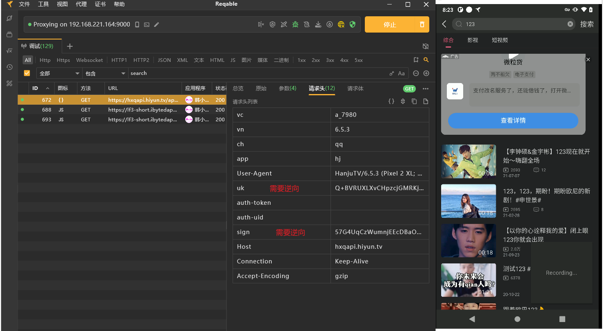

请求头有两个，一个是uk一个是sign；其他都是固定的；没有请求体；

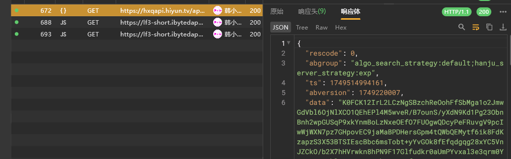

响应体的data需要解密

再次抓包尝试


响应内容变化不大，大概率短时间没变化；这说明data可能是存在rsa加密，也可能与时间戳有关；


# 脱壳

软件存在加壳，frida调试，高强度混淆

脱壳的话这边使用fundex脱壳即可


# 绕过frida反调试

frida调试的话比较简单，使用的是libmsaoaidsec.so，我们hook掉启动检测的函数即可绕过，这里不再赘述；


# sign

先搜一波参数

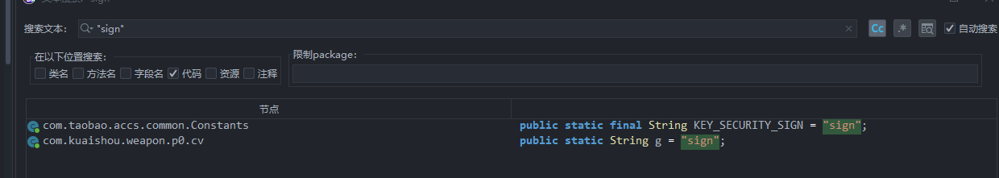

好像还挺少的，我们这里换别的定位


点进去

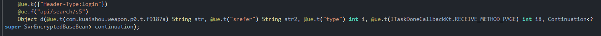

我们交叉引用这个d函数

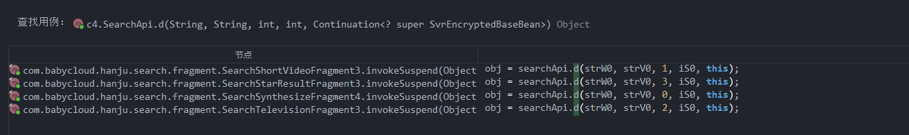

我们根据抓包的第3个参数来进行判断，也就是前面的 `page`


这里的object就是我们拿到的响应内容，我们现在需要去找到这个searchApi在哪里加的请求头

点击`a.b`, 发现点不进去，说明脱壳不彻底，我们这里可以hook一下找调用栈


既然都hook了，我们直接hook加密算法；

这里可以使用frida进行hook java层加密算法，也可以xposed模块算法助手；

我这边实际测试的时候用的是后者，这里演示一下


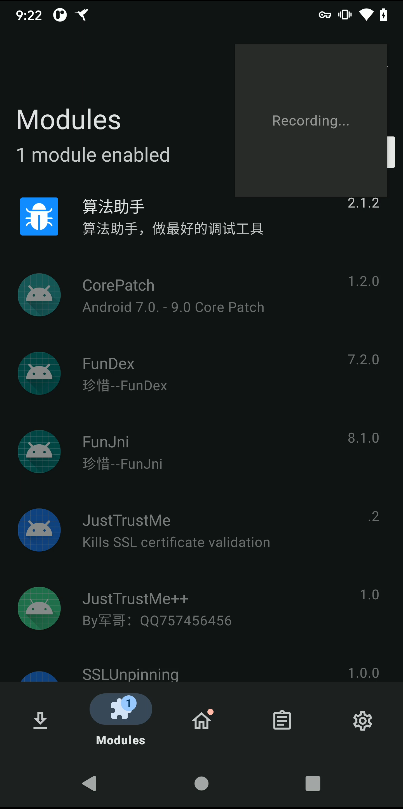 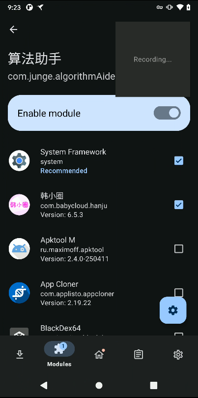

去软件中配置一下需要hook的内容, 然后重启app即可

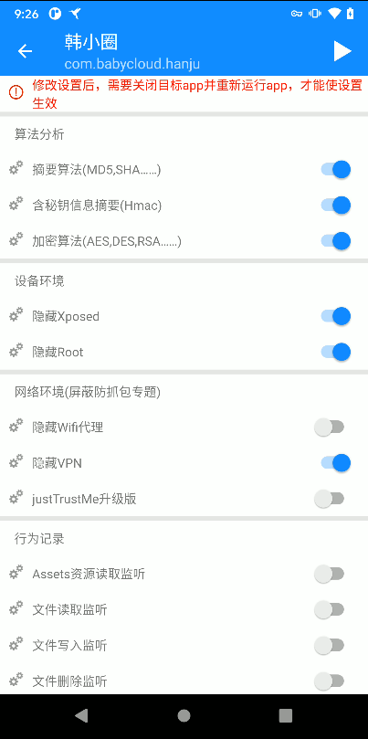 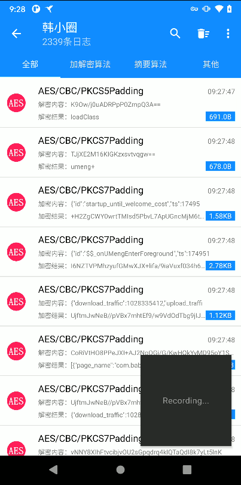


我们对比抓包的内容，搜一下

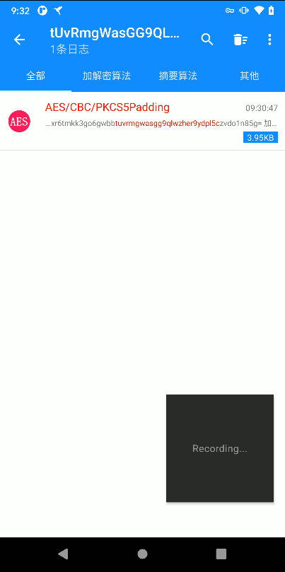 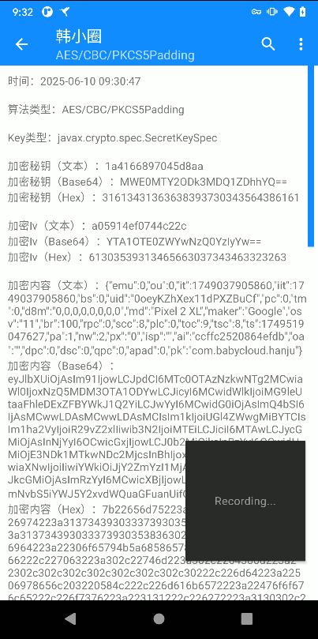

我们记录一下内容，多次抓包比较


算法类型：AES/CBC/PKCS5Padding

- key

  ```bash
  1a4166897045d8aa
  ```

  ```bash
  1a4166897045d8aa
  ```

- iv

  ```bash
  a05914ef0744c22c
  ```

  ```bash
  a05914ef0744c22c
  ```

- 明文

  ```bash
  {"emu":0,"ou":0,"it":1749037905860,"iit":1749037905860,"bs":0,"uid":"0oeyKZhXex11dPXZBuCf","pc":0,"tm":0,"d8m":"0,0,0,0,0,0,0,0","md":"Pixel 2 XL","maker":"Google","osv":"11","br":100,"rpc":0,"scc":8,"plc":0,"toc":9,"tsc":8,"ts":1749519047627,"pa":1,"nw":2,"px":"0","isp":"","ai":"ccffc2520864efdb","oa":"","dpc":0,"dsc":0,"qpc":0,"apad":0,"pk":"com.babycloud.hanju"}
  ```
  
```bash
  {"emu":0,"ou":0,"it":1749037905860,"iit":1749037905860,"bs":0,"uid":"0oeyKZhXex11dPXZBuCf","pc":0,"tm":0,"d8m":"0,0,0,0,0,0,0,0","md":"Pixel 2 XL","maker":"Google","osv":"11","br":100,"rpc":0,"scc":9,"plc":0,"toc":10,"tsc":9,"ts":1749519402820,"pa":1,"nw":2,"px":"0","isp":"","ai":"ccffc2520864efdb","oa":"","dpc":0,"dsc":0,"qpc":0,"apad":0,"pk":"com.babycloud.hanju"}
  ```

发现变化不大，主要是时间戳，我们发现了一个uid，我们清空手机信息再次抓包

```bash
adb shell pm clear com.babycloud.hanju
```


这次发现密钥，iv，uid全部变了

- key

  ```bash
  d01286b0b90eb395
  ```

- iv

  ```bash
  c3c575022664240c
  ```

- 明文

  ```bash
  {"emu":0,"ou":0,"it":1749037905860,"iit":1749037905860,"bs":0,"uid":"TMCZ4sMHu0yzmzIG703K","pc":0,"tm":0,"d8m":"0,0,0,0,0,0,0,0","md":"Pixel 2 XL","maker":"Google","osv":"11","br":100,"rpc":0,"scc":1,"plc":0,"toc":1,"tsc":1,"ts":1749519718256,"pa":1,"nw":2,"px":"0","isp":"","ai":"ccffc2520864efdb","oa":"","dpc":0,"dsc":0,"qpc":0,"apad":0,"pk":"com.babycloud.hanju"}
  ```

  

我们先用python还原这个aes算法


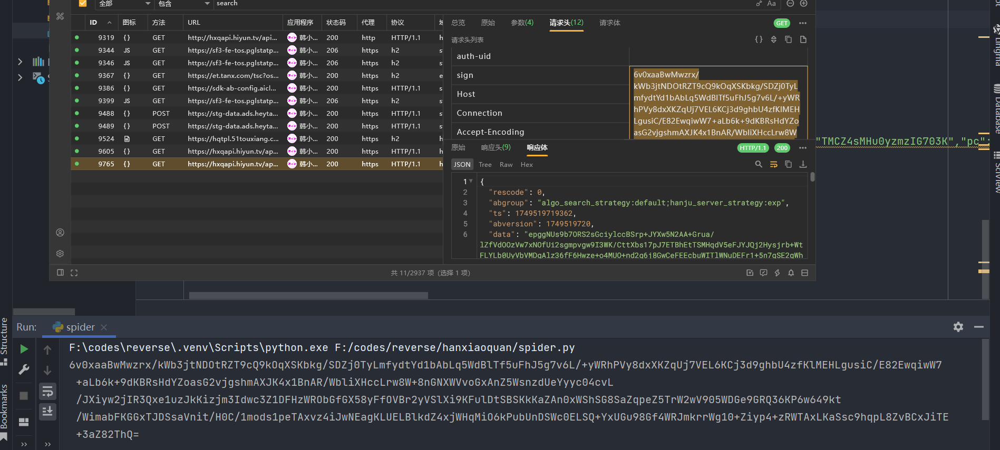

ok，接下来研究一下uid的生成，以及key和iv的生成

我们去算法助手中复制调用栈，跟调用栈 `com.babycloud.hanju.tv_library.common.a.e`


继续跟栈


这里发现是根据 `strB` 生成的

这里发现 `k.b` 和 `d.e` 都点不进去，说明脱壳不彻底

我们用 frida 查看内存

>  这里需要绕过frida反调试

还要注意spawn启动，这两个函数还没加载，我们手动hook加载就行


签名看见这两个参数都是16长度，这个值看起来又像是十六进制，且32长，感觉是md5，测试一下

发现确实是md5，我们需要去找一下这个明文的变化规则

这里再次清除手机缓存，再次hook&抓包测试


这里发现，又变化了，说明是有影响的

我们需要思考服务端是如何使用这个key和iv进行加密的，所以我们一定传过去了某些参数


我们仔细观察，发现这个返回值其实就是uid，明文中会有；

我们只能继续观察其他参数，去看哪个参数传过去了uid


# uk

同样的，我们用算法助手hook一下加密算法，看一下uk在不在正常加密中

记得清除一下缓存, 清除一下算法助手日志

```bash
adb shell pm clear com.babycloud.hanju
adb shell pm clear com.junge.algorithmAide
```


随便抓包一个 `lOSMqSbpMk6ljGRB2CrZlDBPJNVuPdEg5A9qHI36MiY=`

去算法助手中搜一下

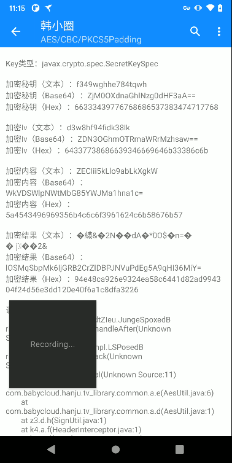

这个的key和iv肯定是固定的，我们也可以去堆栈中进行验证


传入uid `ZECIii5kLlo9abLkXgkW` 

经过aes加密，生成uk，这里的uid要与sign的一致，并且计算md5各取前后一半作为sign的key和iv


接下来进行算法还原即可

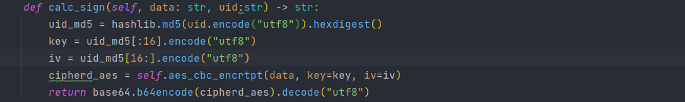


这样就行，接下来去定位一下uid的生成


# uid


还挺多的


我们用前面的sign的地方来进行定位

也就是

```js
{"emu":0,"ou":0,"it":1749037905860,"iit":1749037905860,"bs":0,"uid":"0oeyKZhXex11dPXZBuCf","pc":0,"tm":0,"d8m":"0,0,0,0,0,0,0,0","md":"Pixel 2 XL","maker":"Google","osv":"11","br":100,"rpc":0,"scc":8,"plc":0,"toc":9,"tsc":8,"ts":1749519047627,"pa":1,"nw":2,"px":"0","isp":"","ai":"ccffc2520864efdb","oa":"","dpc":0,"dsc":0,"qpc":0,"apad":0,"pk":"com.babycloud.hanju"}
```

这个里面的uid怎么塞进去的，跟一下调用栈

    at com.babycloud.hanju.tv_library.common.a.e(AesUtil.java:6)
    at com.babycloud.hanju.tv_library.common.a.c(AesUtil.java:4)
    at z3.d.g(SignUtil.java:56)
    at z3.d.f(SignUtil.java:1)
    at z3.a.getHeaders(BaseSignStringRequest.java:7)
    at z3.c.getHeaders(LoginTokenStringRequest.java:1)
    at com.android.volley.toolbox.HurlStack.performRequest(HurlStack.java:3)
    at com.android.volley.toolbox.BasicNetwork.performRequest(BasicNetwork.java:5)
    at com.android.volley.NetworkDispatcher.run(NetworkDispatcher.java:8)
跟这个z3.d.g

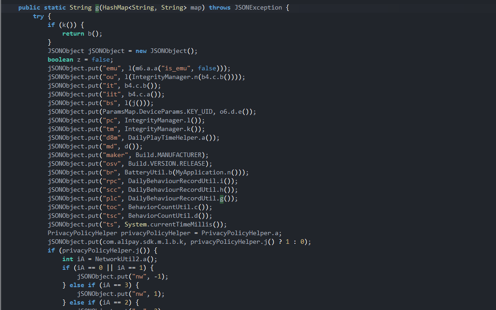

找到了，是 `o6.d.e` 拿到的

好像还是逃不过（

我们如果需要逆向出uid的生成，有两种办法

- trace出d.e的汇编指令进行分析
- 换其他脱壳工具进行脱壳

我们先试试别的脱壳工具，发现没有比较好用的。

我们只能trace了，这里我在尝试的过程中有很多问题，所以最终还是没成功


我们可以先尝试寻找规律然后随机生成，看一下服务端会不会出现问题

- `0oeyKZhXex11dPXZBuCf`
- `3mSw5ASA1AKyfO9rk85z`
- `TMCZ4sMHu0yzmzIG703K`

长度定长，包含内容0-9a-zA-Z

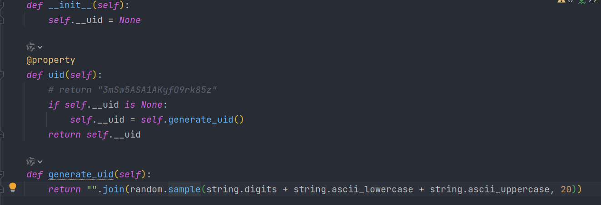

然后发包测试


好像没啥问题，看来随便生成几个应该没啥关系


# 响应体data解密

我们同样先去算法助手中寻找，看一下能不能找到

结果是没找到

我们只能自己定位了


这里我们随便找一个请求体有data的就行

`/api/carp/kp/v2`

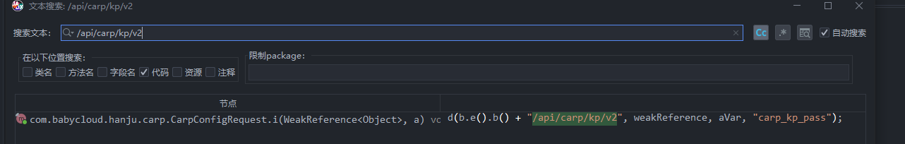


这个 `d` 函数应该是发包，前面的 `b.e().b()` 应该是域名

我们看一下d函数

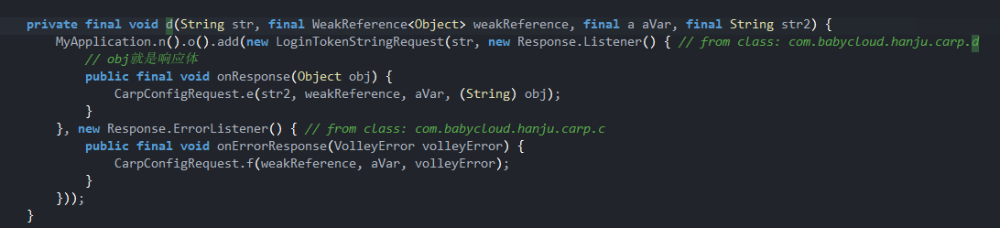

这里面有回调函数，拿到了obj之后，强制转为str然后丢给e函数

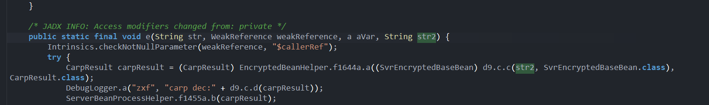

这里的 `d9.c.c` 点不进去，我们只能看 `a` 函数的第一个参数


我们hook一下这个函数


这个函数确实是统一解密的地方，别的请求返回的data也会经过这里，我们现在需要确定他走哪里

这里我们自己判断一下，应该是走后面两个之一，我们hook看一下 `d9.c.c` 即可

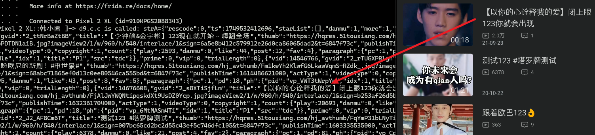

看这样子.c.c是已经被解密了，所以也就是 `w.a.a`是解密的地方

但是这里我们脱壳没有脱出 `w.a.a` 函数，所以没法直接还原这个函数

我们现在有两个办法：

- rpc调用
- unidbg调用


我们先来第一种

1. rpc调用

   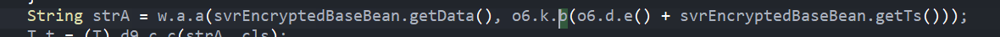

   先搞明白传入的参数，第一个参数就是响应体中的data，第二个参数是uid+响应体的ts进行md5

   所以其实第二个参数也就是key了

   代码如下

   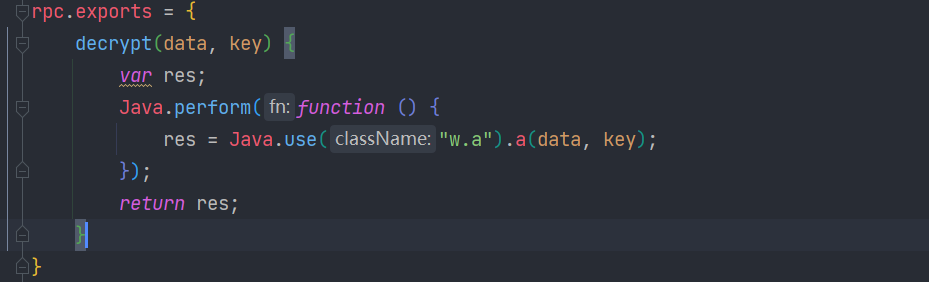

   