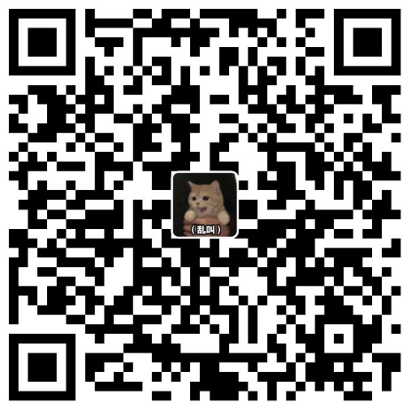

**免责声明**：本项目的所有内容**仅供学习与技术交流使用**，旨在帮助开发者理解移动应用的结构和工作原理。如有侵权，请联系我；

> 这个项目说实话不适合发出来，所以后续可能整个库private了也不一定；

# 注意事项

本项目只保证提供分析笔记，对于某些案例来源是的个人付费教程的，本人只会进行复刻，不会翻录视频损害利益；对于机构中的案例另说，因为现在机构讲的都不算好，还不如我自己分析的；对于用到的付费工具，请自行购买对应课程获取；

项目文件可能会有残缺，不过一般很少，如果有那就是不敢发出来；对于apk和jar包，请点击 [网盘链接](https://pan.baidu.com/s/1f28fv9A39LruaMg4wx4QYA?pwd=uxw2) 下载或者自行网络搜索； 跟着笔记做之前可以看看有没有对应b站视频讲解，我的b站id：`x1a0f3n9`；

如果你需要我对以下项目进行答疑，加我qq：3685168793。注意：不**提供**免费**答疑**，我的时间也是时间；

> 付费答疑方式有两种：（1）单问题答疑后自行打赏（2）多问题请加付费星球；

| 微信打赏                                         | 支付宝打赏                                       | 知识星球(目前￥99)                                         |
| ------------------------------------------------ | ------------------------------------------------ | ---------------------------------------------------------- |
|  |  |  |

# 目录

1. 自己分析

   - 哔哩哔哩 v8.48.0
   - 微博  轻享版v6.4.6  极速版v10.9.8
   - boss直聘（写完了但是没传，感觉还得改改）
   - 豆瓣 v7.100.0
   - 喜马拉雅 v6.6.99.3
   - 抖音 v11.5.0 & v34.9.0（还在研究）
   - 小红书 v6.73.0 & v8.90.0 （还在研究）
   - 转转（还在研究）
   - 扇贝单词（还在研究）

   

2. 粉丝投稿+客户需求

   - 韩小圈 v6.5.3

   - 鱼泡直聘 v9.7.1 

   - 91吃瓜 v1.1.0（还没做完）

   - 电子税务局 v1.2.0 & v1.2.6（写完了，但是这里发不了）

   - 贝壳找房 v3.02.60

     

3. 他人付费课程

   (a) 带带弟弟学爬虫

   - 咕咕语音 v4.8.0  

   - 币coin v4.0.3

   - 飞卢小说 v7.1.4 

   - 转转 v11.13.11

   - 四川航空 v6.14.3

   - 纵横小说 v8.1.10.65（还没做完）

   - 永辉生活 v10.12.0.3

   - ko台球 v3.1.0

   - 入魂一番赏 v4.2.6

   - 联大学堂 v3.0.1

   - 母之蕴 v1.0.0 

   - bitfrog v1.27.0

     

   (b) 龙哥

   - 

     

   (c) 小佳

   - 

   

   (d) 杨如画

   - 

     

4. 机构

   (a) 路飞学城

   - 唯品会   v7.83.3

   - 美之图 v4.0.0 

     

   (b) 小肩膀

   - 淘最热点 v2.3.3 

   - 海博tv v3.26

      

   (c) 看雪1w, 2w, 3w

