# 搜索栏搜索接口

根据关键词检索商品

唯品会v7.83.3

- url: https://mapi.appvipshop.com/vips-mobile/rest/shopping/search/product/list/v1

- method: POST

- headers
    "authorization": "OAuth api_sign=ceaf3e1735008be3ef71be34878cd87e5eb980d0",
    "x-vip-host": "mapi.appvipshop.com",
    "content-type": "application/x-www-form-urlencoded",
    "content-length": "2682",
    "accept-encoding": "gzip",
    "user-agent": "okhttp/4.9.1"
    
- params:
    "api_key": "23e7f28019e8407b98b84cd05b5aef2c",
    "app_name": "shop_android",
    "app_version": "7.83.3",
    "bigSaleTagIds": "",
    "brandIds": "",
    "brandStoreSns": "",
    "categoryId": "",
    "channelId": "1",
    "channel_flag": "0_1",
    "client": "android",
    "client_type": "android",
    "darkmode": "0",
    "deeplink_cps": "",
    "device_model": "Google Pixel 2 XL",
    "did": "0.0.b24e560d5c1f955cec890950555f746c.65a84b",
    "elder": "0",
    "extParams": "{\"priceVer\":\"2\",\"mclabel\":\"1\",\"cmpStyle\":\"1\",\"statusVer\":\"2\",\"ic2label\":\"1\",\"video\":\"2\",\"uiVer\":\"2\",\"preheatTipsVer\":\"4\",\"floatwin\":\"1\",\"superHot\":\"1\",\"exclusivePrice\":\"1\",\"router\":\"1\",\"coupons\":\"1\",\"needVideoExplain\":\"1\",\"rank\":\"2\",\"needVideoGive\":\"1\",\"bigBrand\":\"1\",\"couponVer\":\"v2\",\"videoExplainUrl\":\"1\",\"live\":\"1\",\"sellpoint\":\"1\",\"reco\":\"1\",\"vreimg\":\"1\",\"search_tag\":\"2\",\"tpl\":\"1\",\"stdSizeVids\":\"\",\"labelVer\":\"2\"}",
    "fdc_area_id": "104104",
    "functions": "RTRecomm,flagshipInfo,feedback,otdAds,zoneCode,slotOp,survey,hasTabs,floaterParams",
    "harmony_app": "0",
    "harmony_os": "0",
    "headTabType": "all",
    "height": "2712",
    "isMultiTab": "0",
    "keyword": "高品质t恤女减龄",
    "lastPageProperty": "{\"isBgToFront\":\"0\",\"suggest_text\":\"高品质t恤女减龄\",\"scene_entry_id\":\"-99\",\"refer_page_id\":\"page_te_globle_classify_search_1748159677368\",\"text\":\"高品质t恤女减龄\",\"tag\":\"1\",\"module_name\":\"com.achievo.vipshop.search\",\"type\":\"all\",\"typename\":\"全部\",\"is_back_page\":\"0\"}",
    "maker": "GOOGLE",
    "mars_cid": "5e05301e-a397-3817-a940-d0cb858ce0c7",
    "mobile_channel": "oziq7dxw:::",
    "mobile_platform": "3",
    "net": "WIFI",
    "operator": "",
    "os": "Android",
    "osv": "11",
    "otddid": "",
    "other_cps": "",
    "page_id": "page_te_commodity_search_1748159682450",
    "phone_model": "pixel 2 xl",
    "priceMax": "",
    "priceMin": "",
    "props": "",
    "province_id": "104104",
    "referer": "com.achievo.vipshop.search.activity.TabSearchProductListActivity",
    "rom": "Dalvik/2.1.0 (Linux; U; Android 11; Pixel 2 XL Build/RP1A.201005.004)",
    "sd_tuijian": "0",
    "service_provider": "",
    "session_id": "5e05301e-a397-3817-a940-d0cb858ce0c7_shop_android_1748158311809",
    "skey": "6692c461c3810ab150c9a980d0c275ec",
    "sort": "0",
    "source": "app",
    "source_app": "android",
    "standby_id": "oziq7dxw:::",
    "sys_version": "30",
    "timestamp": "1748159682",
    "union_mark": "blank&_&blank&_&oziq7dxw:::&_&blank&_&blank",
    "vipService": "",
    "warehouse": "VIP_NH",
    "width": "1440"


## 参数分析

分析一下哪些参数需要逆向

### 请求头

api-sign，这个缺失了之后会报错，如果改了请求体也会报错，签名不对


### 请求体

经过测试和观察，下面的参数比较可疑

page_id

api_key

did

mars_cid

session_id

skey


##  逆向请求头api_sign

jadx 反编译

### 搜 url

`"search/product/list/v1"` 

定位到 ` com.achievo.vipshop.commons.logic.productlist.service.SearchProductListApi` 类的 `getProductList` 函数中 


代码很多，这个地方是设置参数


这里发请求，点进去


一直溯源，直到这里拿到treemap(参数)


定位到这里，之后一顿定位没找到

### 搜参数

`api_sign=`


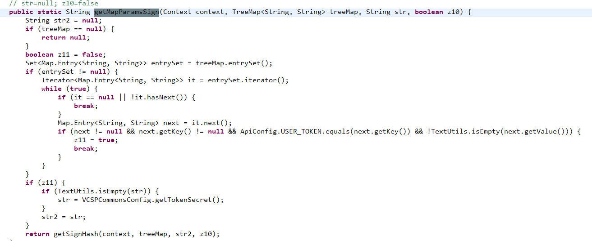


这里用了反射，我们需要知道 `clazz` 的类型

- hook
- 搜索 `clazz=`

这里采用第二种


点进去


检索gs；观察发现不报错走 `gsNav` 


发现是个native方法

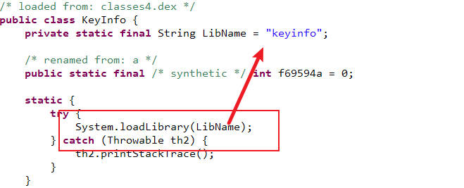

### 定位到so

定位到 `libkeyinfo.so`

打开压缩包找到这个so


提取出来

打开ida32


这是个静态注册，搜 `java_`，找到gsNav

反编译为c，导入jni.h


然后把变量名改改，返回值是v9, 我们找 `j_Functions_gs`


变量类型转env，改改变量名


`ALT + T` 搜索 `return` 定位返回值


`v59` 是`j_getByteHash` 函数得到的


读一下代码，v58是字符串长度，v79是传入的字符串

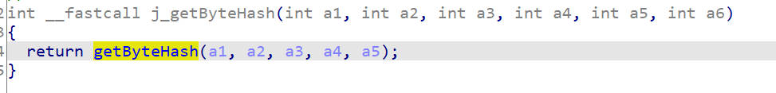


感觉像是纯净的sha1，没有额外干扰操作

hook验证一下

- 找到so，然后延迟hook，检测so被加载的时候进行hook


- 编写hook


hook一条龙


`com.achievo.vipshop`

```bash
frida -U -f com.achievo.vipshop -l xx.js
```

忘了执行函数了

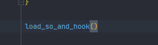

再次hook，发现有很多结果，我们先随便找一个


测试一下是不是sha1


验证完毕，正常sha1

接下来手机点一下搜索，然后抓包拿到正确的值

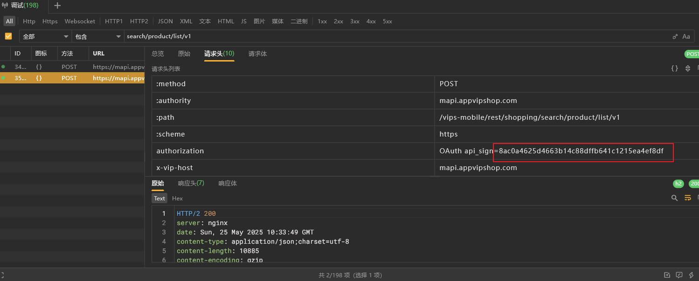


接下来就是找v57是怎么来的


发现v57是dest+v56

- dest：发现是v11+v13


- v56: v55的指针


找一下v55: v30经过sha1生成的


我们查一下sha1长度，应该是40

我们用python对 `aee4c425dbb2288b80c71347cc37d04b739786978630059d47f5dbc9e3191621574efd11` 取后40位 `739786978630059d47f5dbc9e3191621574efd11`


去hook脚本的打印内容中检索, 发现传入的字符串也就是v30是我们检索的内容


我们再去看前半部分 `aee4c425dbb2288b80c71347cc37d04b` ，也就是dest=v11+v13


v11是函数 `j_Utils_gsigds` 生成的


v13是v12的指针


v12是a4生成的


其实到这里，我们可以多尝试几次看一下前半部分是不是固定的


发现换了关键词之后还是相同的，可以视作是盐，至此，逆向已经结束


### 继续逆向盐

我们可以多分析一下c代码，所以继续逆向。

#### v11


返回值是result，感觉这个代码乱七八糟的，我们直接把代码丢给ai问下在干嘛


看样子和传入参数有关，传入参数a2，也就是v9


v9是传入参数a5经过 `j_get_strData` 生成的


看这样子全都是 `byte_234808` 返回的，这是个全局变量，说明压根没用到传入的参数，那么这个值肯定是固定的


#### v12

v12是j_Utils_jstringtochar传入a4生成的，

把a1变量改成env类型然后方便查看


v9 -> v12 -> v8

v8是调用java方法计算数组v7长度

v7是a2对象调用getBytes方法生成的,传入类型为字符串也就是v5,是utf8；这里的a2就是传入的参数；这个方法返回值也就是a2

a4是j_Functions_gs的第4个参数


所以就是最外层传入的a5，我们现在去hook一下java的调用的gsnav函数

在这里应该是第3个参数


- 可能这个str是固定的，我们按照调用顺序去找
- 直接hook

懒得回溯了，直接hook看一下参数吧，发现是null

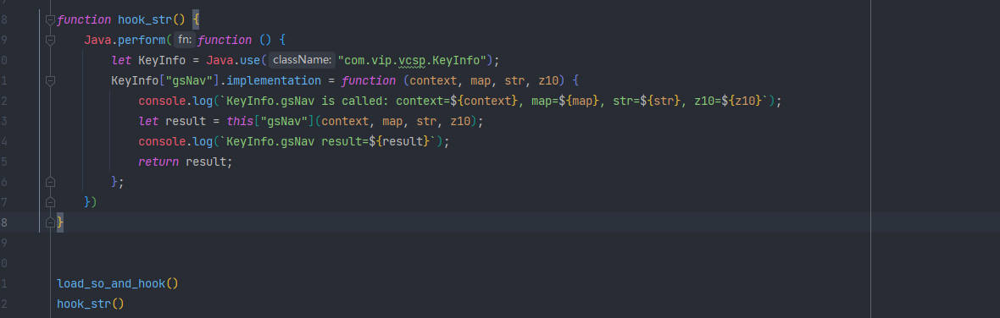


说明这个v12也是固定的


### 还原算法

#### 初步还原

- 前半部分：固定 “aee4c425dbb2288b80c71347cc37d04b”
- 后半部分：请求头参数生成的，注意hook拿到的字符串如果太长终端可能换行，导致计算的值不对（我在这里检查了很久


#### 下面就是如何根据字典生成这个字符串了

稍微改一下就行


## 逆向请求体mars_cid

### 搜参数

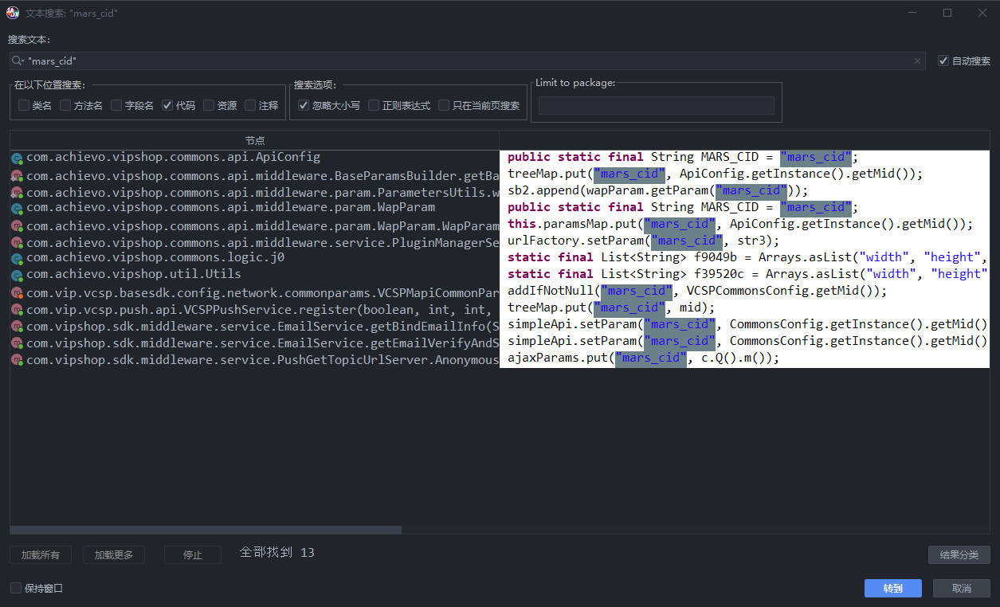

随便找一个put，我们直接找getMid()


看这样子是对象的mid，我们找一下赋值位置，我们默认mid没有，看if里面的代码

`this.mid = UUID.randomUUID().toString();` 看这样子就是java生成uuid的代码，我们随便搞一个就行

### 还原算法

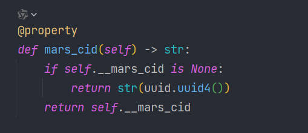


## 逆向请求体skey

### 搜参数


查找用例

挺多的，我们换个方法

### 搜url

`"search/product/list/v1"`


这一步没有加

在下面的发请求过程中加了, 和逆向api_sign一样的搜url过程能定位到


发现这里是反射，我们需要找到这个类，我们点进 `KeyInfo`


找到这个native方法

### 定位到so

ida找到这个函数，把类型转env，变量名也改改


这里的str是`"skey"`，我们在逆向过程中可以看到

我们倒着看, v10 -> v12


看样子v12是指针，然后经过了 `j_getInfo` 把字符串指针赋值给v12的


继续定位，找到 getInfo


这个代码反编译好像有点问题，参数对不上，而且有一部分c++，我们也是从末尾找


看不懂，先问问ai


我们只需要知道infoMap是全局变量就行，说明传入的参数只是取值，并不对参数有影响，那这个值就是固定的，我们只需要hook拿到就行


### 抓包拿到值

`6692c461c3810ab150c9a980d0c275ec`


### 算法还原

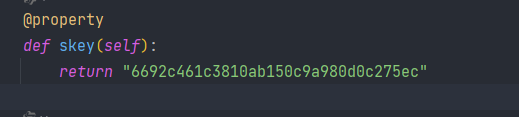


## 逆向请求体api_key

### 搜参数


第一个像


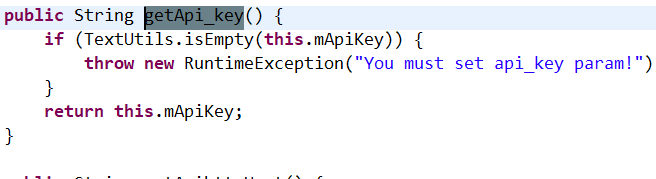


固定

### 算法还原


## 逆向请求体session_id

### 搜参数

搜api_key的位置有


两个地方都是this.sessionid


mid就是之前的mars_cid

System.currentTimeMillis 是毫秒时间戳

### 算法还原


## 逆向请求体page_id

### 搜参数定位

签名的逆向过程中看见了这个参数


先进第一个


发现是str；而starttime是系统当前时间戳+`getTime_deviation`函数返回值


抓包拿到的是`page_te_commodity_search_1748186960369` 


差距才40s，看样子就是个单纯的时间戳，直接给当前的就行

### 算法还原


## 逆向请求体did

### 搜参数


很明显第一个

点进去查找用例


随点找一个put


发现找到了这些参数的老窝，继续逆向did


这是个类变量，我们直接搜索找赋值地方


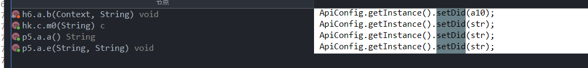

- 挨个寻找
- hook调用栈（因为调用的函数都是同一个）

我们清空一下信息，然后hook一下这个setDid的参数和返回值，并且打印调用栈

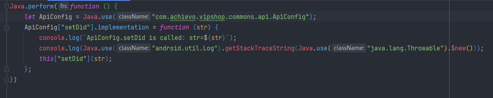


发现是p5.a.e


第一个参数，顺着调用栈往上走


这里str是传进来的，继续顺着调用栈走


还是传进来的，顺着调用栈走


这里发现y10就是我们要的，我们去y函数看看


我们检索赋值位置


找一下M引用


一眼就是第二个


继续找


这里就很多了，我们hook调用栈


很明显this.f2592d是Callable类型，问一下ai


所以其实代表了这个did是某个接口的返回值

我们抓包


发现这个请求是返回did的

多测试几次，发现结果一样

请求头中包含了api_sign

请求体中现在需要逆向edata参数，剩下的都可以拿到

### 算法还原

edata算法见下面的逆向

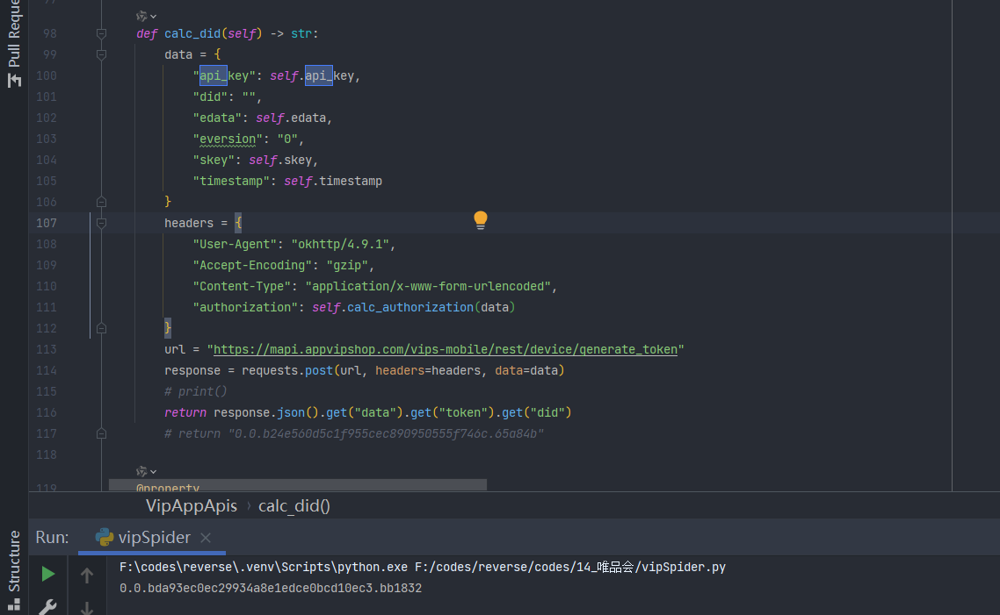


## 逆向edata参数

### 搜url

`device/generate_token`


put没有edata所以发包过程中加上的，进入request


发现是抽象类，不是很好找具体实现, 这里需要hook返回值类型


### 搜参数

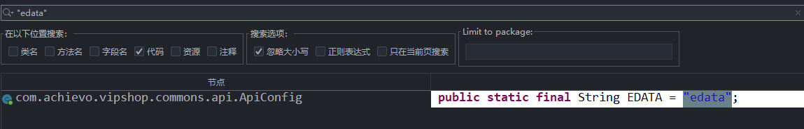


依然优先找put, 点第一个put


这里发现还有个 `EVERSION` ，抓包也有这个参数，感觉十有八九就是这里


我们查看怎么加密的str

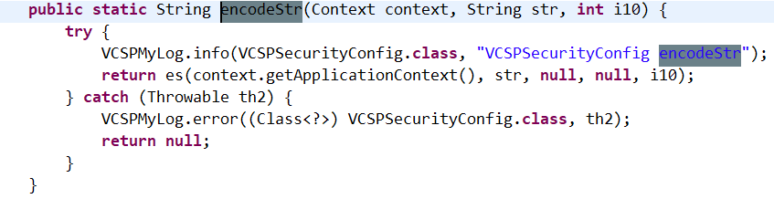


这里用了java的反射，我们需要去找clazz类，查看es方法


点进KeyInfo


找到es


走的是esNav函数

### 定位到so

去so中找到对应函数


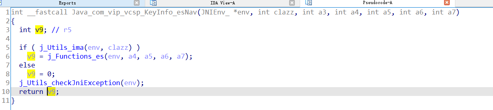


进入Function_es

代码很多，ALT+T 搜return


说明是v45


找v52，这里发现是base64	

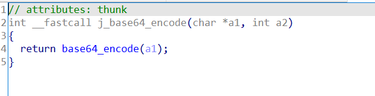

看参数类型，估计v39是待加密数据

查看v39来源


看的不是很清楚，先继续逆向base64吧验证一下对不对


一直往里面点

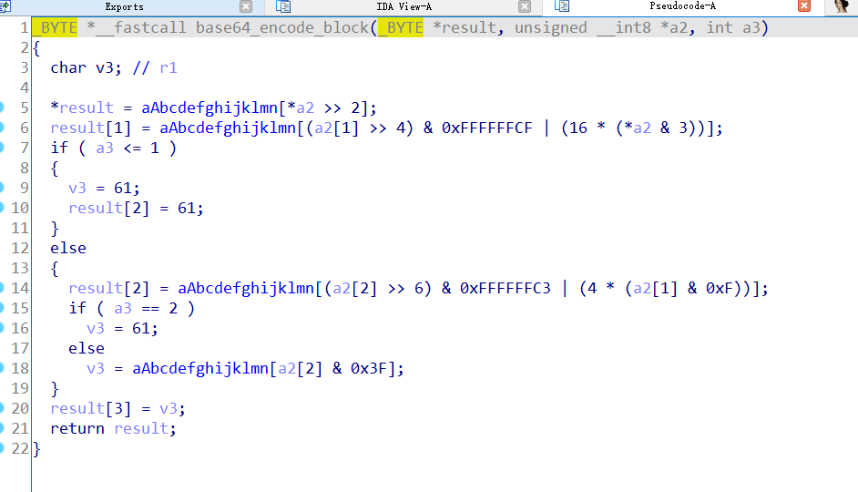

感觉没啥魔改的地方，我们回头逆向传入参数v39

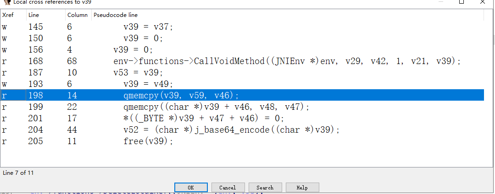

这里看见个cpy，查下资料，发现v39是v59+v48


- v59

  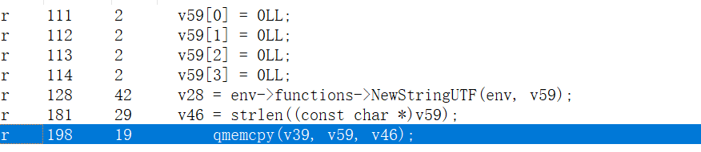

前面的赋值像是初始化，但是v59没有发现具体赋值，我们把这个文件代码给ai，问问v59的具体赋值


- v39+v46

v46是v59长度


说明v39最终是由v59和v48拼接得到的


v48是v44调用了字节数组函数得到的


v44是调用了jni方法得到的

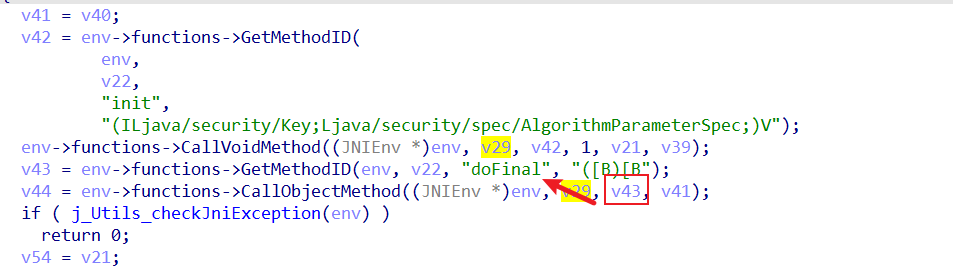

看这样子是调用了java的加密函数，那么输入参数只能是v41了


v41是v40指针


v40是调用了一个方法得到的，没有传入参数


v7 -> 是调用了getBytes得到的，是a2调用的，传入v6为utf8，拿到的是a2对象的字节数组

所以我们去hook一下java层 这个a2参数

对应函数，就是a4参数


所以实际上是str

hook一下


我们把内容丢到base64编码网站中，对不上，说明是存在魔改的或者我们分析错了

篡改一下值换个1试试


这个很明显不对，长度也差得很多，估计是存在其他操作最后再base64

理一下思路，base64是在so中实现的，我们不是很方便hook，我们回头看so，发现这个过程中进行了AES加密；我们可以hook一下Java层的AES加密


这里我们直接使用hook通杀脚本 去hook所有加密方法，用抓包得到的edata来定位


找个网站验证一下


原生aes


不过最终doFinal得到值后又经过了某个操作得到的是 `YzY4N2U4NzQ4YTYxOTI4Y/wSAnBpKagjuGpW2fs5ZSY=` 


这里拿到了v44，过程中只有v47和v48，看这个函数名我们定位v48


我们发现v48实际上是v39的后半部分（前面已经逆向过这个逻辑了

我们现在去找前半部分

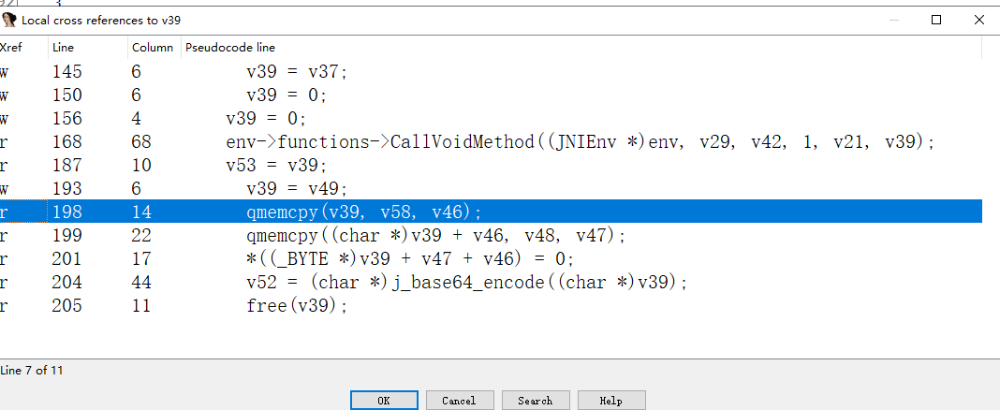

也就是v58

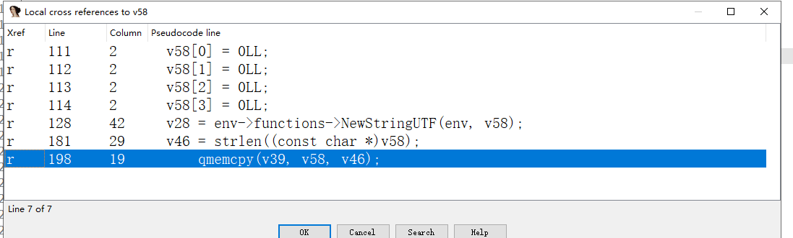

v58经过初始化后直接在128行导出为字符串，说明中间过程中必定存在赋值操作 114-128


这个过程中，唯一可疑的之后这个j_rand16Str()了，因为其他的都是java层的函数，我们都知道其用途，不会存在对v58赋值操作；

那么说明这里反编译有点问题，实际上在jrand这个函数中进行了赋值

这个逻辑代表着，生成一个16字节的字符串再与aes加密后的字符串拼接然后再进行base64

我们hook一下j_base64_encode

发现用名字找不到这个函数

直接扫描看看有没有这个函数


发现没有

我们看一下这个函数的汇编代码

```
; Attributes: thunk

; int __fastcall j_base64_encode(char *s)
j_base64_encode
ADRL            R12, 0x22CCF4
; 3:   return base64_encode(s, a2);
LDR             PC, [R12,#(base64_encode_ptr - 0x22CCF4)]! ; base64_encode
; End of function j_base64_encode
```

ai说这是一个跳板函数，跳到base64_encode，所以名字找不到

那我们找base64_encode


那就hook--base64_encode吧


确实是hook到了，不过怎么乱码了

再试一次

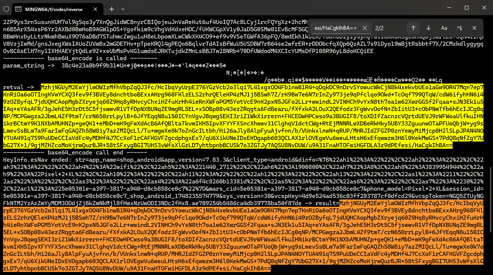

这次还是乱码，不过前面的部分没有乱

38c4e23a0b9f9b31


长度正确，我们多试几次，看看是不是随机的


搜一下这个


发现前面的iv就是

那就是算法还原了，这个base64

### base64算法还原


这里发现是吻合的

### 逆向明文参数

这个明文我们发现是urlencode的

找个网站解码一下


转一下json


找一下没有逆向过，还可疑的

- vcspKey

- vcspToken

- dinfo

  把dinfo的转清楚一些

  

我们多抓几次包

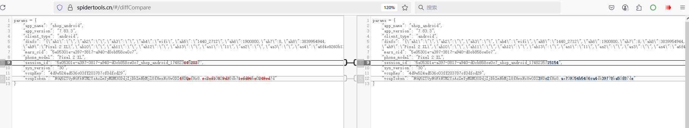

对比发现变化的主要是session_id、vcspToken

而dinfo和vcspkey都是固定的

接下来主要就是逆向vcspToken

### 算法还原

dinfo的末尾有一个mars_cid


vcspToken是发请求拿到的，后面逆向出来了


## 逆向vcspToken

### 搜参数


一直点进去，发现是个接口

其实我们发现这个是个get函数，主要应该去定位context怎么来的


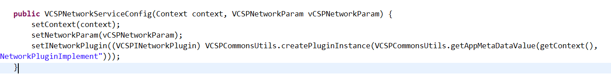


看类名去拿不和network有关，估计是某个请求返回回来的，我们先随便点一个进去


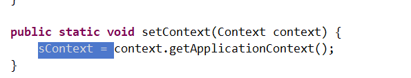

这里发现去找context有很多，我们先抓包搜一下这个值


`NGQ5ZTUyNGFkNTM2YzAzZmYyMDM3ODdjZjBkZmNkMjl8fHwxNzUwODI5Njc3fHx8.36ab4ffdd6e847608521aad05c990645`


这个接口的参数只有vcspKey，请求头只有vcspsign，多试几次看下有没有变化，好像是固定的

05a68135d2bfd322e3a22f95bbc25a24c777f387

### 算法还原


ok，没问题，我们继续还原edata

