# 搜索栏搜索接口
根据关键词检索商品

唯品会v7.83.3

- url: https://mapi.appvipshop.com/vips-mobile/rest/shopping/search/product/list/v1

- method: POST

- headers
    "authorization": "OAuth api_sign=ceaf3e1735008be3ef71be34878cd87e5eb980d0",
    "x-vip-host": "mapi.appvipshop.com",
    "content-type": "application/x-www-form-urlencoded",
    "content-length": "2682",
    "accept-encoding": "gzip",
    "user-agent": "okhttp/4.9.1"
    
- params:
    "api_key": "23e7f28019e8407b98b84cd05b5aef2c",
    "app_name": "shop_android",
    "app_version": "7.83.3",
    "bigSaleTagIds": "",
    "brandIds": "",
    "brandStoreSns": "",
    "categoryId": "",
    "channelId": "1",
    "channel_flag": "0_1",
    "client": "android",
    "client_type": "android",
    "darkmode": "0",
    "deeplink_cps": "",
    "device_model": "Google Pixel 2 XL",
    "did": "0.0.b24e560d5c1f955cec890950555f746c.65a84b",
    "elder": "0",
    "extParams": "{\"priceVer\":\"2\",\"mclabel\":\"1\",\"cmpStyle\":\"1\",\"statusVer\":\"2\",\"ic2label\":\"1\",\"video\":\"2\",\"uiVer\":\"2\",\"preheatTipsVer\":\"4\",\"floatwin\":\"1\",\"superHot\":\"1\",\"exclusivePrice\":\"1\",\"router\":\"1\",\"coupons\":\"1\",\"needVideoExplain\":\"1\",\"rank\":\"2\",\"needVideoGive\":\"1\",\"bigBrand\":\"1\",\"couponVer\":\"v2\",\"videoExplainUrl\":\"1\",\"live\":\"1\",\"sellpoint\":\"1\",\"reco\":\"1\",\"vreimg\":\"1\",\"search_tag\":\"2\",\"tpl\":\"1\",\"stdSizeVids\":\"\",\"labelVer\":\"2\"}",
    "fdc_area_id": "104104",
    "functions": "RTRecomm,flagshipInfo,feedback,otdAds,zoneCode,slotOp,survey,hasTabs,floaterParams",
    "harmony_app": "0",
    "harmony_os": "0",
    "headTabType": "all",
    "height": "2712",
    "isMultiTab": "0",
    "keyword": "高品质t恤女减龄",
    "lastPageProperty": "{\"isBgToFront\":\"0\",\"suggest_text\":\"高品质t恤女减龄\",\"scene_entry_id\":\"-99\",\"refer_page_id\":\"page_te_globle_classify_search_1748159677368\",\"text\":\"高品质t恤女减龄\",\"tag\":\"1\",\"module_name\":\"com.achievo.vipshop.search\",\"type\":\"all\",\"typename\":\"全部\",\"is_back_page\":\"0\"}",
    "maker": "GOOGLE",
    "mars_cid": "5e05301e-a397-3817-a940-d0cb858ce0c7",
    "mobile_channel": "oziq7dxw:::",
    "mobile_platform": "3",
    "net": "WIFI",
    "operator": "",
    "os": "Android",
    "osv": "11",
    "otddid": "",
    "other_cps": "",
    "page_id": "page_te_commodity_search_1748159682450",
    "phone_model": "pixel 2 xl",
    "priceMax": "",
    "priceMin": "",
    "props": "",
    "province_id": "104104",
    "referer": "com.achievo.vipshop.search.activity.TabSearchProductListActivity",
    "rom": "Dalvik/2.1.0 (Linux; U; Android 11; Pixel 2 XL Build/RP1A.201005.004)",
    "sd_tuijian": "0",
    "service_provider": "",
    "session_id": "5e05301e-a397-3817-a940-d0cb858ce0c7_shop_android_1748158311809",
    "skey": "6692c461c3810ab150c9a980d0c275ec",
    "sort": "0",
    "source": "app",
    "source_app": "android",
    "standby_id": "oziq7dxw:::",
    "sys_version": "30",
    "timestamp": "1748159682",
    "union_mark": "blank&_&blank&_&oziq7dxw:::&_&blank&_&blank",
    "vipService": "",
    "warehouse": "VIP_NH",
    "width": "1440"


##  逆向api_sign请求头

### 搜 url

`"search/product/list/v1"` 

定位到 ` com.achievo.vipshop.commons.logic.productlist.service.SearchProductListApi` 类的 `getProductList` 函数中 


代码很多，这个地方是设置参数

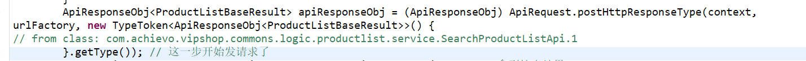

这里发请求，点进去

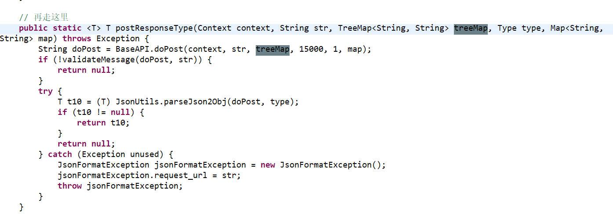

一直溯源，直到这里拿到treemap(参数)


定位到这里，之后一顿定位没找到

### 搜参数

`api_sign=`


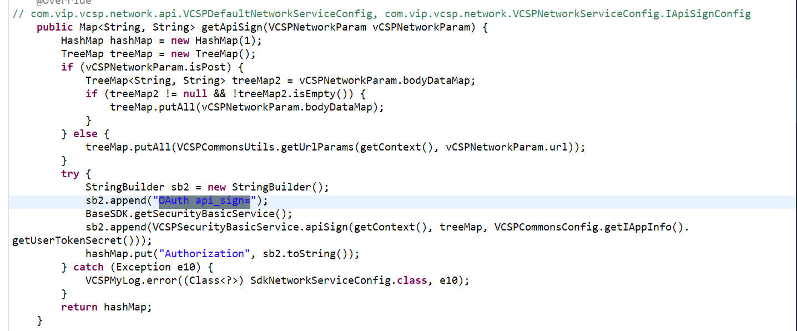


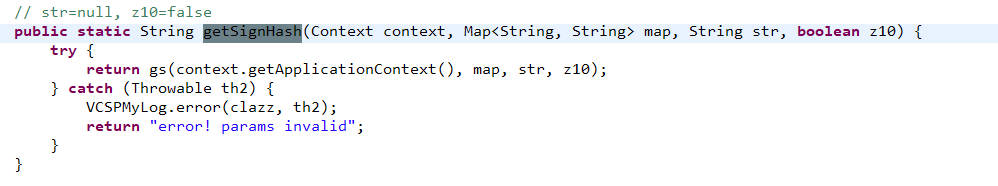


这里用了反射，我们需要知道 `clazz` 的类型

- hook
- 搜索 `clazz=`

这里采用第二种

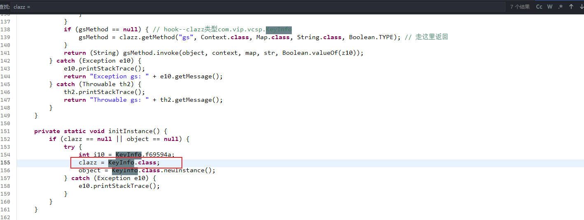

点进去

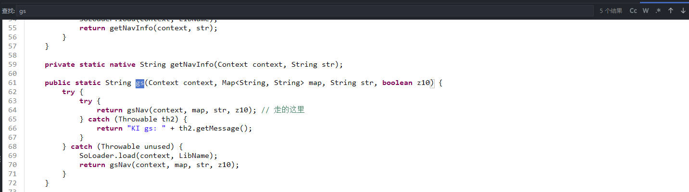

检索gs；观察发现不报错走 `gsNav` 

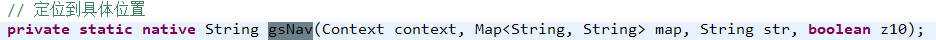

发现是个native方法


### 定位到so

定位到 `libkeyinfo.so`

打开压缩包找到这个so


提取出来

打开ida32

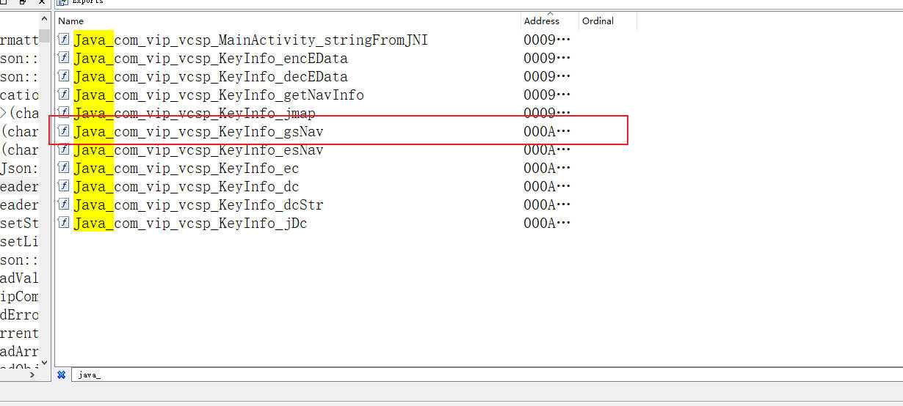

这是个静态注册，搜 `java_`，找到gsNav

反编译为c，导入jni.h


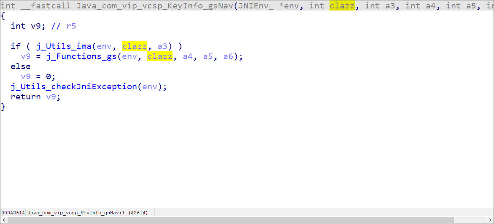

然后把变量名改改，返回值是v9, 我们找 `j_Functions_gs`


变量类型转env，改改变量名

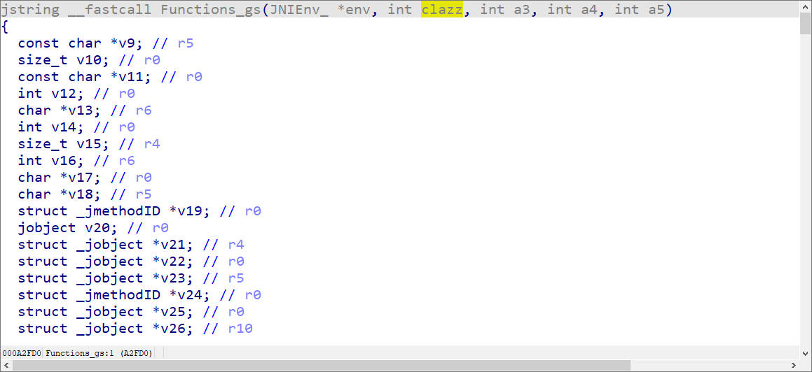

`ALT + T` 搜索 `return` 定位返回值


`v59` 是`j_getByteHash` 函数得到的


读一下代码，v58是字符串长度，v79是传入的字符串


感觉像是纯净的sha1，没有额外干扰操作

hook验证一下

- 找到so，然后延迟hook，检测so被加载的时候进行hook


- 编写hook

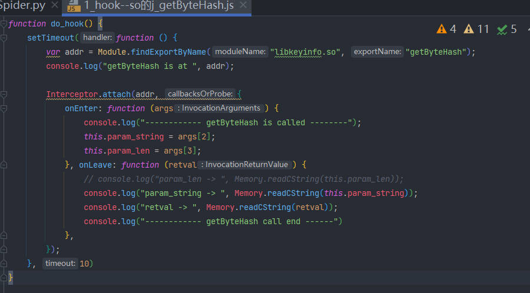

hook一条龙

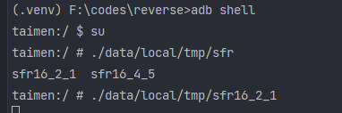


`com.achievo.vipshop`

```bash
frida -U -f com.achievo.vipshop -l xx.js
```

忘了执行函数了


再次hook，发现有很多结果，我们先随便找一个

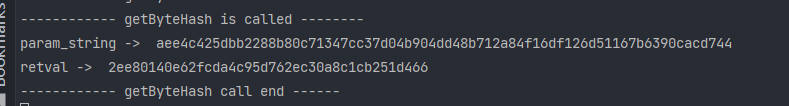

测试一下是不是sha1

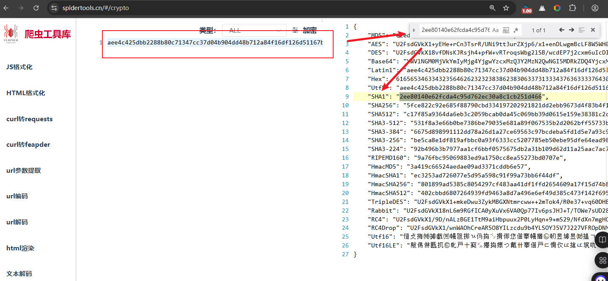

验证完毕，正常sha1

接下来手机点一下搜索，然后抓包拿到正确的值


接下来就是找v57是怎么来的

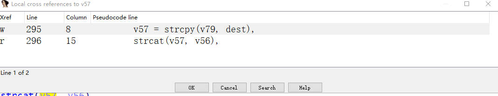

发现v57是dest+v56

- dest：发现是v11+v13

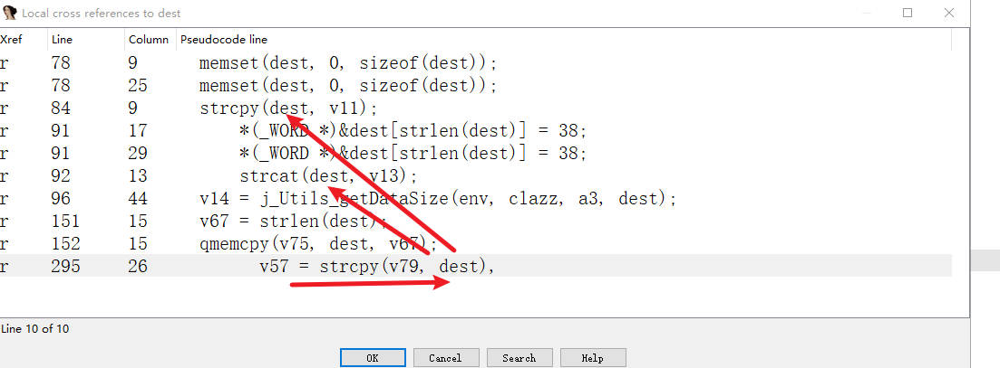

- v56: v55的指针

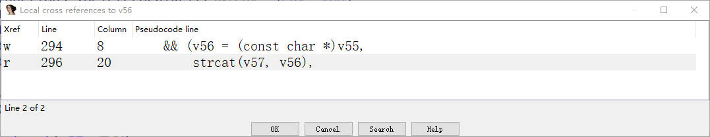

找一下v55: v30经过sha1生成的


我们查一下sha1长度，应该是40

我们用python对 `aee4c425dbb2288b80c71347cc37d04b739786978630059d47f5dbc9e3191621574efd11` 取后40位 `739786978630059d47f5dbc9e3191621574efd11`


去hook脚本的打印内容中检索, 发现传入的字符串也就是v30是我们检索的内容

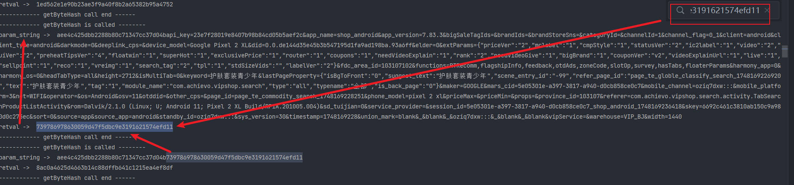

我们再去看前半部分 `aee4c425dbb2288b80c71347cc37d04b` ，也就是dest=v11+v13


v11是函数 `j_Utils_gsigds` 生成的


v13是v12的指针


v12是a4生成的


其实到这里，我们可以多尝试几次看一下前半部分是不是固定的

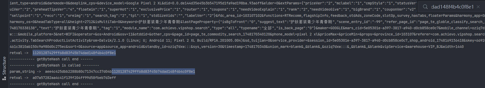

发现换了关键词之后还是相同的，可以视作是盐，至此，逆向已经结束


### 继续逆向盐

我们可以多分析一下c代码，所以继续逆向。

#### v11

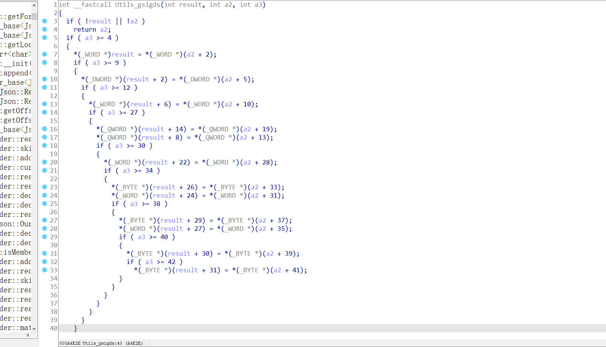

返回值是result，感觉这个代码乱七八糟的，我们直接把代码丢给ai问下在干嘛


看样子和传入参数有关，传入参数a2，也就是v9


v9是传入参数a5经过 `j_get_strData` 生成的

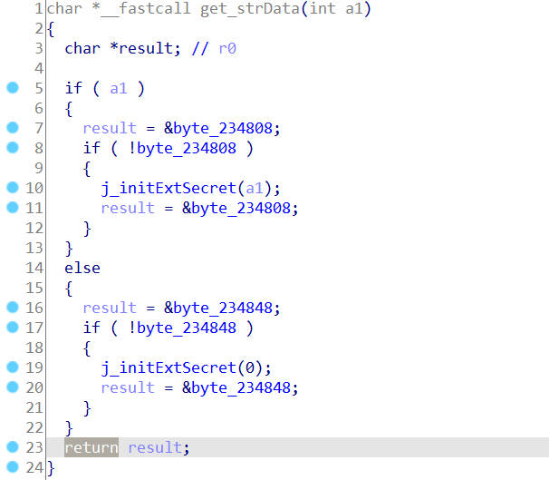

看这样子全都是 `byte_234808` 返回的，这是个全局变量，说明压根没用到传入的参数，那么这个值肯定是固定的


#### v12

v12是j_Utils_jstringtochar传入a4生成的，

把a1变量改成env类型然后方便查看


v9 -> v12 -> v8

v8是调用java方法计算数组v7长度

v7是a2对象调用getBytes方法生成的,传入类型为字符串也就是v5,是utf8；这里的a2就是传入的参数；这个方法返回值也就是a2

a4是j_Functions_gs的第4个参数


所以就是最外层传入的a5，我们现在去hook一下java的调用的gsnav函数

在这里应该是第3个参数

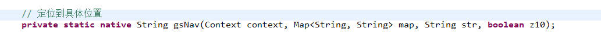

- 可能这个str是固定的，我们按照调用顺序去找
- 直接hook

懒得回溯了，直接hook看一下参数吧，发现是null


说明这个v12也是固定的


### 还原算法

#### 初步还原

- 前半部分：固定 “aee4c425dbb2288b80c71347cc37d04b”
- 后半部分：请求头参数生成的，注意hook拿到的字符串如果太长终端可能换行，导致计算的值不对（我在这里检查了很久


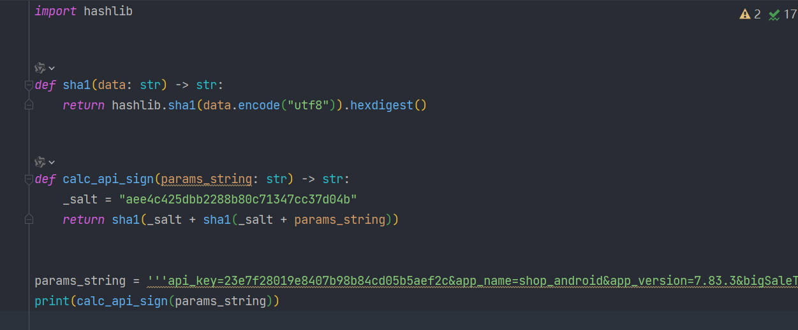


#### 下面就是如何根据字典生成这个字符串了

