# 账号密码登录

6.66.99.3 下载链接 https://www.wandoujia.com/apps/306673/history_v298

## 抓包分析

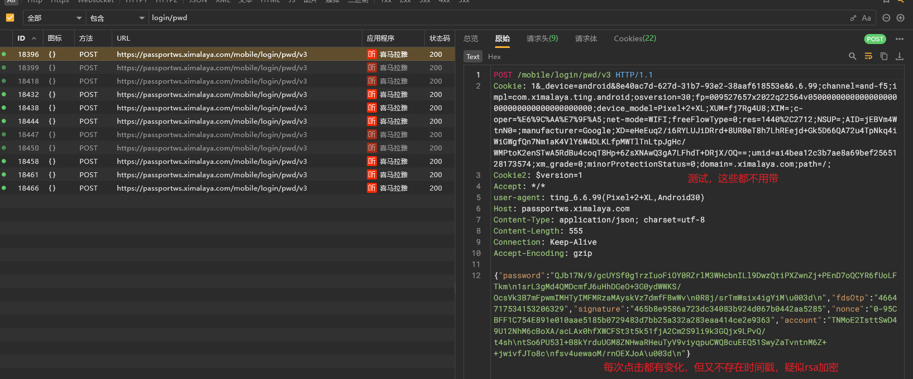

## 定位密码加密

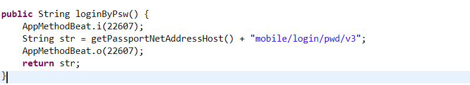

挺多地方调用了，hook看一下

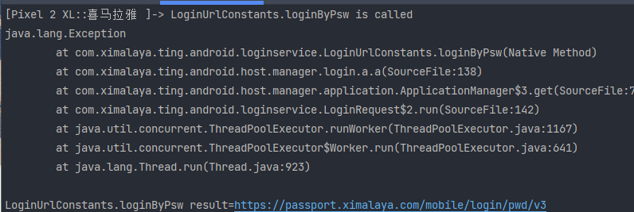

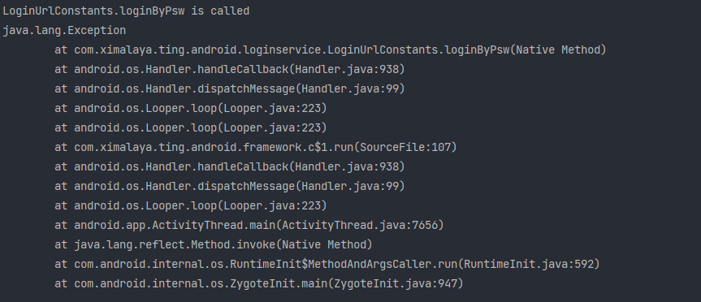

打印了3处，第二个什么handle，dispatch的，和登录好像关系不大；而且还是安卓系统的；

我们看两外两个，好像都被a.a调用

好几个重载，我们前面的那个函数是string返回，所以这里是第四个

我们hook一下看看入参和返回值

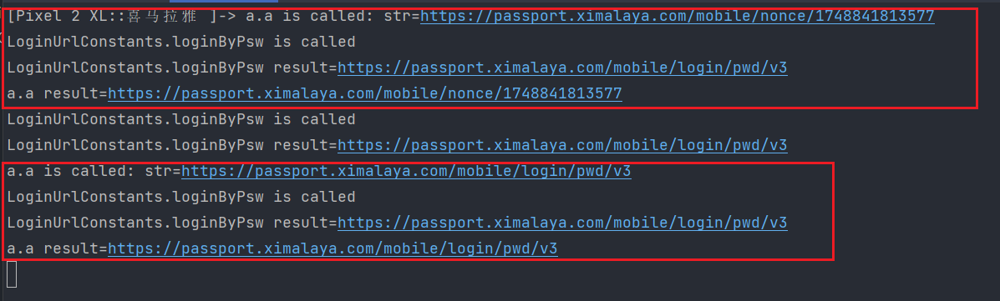

第一个是什么nonce的，估计与抓包的nonce有关

## nonce参数

所以nonce参数是发请求拿到的

我们去看一下这个nonce参数

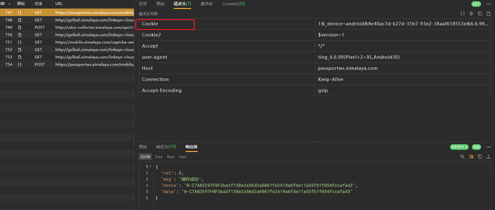

验证了一下，没啥需要带的

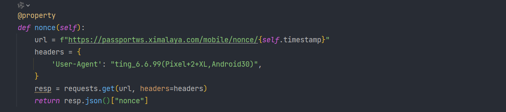

我们继续定位密码

## 继续定位密码

我们继续看第二个，链接一样，我们只能继续跟栈

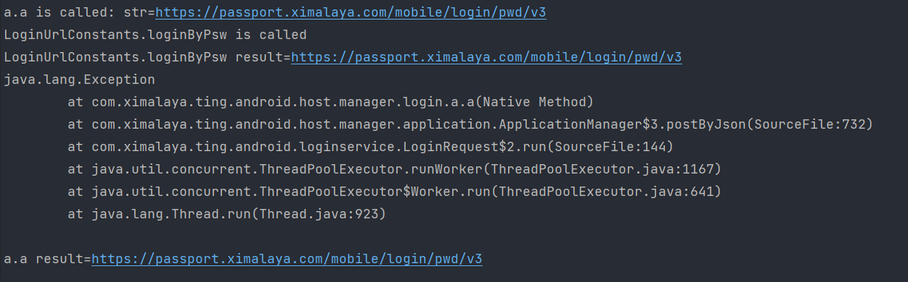

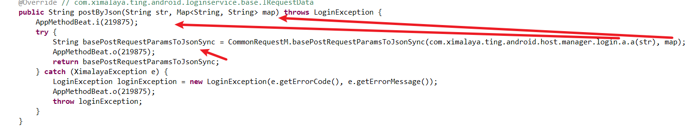

这里hook一下看一下入参和map内容

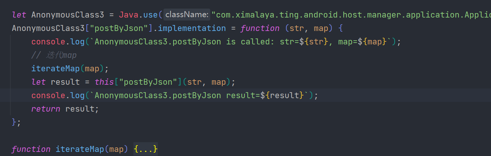

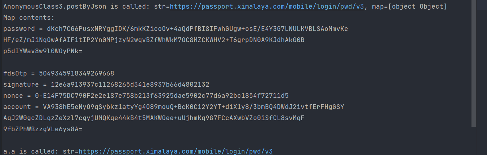

没问题，确实走的这里；但是这个时候已经赋值好了，我们去找map传入的地方

继续跟栈到run方法

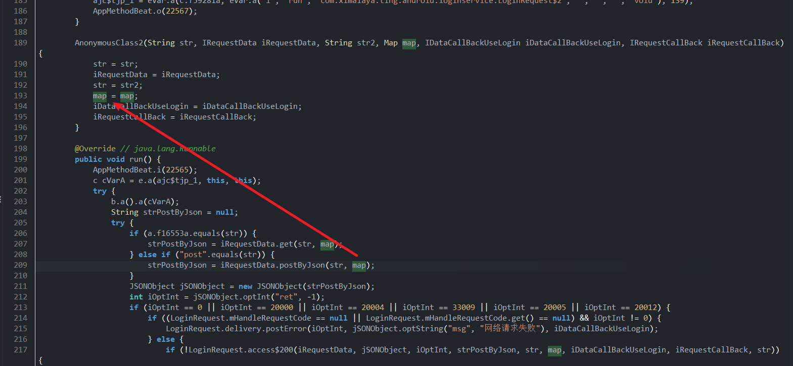

看样子是类被实例化的时候就加密好然后传进去了

hook一下实例化方法跟栈

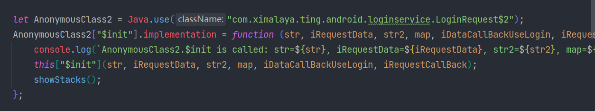

这一次实例化的时候传入了参数

直接跟到request

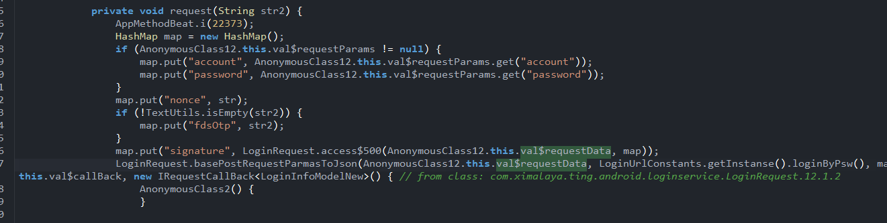

发现这里数据是匿名类12实例化传进来的

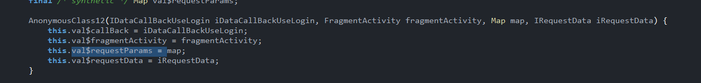

hook一下实例化方法

这个时候传进来了，跟栈看一下

搜了一下这个函数，原来有好几个，不过好歹兜兜转转找到了

hook了一下，确实是我们传入的账号密码

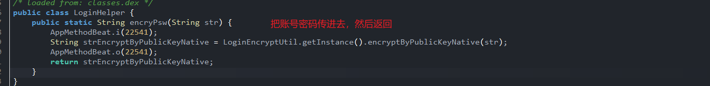

一路点击

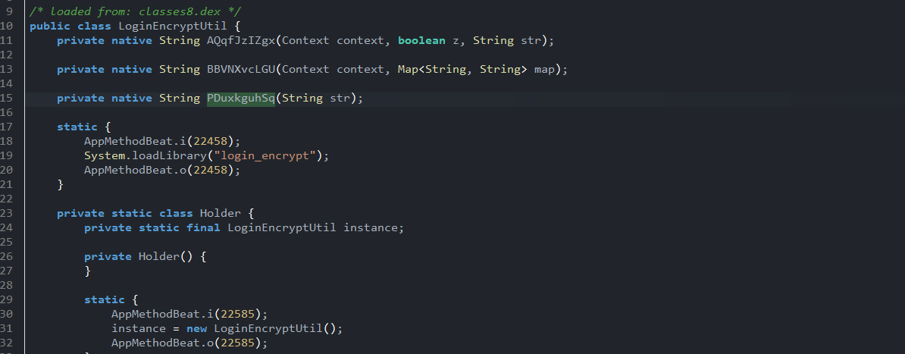

终于跟到了，加密在so里面

先看一下so写的难不难，太难了我们直接unidbg吧

先看下注册方式

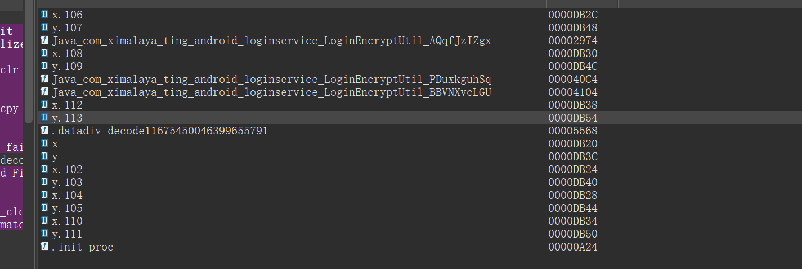

好的，静态注册

这里代码还挺简单的，这里的v7是jstring，传入了两个jstring进去，然后v6不知道是什么

先看一下这个 `byte_D870`

写死在程序里的，可能是什么公钥什么的？看不懂，所以这里的v5是一个固定的jstring

我们看下面那个函数做了什么

好好好，这么玩。经典控制流混淆

> 我啥也不想看，我只想unidbg
> 不过在unidbg之前，我们可以观察一下

## signnature

单纯不是很好搜

即使加上put也不是很好搜

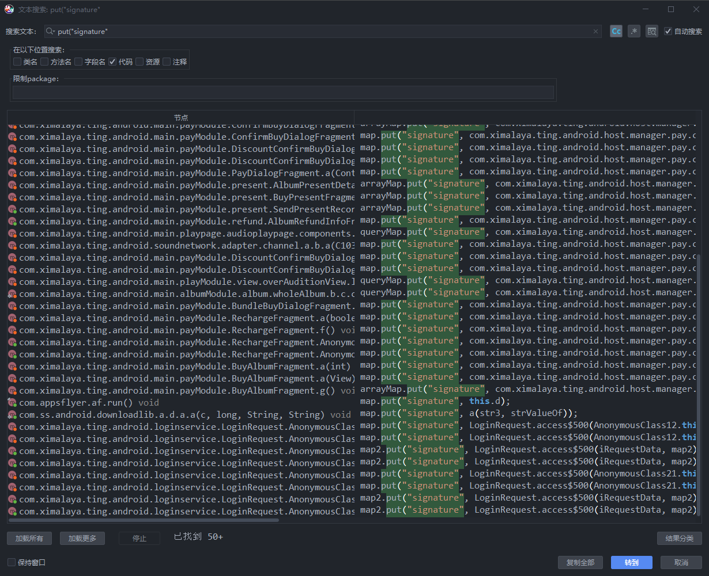

搜一下链接

用java的加密算法自吐脚本

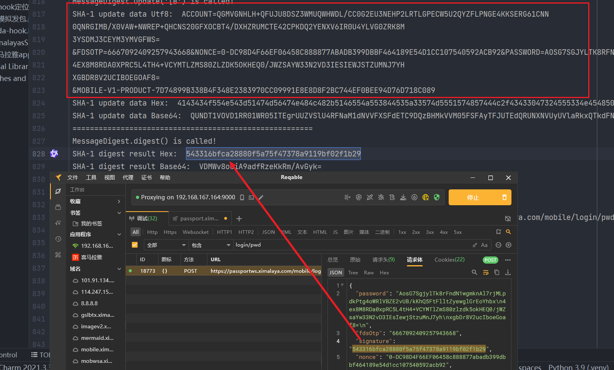

sha1加密

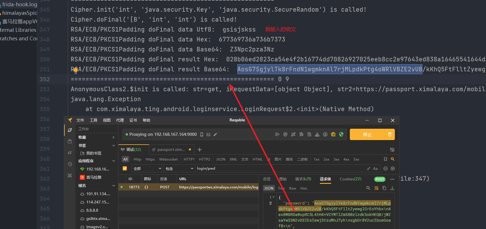

py代码还原

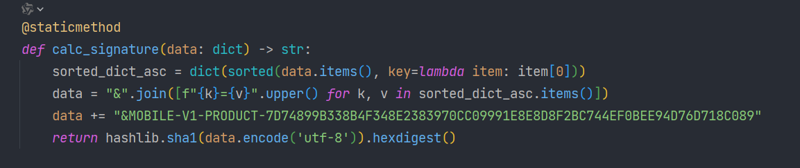

调用的时候把请求体字典传进来就行

## fdsOtp

这个参数也是其他接口返回回来的

> 经测试，默认是不会出滑块的，如果你没有带cookie就会出；

py代码还原如下

