# requests使用与源码分析

官方中文文档： https://requests.readthedocs.io/projects/cn/zh-cn/latest/user/quickstart.html#id2


## 常用参数与源码分析

我们统一使用requests的request来发包，这样可以提醒我们发包请求

### method

#### 作用

指定发包类型

```python
r = requests.request(
    method="get"
    url='http://httpbin.org/post',
)
```

#### 源码分析

我们看一下get源码

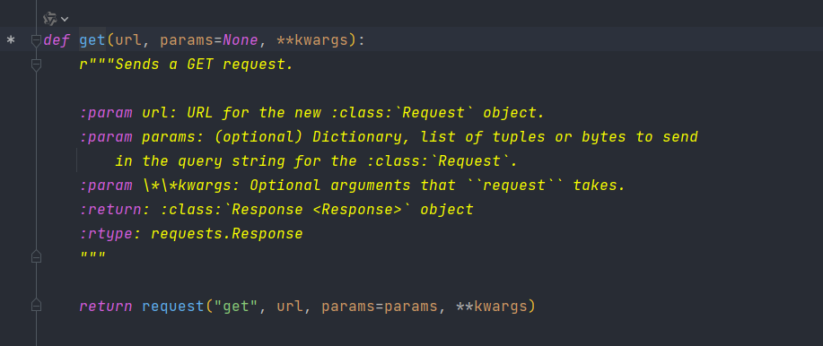

这里实际上最后调用的都是request


### params

#### 作用

```python
resp = requests.request(
    method="get",
    url='http://httpbin.org/post',
    params={'key1': 'value1', 'key2': 'value2'}
)
print(resp.url)
```

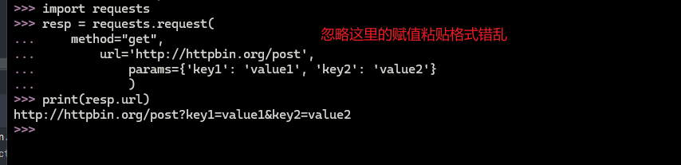

本质上就是按照

k=v得到一个参数，之后在进行&拼接

```python
dct = {"k1":1, "k2":"2"}
url_param = "&".join([f"{k}={v}" for k, v in dct])
url = 'http://httpbin.org/post'
url = url + "?" + url_param
url
```

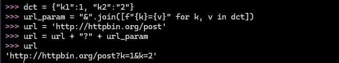


#### 源码分析

我们看一下request对象源码

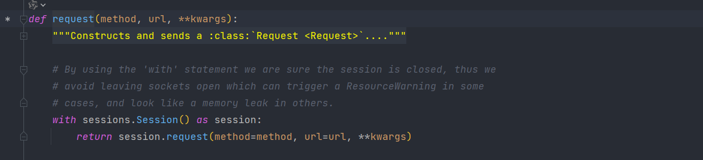

params被传入之后丢进kwargs字典中

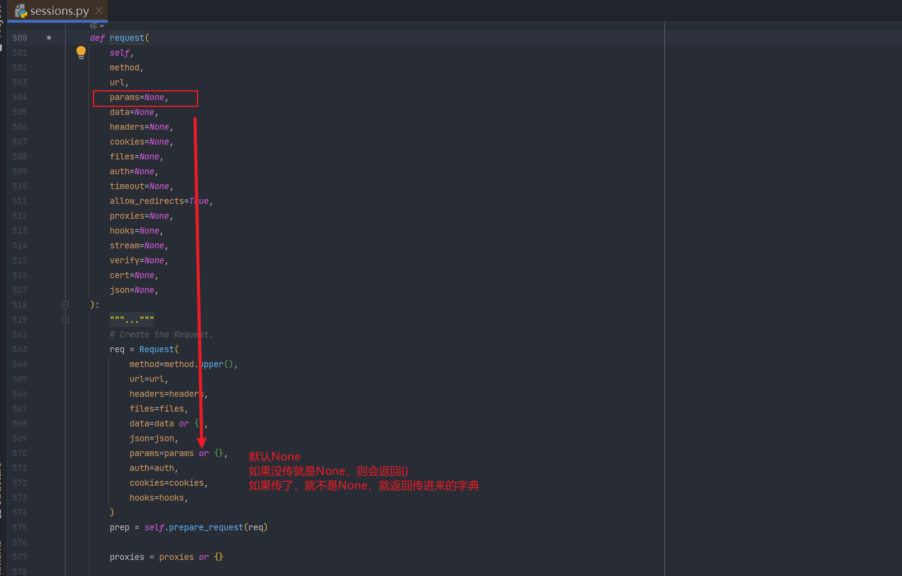

我们再看Request对象

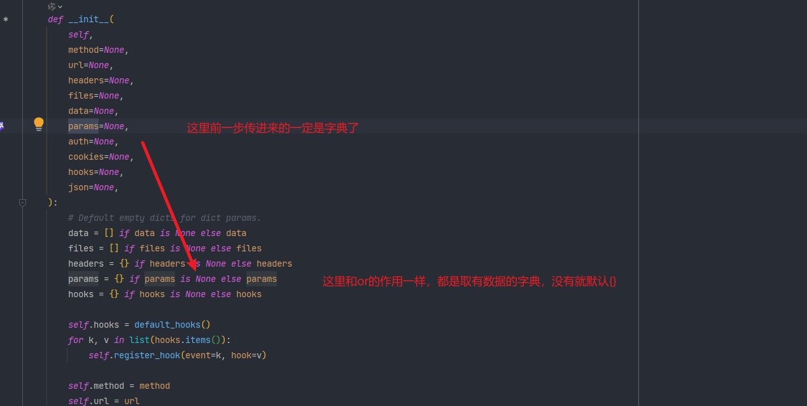

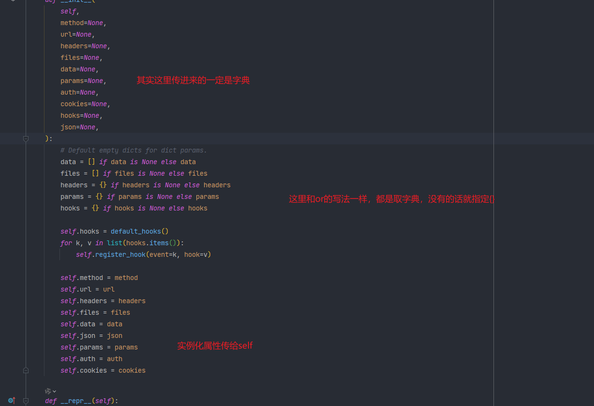


我们回头看resp怎么拿到的

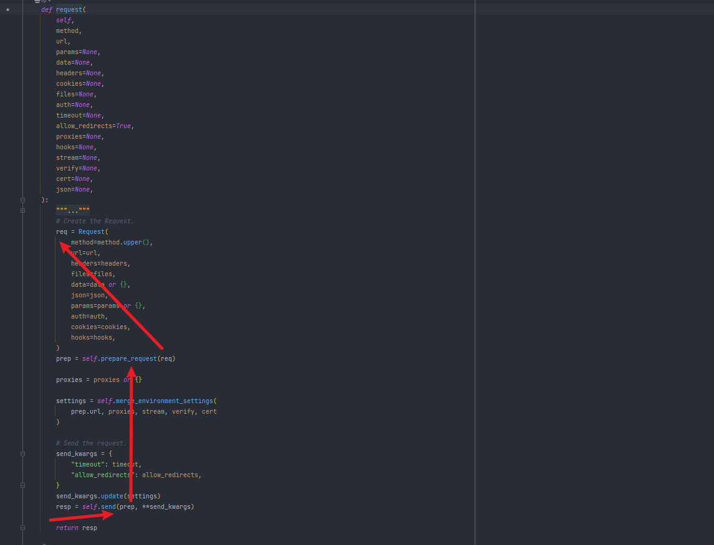

这里request传入params之后封装成req对象，然后经过预处理得到prep，再丢给send方法拿到resp

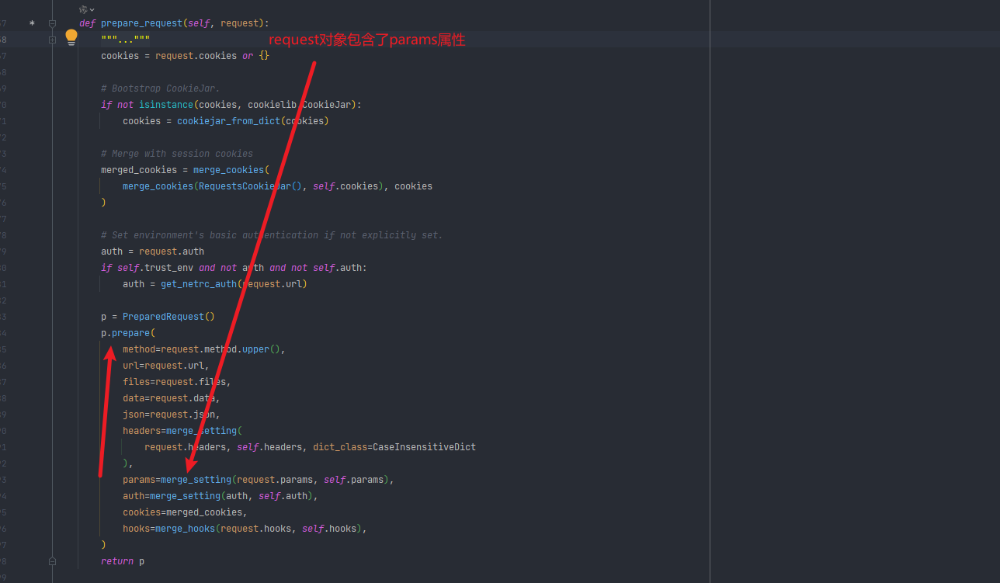

点进来，把对象传进来丢到了p对象的prepare方法中，我们点进这个方法

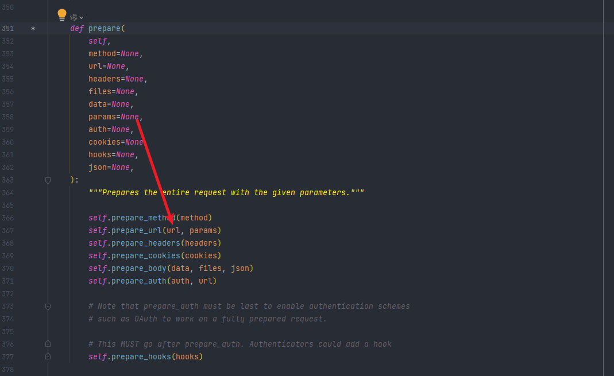

进入prepare_url方法中

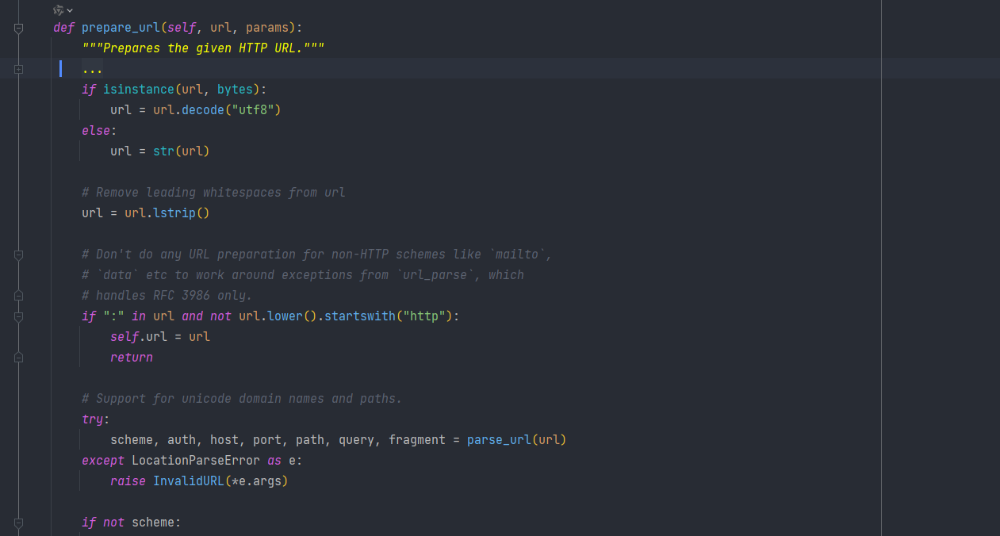

点进去，代码有点多，我们复制到其他地方，顺便删一下注释，再折叠一下

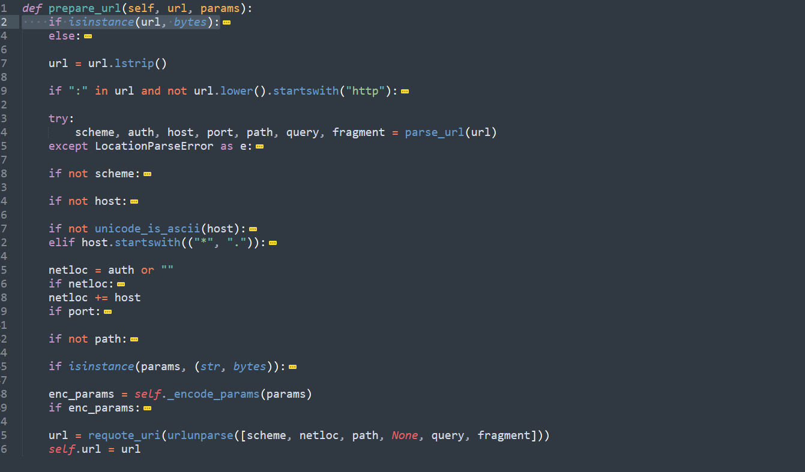

折叠进来之后，我们分析一下大体逻辑，主要就是把url进行处理，最后丢给self中

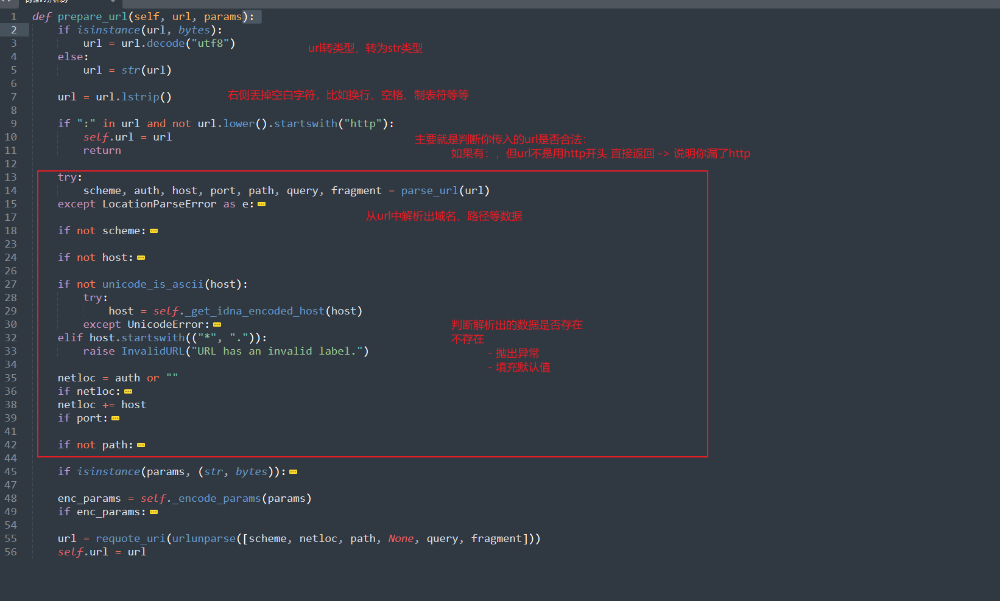

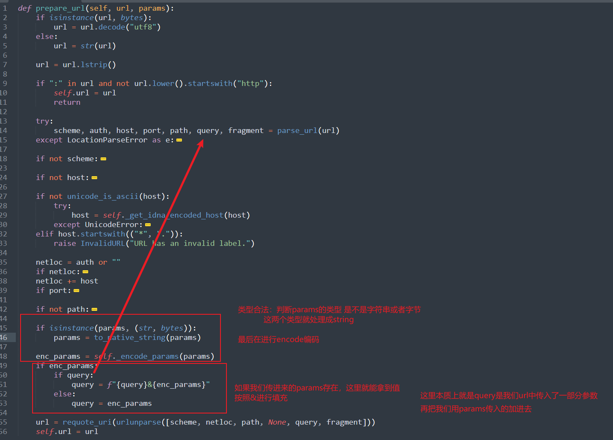

我们先看一下 `self._encode_params`

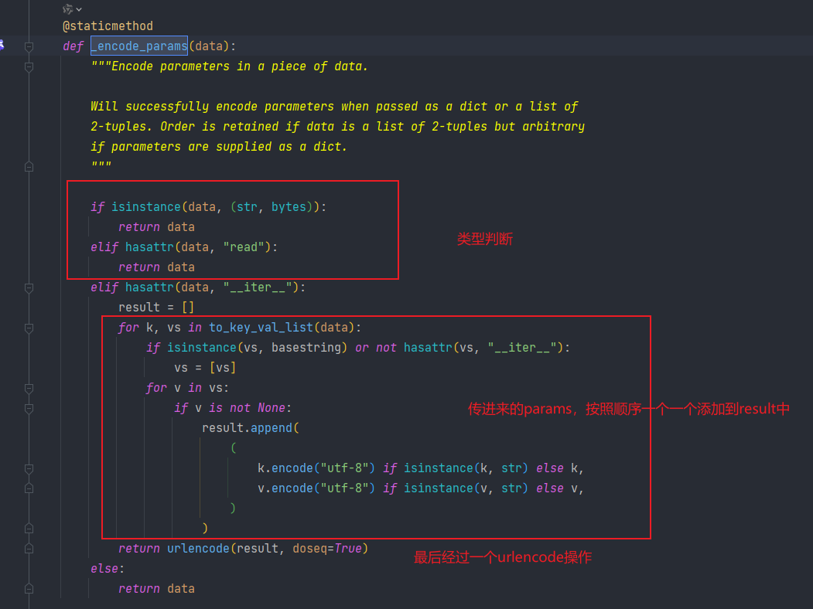

然后urlencode一下


回退外层的 `urlunparse`和 `requote_url` 

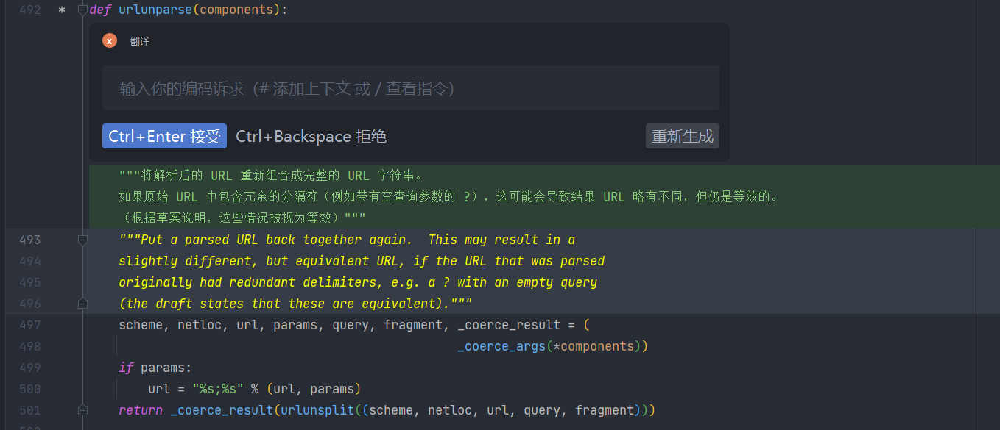

代码比较少我们看一下注释，这一步是拿到完整url字符串

最后返回给 `requote_url` 进行安全的urlencode编码

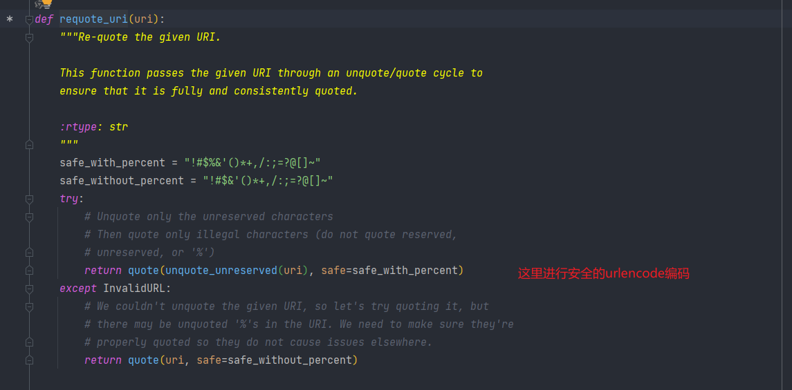


外层函数是进行安全的urlencode


源码流程是：

- 拿到url，params
- 合法性校验：非空判断、类型判断
- 将params的进行编码后添加到url后面
  - url中可能存在了一些k=v，按照&添加
  - 如果url中没有就？填充


### data