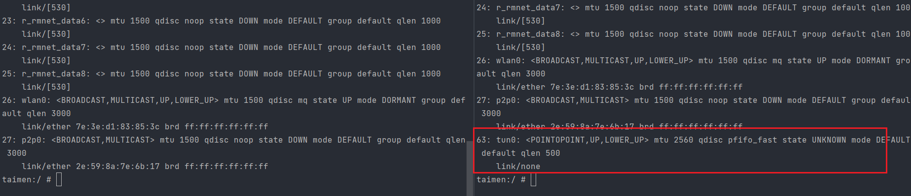
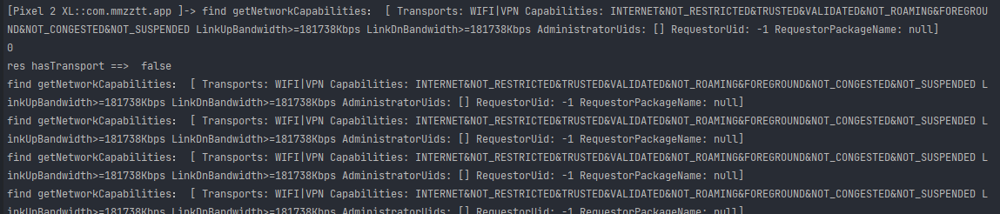

美之图


证书校验

v3.8.0


# 脱壳

app反编译后代码少的可怜，所以需要脱壳


我们使用 `frida-dexdump` 脱壳处理 [github地址](https://github.com/hluwa/frida-dexdump)

- 安装

  ```bash
  pip install frida-dexdump
  ```

  > 其他参数
  >
  > ```
  > -o OUTPUT, --output OUTPUT  Output folder path, default is './<appname>/'.
  > -d, --deep-search           Enable deep search mode.
  > --sleep SLEEP               Waiting times for start, spawn mode default is 5s.
  > ```

- 拿到包名

  ```bash
  frida-ps -Ua
  ```

  > com.mmzztt.app

- 执行脱壳

  ```bash
  frida-dexdump -U -f com.mmzztt.app -d 
  ```


效果图


打包一下，丢进jadx


# 抓包

开reqable抓不到包，关了就能正常使用


分析一下检测点

## 代理检测


我们这里走的不是代理

我们hook一下

```js
        let String = Java.use("java.lang.String");
        let NetworkInterface = Java.use("java.net.NetworkInterface");
        NetworkInterface.getName.implementation = function () {
            var result = this.getName();
            console.log("find getName：", result);
            if (result && (result.indexOf("ppp0") > -1 || result.indexOf("tun0") > -1)) {
                return String.$new("rmnet_data0");
            }
        }
```

然后继续抓包测试，发现还是抓不到，而且也不打印信息，说明压根没管代理


## vpn检测

### 原理

开了vpn后，手机ip路由会走tun0字样


java检测代码

```java
import android.content.Context;
import android.net.ConnectivityManager;
import android.net.NetworkInfo;

public class VPNChecker {
    public static boolean hasVPN(Context context) {
        ConnectivityManager cm = (ConnectivityManager) context.getSystemService(Context.CONNECTIVITY_SERVICE);
        NetworkInfo ni = cm.getActiveNetworkInfo();
        return ni != null && ni.getType() == ConnectivityManager.TYPE_VPN;
    }
}

```

> context的getSystemService可以拿到链接信息


### 小实验

查看手机ip路由 

```bash
ip link show
```



左边是没开reqable，右边开了；就会是这样的结果，有tun0

### 解决方案

hook绕过


1. hook--`java.net.NetworkInterface.getName` 的返回值

   检测到 `ppp0` 和tun0修改成正常的 `eth0` `wlan0` `rmnet0` ``rmnet_data0` `

   > - Wi-Fi 连接：通常是 `wlan0`; 
   > - 移动数据：通常是 `rmnet0`、`rmnet_data0` 或类似名称
   > - **VPN 连接**：(1) IPsec/L2TP可能使用 `ppp0` (2) OpenVPN/Shadowsocks：通常使用 `tun0`
   > - USB 共享网络：(1) 手机作为热点`rndis0` 或 `usb0` (2) 手机连接到电脑 `ppp0`（如果通过 PPP 协议）

   ```js
   let String = Java.use("java.lang.String");
   let NetworkInterface = Java.use("java.net.NetworkInterface");
   NetworkInterface.getName.implementation = function () {
       var result = this.getName();
       console.log("find getName：", result);
       if (result && (result.indexOf("ppp0") > -1 || result.indexOf("tun0") > -1)) {
           return String.$new("rmnet_data0");
       }
   }
   ```

2. hook getNetworkCapabilities返回值为null； hasTransport为false

   ```js
   let ConnectivityManager = Java.use("android.net.ConnectivityManager");
   ConnectivityManager.getNetworkCapabilities.implementation = function (arg) {
       var result = this.getNetworkCapabilities(arg);
       console.log("find getNetworkCapabilities：", result);
       return null;
   }
   let NetworkCapabilities = Java.use("android.net.NetworkCapabilities");
   NetworkCapabilities.hasTransport.implementation = function (v) {
       console.log(v);
       var res = this.hasTransport(v);
       console.log("res hasTransport ==> ", res)
       return false;
   }
   ```


3. 用hooker工具包的脚本绕过

   ```js
   function bypassVPNDetect(){
       Java.perform(function(){
           var NetworkInterface = Java.use("java.net.NetworkInterface")
           NetworkInterface.getAll.implementation = function(){
               var nis = this.getAll()
               console.log("call getAll function !!!")
               nis.forEach(function(ni){
                   if (ni.name.value.indexOf("tun0")>=0 || ni.name.value.indexOf("ppp0")>=0 ||
                   ni.displayName.value.indexOf("tun0")>=0 || ni.displayName.value.indexOf("ppp0")>=0){
                       ni.name.value = "xxxx"
                       ni.displayName.value = "xxxx"
                   }
               })
               return nis
           }
   
           var can_hook = false
           var ConnectivityManager = Java.use("android.net.ConnectivityManager");
           ConnectivityManager.getNetworkInfo.overload('int').implementation = function(){
               if(arguments[0] == 17){
                   can_hook = true
               }
               var ret = this.getNetworkInfo(arguments[0])
               return ret
           }
   
           var NetworkInfo = Java.use("android.net.NetworkInfo")
           NetworkInfo.isConnected.implementation = function(){
               let ret = this.isConnected()
               if(can_hook){
                   ret = false
                   can_hook = false
                   console.log("call isConnected function !!!")
               }
               return ret
           }
   
           var NetworkCapabilities = Java.use("android.net.NetworkCapabilities")
           NetworkCapabilities.hasTransport.implementation = function(){
               var ret = this.hasTransport(arguments[0])
               if(arguments[0] == 4){
                   console.log("call hasTransport function !!!")
                   ret = false
               }
               return ret
           }
   
           NetworkCapabilities.transportNameOf.overload('int').implementation = function(){
               var ret = this.transportNameOf(arguments[0])
               if(ret.indexOf("VPN") >= 0){
                   ret = "WIFI"
               }
               return ret;
           }
       })
   }
   
   setImmediate(bypassVPNDetect)
   ```

   

测试结果如下





再次抓包测试，发现打印了很多信息，说明是有代理检测的！


但是遗憾的是我们还是抓不到，这个时候我们用 `postern+charles` 抓包发现一堆403

我们把charles的证书校验关掉，然后就能正常加载图片了，但是我们抓不到包


> 或者这里开一下clash，发现正常可以访问的


这说明单纯也就是存在证书校验，vpn可能检测了但是没有禁这个


## 证书校验

这里先尝试[hooker工具包](https://github.com/CreditTone/hooker)里的js 


后面懒得写了，有空做视频再补，具体看py代码


